= Math 2121, Calculus for the life sciences, I.
:source-highlighter: coderay
:stem:

In this set of notes we work through some notions and
examples from calculus.  You can read the questions
here, study the handwritten notes, and while doing
so, listen to some explanations by clicking on the
"play" button.

== Lesson 1, Review.

*Question.* Multiply the expression out: stem:[(4c-6d)(4c+5d)].
++++
<figure>
    <figcaption>Solution</figcaption>
    <audio
	controls
	src="./2121-01-01.m4a">
	    Your browser does not support the
	    <code>audio</code> element.
    </audio>
</figure>
++++
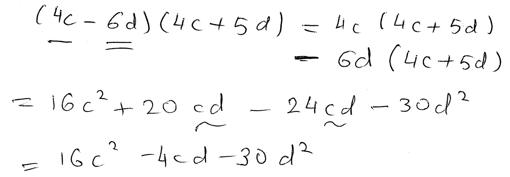
----
----

*Question.* (R.1:R-5/24, i.e., section R.1, page R-5, question 24 from the textbook) Multiply the expression out: stem:[E=(2a-4b)^2].
++++
<figure>
    <figcaption>Solution</figcaption>
    <audio
	controls
	src="./2121-01-02.m4a">
	    Your browser does not support the
	    <code>audio</code> element.
    </audio>
</figure>
++++
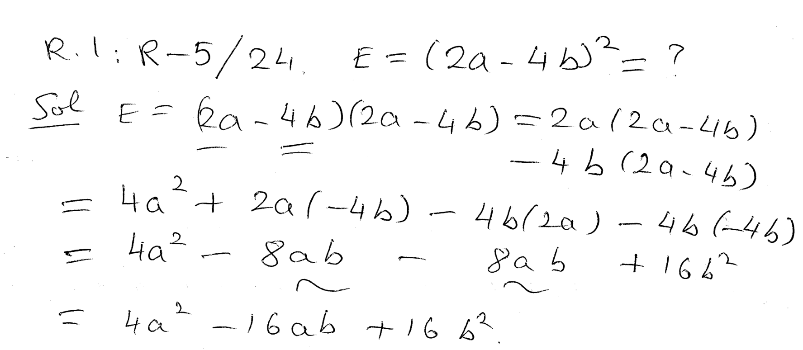
NOTE: In general we have stem:[(x+y)^2=x^2+2xy+y^2].
----
----

*Question.* (R.2:R-7/6) Factor stem:[x^2+4x-5].
++++
<figure>
    <figcaption>Solution</figcaption>
    <audio
	controls
	src="./2121-01-03.m4a">
	    Your browser does not support the
	    <code>audio</code> element.
    </audio>
</figure>
++++
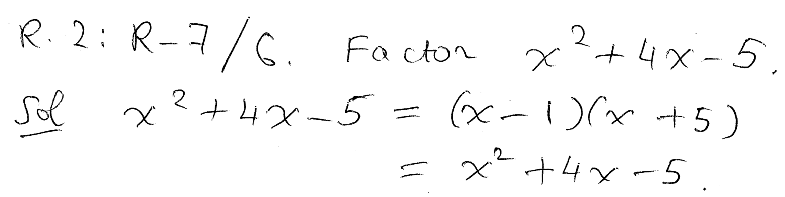
----
----

*Question.* (R.2:R-7/15) Factor stem:[21m^2+13mn+2n^2].
++++
<figure>
    <figcaption>Solution</figcaption>
    <audio
	controls
	src="./2121-01-04.m4a">
	    Your browser does not support the
	    <code>audio</code> element.
    </audio>
</figure>
++++
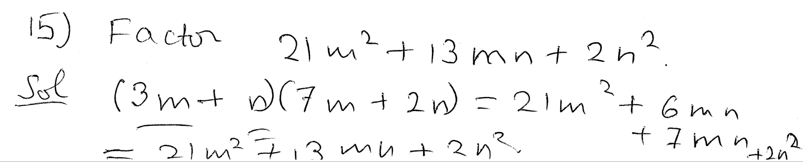
----
----

*Question.* (R.3:R-10/9) Simplify the expression stem:[E={3x^2+3x-6}/{x^2-4}].
++++
<figure>
    <figcaption>Solution</figcaption>
    <audio
	controls
	src="./2121-01-05.m4a">
	    Your browser does not support the
	    <code>audio</code> element.
    </audio>
</figure>
++++
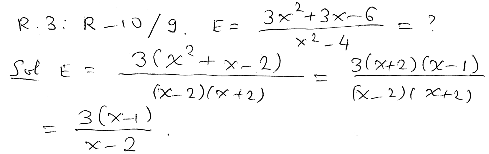
----
----

*Question.* (R.3:R-10/21) Simplify the expression stem:[E={k^2+4k-12}/{k^2+10k+24}cdot{k^2+k-12}/{k^2-9}].
++++
<figure>
    <figcaption>Solution</figcaption>
    <audio
	controls
	src="./2121-01-06.m4a">
	    Your browser does not support the
	    <code>audio</code> element.
    </audio>
</figure>
++++
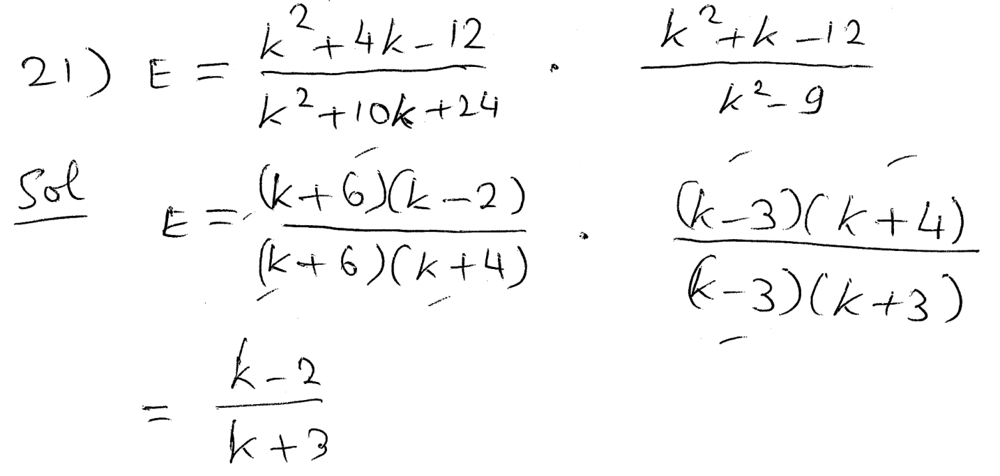
----
----

*Question.* (R.3:R-10/33) Simplify the expression stem:[E=4/{x^2+4x+3}+3/{x^2-x-2}].
++++
<figure>
    <figcaption>Solution</figcaption>
    <audio
	controls
	src="./2121-01-07.m4a">
	    Your browser does not support the
	    <code>audio</code> element.
    </audio>
</figure>
++++
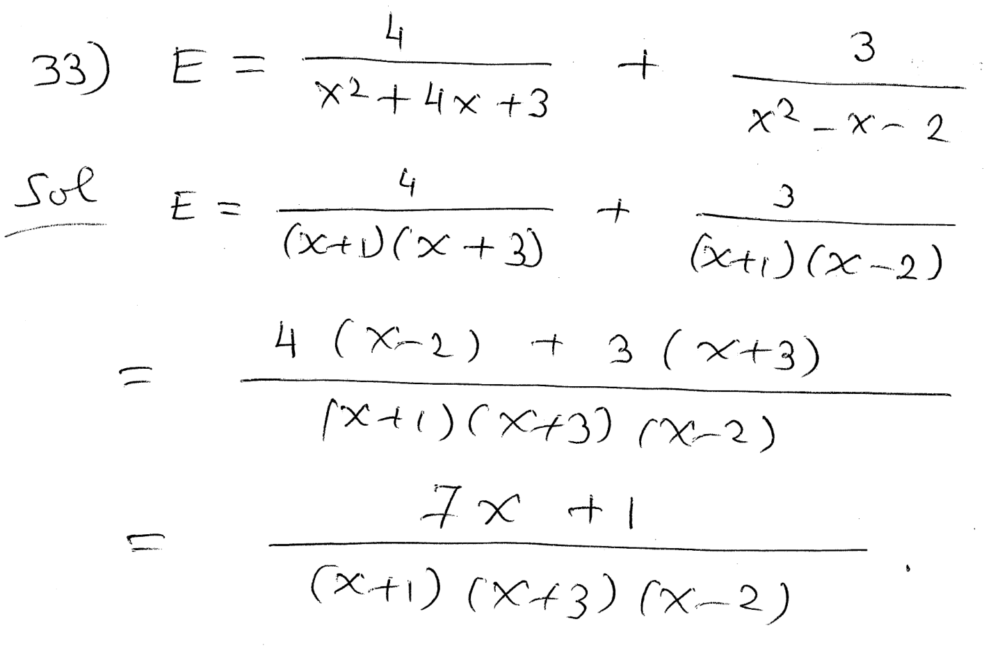
----
----

*Question.* (R.4:R-16/5) Solve the equation stem:[3r+2-5(r+1)=6r+4].
++++
<figure>
    <figcaption>Solution</figcaption>
    <audio
	controls
	src="./2121-01-08.m4a">
	    Your browser does not support the
	    <code>audio</code> element.
    </audio>
</figure>
++++
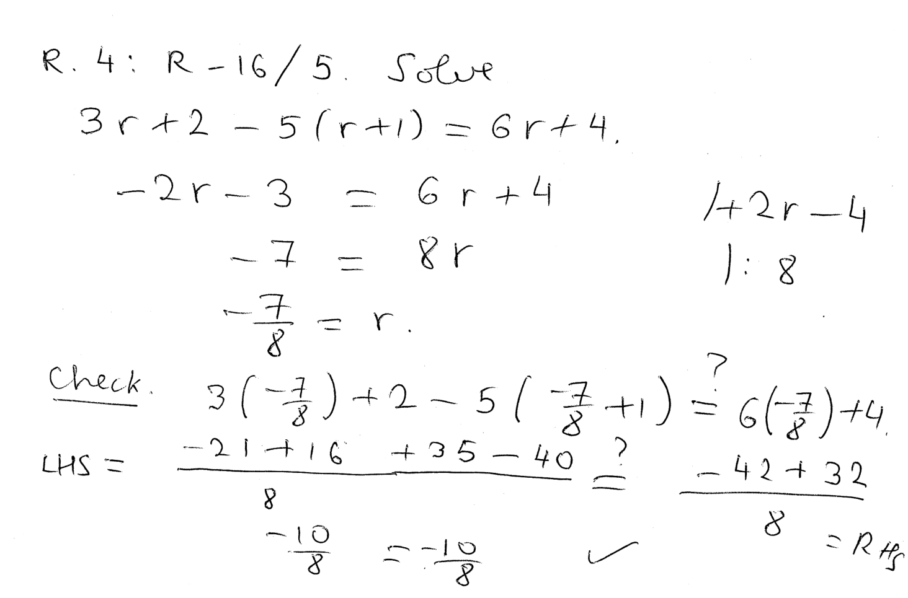
----
----

*About quadratic equations.* 
++++
<figure>
    <figcaption></figcaption>
    <audio
	controls
	src="./2121-01-09.m4a">
	    Your browser does not support the
	    <code>audio</code> element.
    </audio>
</figure>
++++
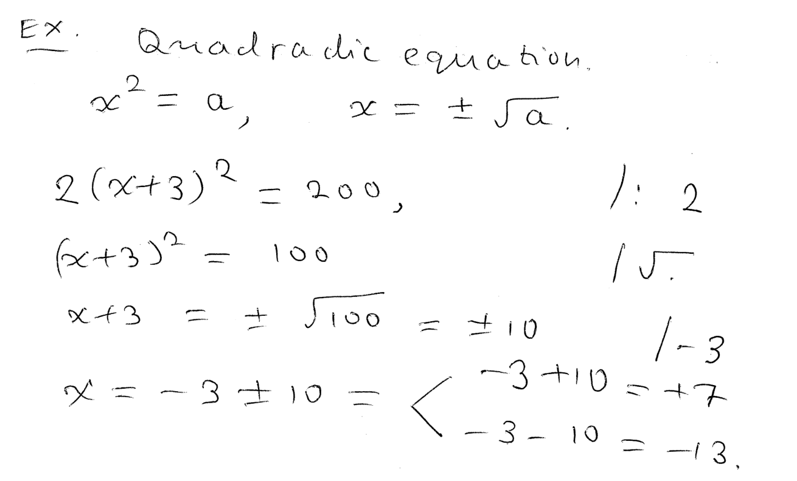
----
----

*The quadratic formula to solve a quadratic equation.*
++++
<figure>
    <figcaption></figcaption>
    <audio
	controls
	src="./2121-01-10.m4a">
	    Your browser does not support the
	    <code>audio</code> element.
    </audio>
</figure>
++++
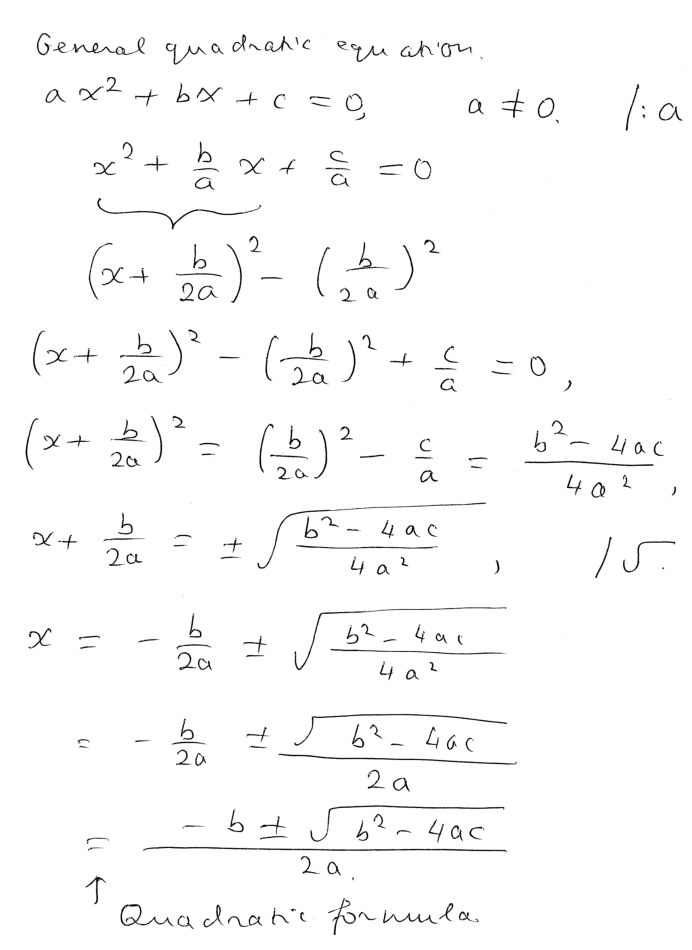
----
----

*Question.* (R.4:R-16/9) Solve the equation stem:[x^2+5x+6=0].
++++
<figure>
    <figcaption>Solution</figcaption>
    <audio
	controls
	src="./2121-01-11.m4a">
	    Your browser does not support the
	    <code>audio</code> element.
    </audio>
</figure>
++++
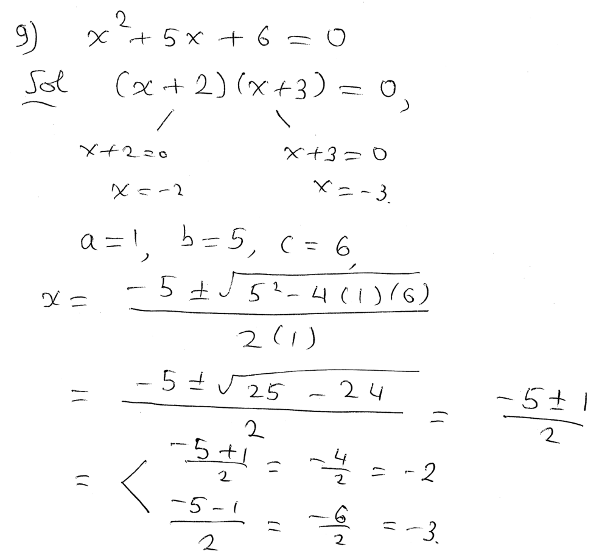
----
----

*Example of an _ugly_ quadratic equation.*  Solve the equation stem:[2x^2+7x-100=0].
++++
<figure>
    <figcaption>Solution</figcaption>
    <audio
	controls
	src="./2121-01-12.m4a">
	    Your browser does not support the
	    <code>audio</code> element.
    </audio>
</figure>
++++
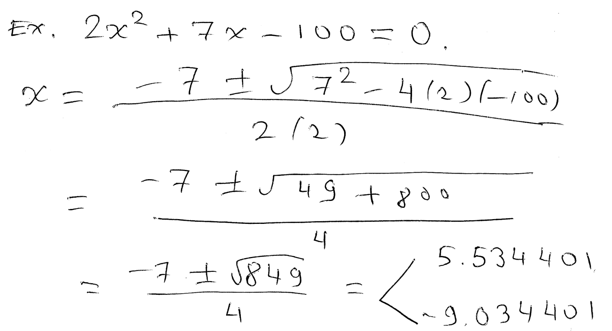
----
----

*R.5. Inequalities.*
++++
<figure>
    <figcaption></figcaption>
    <audio
	controls
	src="./2121-01-13.m4a">
	    Your browser does not support the
	    <code>audio</code> element.
    </audio>
</figure>
++++
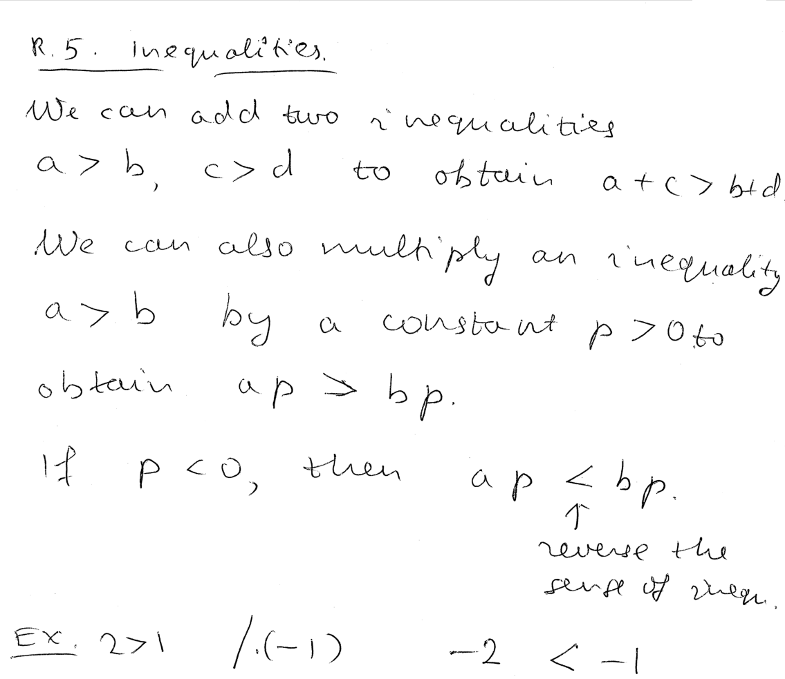
----
----

*Intervals.* 
++++
<figure>
    <figcaption></figcaption>
    <audio
	controls
	src="./2121-01-14.m4a">
	    Your browser does not support the
	    <code>audio</code> element.
    </audio>
</figure>
++++
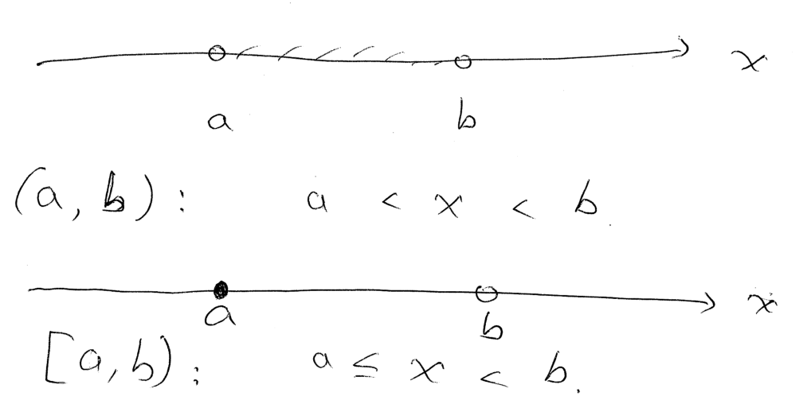
----
----

