= Math 2121, Calculus for the life sciences, I
:source-highlighter: coderay
:stem:

In this set of notes we work through some notions and
examples from calculus.  You can read the questions
here, study the handwritten notes, and while doing
so, listen to some explanations by clicking on the
"play" button.

== Lesson 2, Review, Lines and Linear Functions.

*Question.* (R.5:R-21/15) Solve the inequality stem:[6p+7 le 9].
++++
<figure>
    <figcaption>Solution</figcaption>
    <audio
	controls
	src="./2121-02-01.m4a">
	    Your browser does not support the
	    <code>audio</code> element.
    </audio>
</figure>
++++
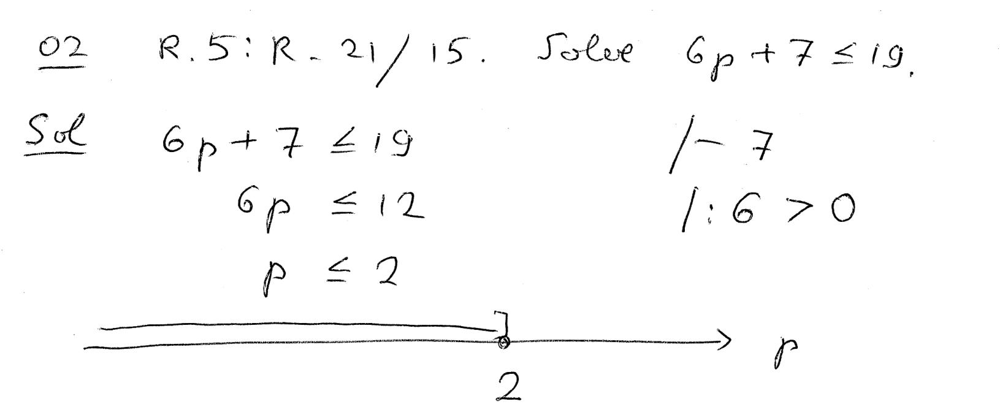
----
----

*Question.* (R.5:R-21/17) Solve the inequality stem:[m-(3m-2)+6<7m-19].
++++
<figure>
    <figcaption>Solution</figcaption>
    <audio
	controls
	src="./2121-02-02.m4a">
	    Your browser does not support the
	    <code>audio</code> element.
    </audio>
</figure>
++++
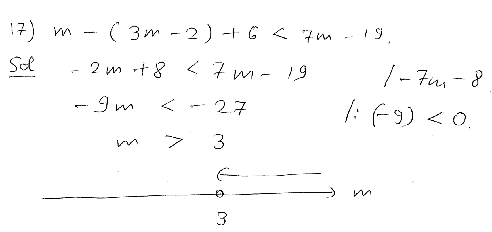
----
----

*Question.* (R.5:R-21/23) Solve the inequality stem:[-2<{1-3k}/4 le 4].
++++
<figure>
    <figcaption>Solution</figcaption>
    <audio
	controls
	src="./2121-02-03.m4a">
	    Your browser does not support the
	    <code>audio</code> element.
    </audio>
</figure>
++++
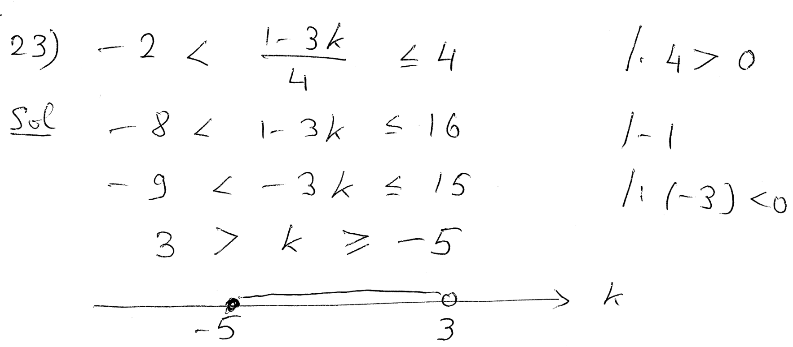
----
----

*Question.* (Example of a sign diagram.)  Solve the inequality
stem:[P=(x-1)(x-2)(x+3)>0].
++++
<figure>
    <figcaption>Solution</figcaption>
    <audio
	controls
	src="./2121-02-04.m4a">
	    Your browser does not support the
	    <code>audio</code> element.
    </audio>
</figure>
++++
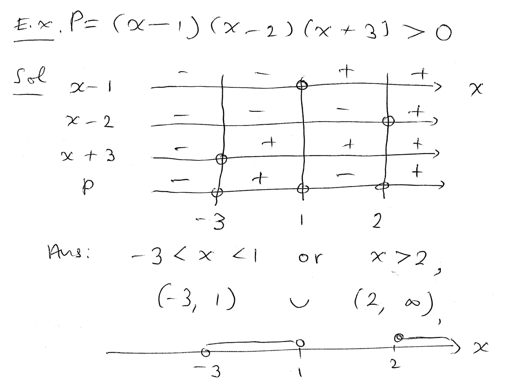
----
----

*Question.* (R.5:R-21/53) Solve the inequality stem:[{z^2+z}/{z^2-1}ge3].
++++
<figure>
    <figcaption>Solution</figcaption>
    <audio
	controls
	src="./2121-02-05.m4a">
	    Your browser does not support the
	    <code>audio</code> element.
    </audio>
</figure>
++++
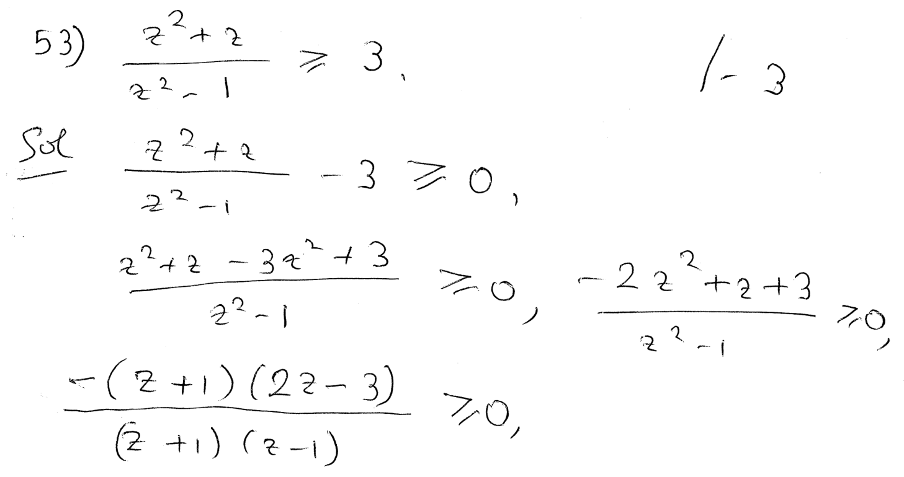
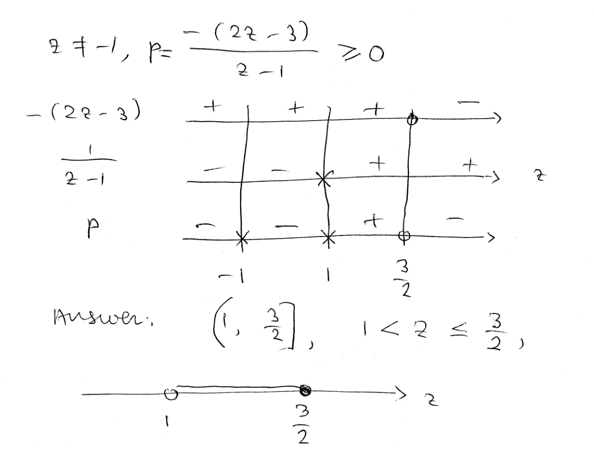
----
----

*Question.* (R.7:R-28/9) Simplify the expression stem:[E=7sqrt{2}-8sqrt{18}+4sqrt{72}].
++++
<figure>
    <figcaption>Solution</figcaption>
    <audio
	controls
	src="./2121-02-06.m4a">
	    Your browser does not support the
	    <code>audio</code> element.
    </audio>
</figure>
++++
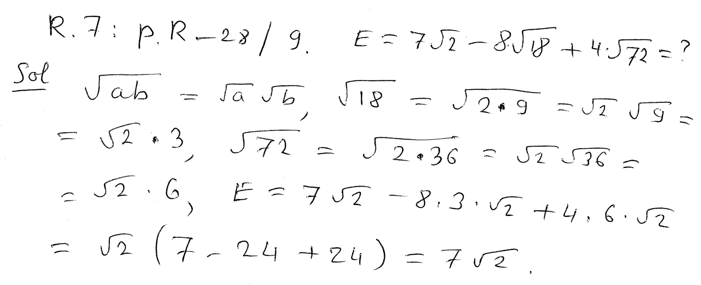
----
----

*Question.* (R.7:R-28/42) Rationalize the denominator of stem:[E={sqrt{x}+sqrt{x+1}}/{sqrt{x}-sqrt{x+1}}].
++++
<figure>
    <figcaption>Solution</figcaption>
    <audio
	controls
	src="./2121-02-07.m4a">
	    Your browser does not support the
	    <code>audio</code> element.
    </audio>
</figure>
++++
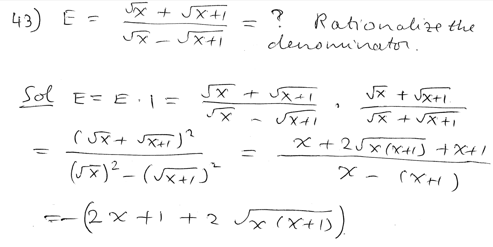
----
----

*Lines and linear functions.*  The equation of a line in slope and
intercept form, stem:[y=mx+b], and in slope and point form, 
stem:[y-y_0=m(x-x_0)].
++++
<figure>
    <figcaption></figcaption>
    <audio
	controls
	src="./2121-02-08.m4a">
	    Your browser does not support the
	    <code>audio</code> element.
    </audio>
</figure>
++++
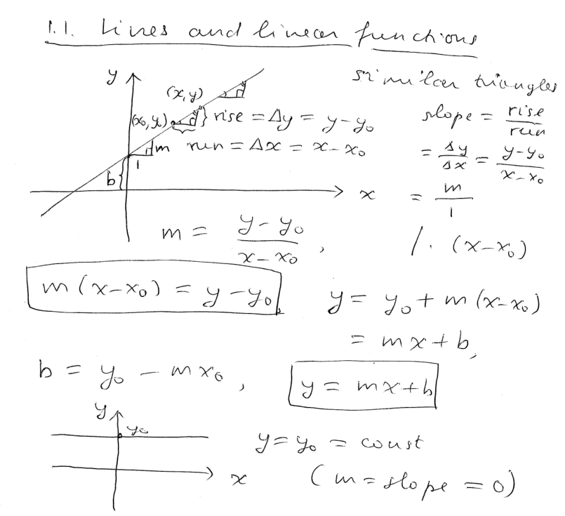
----
----

*Vertical lines, parallel lines, perpendicular lines.*
A line is vertical if it is parallel to the vertical axis, i.e.,
its equation is of the form stem:[x=x_0=const].
Two lines are parallel if and only if they have the same slope.
Two lines are perpendicular if and only if their slopes are
negative reciprocals of each other.
++++
<figure>
    <figcaption></figcaption>
    <audio
	controls
	src="./2121-02-09.m4a">
	    Your browser does not support the
	    <code>audio</code> element.
    </audio>
</figure>
++++
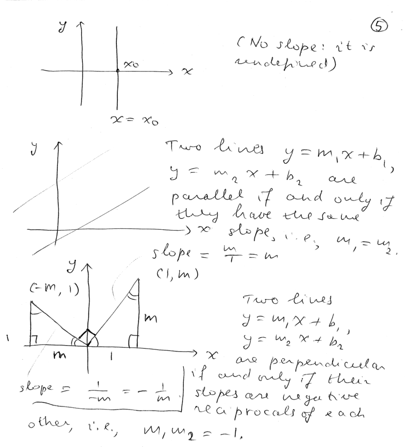
----
----

*Question.* (1.1:p13/1) Compute the slope of the line through the points stem:[(4,5)] and stem:[(-1,2)].
++++
<figure>
    <figcaption>Solution</figcaption>
    <audio
	controls
	src="./2121-02-10.m4a">
	    Your browser does not support the
	    <code>audio</code> element.
    </audio>
</figure>
++++
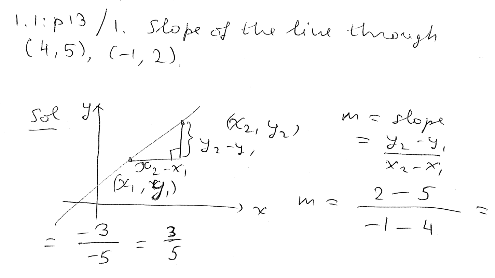
----
----

*Question.* (1.1:p13/7) Compute the slope of the line stem:[5x-9y=11].
++++
<figure>
    <figcaption>Solution</figcaption>
    <audio
	controls
	src="./2121-02-11.m4a">
	    Your browser does not support the
	    <code>audio</code> element.
    </audio>
</figure>
++++
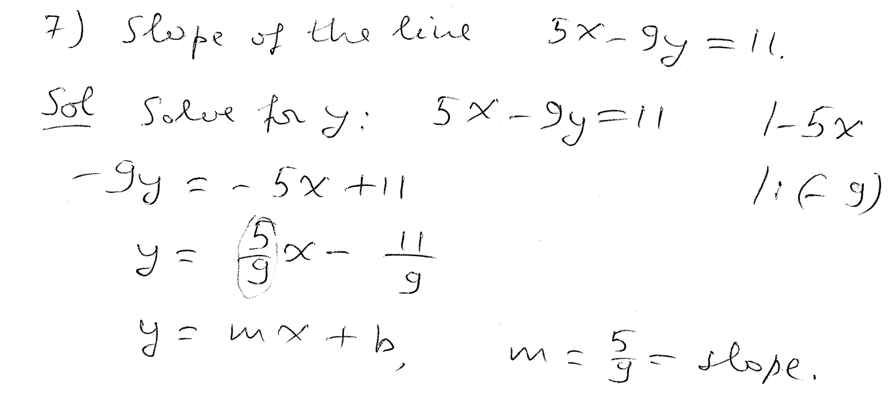
----
----

*Question.* (1.1:p13/15) Find an equation of the line that goes through the points stem:[(1,3)] and has slope stem:[-2].
++++
<figure>
    <figcaption>Solution</figcaption>
    <audio
	controls
	src="./2121-02-12.m4a">
	    Your browser does not support the
	    <code>audio</code> element.
    </audio>
</figure>
++++
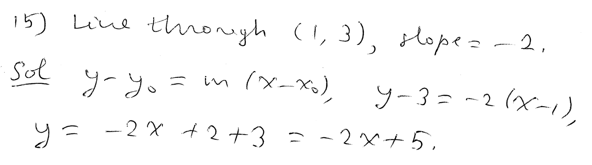
----
----

*Question.* (1.1:p13/21) Find an equation of the line that goes through the points stem:[(2/3,1/2)] and stem:[(1/4,-2)].
++++
<figure>
    <figcaption>Solution</figcaption>
    <audio
	controls
	src="./2121-02-13.m4a">
	    Your browser does not support the
	    <code>audio</code> element.
    </audio>
</figure>
++++
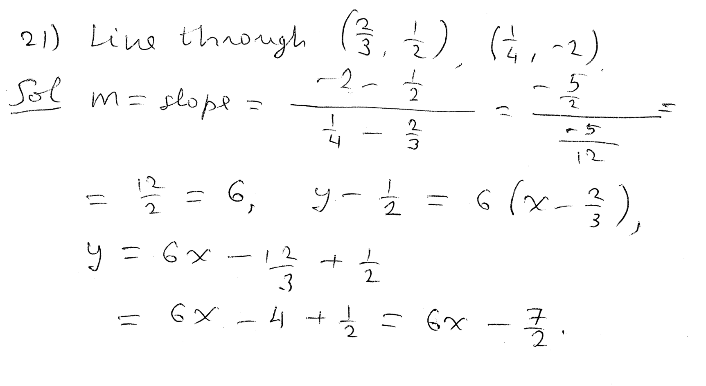
----
----

*Question.* (1.1:p13/29) Find an equation of the line that goes through the points stem:[(-4,6)] and is parallel to the line stem:[3x+2y=13].
++++
<figure>
    <figcaption>Solution</figcaption>
    <audio
	controls
	src="./2121-02-14.m4a">
	    Your browser does not support the
	    <code>audio</code> element.
    </audio>
</figure>
++++
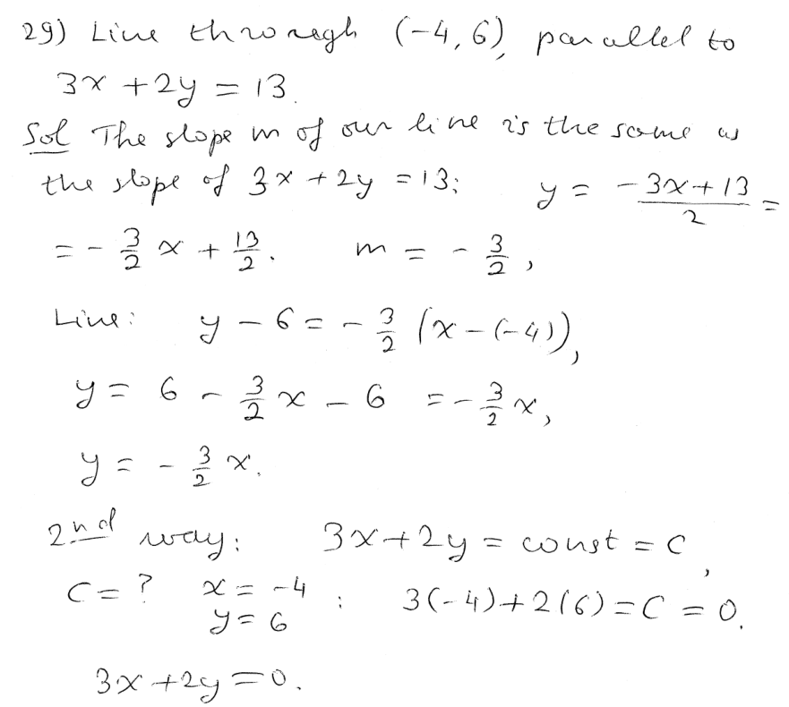
----
----

*Question.* (1.1:p13/31) Find an equation of the line that goes through the points stem:[(3,-4)] and is perpendicular to the line stem:[x+y=4].
++++
<figure>
    <figcaption>Solution</figcaption>
    <audio
	controls
	src="./2121-02-15.m4a">
	    Your browser does not support the
	    <code>audio</code> element.
    </audio>
</figure>
++++
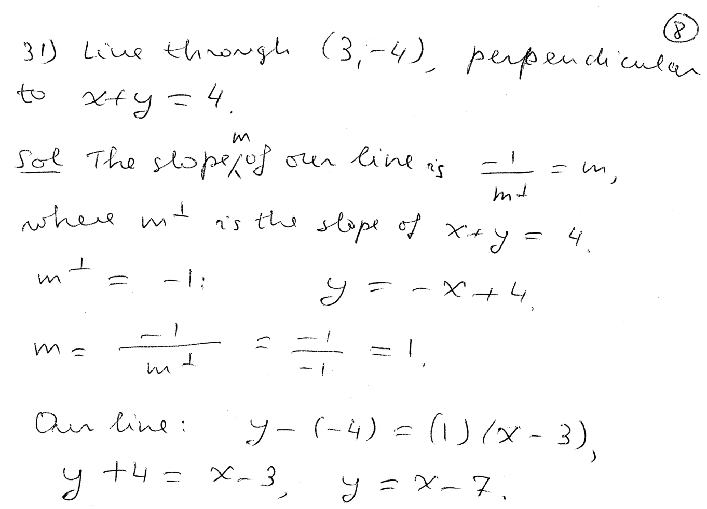
----
----

*The equation of the line using two intercepts.*
Find an equation of the line with stem:[x]-intercept stem:[2], and
stem:[y]-intercept stem:[1/3].
++++
<figure>
    <figcaption>Solution</figcaption>
    <audio
	controls
	src="./2121-02-16.m4a">
	    Your browser does not support the
	    <code>audio</code> element.
    </audio>
</figure>
++++
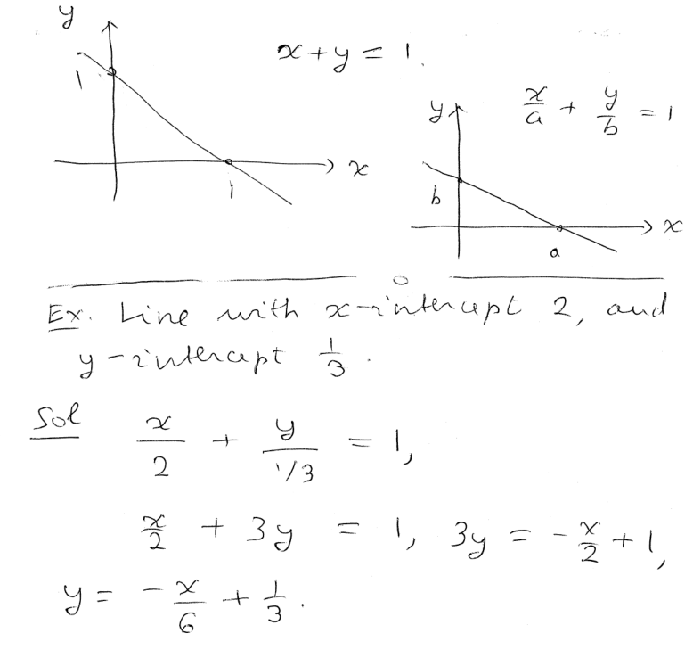
----
----

*Question.* (1.1:p13/45) Graph the line stem:[y=x-1].
++++
<figure>
    <figcaption>Solution</figcaption>
    <audio
	controls
	src="./2121-02-17.m4a">
	    Your browser does not support the
	    <code>audio</code> element.
    </audio>
</figure>
++++
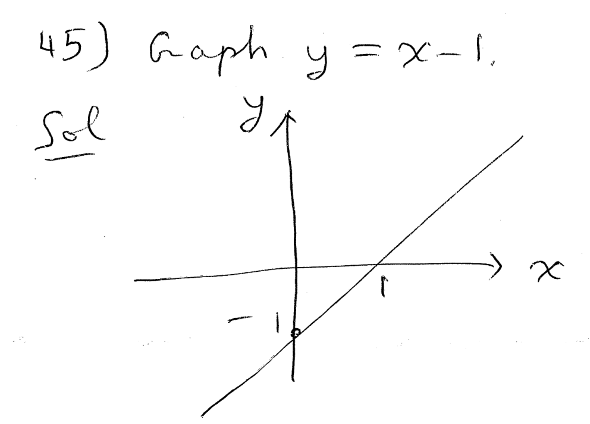
----
----

*Question.* (1.1:p13/47) Graph the line  stem:[y=-4x+9].
++++
<figure>
    <figcaption>Solution</figcaption>
    <audio
	controls
	src="./2121-02-18.m4a">
	    Your browser does not support the
	    <code>audio</code> element.
    </audio>
</figure>
++++
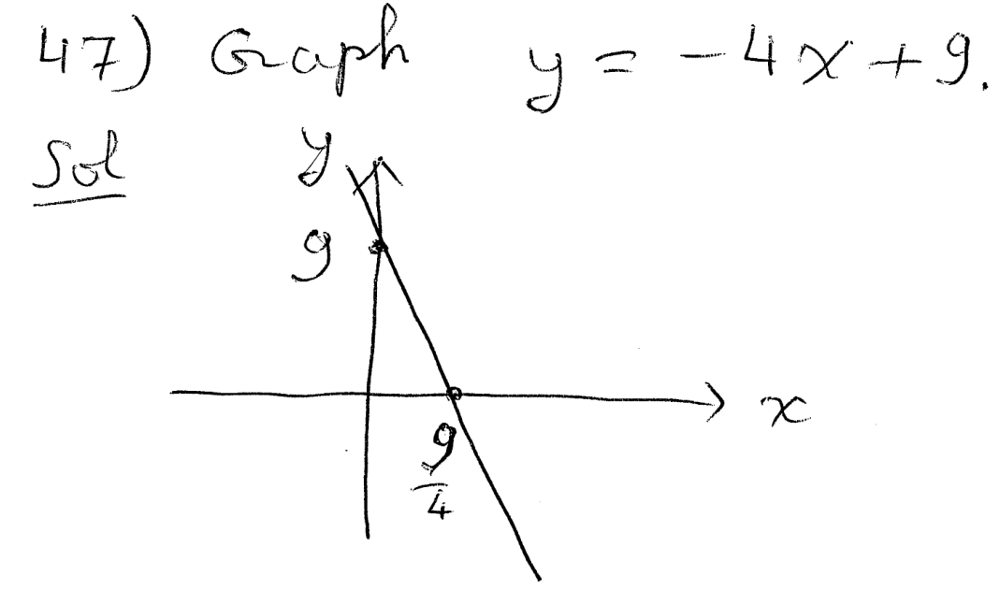
----
----

