= Math 2121, Calculus for the life sciences, I
:source-highlighter: coderay
:stem:

In this set of notes we work through some notions and
examples from calculus.  You can read the questions
here, study the handwritten notes, and while doing
so, listen to some explanations by clicking on the
"play" button.

== Lesson 3, Lines, Properties of Functions, Quadratic Functions.

*Question.* (1.1:p15/51) Graph the line stem:[3y-7x=-21].
++++
<figure>
    <figcaption>Solution</figcaption>
    <audio
	controls
	src="./2121-03-01.m4a">
	    Your browser does not support the
	    <code>audio</code> element.
    </audio>
</figure>
++++
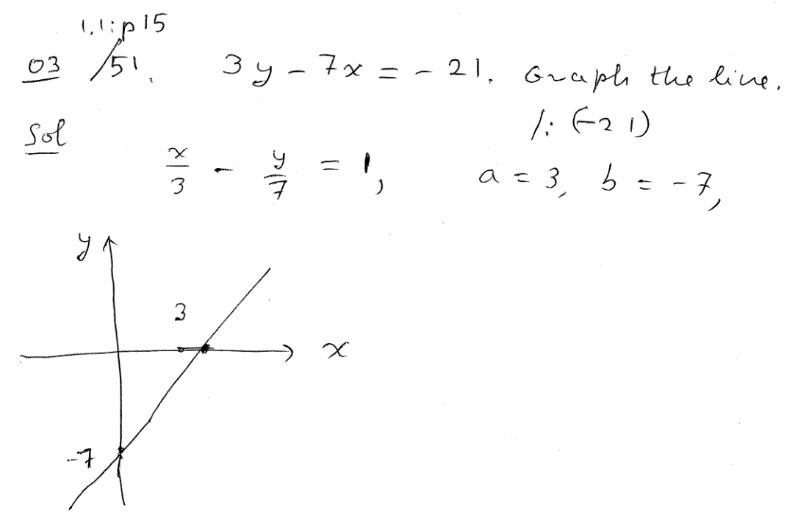
----
----

*Question.* (1.1:p15/61,65) Given the functions stem:[f(x)=7-5x],
stem:[g(x)=2x-3], compute stem:[f(2)], stem:[g(1.5)], stem:[f(f(x))],
stem:[f(g(x))], stem:[g(f(x))], stem:[g(g(x))].
++++
<figure>
    <figcaption>Solution</figcaption>
    <audio
	controls
	src="./2121-03-02.m4a">
	    Your browser does not support the
	    <code>audio</code> element.
    </audio>
</figure>
++++
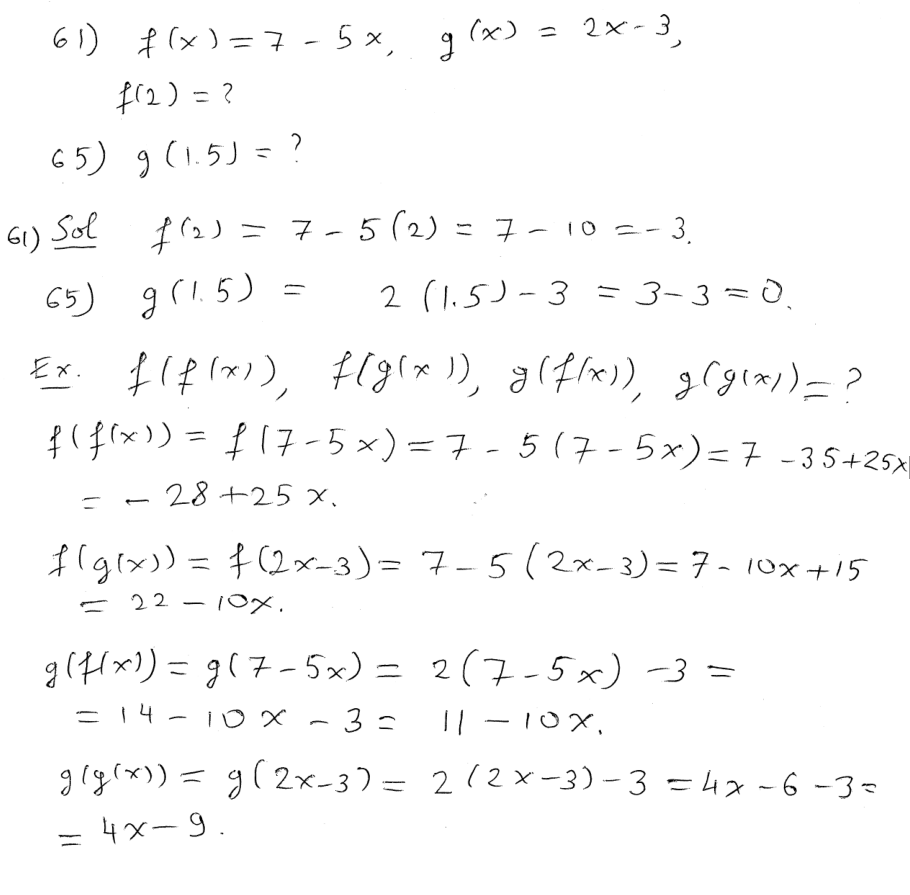
----
----

*Function as an assignment of points from one set to points in another set; representing a function by a table.*
++++
<figure>
    <figcaption></figcaption>
    <audio
	controls
	src="./2121-03-03.m4a">
	    Your browser does not support the
	    <code>audio</code> element.
    </audio>
</figure>
++++
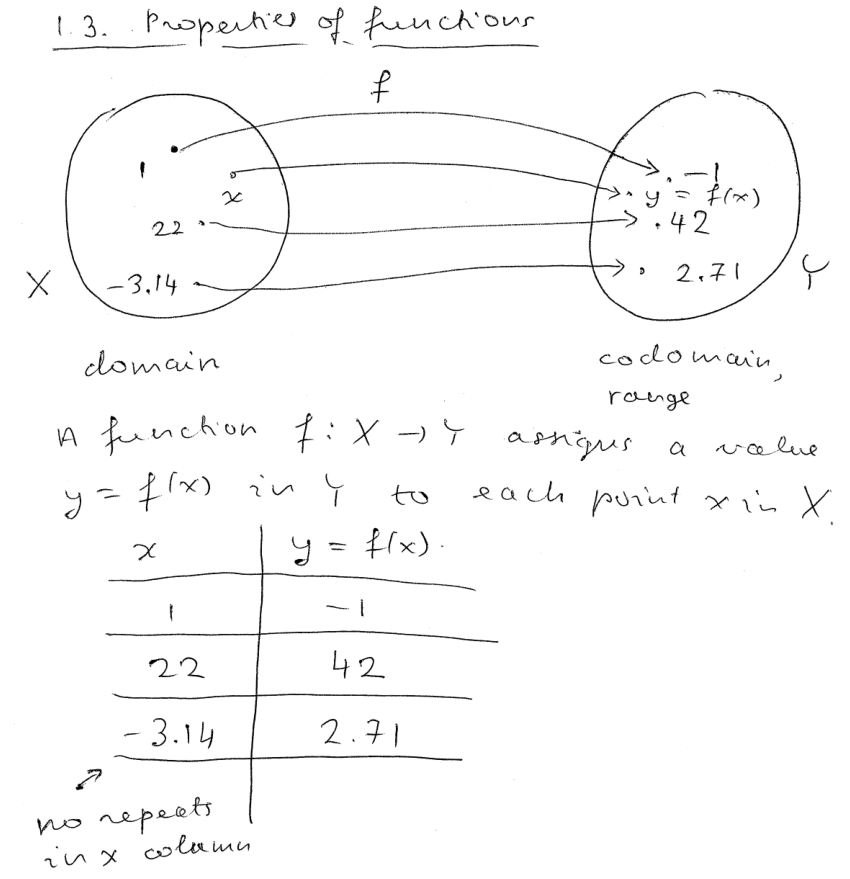
----
----

*Graphing a function that maps numbers to numbers.*
++++
<figure>
    <figcaption></figcaption>
    <audio
	controls
	src="./2121-03-04.m4a">
	    Your browser does not support the
	    <code>audio</code> element.
    </audio>
</figure>
++++
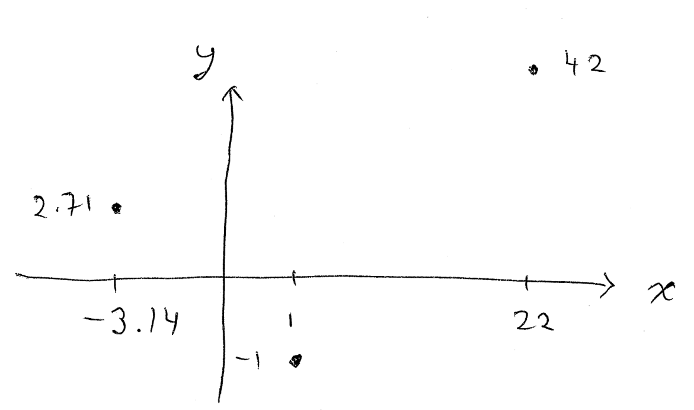
----
----

*Function as an input-output machine.*
++++
<figure>
    <figcaption></figcaption>
    <audio
	controls
	src="./2121-03-05.m4a">
	    Your browser does not support the
	    <code>audio</code> element.
    </audio>
</figure>
++++
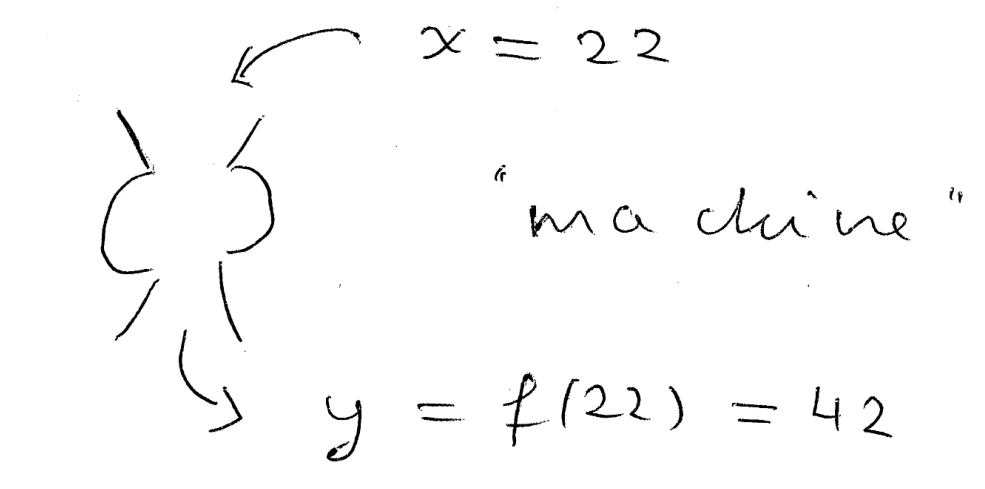
----
----

*Composition of functions; the vertical line test.*
++++
<figure>
    <figcaption></figcaption>
    <audio
	controls
	src="./2121-03-06.m4a">
	    Your browser does not support the
	    <code>audio</code> element.
    </audio>
</figure>
++++
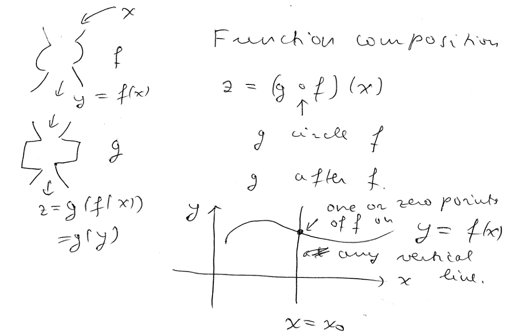
----
----

*An example of the vertical line test.*
++++
<figure>
    <figcaption></figcaption>
    <audio
	controls
	src="./2121-03-07.m4a">
	    Your browser does not support the
	    <code>audio</code> element.
    </audio>
</figure>
++++
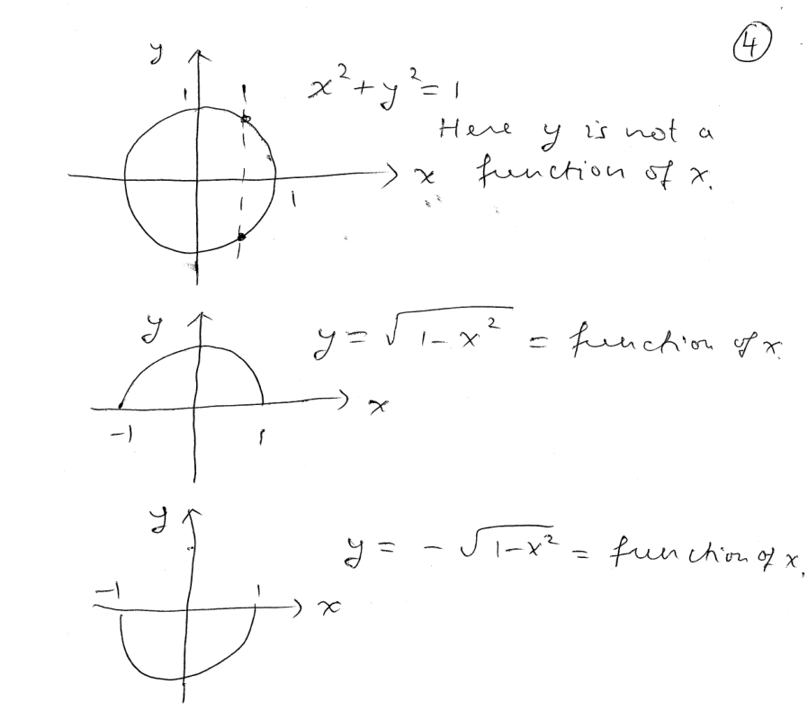
----
----

*Question.* (1.3:p37/21) Find the domain of the function stem:[f(x)=sqrt{4-x^2}].
++++
<figure>
    <figcaption>Solution</figcaption>
    <audio
	controls
	src="./2121-03-08.m4a">
	    Your browser does not support the
	    <code>audio</code> element.
    </audio>
</figure>
++++
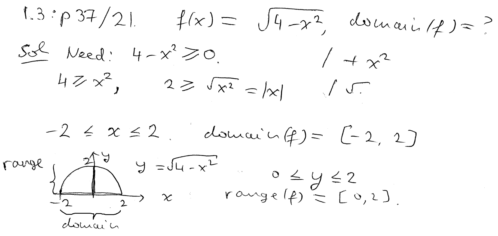
----
----

*Question.* (1.3:p37/25) Find the domain of the function stem:[f(x)=2/{1-x^2}].
++++
<figure>
    <figcaption>Solution</figcaption>
    <audio
	controls
	src="./2121-03-09.m4a">
	    Your browser does not support the
	    <code>audio</code> element.
    </audio>
</figure>
++++
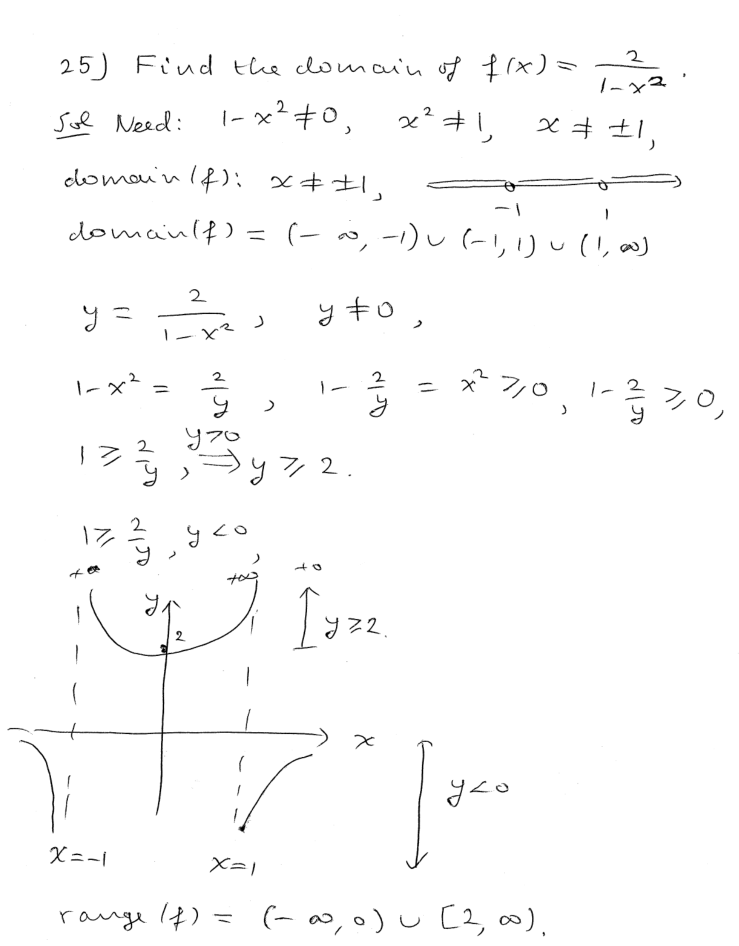
----
----

*Question.* (1.3:p37/31) Find the domain of the function stem:[f(x)=1/{sqrt{3x^2+2x-1}}].
++++
<figure>
    <figcaption>Solution</figcaption>
    <audio
	controls
	src="./2121-03-10.m4a">
	    Your browser does not support the
	    <code>audio</code> element.
    </audio>
</figure>
++++
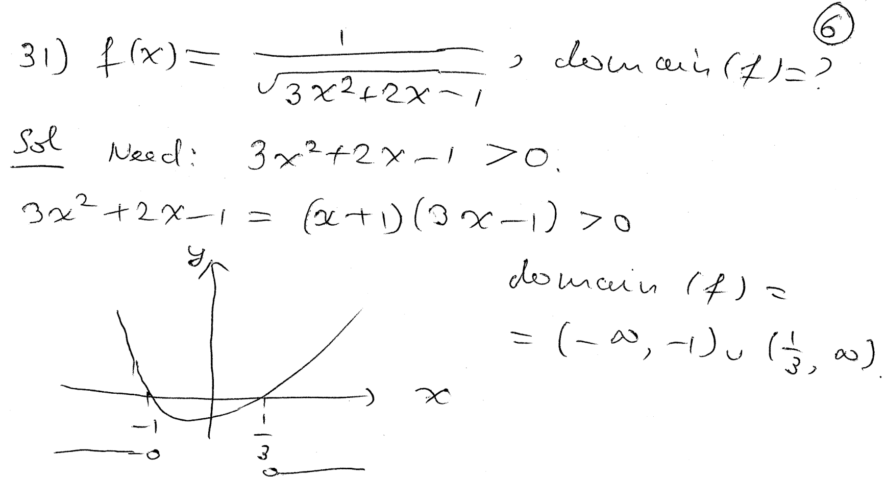
----
----

*Question.* (1.3:p37/33) Find the domain and the range of the function sketched.
++++
<figure>
    <figcaption>Solution</figcaption>
    <audio
	controls
	src="./2121-03-11.m4a">
	    Your browser does not support the
	    <code>audio</code> element.
    </audio>
</figure>
++++
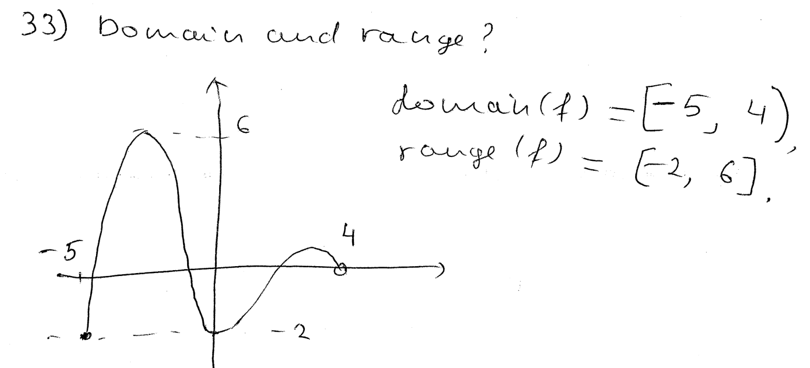
----
----

*Question.* (1.3:p37/57-60) Is stem:[y=y(x)] a function of stem:[x]?
++++
<figure>
    <figcaption>Solution</figcaption>
    <audio
	controls
	src="./2121-03-12.m4a">
	    Your browser does not support the
	    <code>audio</code> element.
    </audio>
</figure>
++++
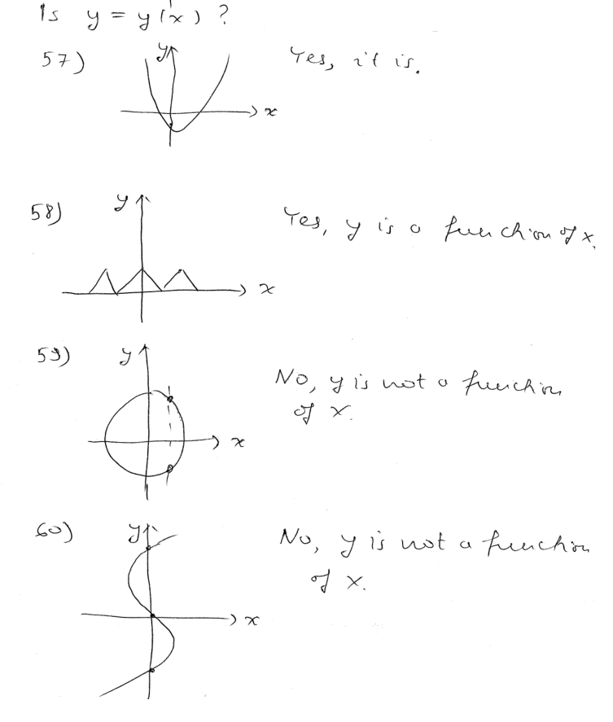
----
----

*Question.* (1.3:p37/63) Given stem:[f(x)=3x-7], stem:[g(x)=4-x],
compute (a) stem:[f(g(1))], (b) stem:[g(f(1))], (c) stem:[(f circ
g)(x)], (d) stem:[(g circ f)(x)].
++++
<figure>
    <figcaption>Solution</figcaption>
    <audio
	controls
	src="./2121-03-13.m4a">
	    Your browser does not support the
	    <code>audio</code> element.
    </audio>
</figure>
++++
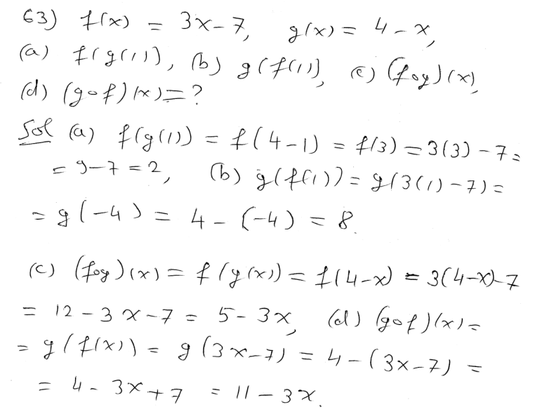
----
----

*Quadratic functions; graphing parabolas; transforming function graphs
via changes of coordinates.*
++++
<figure>
    <figcaption></figcaption>
    <audio
	controls
	src="./2121-03-14.m4a">
	    Your browser does not support the
	    <code>audio</code> element.
    </audio>
</figure>
++++
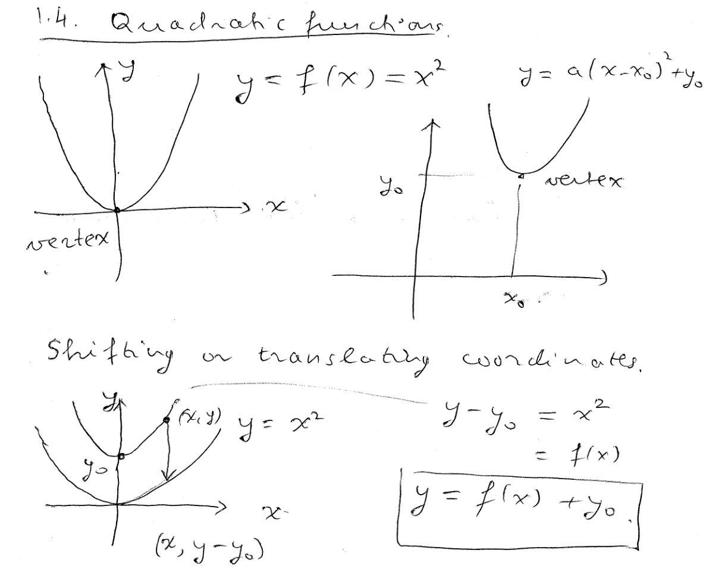
----
----

*Shifting or translating along the stem:[x]-axis.*
++++
<figure>
    <figcaption></figcaption>
    <audio
	controls
	src="./2121-03-15.m4a">
	    Your browser does not support the
	    <code>audio</code> element.
    </audio>
</figure>
++++
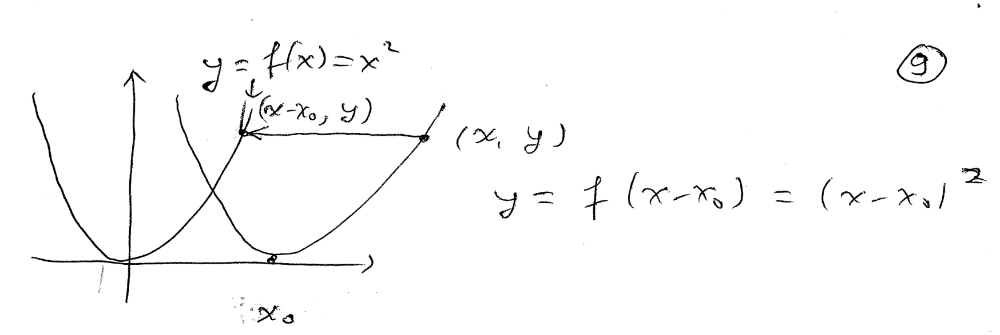
----
----

*Shifting or translating simultaneously along both the stem:[x]-axis
and the stem:[y]-axis.*
++++
<figure>
    <figcaption></figcaption>
    <audio
	controls
	src="./2121-03-16.m4a">
	    Your browser does not support the
	    <code>audio</code> element.
    </audio>
</figure>
++++
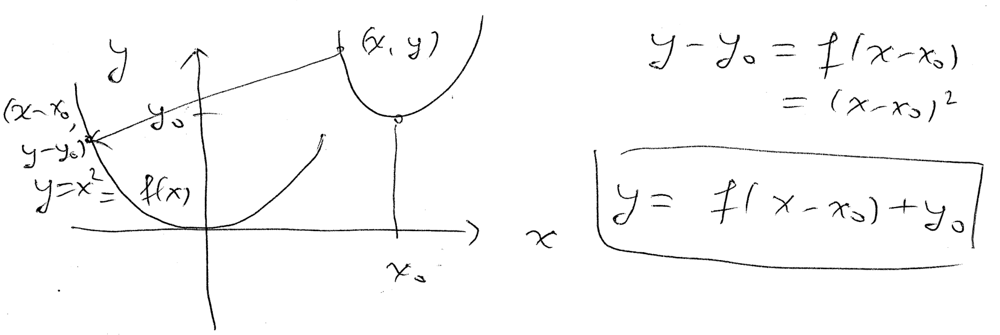
----
----

*Scaling or dilating along the stem:[y]-axis.*
++++
<figure>
    <figcaption></figcaption>
    <audio
	controls
	src="./2121-03-17.m4a">
	    Your browser does not support the
	    <code>audio</code> element.
    </audio>
</figure>
++++
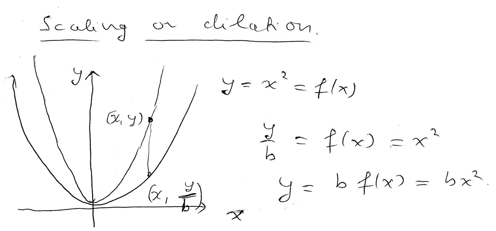
----
----

*Scaling or dilating along the stem:[x]-axis.*
++++
<figure>
    <figcaption></figcaption>
    <audio
	controls
	src="./2121-03-18.m4a">
	    Your browser does not support the
	    <code>audio</code> element.
    </audio>
</figure>
++++
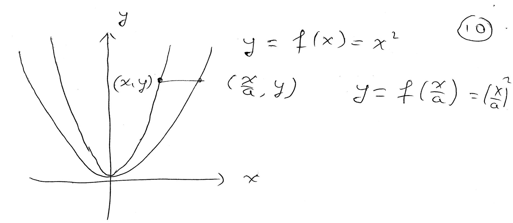
----
----

*Reflection through the stem:[x]-axis.*
++++
<figure>
    <figcaption></figcaption>
    <audio
	controls
	src="./2121-03-19.m4a">
	    Your browser does not support the
	    <code>audio</code> element.
    </audio>
</figure>
++++
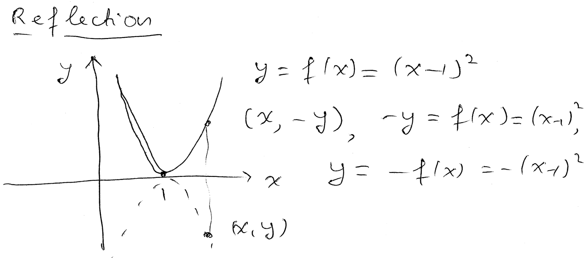
----
----

*Reflection through the stem:[y]-axis.*
++++
<figure>
    <figcaption></figcaption>
    <audio
	controls
	src="./2121-03-20.m4a">
	    Your browser does not support the
	    <code>audio</code> element.
    </audio>
</figure>
++++
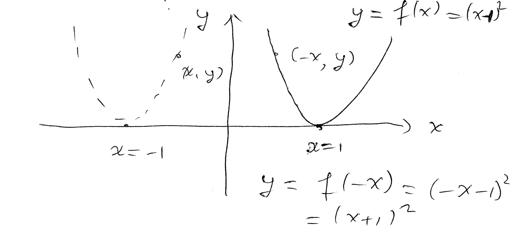
----
----

*Graphing a parabola in vertex form through a chain of linear
transformations of the elementary parabola stem:[y=x^2].*
++++
<figure>
    <figcaption></figcaption>
    <audio
	controls
	src="./2121-03-21.m4a">
	    Your browser does not support the
	    <code>audio</code> element.
    </audio>
</figure>
++++
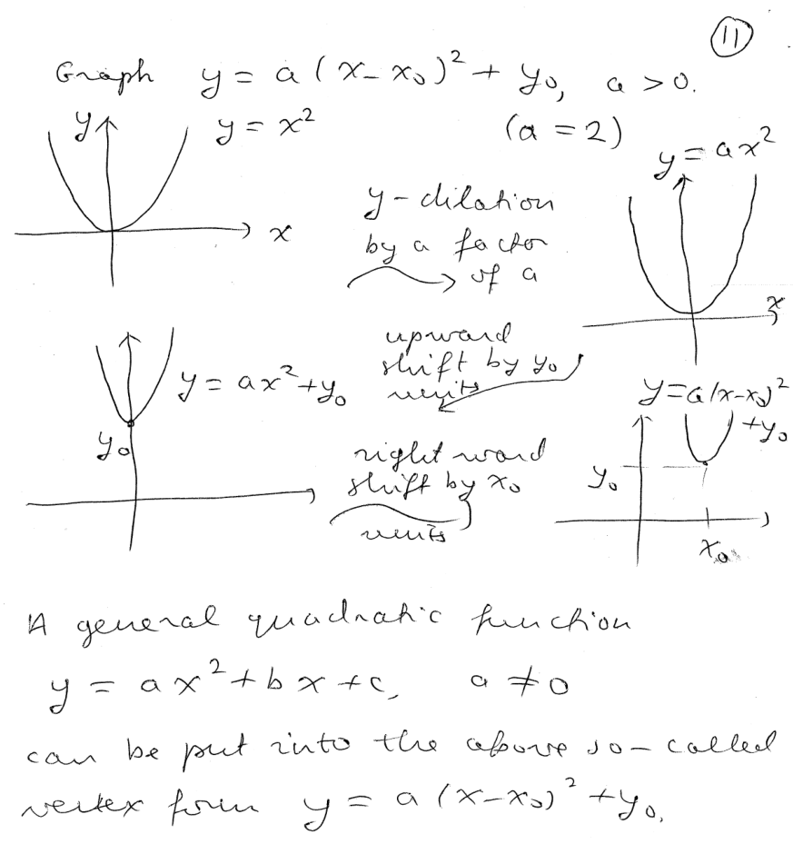
----
----

