= Math 2121, Calculus for the life sciences, I
:source-highlighter: coderay
:stem:

In this set of notes we work through some notions and
examples from calculus.  You can read the questions
here, study the handwritten notes, and while doing
so, listen to some explanations by clicking on the
"play" button.

== Lesson 4, Quadratic Functions; Polynomial and Rational Functions; The Exponential Function.

*Finding the vertex form of a quadratic function.*
++++
<figure>
    <figcaption></figcaption>
    <audio
	controls
	src="./2121-04-01.m4a">
	    Your browser does not support the
	    <code>audio</code> element.
    </audio>
</figure>
++++
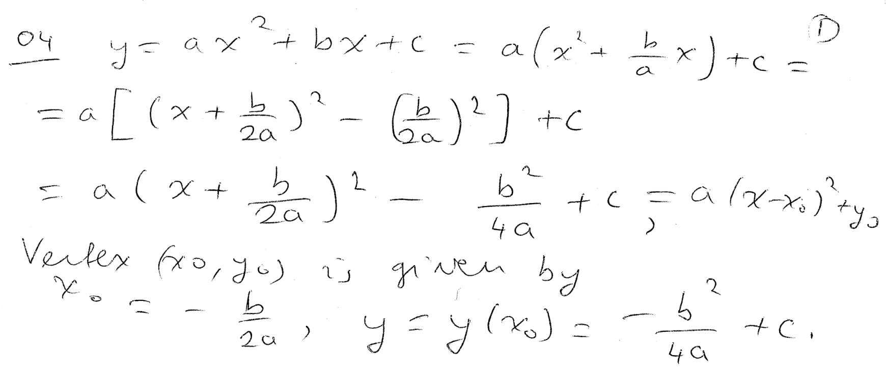
----
----

*Question.* (1.4:p48/7) Graph the function stem:[y=-(3-x)^2+2].
++++
<figure>
    <figcaption>Solution</figcaption>
    <audio
	controls
	src="./2121-04-02.m4a">
	    Your browser does not support the
	    <code>audio</code> element.
    </audio>
</figure>
++++
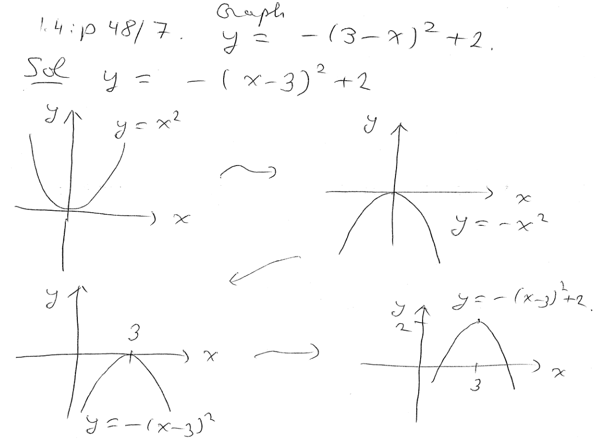
----
----

*Question.* (1.4:p48/9) Complete the square and find the vertex of 
stem:[y=3x^2+9x+5].
++++
<figure>
    <figcaption>Solution</figcaption>
    <audio
	controls
	src="./2121-04-03.m4a">
	    Your browser does not support the
	    <code>audio</code> element.
    </audio>
</figure>
++++
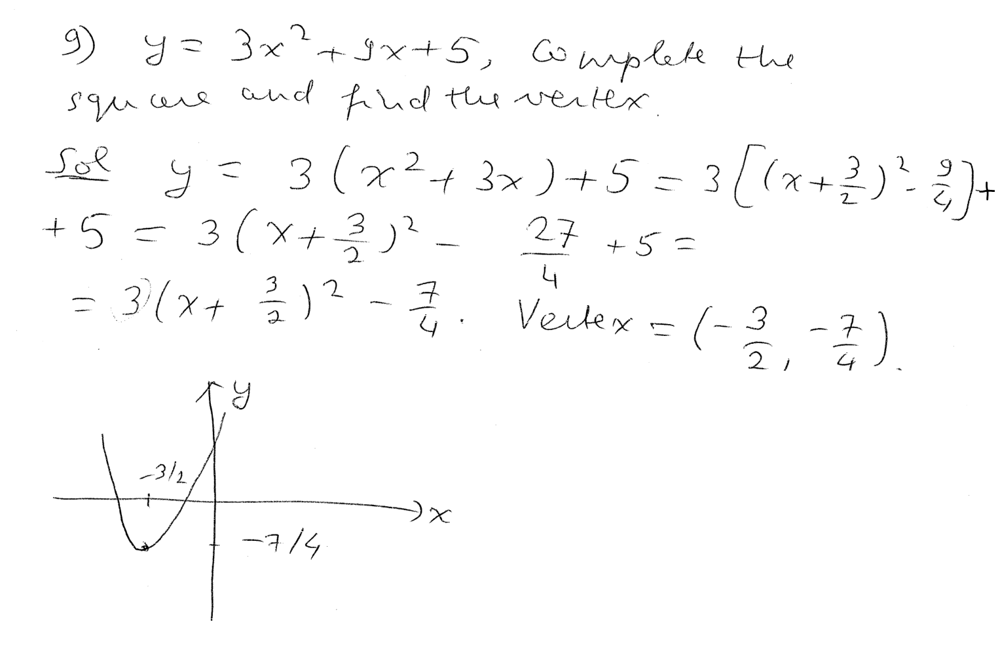
----
----

*Question.* (1.4:p48/9) Complete the square and find the vertex of 
stem:[f(x)=-2x^2+16x-21].
++++
<figure>
    <figcaption>Solution</figcaption>
    <audio
	controls
	src="./2121-04-04.m4a">
	    Your browser does not support the
	    <code>audio</code> element.
    </audio>
</figure>
++++
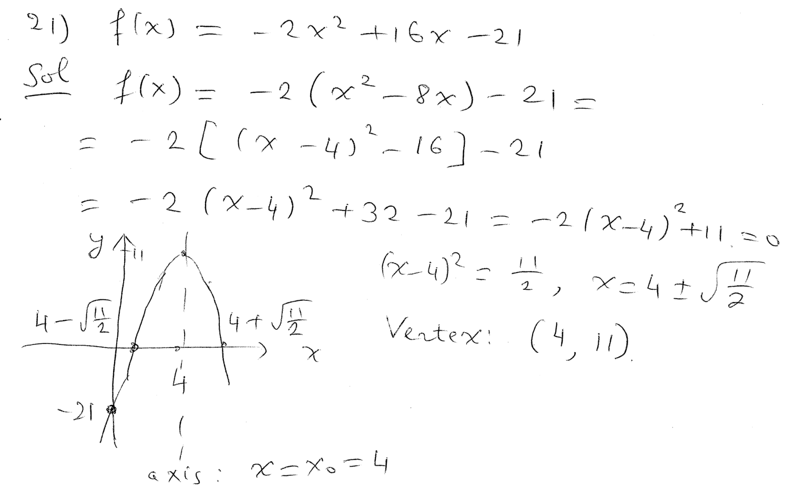
----
----

*Question.* (1.4:p48/35) Using coordinate transformations, graph
stem:[f(x)=sqrt{x-2}+2].
++++
<figure>
    <figcaption>Solution</figcaption>
    <audio
	controls
	src="./2121-04-05.m4a">
	    Your browser does not support the
	    <code>audio</code> element.
    </audio>
</figure>
++++
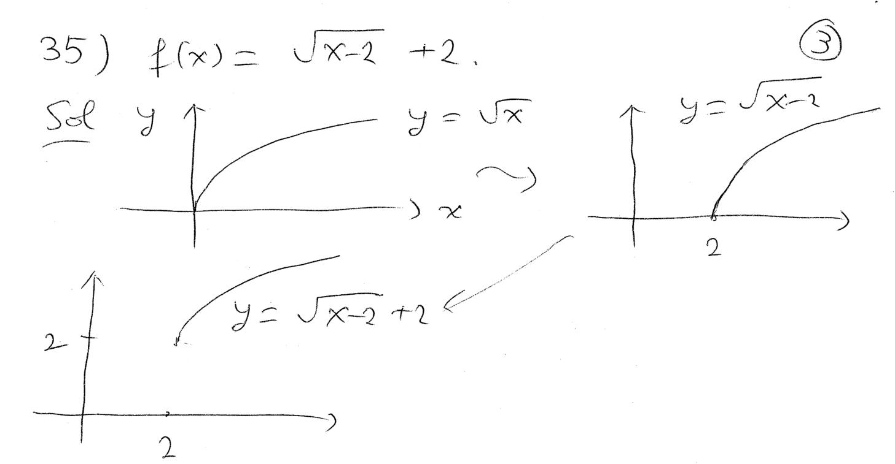
----
----

*Definition of polynomials; odd degree powers.*
++++
<figure>
    <figcaption></figcaption>
    <audio
	controls
	src="./2121-04-06.m4a">
	    Your browser does not support the
	    <code>audio</code> element.
    </audio>
</figure>
++++
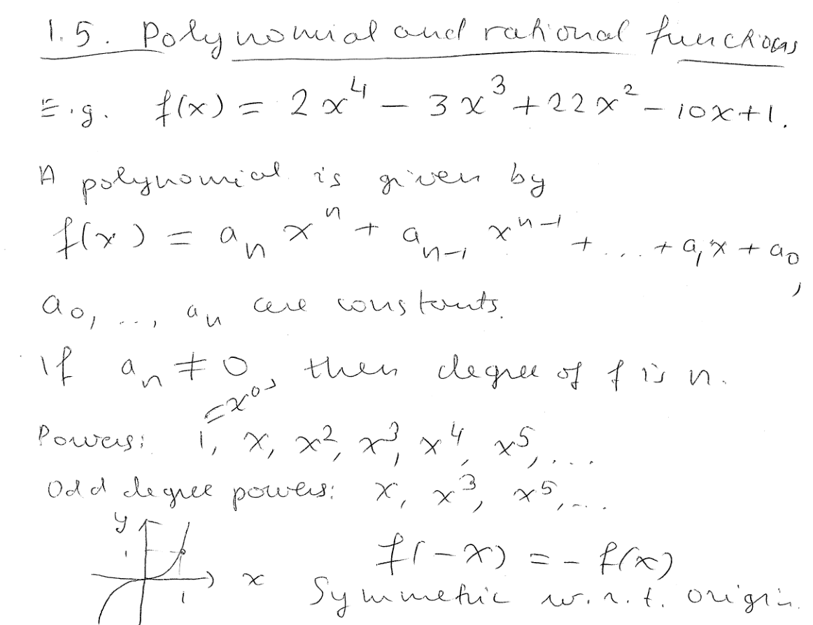
----
----

*Even degree powers.*
++++
<figure>
    <figcaption></figcaption>
    <audio
	controls
	src="./2121-04-07.m4a">
	    Your browser does not support the
	    <code>audio</code> element.
    </audio>
</figure>
++++
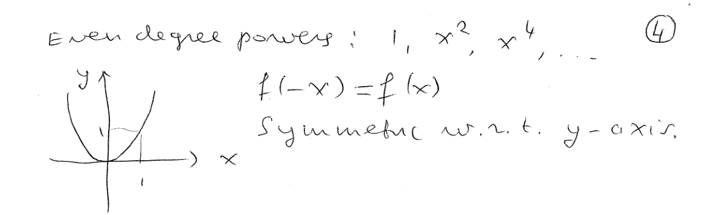
----
----

*Definition of a rational function.*
++++
<figure>
    <figcaption></figcaption>
    <audio
	controls
	src="./2121-04-08.m4a">
	    Your browser does not support the
	    <code>audio</code> element.
    </audio>
</figure>
++++
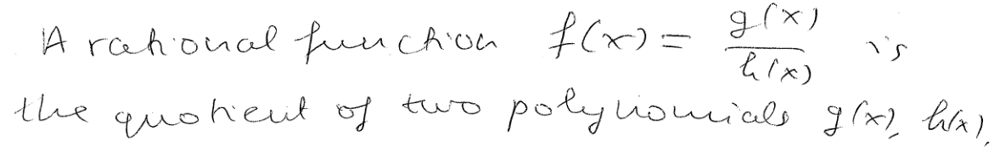
----
----

*Linear fraction, or, fractional linear function.*
++++
<figure>
    <figcaption></figcaption>
    <audio
	controls
	src="./2121-04-09.m4a">
	    Your browser does not support the
	    <code>audio</code> element.
    </audio>
</figure>
++++
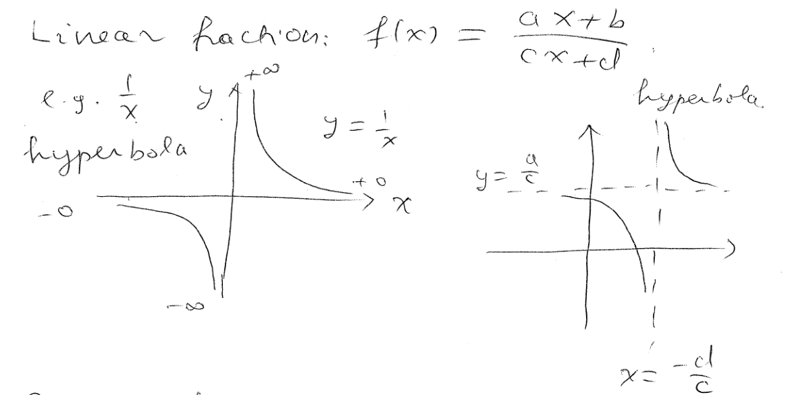
----
----

*Powers of negative exponent; odd degree negative powers.*
++++
<figure>
    <figcaption></figcaption>
    <audio
	controls
	src="./2121-04-10.m4a">
	    Your browser does not support the
	    <code>audio</code> element.
    </audio>
</figure>
++++
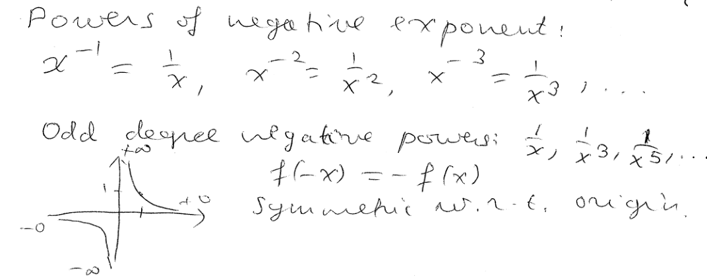
----
----

*Even degree negative powers.*
++++
<figure>
    <figcaption></figcaption>
    <audio
	controls
	src="./2121-04-11.m4a">
	    Your browser does not support the
	    <code>audio</code> element.
    </audio>
</figure>
++++
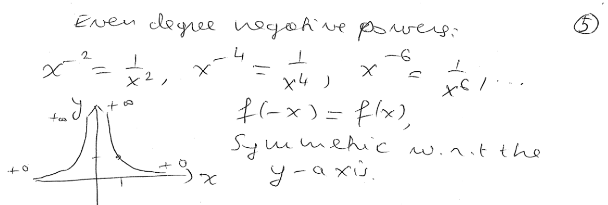
----
----

*Question.* (1.5:p58/3) Graph the function stem:[f(x)=(x-2)^3+3].
++++
<figure>
    <figcaption>Solution</figcaption>
    <audio
	controls
	src="./2121-04-12.m4a">
	    Your browser does not support the
	    <code>audio</code> element.
    </audio>
</figure>
++++
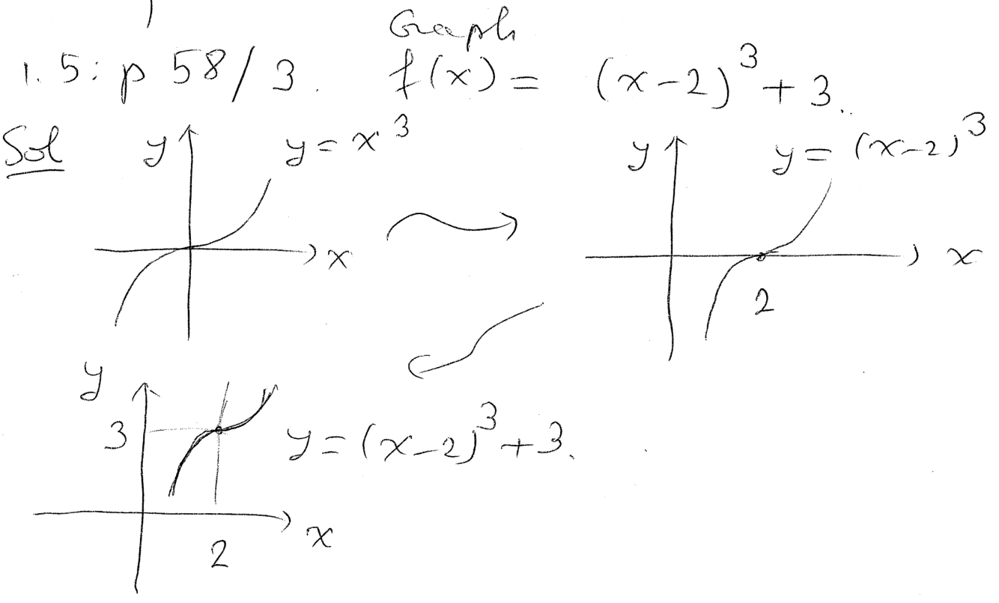
----
----

*Question.* (1.5:p58/6) Graph the function stem:[f(x)=-(x-1)^4+2].
++++
<figure>
    <figcaption>Solution</figcaption>
    <audio
	controls
	src="./2121-04-13.m4a">
	    Your browser does not support the
	    <code>audio</code> element.
    </audio>
</figure>
++++
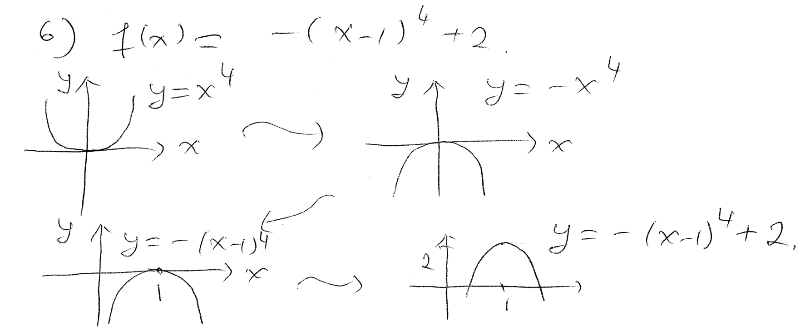
----
----

*Question.* (1.5:p58/27) Graph the function stem:[f(x)=-4/{x+2}].
++++
<figure>
    <figcaption>Solution</figcaption>
    <audio
	controls
	src="./2121-04-14.m4a">
	    Your browser does not support the
	    <code>audio</code> element.
    </audio>
</figure>
++++
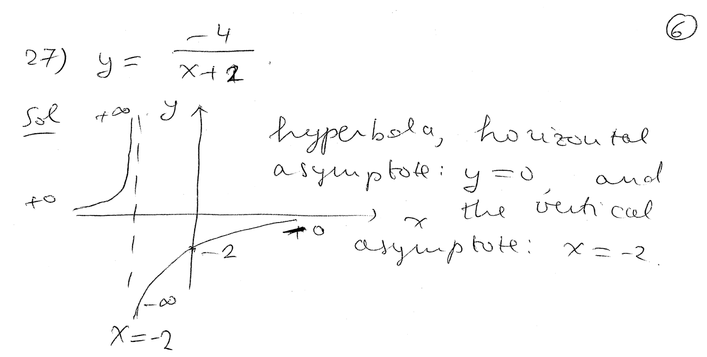
----
----

*Question.* (1.5:p58/33) Graph the function stem:[f(x)={x+1}/{x-4}].
++++
<figure>
    <figcaption>Solution</figcaption>
    <audio
	controls
	src="./2121-04-15.m4a">
	    Your browser does not support the
	    <code>audio</code> element.
    </audio>
</figure>
++++
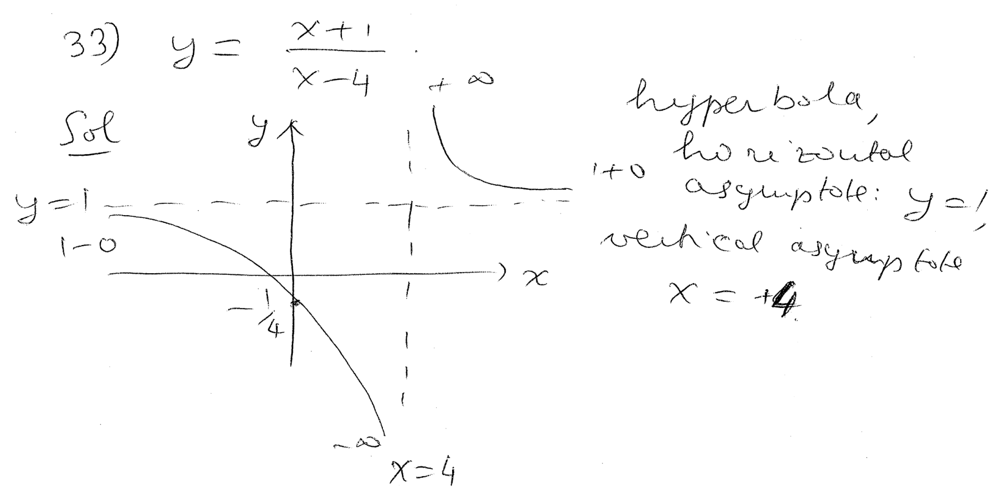
----
----

*Question.* (1.5:p58/39) Graph the function stem:[f(x)={x^2+7x+12}/{x+4}].
++++
<figure>
    <figcaption>Solution</figcaption>
    <audio
	controls
	src="./2121-04-16.m4a">
	    Your browser does not support the
	    <code>audio</code> element.
    </audio>
</figure>
++++
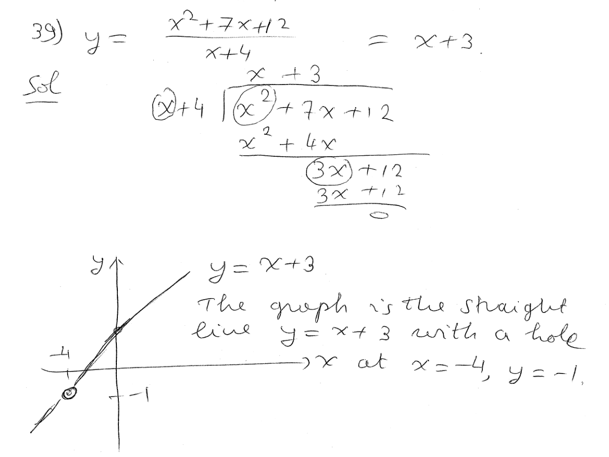
----
----

*The exponential function.*
++++
<figure>
    <figcaption></figcaption>
    <audio
	controls
	src="./2121-04-17.m4a">
	    Your browser does not support the
	    <code>audio</code> element.
    </audio>
</figure>
++++
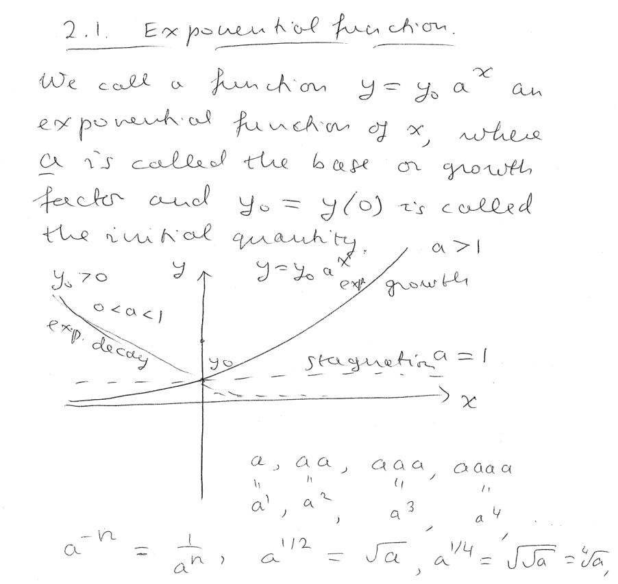
----
----

