= Math 2121, Calculus for the life sciences, I
:source-highlighter: coderay
:stem:

In this set of notes we work through some notions and
examples from calculus.  You can read the questions
here, study the handwritten notes, and while doing
so, listen to some explanations by clicking on the
"play" button.

== Lesson 5, The exponential function (continued).

*Basic properties of the exponential function.*
++++
<figure>
    <figcaption></figcaption>
    <audio
	controls
	src="./2121-05-01.m4a">
	    Your browser does not support the
	    <code>audio</code> element.
    </audio>
</figure>
++++
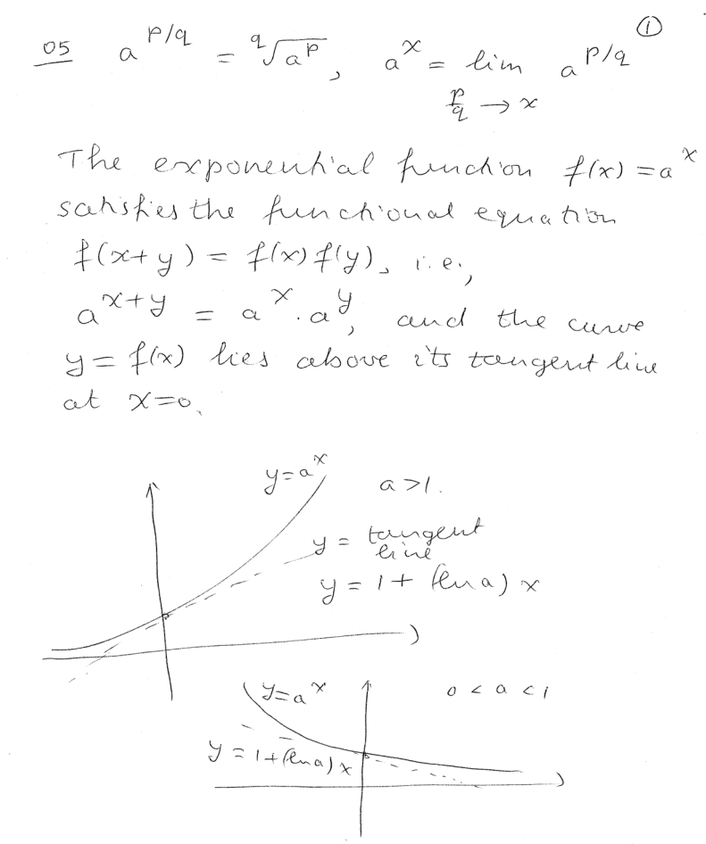
----
----

*The Euler number stem:[e] and the natural exponential function.*
++++
<figure>
    <figcaption></figcaption>
    <audio
	controls
	src="./2121-05-02.m4a">
	    Your browser does not support the
	    <code>audio</code> element.
    </audio>
</figure>
++++
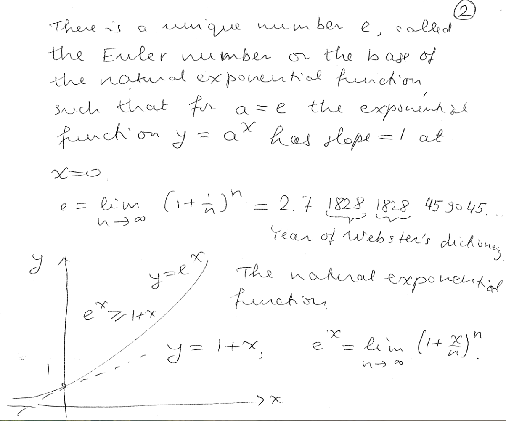
----
----

*Interest.*
++++
<figure>
    <figcaption></figcaption>
    <audio
	controls
	src="./2121-05-03.m4a">
	    Your browser does not support the
	    <code>audio</code> element.
    </audio>
</figure>
++++
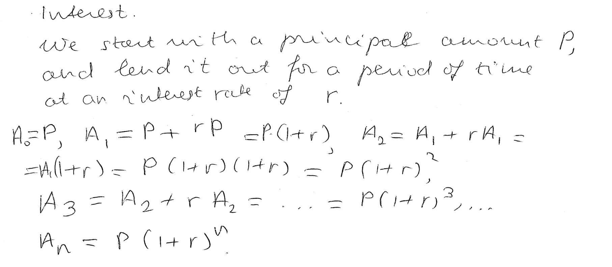
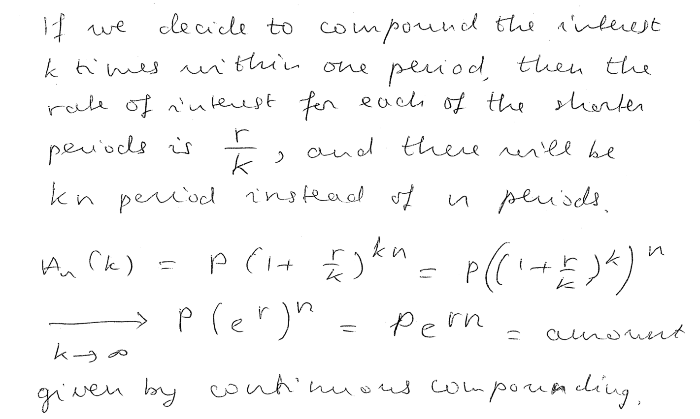
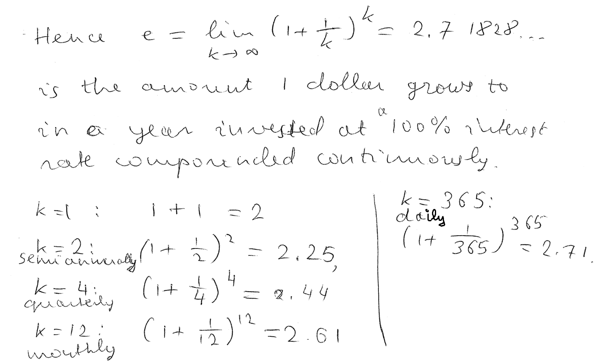
----
----

*The natural logarithm function as the inverse of the natural exponential function.*
++++
<figure>
    <figcaption></figcaption>
    <audio
	controls
	src="./2121-05-04.m4a">
	    Your browser does not support the
	    <code>audio</code> element.
    </audio>
</figure>
++++
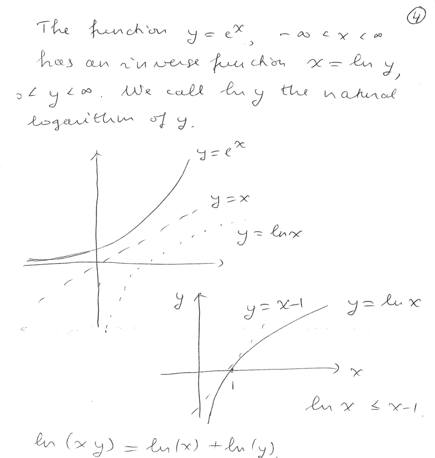
----
----

*Question.* (2.1:p82/51) Find the amount $10,000 reaches when invested
for 5 years at 4% interest compounded (a) annually, (b) semiannually
(twice a year), (c) quarterly, (d) monthly, (e) continuously.
++++
<figure>
    <figcaption>Solution</figcaption>
    <audio
	controls
	src="./2121-05-05.m4a">
	    Your browser does not support the
	    <code>audio</code> element.
    </audio>
</figure>
++++
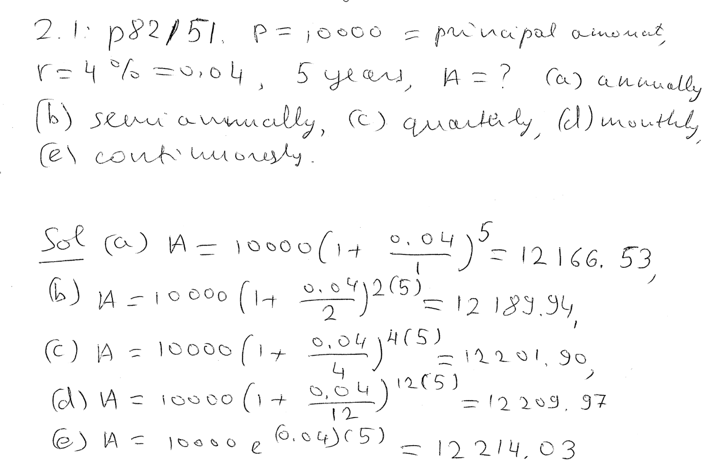
----
----

*Question.* (2.1:p82/54) Find the interest rate required for an
investment of $5,000 to grow to $7,500 in 5 years if interest is
compounded (a) annually, (b) quarterly.
++++
<figure>
    <figcaption>Solution</figcaption>
    <audio
	controls
	src="./2121-05-06.m4a">
	    Your browser does not support the
	    <code>audio</code> element.
    </audio>
</figure>
++++
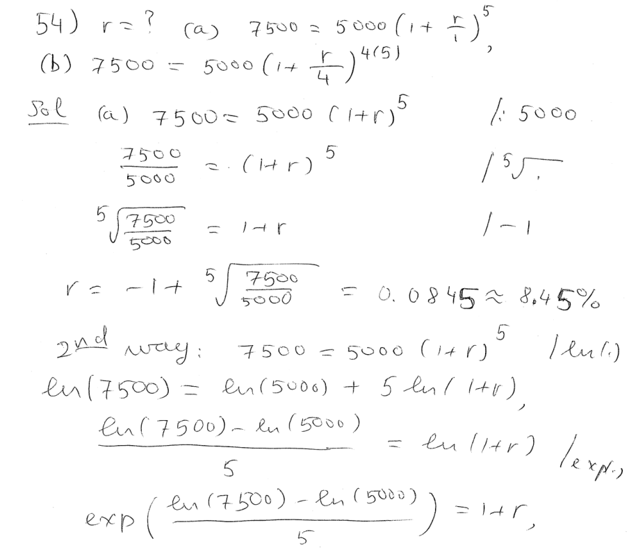
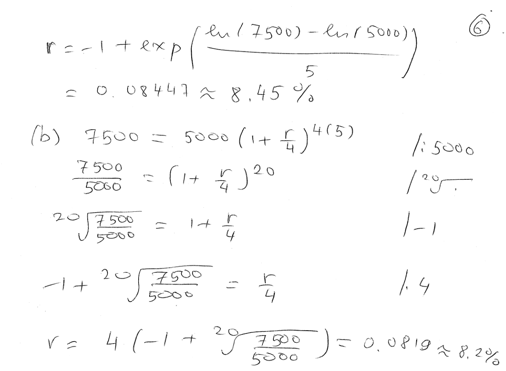
----
----

*Question.* (2.1:p82/54) Solve the equation stem:[2^x=32].
++++
<figure>
    <figcaption>Solution</figcaption>
    <audio
	controls
	src="./2121-05-07.m4a">
	    Your browser does not support the
	    <code>audio</code> element.
    </audio>
</figure>
++++
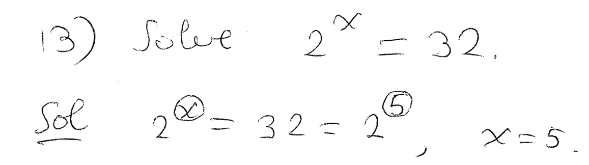
----
----

*Question.* (2.1:p82/15) Solve the equation stem:[3^x=1/81].
++++
<figure>
    <figcaption>Solution</figcaption>
    <audio
	controls
	src="./2121-05-08.m4a">
	    Your browser does not support the
	    <code>audio</code> element.
    </audio>
</figure>
++++
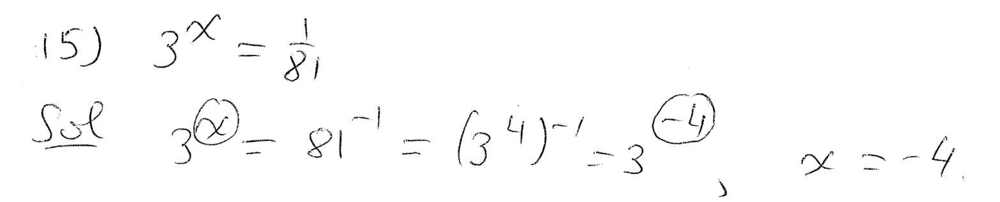
----
----

*Question.* (2.1:p82/17) Solve the equation stem:[4^x=8^{x+1}].
++++
<figure>
    <figcaption>Solution</figcaption>
    <audio
	controls
	src="./2121-05-09.m4a">
	    Your browser does not support the
	    <code>audio</code> element.
    </audio>
</figure>
++++
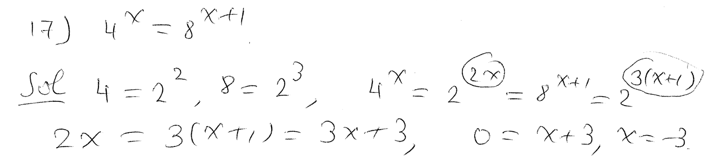
----
----

*Question.* (2.1:p82/27) Solve the equation stem:[27^x=9^{x^2+x}].
++++
<figure>
    <figcaption>Solution</figcaption>
    <audio
	controls
	src="./2121-05-10.m4a">
	    Your browser does not support the
	    <code>audio</code> element.
    </audio>
</figure>
++++
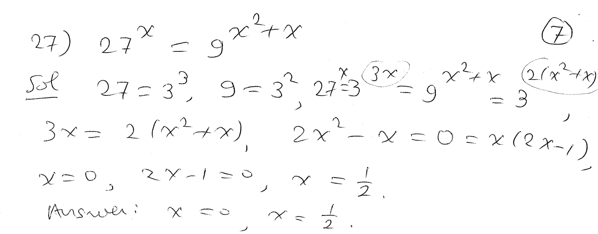
----
----

*Question.* (2.1:p82/47) Suppose that the quantity in grams
of radioactive substance present at time stem:[t] is
stem:[Q(t)=1000cdot5^{(-0.3)t}],
where stem:[t] is measured in months.
(a) How much will be present in 6 months?
(b) How long will it take to reduce the substance to 8 g?
++++
<figure>
    <figcaption>Solution</figcaption>
    <audio
	controls
	src="./2121-05-11.m4a">
	    Your browser does not support the
	    <code>audio</code> element.
    </audio>
</figure>
++++
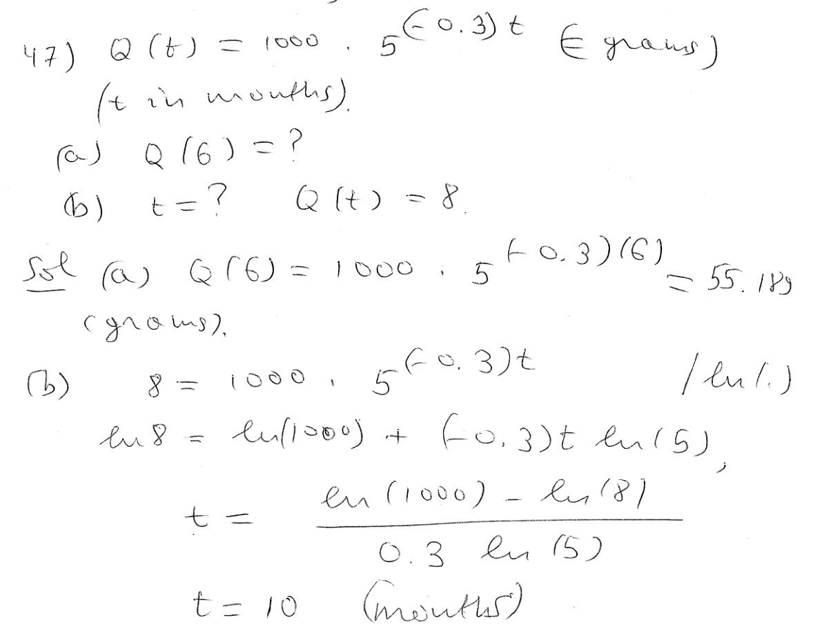
----
----

