= Math 2121, Calculus for the life sciences, I
:source-highlighter: coderay
:stem:

In this set of notes we work through some notions and
examples from calculus.  You can read the questions
here, study the handwritten notes, and while doing
so, listen to some explanations by clicking on the
"play" button.

== Lesson 6, The Logarithmic Functions; Exponential Growth and Decay; Trigonometric Functions.

*The logarithmic functions.*
++++
<figure>
    <figcaption></figcaption>
    <audio
	controls
	src="./2121-06-01.m4a">
	    Your browser does not support the
	    <code>audio</code> element.
    </audio>
</figure>
++++
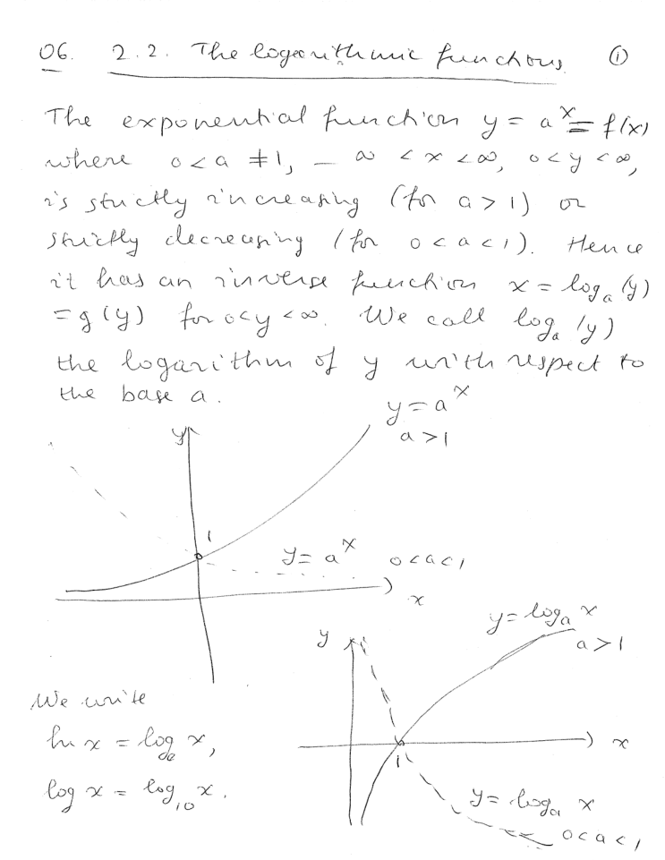
----
----

*The properties of logarithms.*
++++
<figure>
    <figcaption></figcaption>
    <audio
	controls
	src="./2121-06-02.m4a">
	    Your browser does not support the
	    <code>audio</code> element.
    </audio>
</figure>
++++
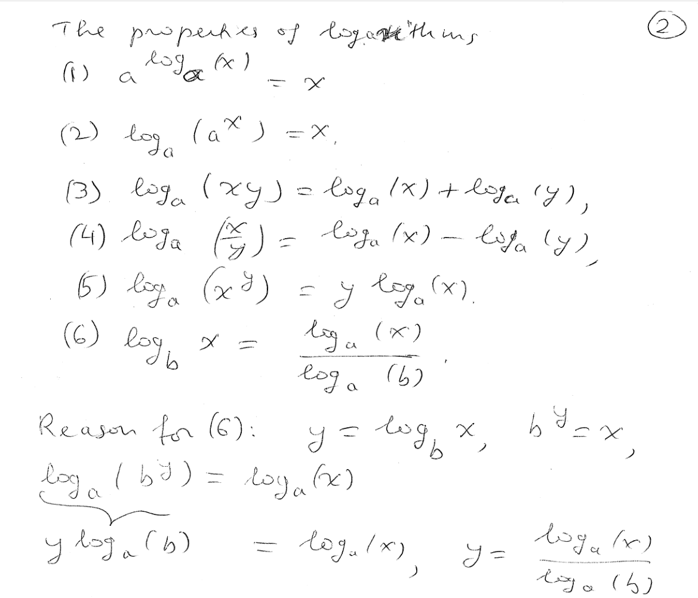
----
----

*Question.* (2.2:p92/37) Compute stem:[E=log_5(30)].
++++
<figure>
    <figcaption>Solution</figcaption>
    <audio
	controls
	src="./2121-06-03.m4a">
	    Your browser does not support the
	    <code>audio</code> element.
    </audio>
</figure>
++++
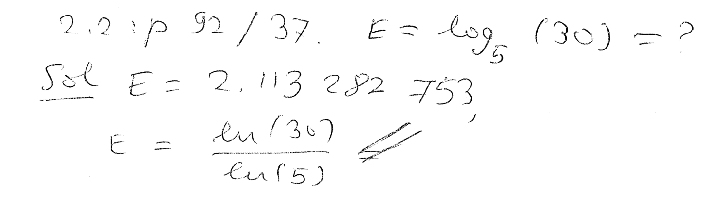
----
----

*Question.* (2.2:p92/40) Compute stem:[E=log_{2.8}(0.12)].
++++
<figure>
    <figcaption>Solution</figcaption>
    <audio
	controls
	src="./2121-06-04.m4a">
	    Your browser does not support the
	    <code>audio</code> element.
    </audio>
</figure>
++++
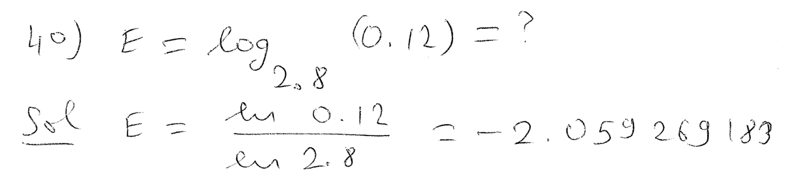
----
----

*Question.* (2.2:p92/47) Solve the equation stem:[log_5(9x-4)=1].
++++
<figure>
    <figcaption>Solution</figcaption>
    <audio
	controls
	src="./2121-06-05.m4a">
	    Your browser does not support the
	    <code>audio</code> element.
    </audio>
</figure>
++++
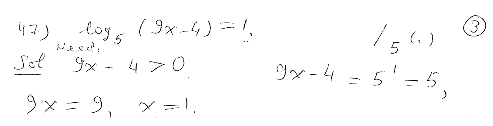
----
----

*Question.* (2.2:p92/53) Solve the equation
stem:[log_2(x^2-1)-log_2(x+1)=2].
++++
<figure>
    <figcaption>Solution</figcaption>
    <audio
	controls
	src="./2121-06-06.m4a">
	    Your browser does not support the
	    <code>audio</code> element.
    </audio>
</figure>
++++
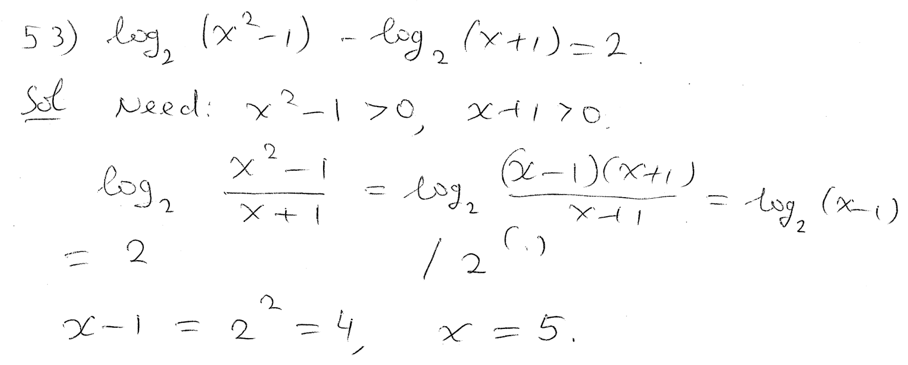
----
----

*Question.* (2.2:p92/50) Solve the equation
stem:[log(x+5)+log(x+2)=1].
++++
<figure>
    <figcaption>Solution</figcaption>
    <audio
	controls
	src="./2121-06-07.m4a">
	    Your browser does not support the
	    <code>audio</code> element.
    </audio>
</figure>
++++
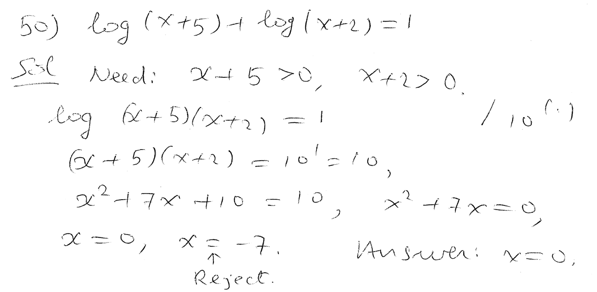
----
----

*Question.* (2.2:p92/50) Solve the equation stem:[e^{k-1}=6].
++++
<figure>
    <figcaption>Solution</figcaption>
    <audio
	controls
	src="./2121-06-08.m4a">
	    Your browser does not support the
	    <code>audio</code> element.
    </audio>
</figure>
++++
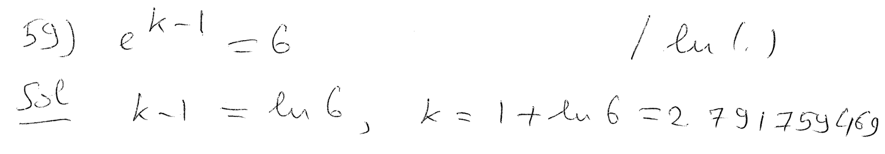
----
----

*Question.* (2.2:p92/61) Solve the equation stem:[3^{x+1}=5^x].
++++
<figure>
    <figcaption>Solution</figcaption>
    <audio
	controls
	src="./2121-06-09.m4a">
	    Your browser does not support the
	    <code>audio</code> element.
    </audio>
</figure>
++++
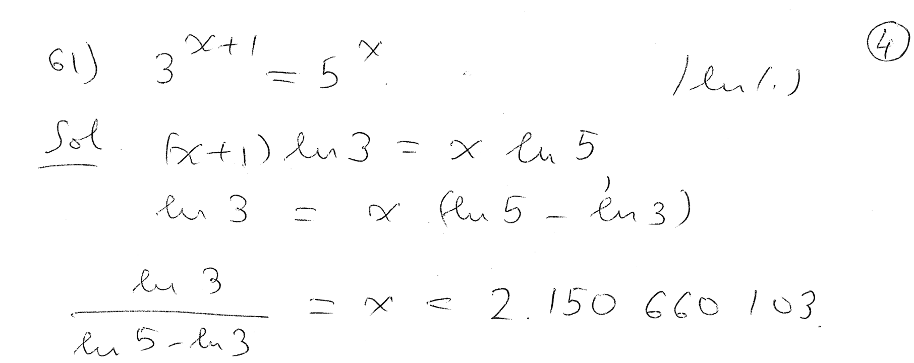
----
----

*Question.* (2.2:p92/64) Solve the equation stem:[(1.5)(1.05)^x=(2)(1.01)^x].
++++
<figure>
    <figcaption>Solution</figcaption>
    <audio
	controls
	src="./2121-06-10.m4a">
	    Your browser does not support the
	    <code>audio</code> element.
    </audio>
</figure>
++++
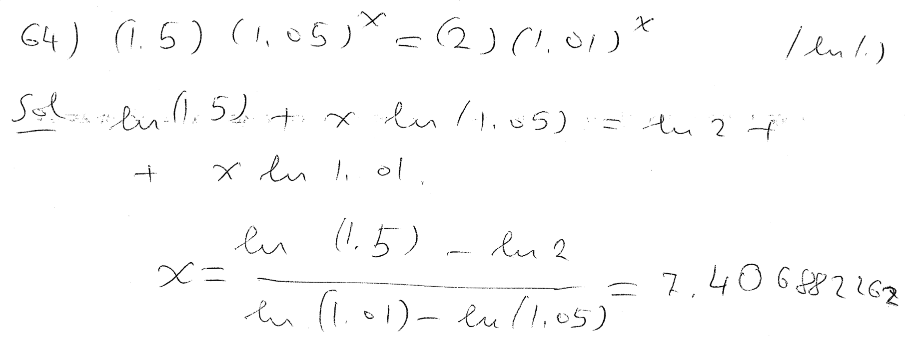
----
----

*Exponential growth and decay; growth factor; growth rate;
doubling time; decay factor; decay rate; half life.*
++++
<figure>
    <figcaption></figcaption>
    <audio
	controls
	src="./2121-06-11.m4a">
	    Your browser does not support the
	    <code>audio</code> element.
    </audio>
</figure>
++++
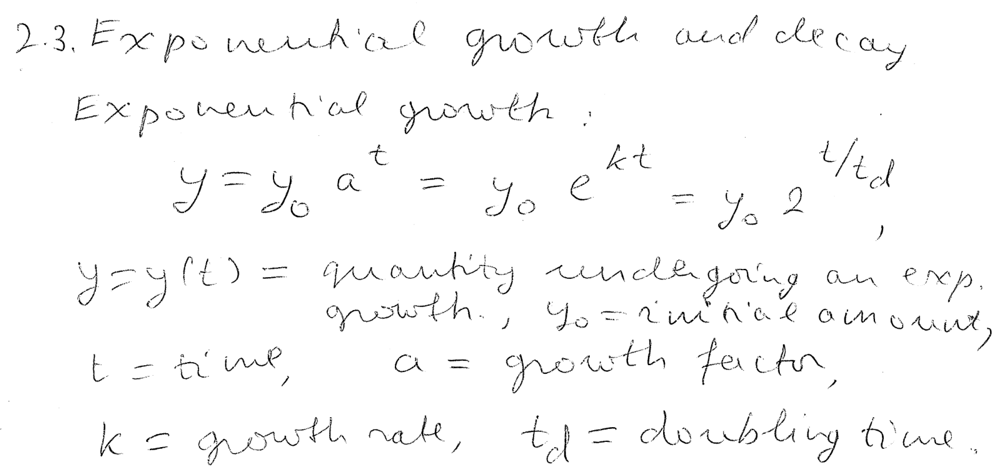
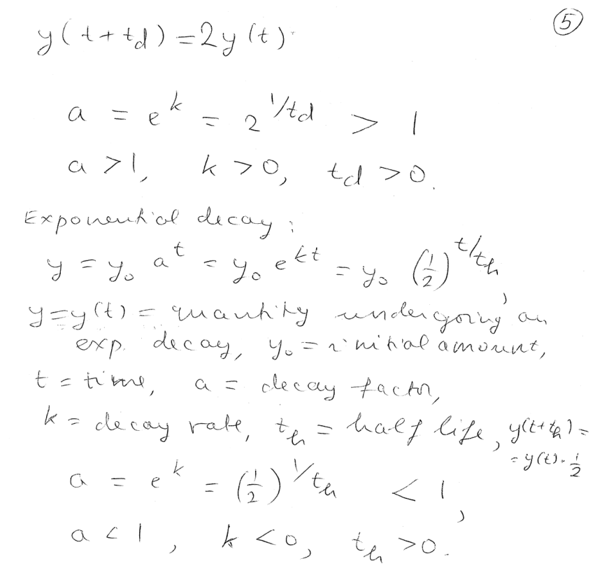
----
----

*Question.* (2.3:p100/8) A bacterium culture starts with 25,000 bacteria, it undergoes exponential growth, and after 10 hours it has 40,000 bacteria.  (a) Write a function in the form stem:[y=y_0e^{kt}] giving
the number of bacteria after stem:[t] hours.
(b) Write the function in (a) in the form stem:[y=y_0a^t].
(c) How long will it be until there are 60,000 bacteria?
++++
<figure>
    <figcaption>Solution</figcaption>
    <audio
	controls
	src="./2121-06-12.m4a">
	    Your browser does not support the
	    <code>audio</code> element.
    </audio>
</figure>
++++
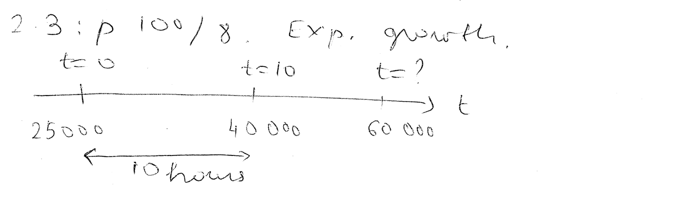
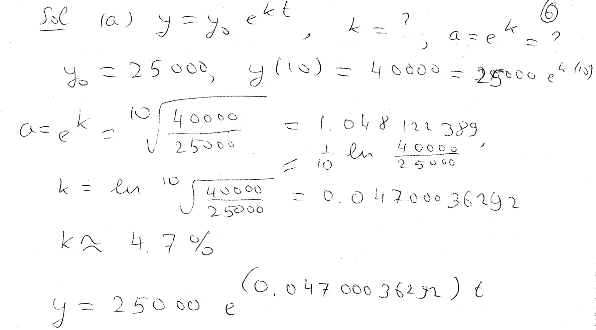
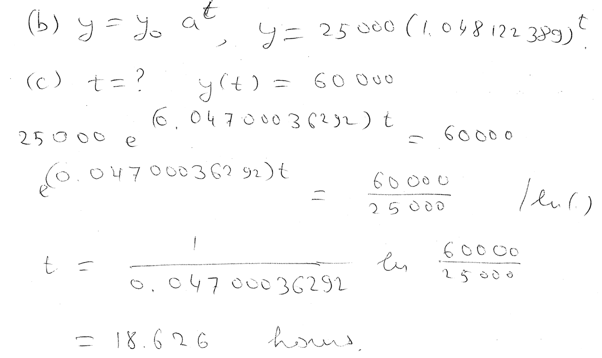
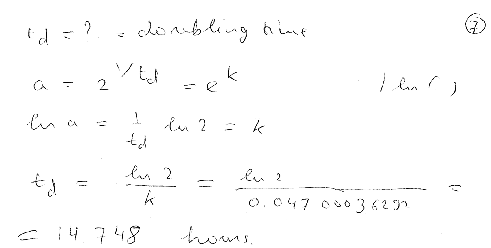
----
----

*Question.* (2.3:p100/15) Postassium-40, with a half life of 1.25 billion years, has been used by geochronologists trying to sort out the
mass extinction of 250 million years ago.
What percent of potassium-40 remains from a creature that died 250 million years ago? 
++++
<figure>
    <figcaption>Solution</figcaption>
    <audio
	controls
	src="./2121-06-13.m4a">
	    Your browser does not support the
	    <code>audio</code> element.
    </audio>
</figure>
++++
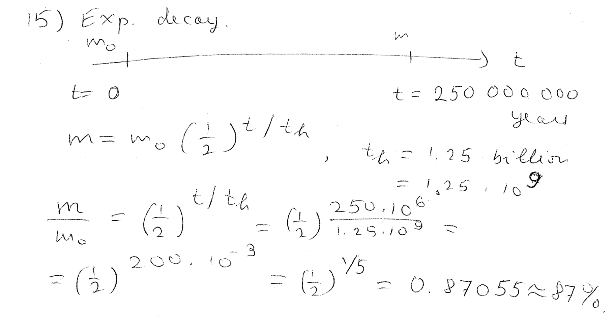
----
----

*Question.* (2.3:p100/21) The half life of radium-226 is approximately
1620 years.
(a) How much of a sample weighing 4 g will remain after 100 years?
(b) How much time is necessary for a sample weighing 4 g to decay to 0.1 g?
++++
<figure>
    <figcaption>Solution</figcaption>
    <audio
	controls
	src="./2121-06-14.m4a">
	    Your browser does not support the
	    <code>audio</code> element.
    </audio>
</figure>
++++
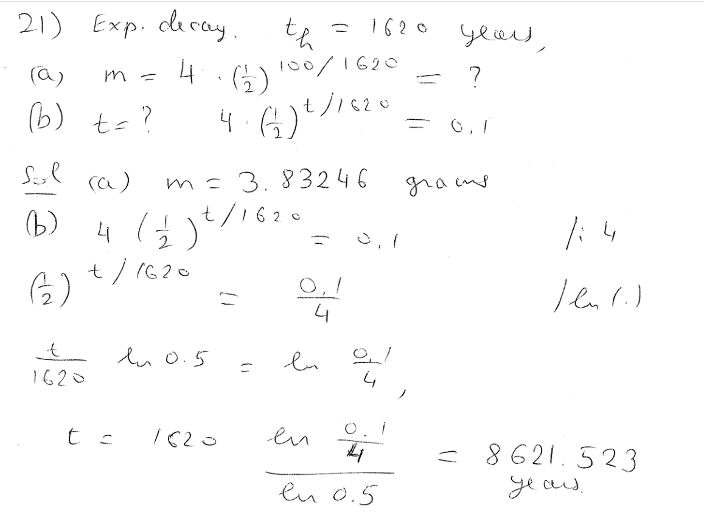
----
----

*Question.* (2.3:p100/23) A sample of 25 g of pollonium-210 is decaying
exponentially.  After 50 days 19.5 g of pollonium-210 is left.
(a) Write a function in the form stem:[y=y_0e^{kt}] giving the number
of grams of pollonium-210 after stem:[t] days.
(b) Write the function in (a) in the form stem:[y=y_0a^{t/50}].
(c) Use your answer from (a) to find the half life of pollonium-210.
++++
<figure>
    <figcaption>Solution</figcaption>
    <audio
	controls
	src="./2121-06-15.m4a">
	    Your browser does not support the
	    <code>audio</code> element.
    </audio>
</figure>
++++
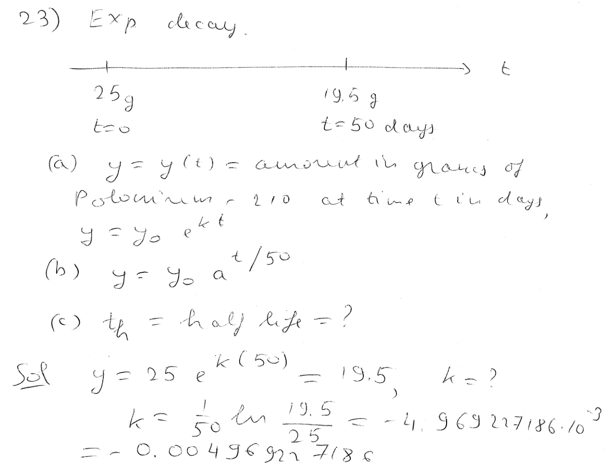
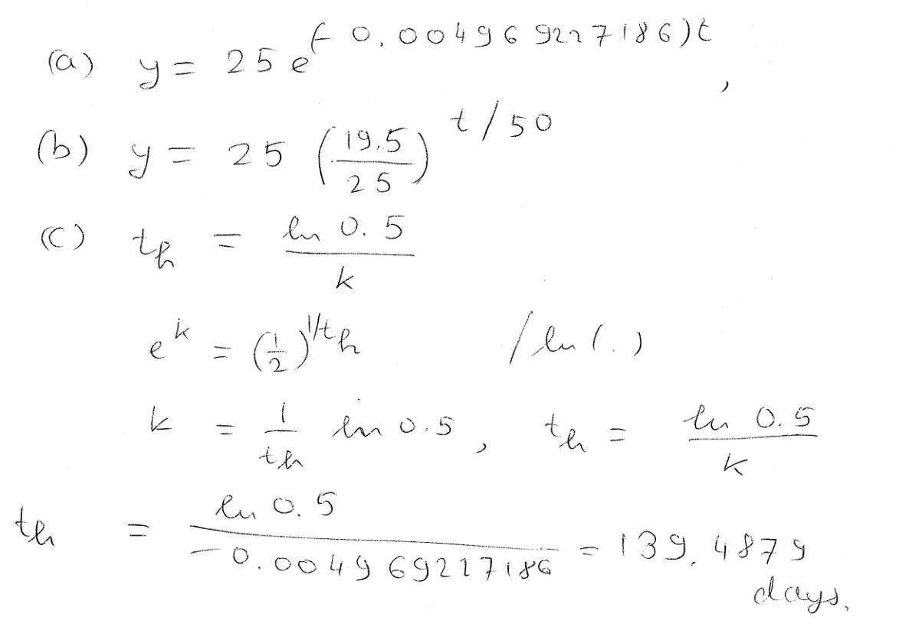
----
----

*Trigonometric functions; sine and cosine.*
++++
<figure>
    <figcaption></figcaption>
    <audio
	controls
	src="./2121-06-16.m4a">
	    Your browser does not support the
	    <code>audio</code> element.
    </audio>
</figure>
++++
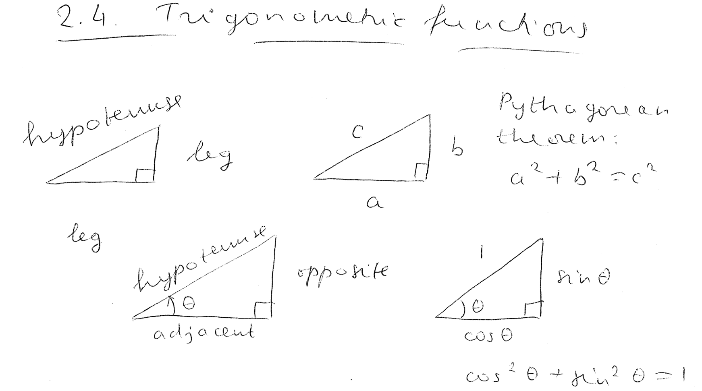
----
----

*Trigonometric functions; tangent, cotangent, secant, cosecant.*
++++
<figure>
    <figcaption></figcaption>
    <audio
	controls
	src="./2121-06-17.m4a">
	    Your browser does not support the
	    <code>audio</code> element.
    </audio>
</figure>
++++
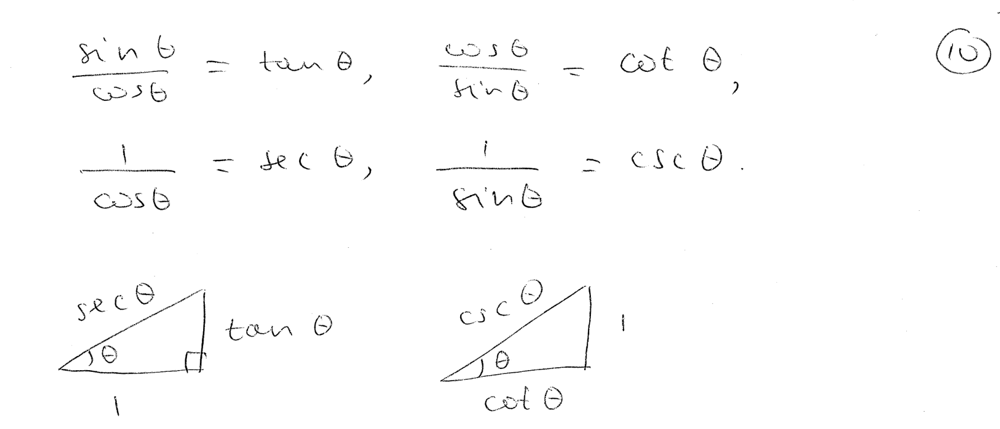
----
----

*The first magic triangle: the half of the equilateral triangle.*
++++
<figure>
    <figcaption></figcaption>
    <audio
	controls
	src="./2121-06-18.m4a">
	    Your browser does not support the
	    <code>audio</code> element.
    </audio>
</figure>
++++
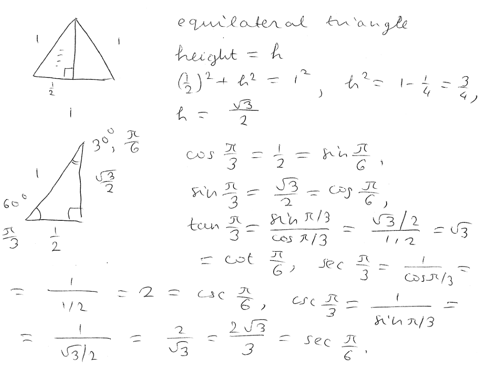
----
----

*The second magic triangle: the half of the square.*
++++
<figure>
    <figcaption></figcaption>
    <audio
	controls
	src="./2121-06-19.m4a">
	    Your browser does not support the
	    <code>audio</code> element.
    </audio>
</figure>
++++
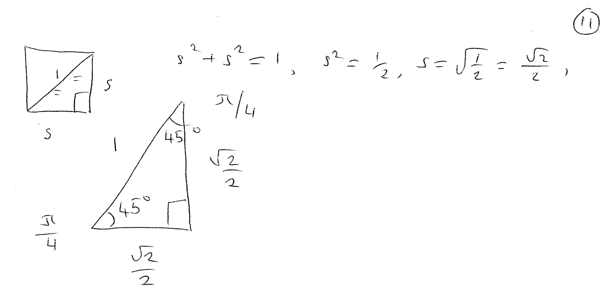
----
----

