= Math 2121, Calculus for the life sciences, I
:source-highlighter: coderay
:stem:

In this set of notes we work through some notions and
examples from calculus.  You can read the questions
here, study the handwritten notes, and while doing
so, listen to some explanations by clicking on the
"play" button.

== Lesson 7, Trigonometric functions (continued); Limits.

*The second magic triangle: the half of the square.*
++++
<figure>
    <figcaption></figcaption>
    <audio
	controls
	src="./2121-07-01.m4a">
	    Your browser does not support the
	    <code>audio</code> element.
    </audio>
</figure>
++++
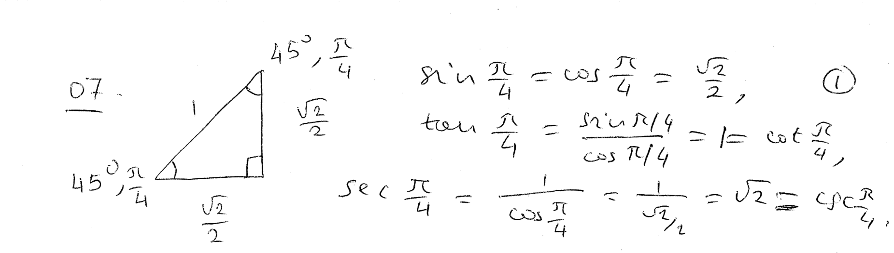
----
----

*Trigonometric functions on the unit circle.*
++++
<figure>
    <figcaption></figcaption>
    <audio
	controls
	src="./2121-07-02.m4a">
	    Your browser does not support the
	    <code>audio</code> element.
    </audio>
</figure>
++++
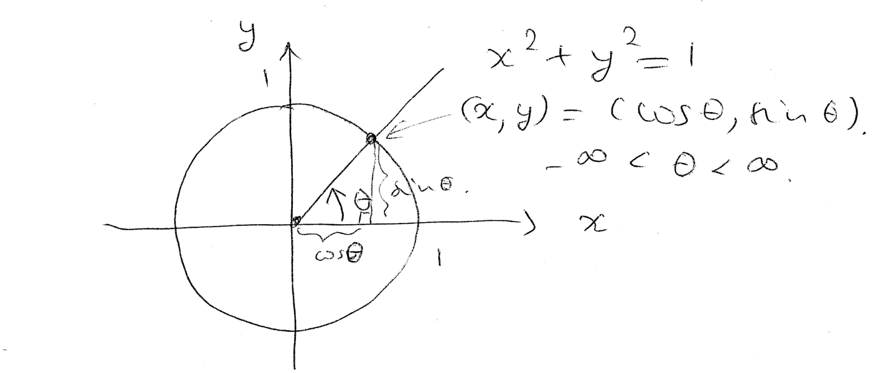
----
----

*The graph of the sine function.*
++++
<figure>
    <figcaption></figcaption>
    <audio
	controls
	src="./2121-07-03.m4a">
	    Your browser does not support the
	    <code>audio</code> element.
    </audio>
</figure>
++++
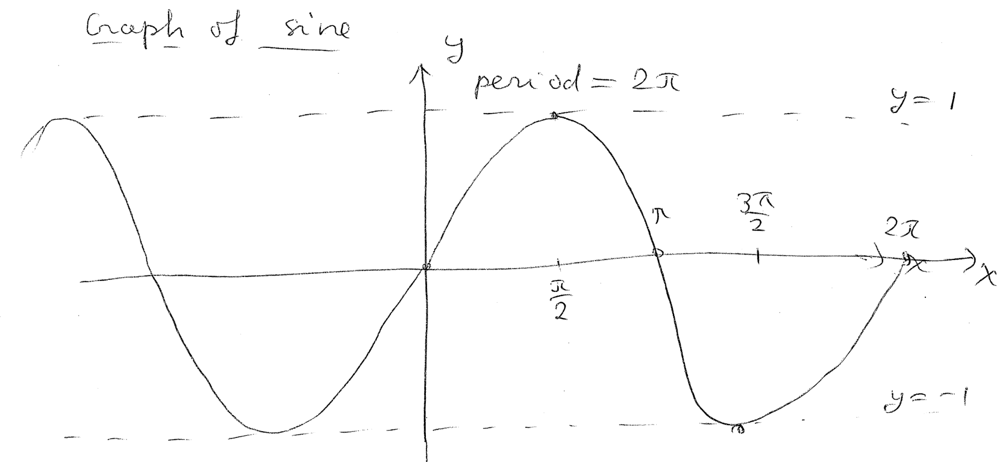
----
----

*The graph of the cosine function.*
++++
<figure>
    <figcaption></figcaption>
    <audio
	controls
	src="./2121-07-04.m4a">
	    Your browser does not support the
	    <code>audio</code> element.
    </audio>
</figure>
++++
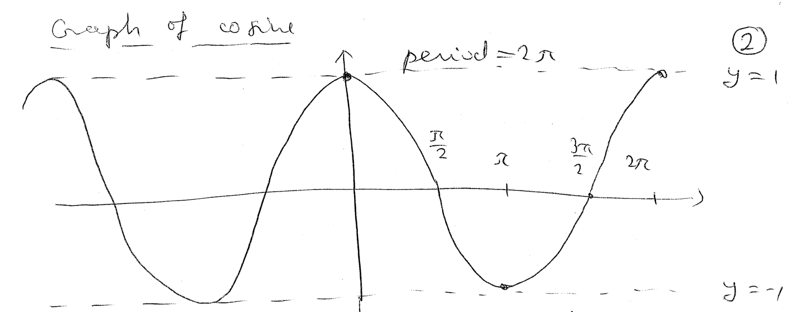
----
----

*The graph of the tangent function.*
++++
<figure>
    <figcaption></figcaption>
    <audio
	controls
	src="./2121-07-05.m4a">
	    Your browser does not support the
	    <code>audio</code> element.
    </audio>
</figure>
++++
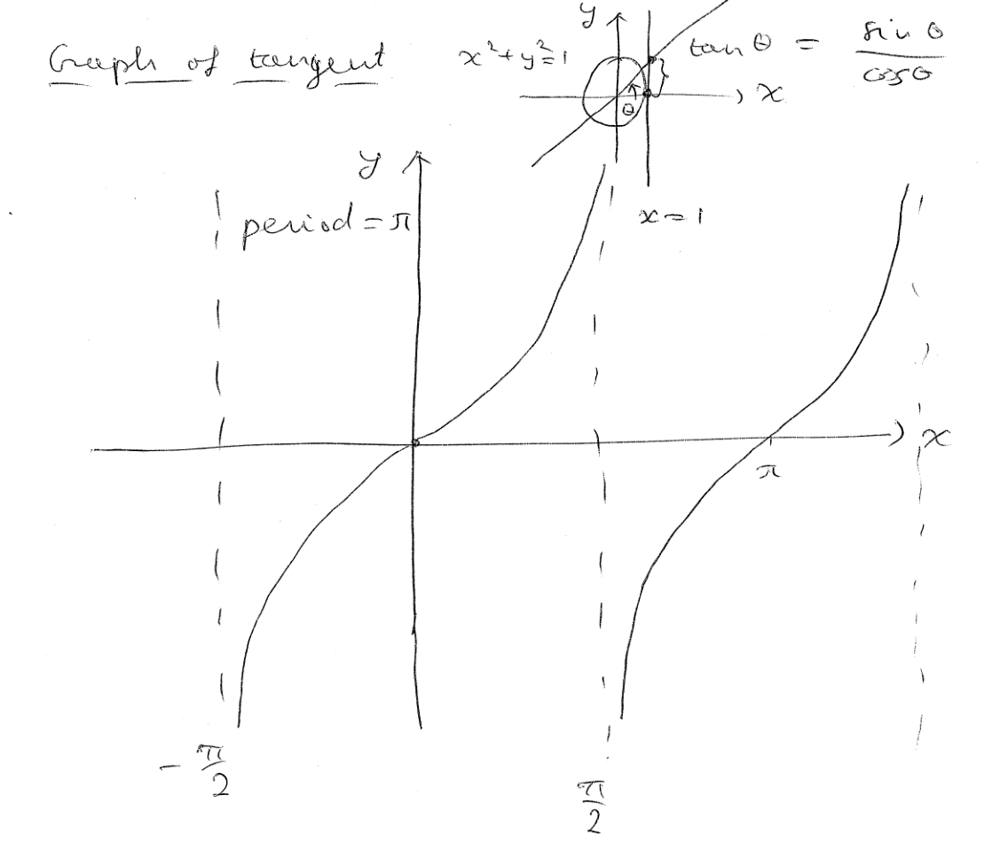
----
----

*The graph of the cotangent function.*
++++
<figure>
    <figcaption></figcaption>
    <audio
	controls
	src="./2121-07-06.m4a">
	    Your browser does not support the
	    <code>audio</code> element.
    </audio>
</figure>
++++
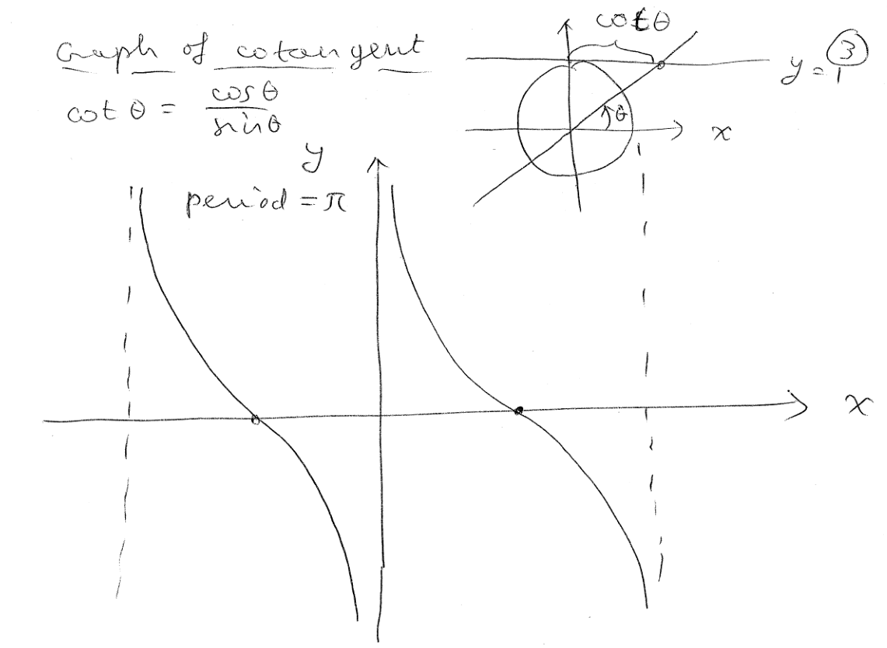
----
----

*The graph of the secant function.*
++++
<figure>
    <figcaption></figcaption>
    <audio
	controls
	src="./2121-07-07.m4a">
	    Your browser does not support the
	    <code>audio</code> element.
    </audio>
</figure>
++++
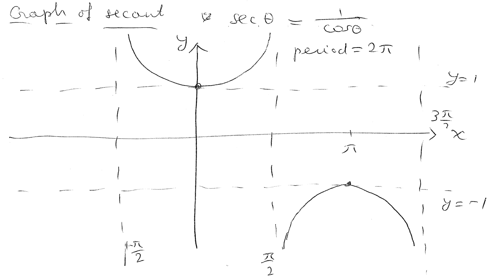
----
----

*The graph of the cosecant function.*
++++
<figure>
    <figcaption></figcaption>
    <audio
	controls
	src="./2121-07-08.m4a">
	    Your browser does not support the
	    <code>audio</code> element.
    </audio>
</figure>
++++
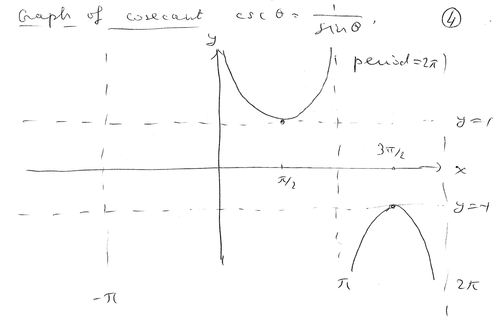
----
----

*Question.* (2.4:p114/1) Convert 60 degrees to radians.
++++
<figure>
    <figcaption>Solution</figcaption>
    <audio
	controls
	src="./2121-07-09.m4a">
	    Your browser does not support the
	    <code>audio</code> element.
    </audio>
</figure>
++++
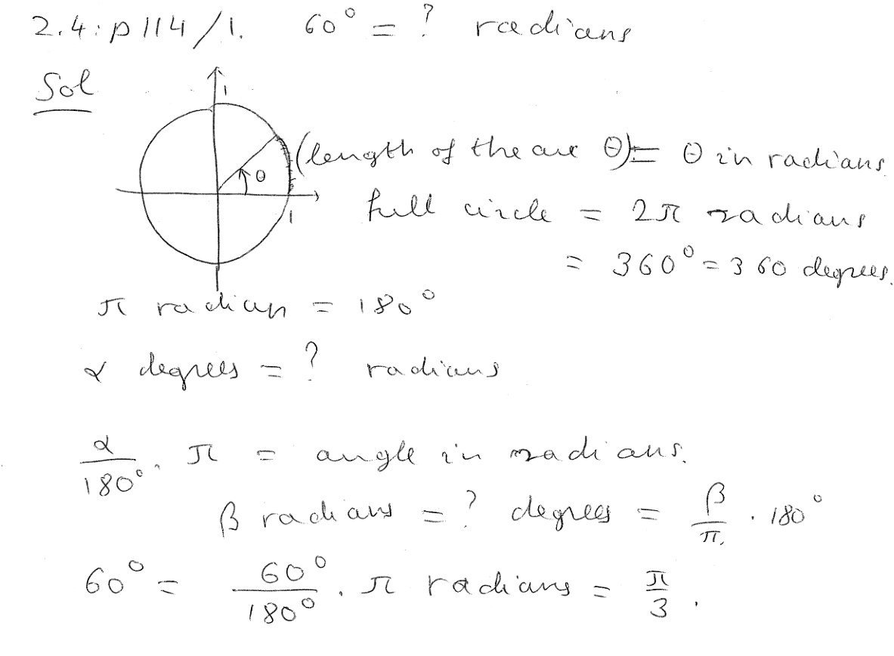
----
----

*Question.* (2.4:p114/9) Convert stem:[{5pi}/4] radians to degrees.
++++
<figure>
    <figcaption>Solution</figcaption>
    <audio
	controls
	src="./2121-07-10.m4a">
	    Your browser does not support the
	    <code>audio</code> element.
    </audio>
</figure>
++++
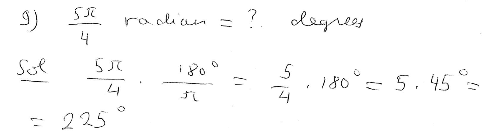
----
----

*Question.* (2.4:p114/55) Compute stem:[sin39^circ].
++++
<figure>
    <figcaption>Solution</figcaption>
    <audio
	controls
	src="./2121-07-11.m4a">
	    Your browser does not support the
	    <code>audio</code> element.
    </audio>
</figure>
++++
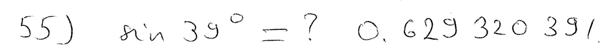
----
----

*Question.* (2.4:p114/58) Compute stem:[tan54^circ].
++++
<figure>
    <figcaption>Solution</figcaption>
    <audio
	controls
	src="./2121-07-12.m4a">
	    Your browser does not support the
	    <code>audio</code> element.
    </audio>
</figure>
++++
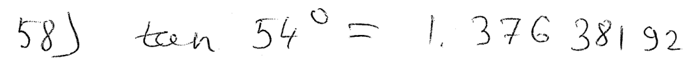
----
----

*Question.* (2.4:p114/61) Compute stem:[cos 1.2353].
++++
<figure>
    <figcaption>Solution</figcaption>
    <audio
	controls
	src="./2121-07-13.m4a">
	    Your browser does not support the
	    <code>audio</code> element.
    </audio>
</figure>
++++
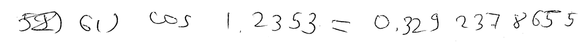
----
----

*Question.* (2.4:p114/91) A surveyor standing 65 m from the base of a
building measures the angle to the top of the building and finds it to
be stem:[42.8^circ].  Use trigonometry to find the height of the
building.
++++
<figure>
    <figcaption>Solution</figcaption>
    <audio
	controls
	src="./2121-07-14.m4a">
	    Your browser does not support the
	    <code>audio</code> element.
    </audio>
</figure>
++++
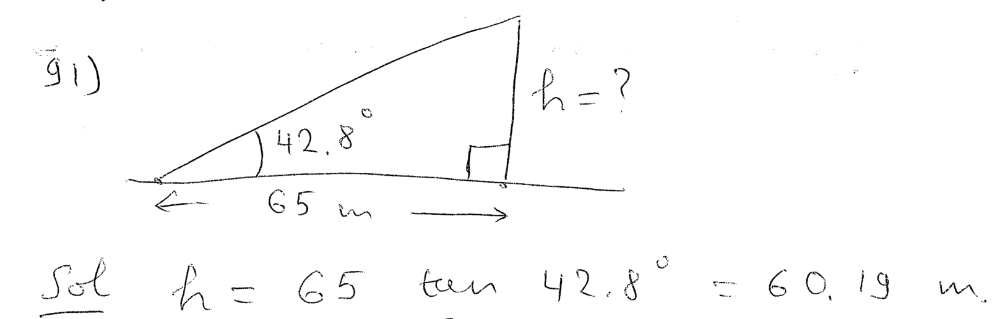
----
----

*Question.* (2.4:p114/92) Jenny Crum stands on a cliff at the edge of
a canyon.  On the opposite side of the canyon is another cliff equal
in height to the one she is on.
By dropping a stone and timing its fall, she determines that it is
105 ft to the bottom of the canyon.
She also determines that the angle to the base of the opposite cliff
is stem:[27^circ].
How far is it to the opposite side of the canyon?
++++
<figure>
    <figcaption>Solution</figcaption>
    <audio
	controls
	src="./2121-07-15.m4a">
	    Your browser does not support the
	    <code>audio</code> element.
    </audio>
</figure>
++++
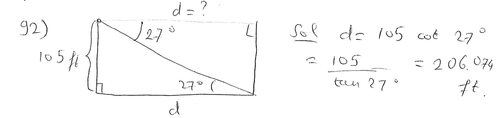
----
----

*Example of a limit.*
++++
<figure>
    <figcaption></figcaption>
    <audio
	controls
	src="./2121-07-16.m4a">
	    Your browser does not support the
	    <code>audio</code> element.
    </audio>
</figure>
++++
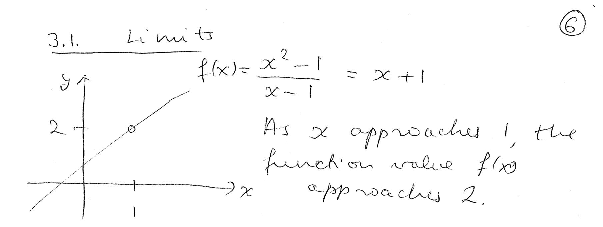
----
----

*The definition of a limit.*
++++
<figure>
    <figcaption></figcaption>
    <audio
	controls
	src="./2121-07-17.m4a">
	    Your browser does not support the
	    <code>audio</code> element.
    </audio>
</figure>
++++
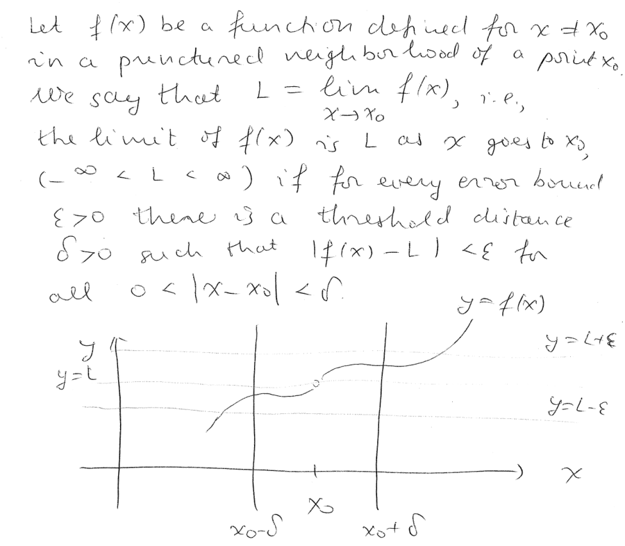
----
----

*Example of using the definition of limit to check a concrete limit.*
++++
<figure>
    <figcaption></figcaption>
    <audio
	controls
	src="./2121-07-18.m4a">
	    Your browser does not support the
	    <code>audio</code> element.
    </audio>
</figure>
++++
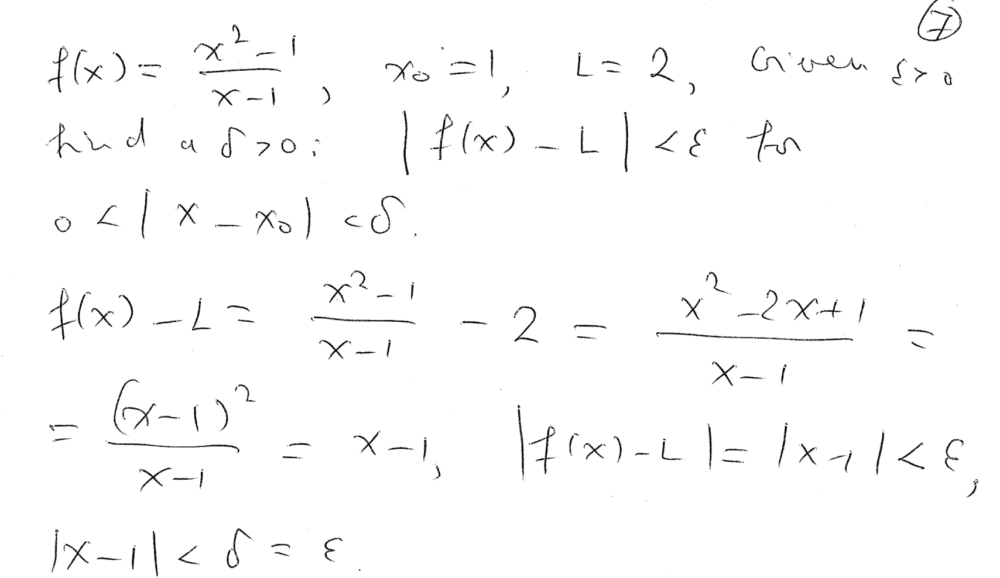
----
----

////
*Question.* () stem:[].
++++
<figure>
    <figcaption>Solution</figcaption>
    <audio
	controls
	src="./2121-07-19.m4a">
	    Your browser does not support the
	    <code>audio</code> element.
    </audio>
</figure>
++++
image::2121-07-19.PNG[Work]
----
----

*Question.* () stem:[].
++++
<figure>
    <figcaption>Solution</figcaption>
    <audio
	controls
	src="./2121-07-20.m4a">
	    Your browser does not support the
	    <code>audio</code> element.
    </audio>
</figure>
++++
image::2121-07-20.PNG[Work]
----
----

*Question.* () stem:[].
++++
<figure>
    <figcaption>Solution</figcaption>
    <audio
	controls
	src="./2121-07-21.m4a">
	    Your browser does not support the
	    <code>audio</code> element.
    </audio>
</figure>
++++
image::2121-07-21.PNG[Work]
----
----

*Question.* () stem:[].
++++
<figure>
    <figcaption>Solution</figcaption>
    <audio
	controls
	src="./2121-07-22.m4a">
	    Your browser does not support the
	    <code>audio</code> element.
    </audio>
</figure>
++++
image::2121-07-22.PNG[Work]
----
----

*Question.* () stem:[].
++++
<figure>
    <figcaption>Solution</figcaption>
    <audio
	controls
	src="./2121-07-23.m4a">
	    Your browser does not support the
	    <code>audio</code> element.
    </audio>
</figure>
++++
image::2121-07-23.PNG[Work]
----
----

*Question.* () stem:[].
++++
<figure>
    <figcaption>Solution</figcaption>
    <audio
	controls
	src="./2121-07-24.m4a">
	    Your browser does not support the
	    <code>audio</code> element.
    </audio>
</figure>
++++
image::2121-07-24.PNG[Work]
----
----

*Question.* () stem:[].
++++
<figure>
    <figcaption>Solution</figcaption>
    <audio
	controls
	src="./2121-07-25.m4a">
	    Your browser does not support the
	    <code>audio</code> element.
    </audio>
</figure>
++++
image::2121-07-25.PNG[Work]
----
----

*Question.* () stem:[].
++++
<figure>
    <figcaption>Solution</figcaption>
    <audio
	controls
	src="./2121-07-26.m4a">
	    Your browser does not support the
	    <code>audio</code> element.
    </audio>
</figure>
++++
image::2121-07-26.PNG[Work]
----
----

*Question.* () stem:[].
++++
<figure>
    <figcaption>Solution</figcaption>
    <audio
	controls
	src="./2121-07-27.m4a">
	    Your browser does not support the
	    <code>audio</code> element.
    </audio>
</figure>
++++
image::2121-07-27.PNG[Work]
----
----

*Question.* () stem:[].
++++
<figure>
    <figcaption>Solution</figcaption>
    <audio
	controls
	src="./2121-07-28.m4a">
	    Your browser does not support the
	    <code>audio</code> element.
    </audio>
</figure>
++++
image::2121-07-28.PNG[Work]
----
----

*Question.* () stem:[].
++++
<figure>
    <figcaption>Solution</figcaption>
    <audio
	controls
	src="./2121-07-29.m4a">
	    Your browser does not support the
	    <code>audio</code> element.
    </audio>
</figure>
++++
image::2121-07-29.PNG[Work]
----
----

*Question.* () stem:[].
++++
<figure>
    <figcaption>Solution</figcaption>
    <audio
	controls
	src="./2121-07-30.m4a">
	    Your browser does not support the
	    <code>audio</code> element.
    </audio>
</figure>
++++
image::2121-07-30.PNG[Work]
----
----

////
