= Math 2121, Calculus for the life sciences, I
:source-highlighter: coderay
:stem:

In this set of notes we work through some notions and
examples from calculus.  You can read the questions
here, study the handwritten notes, and while doing
so, listen to some explanations by clicking on the
"play" button.

== Lesson 8, Limits (continued); Continuity; Rates of Change.

*Properties of limits.*
++++
<figure>
    <figcaption></figcaption>
    <audio
	controls
	src="./2121-08-01.m4a">
	    Your browser does not support the
	    <code>audio</code> element.
    </audio>
</figure>
++++
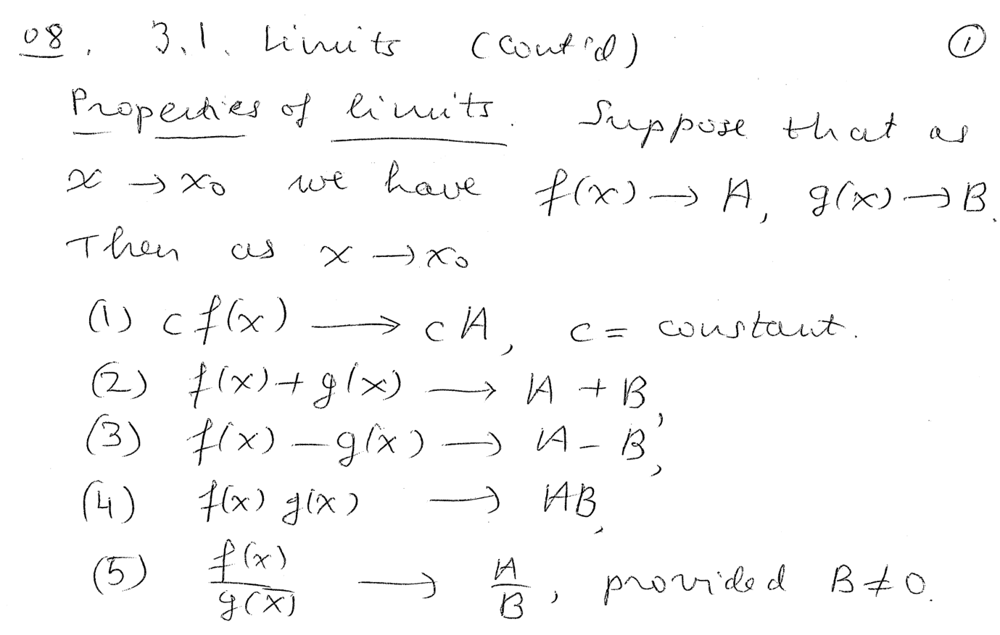
----
----

*Question.* (3.1:p142/35) Compute the limit stem:[L=lim_{x to 3}{x^2-9}/{x-3}].
++++
<figure>
    <figcaption>Solution</figcaption>
    <audio
	controls
	src="./2121-08-02.m4a">
	    Your browser does not support the
	    <code>audio</code> element.
    </audio>
</figure>
++++
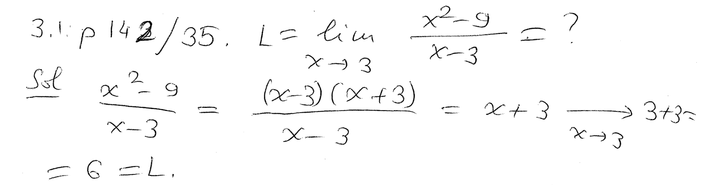
----
----

*Question.* (3.1:p142/37) Compute the limit stem:[L=lim_{x to 1}{5x^2-7x+2}/{x^2-1}].
++++
<figure>
    <figcaption>Solution</figcaption>
    <audio
	controls
	src="./2121-08-03.m4a">
	    Your browser does not support the
	    <code>audio</code> element.
    </audio>
</figure>
++++
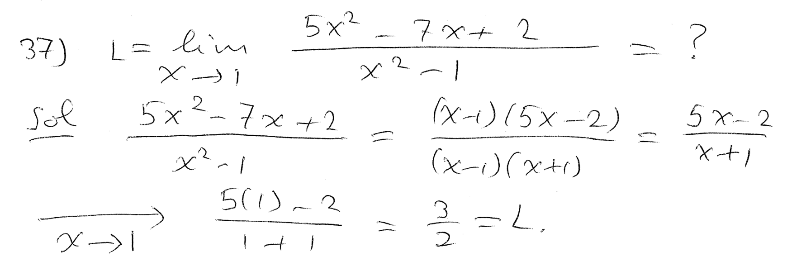
----
----

*Question.* (3.1:p142/39) Compute the limit stem:[L=lim_{x to -2}{x^2-x-6}/{x+2}].
++++
<figure>
    <figcaption>Solution</figcaption>
    <audio
	controls
	src="./2121-08-04.m4a">
	    Your browser does not support the
	    <code>audio</code> element.
    </audio>
</figure>
++++
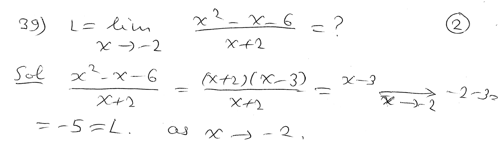
----
----

*Question.* (3.1:p142/41) Compute the limit stem:[L=lim_{x to 0}{1/{x+3}-1/3}/x].
++++
<figure>
    <figcaption>Solution</figcaption>
    <audio
	controls
	src="./2121-08-05.m4a">
	    Your browser does not support the
	    <code>audio</code> element.
    </audio>
</figure>
++++
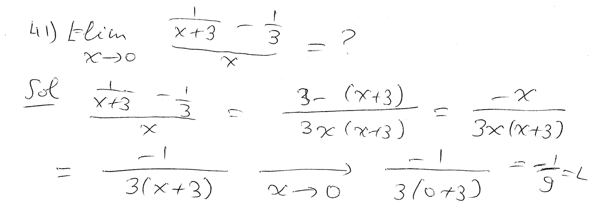
----
----

*Question.* (3.1:p142/43) Compute the limit stem:[L=lim_{x to 25}{sqrt{x}-5}/{x-25}].
++++
<figure>
    <figcaption>Solution</figcaption>
    <audio
	controls
	src="./2121-08-06.m4a">
	    Your browser does not support the
	    <code>audio</code> element.
    </audio>
</figure>
++++
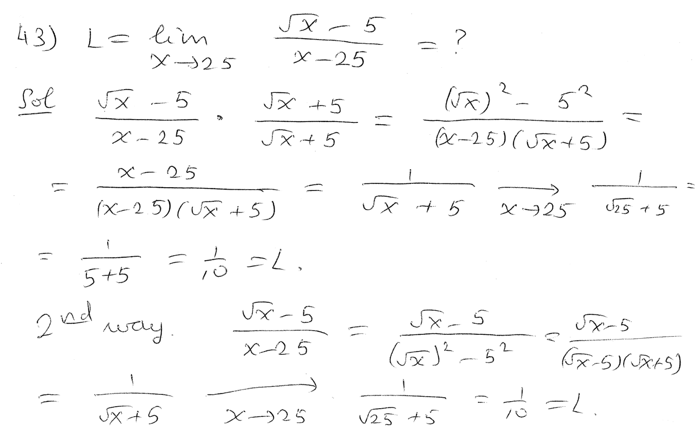
----
----

*Question.* (3.1:p142/45) Compute the limit stem:[L=lim_{h to 0}{(x+h)^2-x^2}/h].
++++
<figure>
    <figcaption>Solution</figcaption>
    <audio
	controls
	src="./2121-08-07.m4a">
	    Your browser does not support the
	    <code>audio</code> element.
    </audio>
</figure>
++++
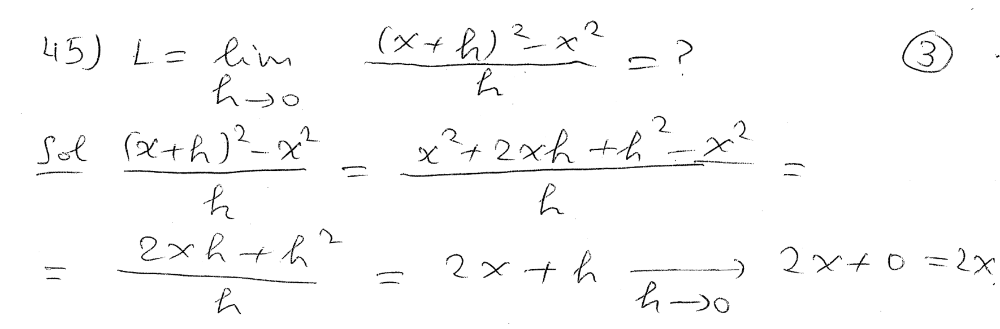
----
----

*Question.* (3.1:p142/49) Compute the limit stem:[L=lim_{x to infty}{3x}/{7x-1}].
++++
<figure>
    <figcaption>Solution</figcaption>
    <audio
	controls
	src="./2121-08-08.m4a">
	    Your browser does not support the
	    <code>audio</code> element.
    </audio>
</figure>
++++
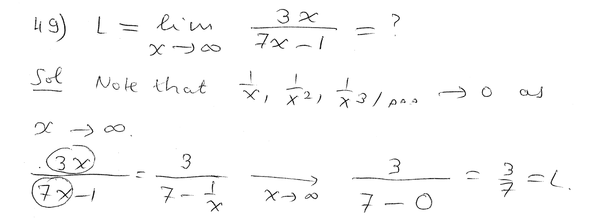
----
----

*Question.* (3.1:p142/53) Compute the limit stem:[L=lim_{x to infty}{3x^3+2x-1}/{2x^4-3x^3-2}].
++++
<figure>
    <figcaption>Solution</figcaption>
    <audio
	controls
	src="./2121-08-09.m4a">
	    Your browser does not support the
	    <code>audio</code> element.
    </audio>
</figure>
++++
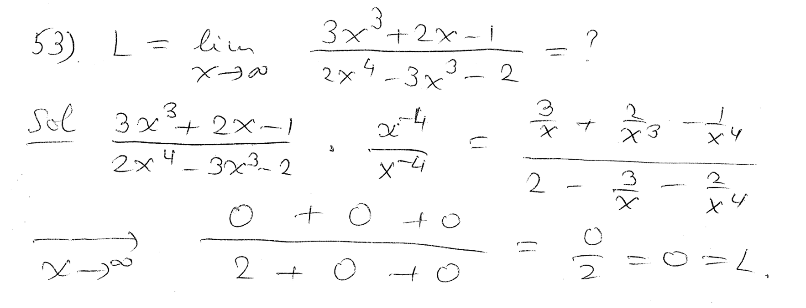
----
----

*Definition of continuity.*
++++
<figure>
    <figcaption></figcaption>
    <audio
	controls
	src="./2121-08-10.m4a">
	    Your browser does not support the
	    <code>audio</code> element.
    </audio>
</figure>
++++
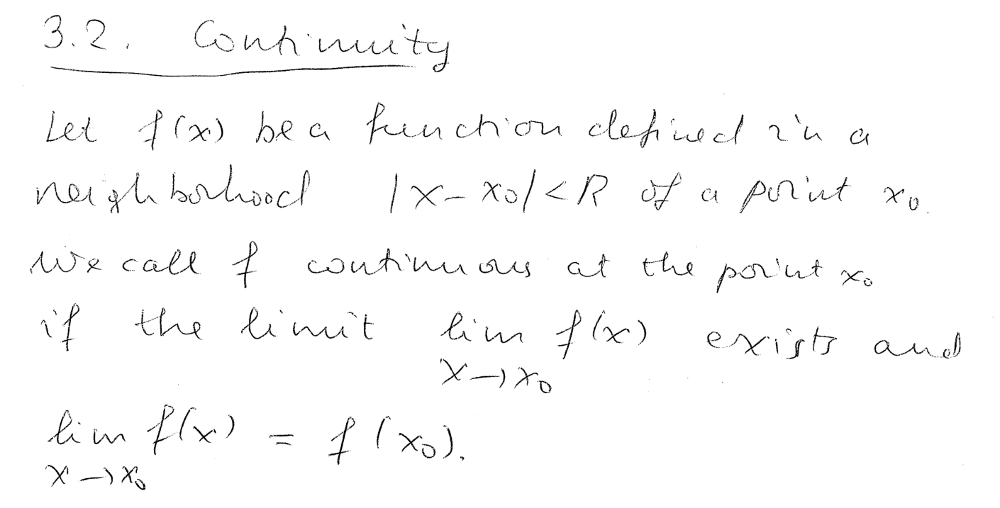
----
----

*Properties of continuous functions.*
++++
<figure>
    <figcaption></figcaption>
    <audio
	controls
	src="./2121-08-11.m4a">
	    Your browser does not support the
	    <code>audio</code> element.
    </audio>
</figure>
++++

----
----

*The intermediate value theorem and the extreme value theorem.*
++++
<figure>
    <figcaption></figcaption>
    <audio
	controls
	src="./2121-08-12.m4a">
	    Your browser does not support the
	    <code>audio</code> element.
    </audio>
</figure>
++++
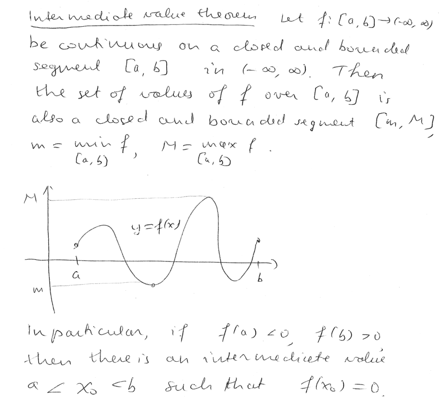
----
----

*Question.* (3.2:p152/27) Choose stem:[k] so that the function stem:[f] is continuous, where stem:[f(x)= kx^2] for stem:[x le 2], and
stem:[f(x)=x+k] for stem:[x>2].
++++
<figure>
    <figcaption>Solution</figcaption>
    <audio
	controls
	src="./2121-08-13.m4a">
	    Your browser does not support the
	    <code>audio</code> element.
    </audio>
</figure>
++++
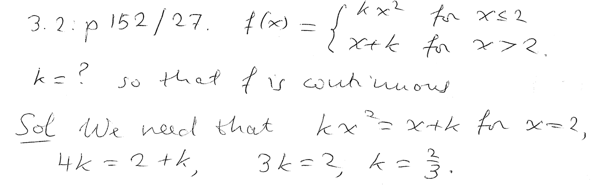
----
----

*Question.* (3.2:p152/29) Choose stem:[k] so that the function stem:[g] is continuous, where stem:[g(x)={2x^2-x-15}/{x-3}] for stem:[x ne 3], and stem:[g(x)=kx-1] for stem:[x=3].
++++
<figure>
    <figcaption>Solution</figcaption>
    <audio
	controls
	src="./2121-08-14.m4a">
	    Your browser does not support the
	    <code>audio</code> element.
    </audio>
</figure>
++++
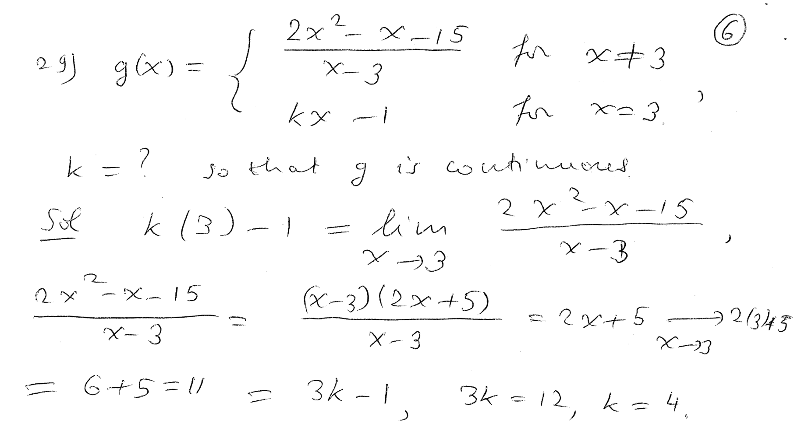
----
----

*The definition of the average rate of change of a function on a segment.*
++++
<figure>
    <figcaption></figcaption>
    <audio
	controls
	src="./2121-08-15.m4a">
	    Your browser does not support the
	    <code>audio</code> element.
    </audio>
</figure>
++++
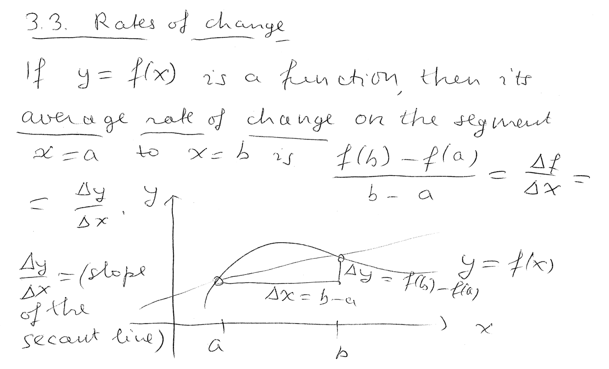
----
----

*The definition of the instantaneous rate of change of a function at a point.*
++++
<figure>
    <figcaption></figcaption>
    <audio
	controls
	src="./2121-08-16.m4a">
	    Your browser does not support the
	    <code>audio</code> element.
    </audio>
</figure>
++++
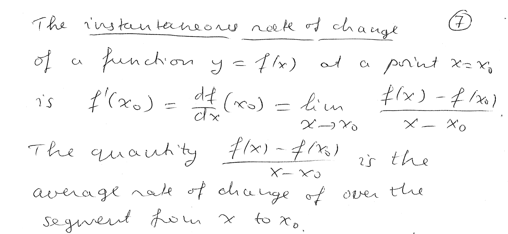
----
----

*The secant line and the tangent line.*
++++
<figure>
    <figcaption></figcaption>
    <audio
	controls
	src="./2121-08-17.m4a">
	    Your browser does not support the
	    <code>audio</code> element.
    </audio>
</figure>
++++
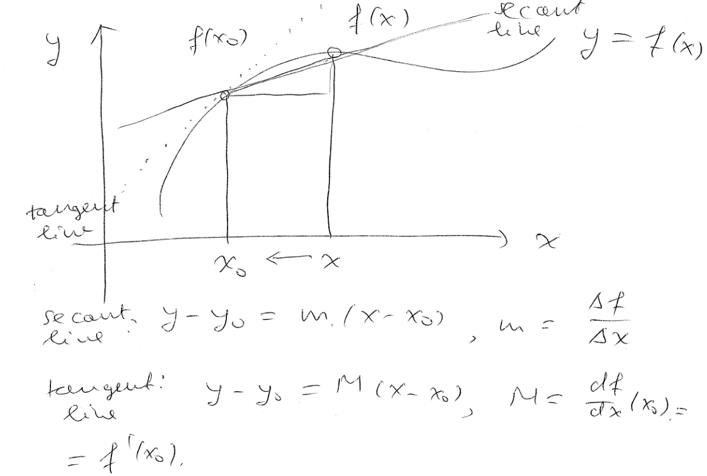
----
----

*Example of calculating the instantaneous rate of change from
its definition.*
++++
<figure>
    <figcaption></figcaption>
    <audio
	controls
	src="./2121-08-18.m4a">
	    Your browser does not support the
	    <code>audio</code> element.
    </audio>
</figure>
++++
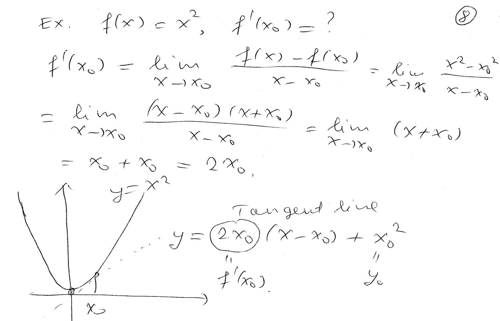
----
----

////
*Question.* () stem:[].
++++
<figure>
    <figcaption>Solution</figcaption>
    <audio
	controls
	src="./2121-08-19.m4a">
	    Your browser does not support the
	    <code>audio</code> element.
    </audio>
</figure>
++++
image::2121-08-19.PNG[Work]
----
----

*Question.* () stem:[].
++++
<figure>
    <figcaption>Solution</figcaption>
    <audio
	controls
	src="./2121-08-20.m4a">
	    Your browser does not support the
	    <code>audio</code> element.
    </audio>
</figure>
++++
image::2121-08-20.PNG[Work]
----
----

*Question.* () stem:[].
++++
<figure>
    <figcaption>Solution</figcaption>
    <audio
	controls
	src="./2121-08-21.m4a">
	    Your browser does not support the
	    <code>audio</code> element.
    </audio>
</figure>
++++
image::2121-08-21.PNG[Work]
----
----

*Question.* () stem:[].
++++
<figure>
    <figcaption>Solution</figcaption>
    <audio
	controls
	src="./2121-08-22.m4a">
	    Your browser does not support the
	    <code>audio</code> element.
    </audio>
</figure>
++++
image::2121-08-22.PNG[Work]
----
----

*Question.* () stem:[].
++++
<figure>
    <figcaption>Solution</figcaption>
    <audio
	controls
	src="./2121-08-23.m4a">
	    Your browser does not support the
	    <code>audio</code> element.
    </audio>
</figure>
++++
image::2121-08-23.PNG[Work]
----
----

*Question.* () stem:[].
++++
<figure>
    <figcaption>Solution</figcaption>
    <audio
	controls
	src="./2121-08-24.m4a">
	    Your browser does not support the
	    <code>audio</code> element.
    </audio>
</figure>
++++
image::2121-08-24.PNG[Work]
----
----

*Question.* () stem:[].
++++
<figure>
    <figcaption>Solution</figcaption>
    <audio
	controls
	src="./2121-08-25.m4a">
	    Your browser does not support the
	    <code>audio</code> element.
    </audio>
</figure>
++++
image::2121-08-25.PNG[Work]
----
----

*Question.* () stem:[].
++++
<figure>
    <figcaption>Solution</figcaption>
    <audio
	controls
	src="./2121-08-26.m4a">
	    Your browser does not support the
	    <code>audio</code> element.
    </audio>
</figure>
++++
image::2121-08-26.PNG[Work]
----
----

*Question.* () stem:[].
++++
<figure>
    <figcaption>Solution</figcaption>
    <audio
	controls
	src="./2121-08-27.m4a">
	    Your browser does not support the
	    <code>audio</code> element.
    </audio>
</figure>
++++
image::2121-08-27.PNG[Work]
----
----

*Question.* () stem:[].
++++
<figure>
    <figcaption>Solution</figcaption>
    <audio
	controls
	src="./2121-08-28.m4a">
	    Your browser does not support the
	    <code>audio</code> element.
    </audio>
</figure>
++++
image::2121-08-28.PNG[Work]
----
----

*Question.* () stem:[].
++++
<figure>
    <figcaption>Solution</figcaption>
    <audio
	controls
	src="./2121-08-29.m4a">
	    Your browser does not support the
	    <code>audio</code> element.
    </audio>
</figure>
++++
image::2121-08-29.PNG[Work]
----
----

*Question.* () stem:[].
++++
<figure>
    <figcaption>Solution</figcaption>
    <audio
	controls
	src="./2121-08-30.m4a">
	    Your browser does not support the
	    <code>audio</code> element.
    </audio>
</figure>
++++
image::2121-08-30.PNG[Work]
----
----

////
