= Math 2121, Calculus for the life sciences, I
:source-highlighter: coderay
:stem:

In this set of notes we work through some notions and
examples from calculus.  You can read the questions
here, study the handwritten notes, and while doing
so, listen to some explanations by clicking on the
"play" button.

== Lesson 9, Mock Midterm Exam 1.

* MOCK MIDTERM 1
* INSTRUCTIONS
* 1. Do not open the exam paper or start working until you are told to do so.
* 2. Bubble in your name as DOE John S (if it is John S. Doe), bubble in your student
ID number.
* 3. NO NOTES OR BOOKS ARE ALLOWED. You may not communicate with others
during the exam. Please be considerate and refrain from making noise. Switch off any
beepers, cell phones, etc.
* 4. Bubble in your answer to, say, Question 4, on line 4.
* 5. The exam is self-explanatory. The instructor will not interpret the questions for you.
You may, however, ask for another copy of the exam if your copy is illegible.
* 6. Have your calculator in RADIAN MODE. You can set radian mode by pressing
a button called MODE, SET UP, or DRG (degree, radian, gradian).
----
----
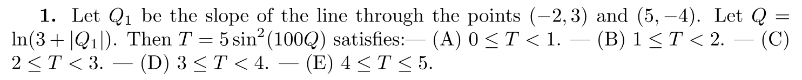
++++
<figure>
    <figcaption>Solution</figcaption>
    <audio
	controls
	src="./2121-09-01.m4a">
	    Your browser does not support the
	    <code>audio</code> element.
    </audio>
</figure>
++++
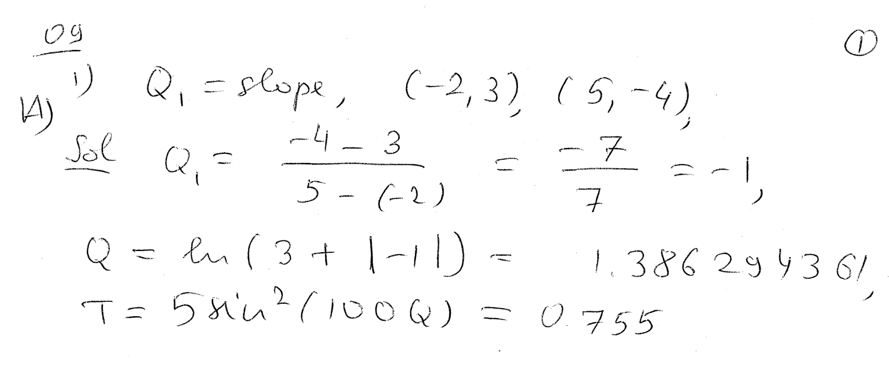
----
----

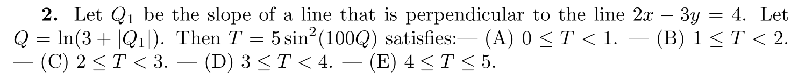
++++
<figure>
    <figcaption>Solution</figcaption>
    <audio
	controls
	src="./2121-09-02.m4a">
	    Your browser does not support the
	    <code>audio</code> element.
    </audio>
</figure>
++++
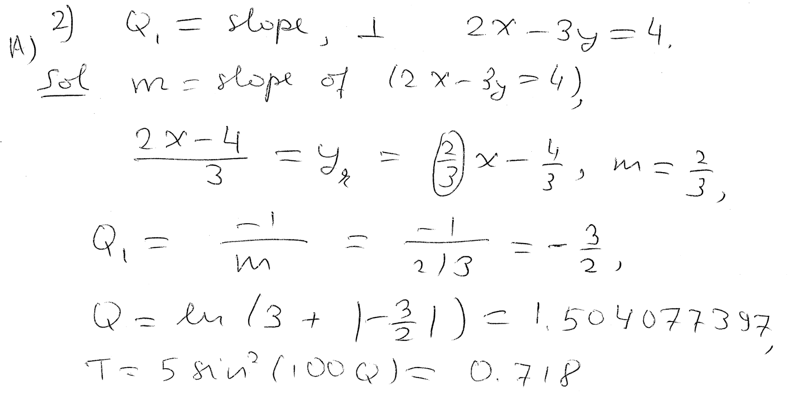
----
----

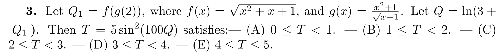
++++
<figure>
    <figcaption>Solution</figcaption>
    <audio
	controls
	src="./2121-09-03.m4a">
	    Your browser does not support the
	    <code>audio</code> element.
    </audio>
</figure>
++++
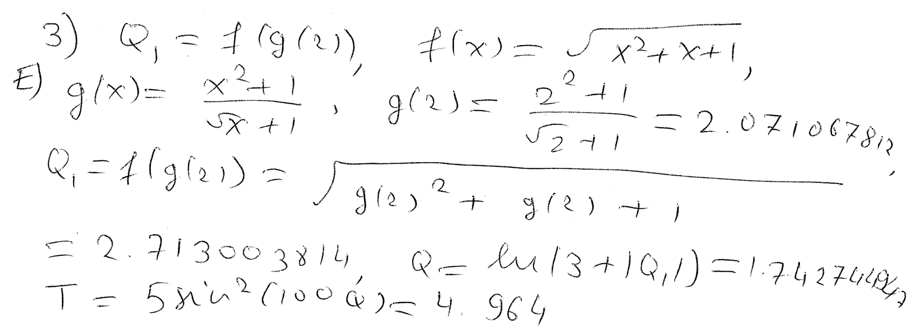
----
----

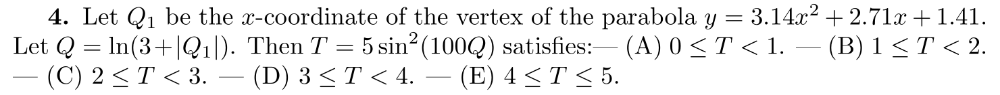
++++
<figure>
    <figcaption>Solution</figcaption>
    <audio
	controls
	src="./2121-09-04.m4a">
	    Your browser does not support the
	    <code>audio</code> element.
    </audio>
</figure>
++++
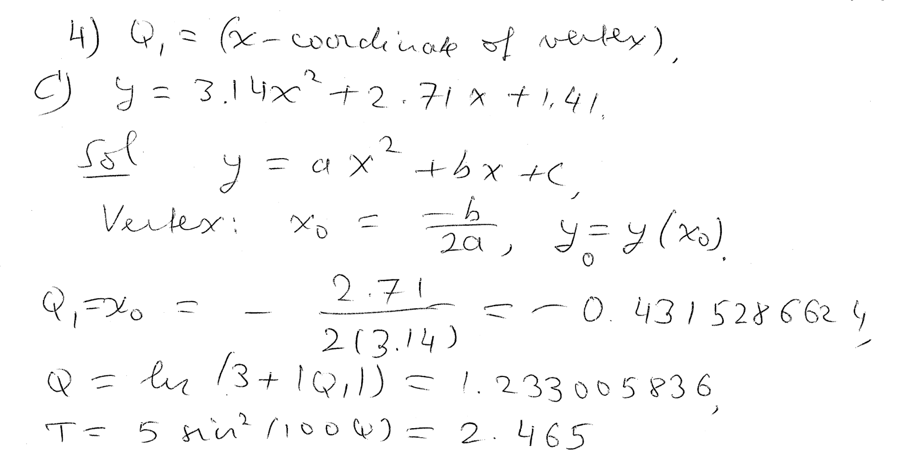
----
----

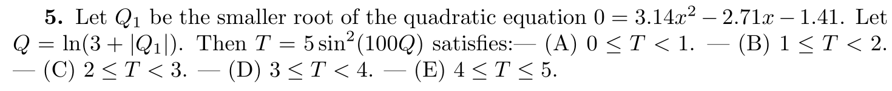
++++
<figure>
    <figcaption>Solution</figcaption>
    <audio
	controls
	src="./2121-09-05.m4a">
	    Your browser does not support the
	    <code>audio</code> element.
    </audio>
</figure>
++++
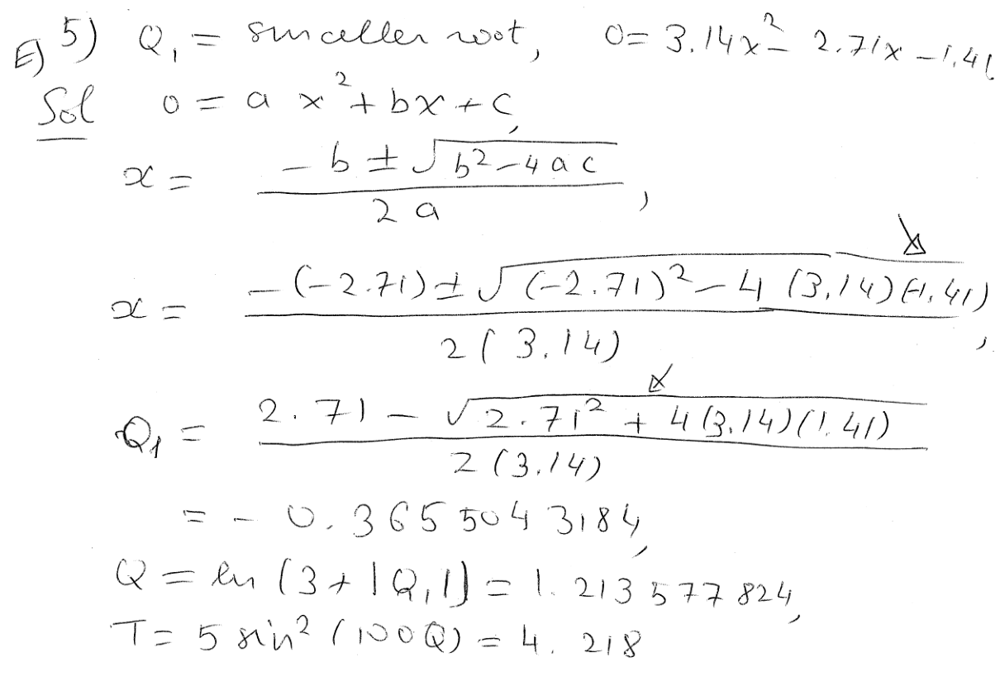
----
----

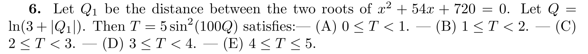
++++
<figure>
    <figcaption>Solution</figcaption>
    <audio
	controls
	src="./2121-09-06.m4a">
	    Your browser does not support the
	    <code>audio</code> element.
    </audio>
</figure>
++++
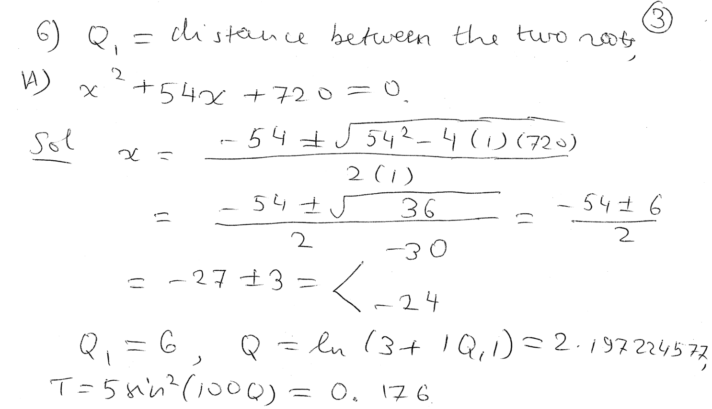
----
----

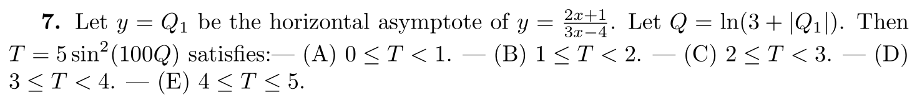
++++
<figure>
    <figcaption>Solution</figcaption>
    <audio
	controls
	src="./2121-09-07.m4a">
	    Your browser does not support the
	    <code>audio</code> element.
    </audio>
</figure>
++++
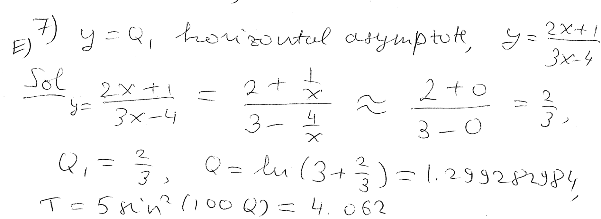
----
----

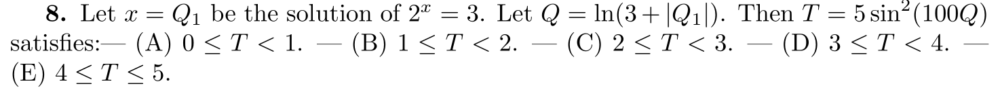
++++
<figure>
    <figcaption>Solution</figcaption>
    <audio
	controls
	src="./2121-09-08.m4a">
	    Your browser does not support the
	    <code>audio</code> element.
    </audio>
</figure>
++++
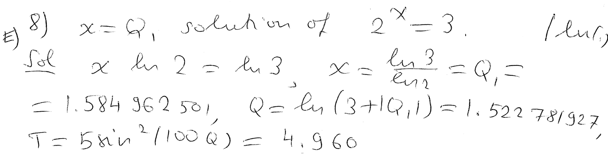
----
----

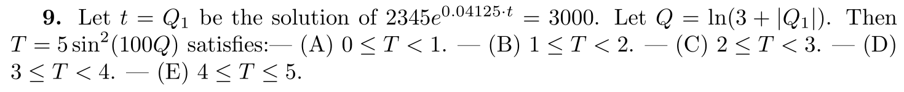
++++
<figure>
    <figcaption>Solution</figcaption>
    <audio
	controls
	src="./2121-09-09.m4a">
	    Your browser does not support the
	    <code>audio</code> element.
    </audio>
</figure>
++++
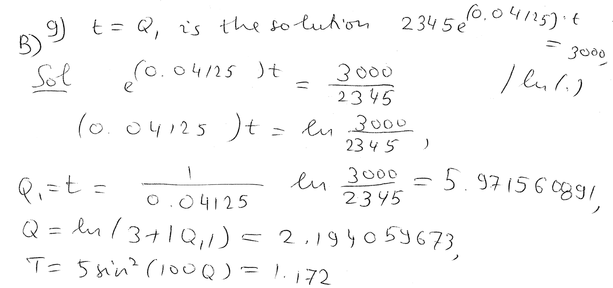
----
----

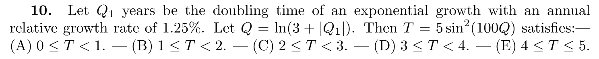
++++
<figure>
    <figcaption>Solution</figcaption>
    <audio
	controls
	src="./2121-09-10.m4a">
	    Your browser does not support the
	    <code>audio</code> element.
    </audio>
</figure>
++++
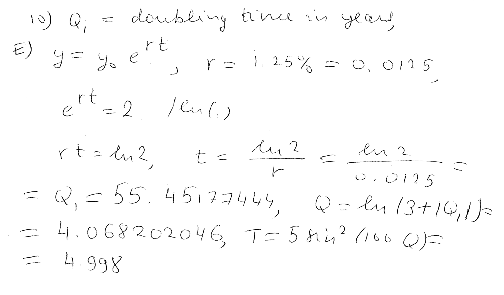
----
----

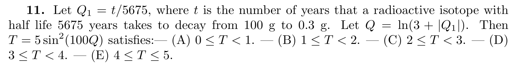
++++
<figure>
    <figcaption>Solution</figcaption>
    <audio
	controls
	src="./2121-09-11.m4a">
	    Your browser does not support the
	    <code>audio</code> element.
    </audio>
</figure>
++++
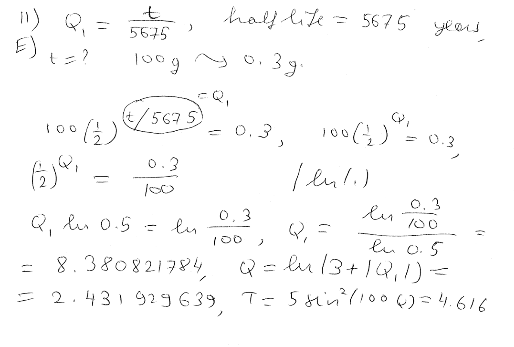
----
----

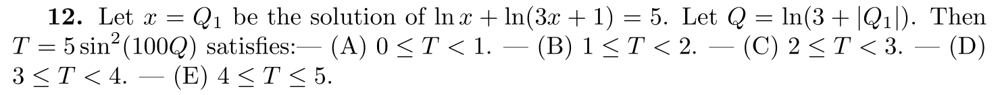
++++
<figure>
    <figcaption>Solution</figcaption>
    <audio
	controls
	src="./2121-09-12.m4a">
	    Your browser does not support the
	    <code>audio</code> element.
    </audio>
</figure>
++++
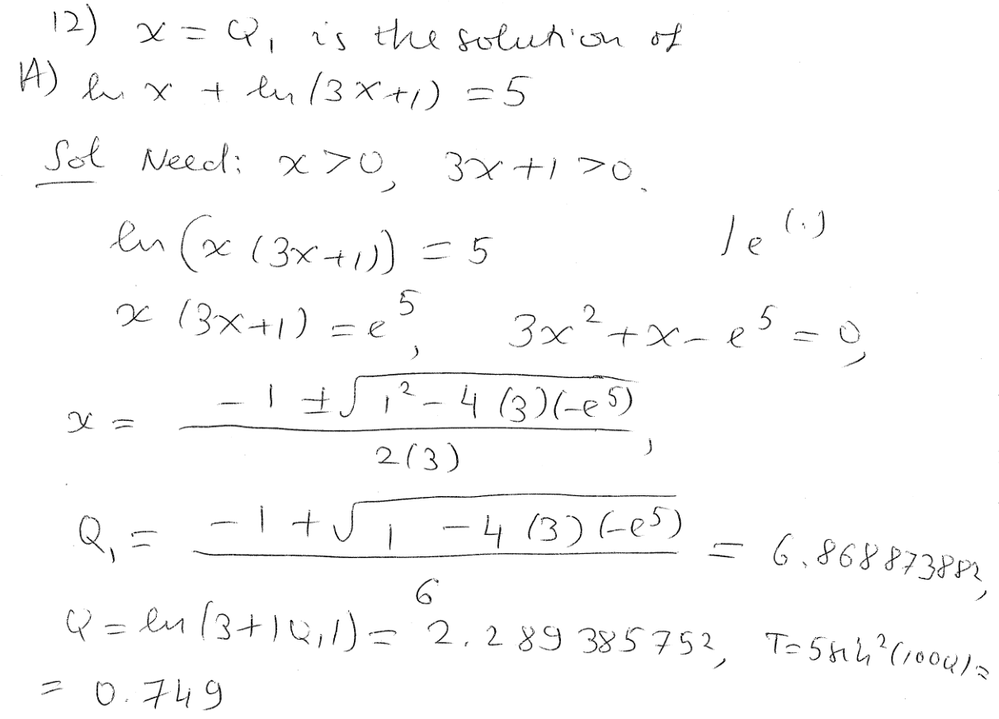
----
----

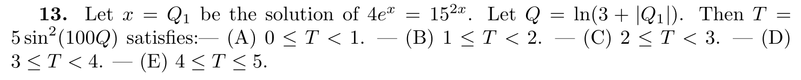
++++
<figure>
    <figcaption>Solution</figcaption>
    <audio
	controls
	src="./2121-09-13.m4a">
	    Your browser does not support the
	    <code>audio</code> element.
    </audio>
</figure>
++++
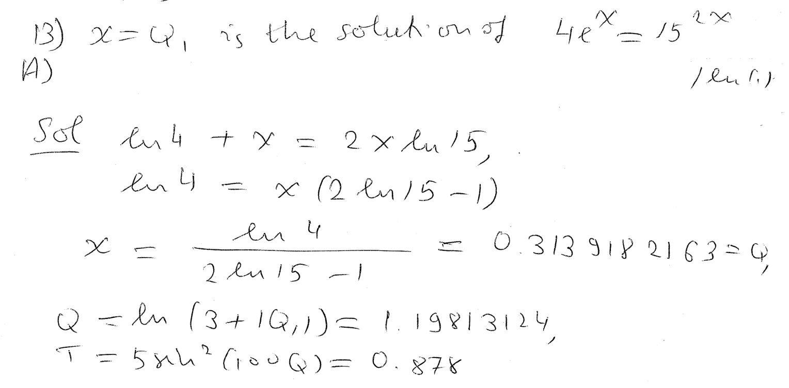
----
----

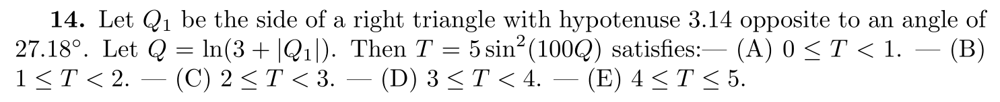
++++
<figure>
    <figcaption>Solution</figcaption>
    <audio
	controls
	src="./2121-09-14.m4a">
	    Your browser does not support the
	    <code>audio</code> element.
    </audio>
</figure>
++++
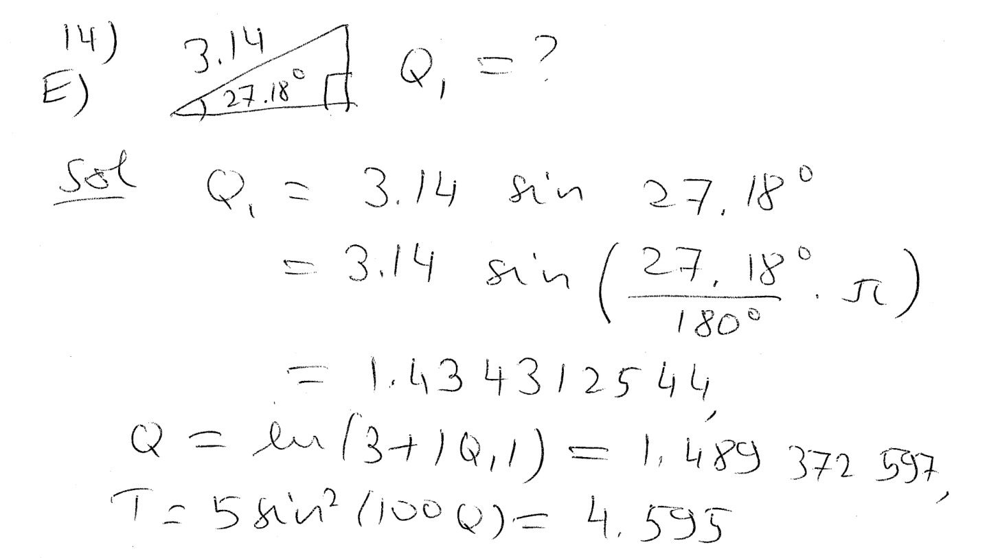
----
----

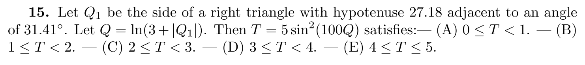
++++
<figure>
    <figcaption>Solution</figcaption>
    <audio
	controls
	src="./2121-09-15.m4a">
	    Your browser does not support the
	    <code>audio</code> element.
    </audio>
</figure>
++++
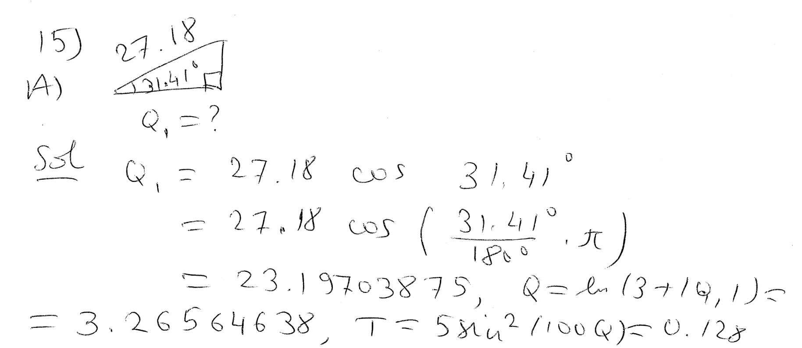
----
----

////
*Question.* () stem:[].
++++
<figure>
    <figcaption>Solution</figcaption>
    <audio
	controls
	src="./2121-09-16.m4a">
	    Your browser does not support the
	    <code>audio</code> element.
    </audio>
</figure>
++++
image::2121-09-16.PNG[Work]
----
----

*Question.* () stem:[].
++++
<figure>
    <figcaption>Solution</figcaption>
    <audio
	controls
	src="./2121-09-17.m4a">
	    Your browser does not support the
	    <code>audio</code> element.
    </audio>
</figure>
++++
image::2121-09-17.PNG[Work]
----
----

*Question.* () stem:[].
++++
<figure>
    <figcaption>Solution</figcaption>
    <audio
	controls
	src="./2121-09-18.m4a">
	    Your browser does not support the
	    <code>audio</code> element.
    </audio>
</figure>
++++
image::2121-09-18.PNG[Work]
----
----

*Question.* () stem:[].
++++
<figure>
    <figcaption>Solution</figcaption>
    <audio
	controls
	src="./2121-09-19.m4a">
	    Your browser does not support the
	    <code>audio</code> element.
    </audio>
</figure>
++++
image::2121-09-19.PNG[Work]
----
----

*Question.* () stem:[].
++++
<figure>
    <figcaption>Solution</figcaption>
    <audio
	controls
	src="./2121-09-20.m4a">
	    Your browser does not support the
	    <code>audio</code> element.
    </audio>
</figure>
++++
image::2121-09-20.PNG[Work]
----
----

*Question.* () stem:[].
++++
<figure>
    <figcaption>Solution</figcaption>
    <audio
	controls
	src="./2121-09-21.m4a">
	    Your browser does not support the
	    <code>audio</code> element.
    </audio>
</figure>
++++
image::2121-09-21.PNG[Work]
----
----

*Question.* () stem:[].
++++
<figure>
    <figcaption>Solution</figcaption>
    <audio
	controls
	src="./2121-09-22.m4a">
	    Your browser does not support the
	    <code>audio</code> element.
    </audio>
</figure>
++++
image::2121-09-22.PNG[Work]
----
----

*Question.* () stem:[].
++++
<figure>
    <figcaption>Solution</figcaption>
    <audio
	controls
	src="./2121-09-23.m4a">
	    Your browser does not support the
	    <code>audio</code> element.
    </audio>
</figure>
++++
image::2121-09-23.PNG[Work]
----
----

*Question.* () stem:[].
++++
<figure>
    <figcaption>Solution</figcaption>
    <audio
	controls
	src="./2121-09-24.m4a">
	    Your browser does not support the
	    <code>audio</code> element.
    </audio>
</figure>
++++
image::2121-09-24.PNG[Work]
----
----

*Question.* () stem:[].
++++
<figure>
    <figcaption>Solution</figcaption>
    <audio
	controls
	src="./2121-09-25.m4a">
	    Your browser does not support the
	    <code>audio</code> element.
    </audio>
</figure>
++++
image::2121-09-25.PNG[Work]
----
----

*Question.* () stem:[].
++++
<figure>
    <figcaption>Solution</figcaption>
    <audio
	controls
	src="./2121-09-26.m4a">
	    Your browser does not support the
	    <code>audio</code> element.
    </audio>
</figure>
++++
image::2121-09-26.PNG[Work]
----
----

*Question.* () stem:[].
++++
<figure>
    <figcaption>Solution</figcaption>
    <audio
	controls
	src="./2121-09-27.m4a">
	    Your browser does not support the
	    <code>audio</code> element.
    </audio>
</figure>
++++
image::2121-09-27.PNG[Work]
----
----

*Question.* () stem:[].
++++
<figure>
    <figcaption>Solution</figcaption>
    <audio
	controls
	src="./2121-09-28.m4a">
	    Your browser does not support the
	    <code>audio</code> element.
    </audio>
</figure>
++++
image::2121-09-28.PNG[Work]
----
----

*Question.* () stem:[].
++++
<figure>
    <figcaption>Solution</figcaption>
    <audio
	controls
	src="./2121-09-29.m4a">
	    Your browser does not support the
	    <code>audio</code> element.
    </audio>
</figure>
++++
image::2121-09-29.PNG[Work]
----
----

*Question.* () stem:[].
++++
<figure>
    <figcaption>Solution</figcaption>
    <audio
	controls
	src="./2121-09-30.m4a">
	    Your browser does not support the
	    <code>audio</code> element.
    </audio>
</figure>
++++
image::2121-09-30.PNG[Work]
----
----

////
