= Math 2121, Calculus for the life sciences, I
:source-highlighter: coderay
:stem:

In this set of notes we work through some notions and
examples from calculus.  You can read the questions
here, study the handwritten notes, and while doing
so, listen to some explanations by clicking on the
"play" button.

== Lesson 10, Rates of Change; Definition of the Derivative; Finding Derivatives.

*Question.* (3.3:p164/3) Compute the average rate of change of 
stem:[y=-3x^3+2x^2-4x+1] between stem:[x=-2] and stem:[x=1].
++++
<figure>
    <figcaption>Solution</figcaption>
    <audio
	controls
	src="./2121-10-01.m4a">
	    Your browser does not support the
	    <code>audio</code> element.
    </audio>
</figure>
++++
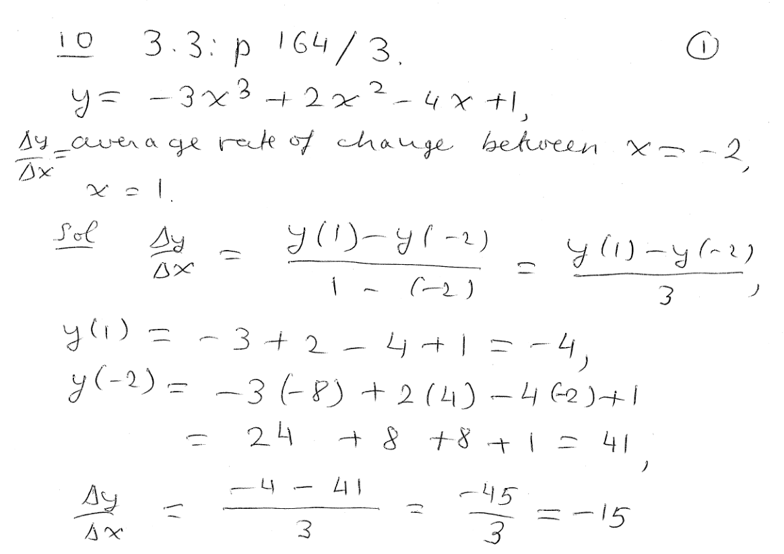
----
----

*Question.* (3.3:p164/11) Compute the average rate of change of 
stem:[y=sin x] between stem:[x=0] and stem:[x=pi/4].
++++
<figure>
    <figcaption>Solution</figcaption>
    <audio
	controls
	src="./2121-10-02.m4a">
	    Your browser does not support the
	    <code>audio</code> element.
    </audio>
</figure>
++++
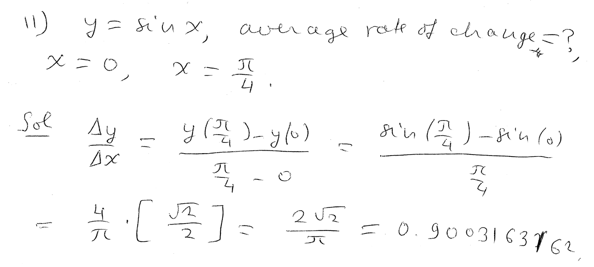
----
----

*Question.* (3.3:p164/47) If $1000 is invested in an account that
pays 5% interest compounded annually, then the total amount
stem:[A(t)] after stem:[t] years is given by
stem:[A(t)=1000 (1.05)^t].

(a) Find the average rate of change per year of the total amount in the
account for the first 5 years of the investment, i.e., from
stem:[t=0] to stem:[t=5].

(b) Find the average rate of change per year of the total amount in the
account for the second 5 years of the investment, i.e., from
stem:[t=5] to stem:[t=10].

(c) Estimate the instantaneous rate of change for stem:[t=5].
++++
<figure>
    <figcaption>Solution</figcaption>
    <audio
	controls
	src="./2121-10-03.m4a">
	    Your browser does not support the
	    <code>audio</code> element.
    </audio>
</figure>
++++
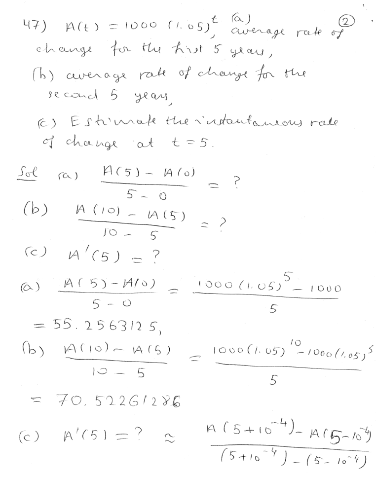
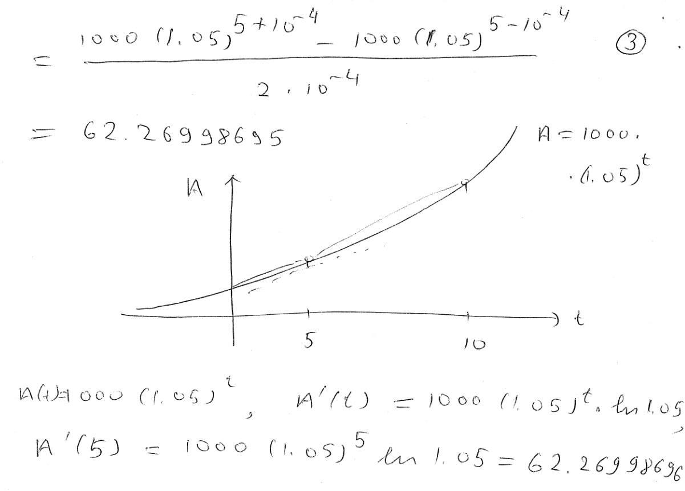
----
----

*The definition of the derivative.*
++++
<figure>
    <figcaption></figcaption>
    <audio
	controls
	src="./2121-10-04.m4a">
	    Your browser does not support the
	    <code>audio</code> element.
    </audio>
</figure>
++++
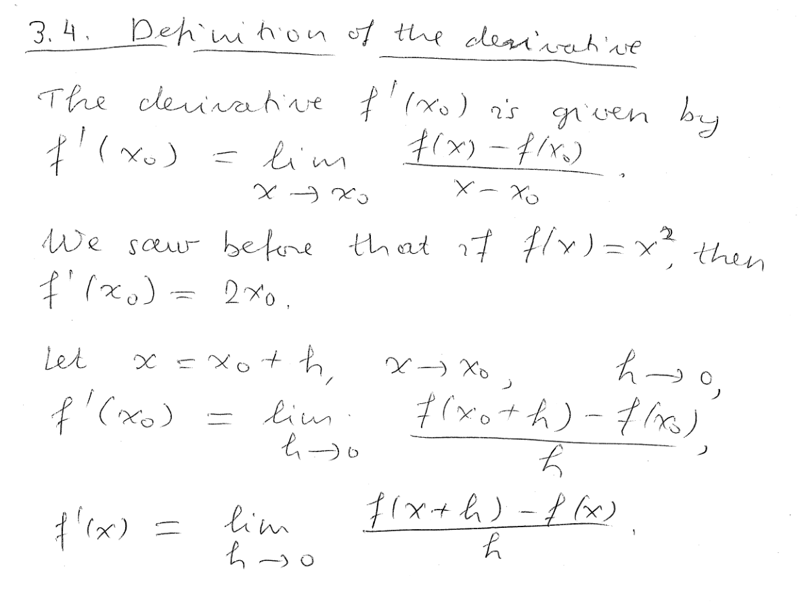
----
----

*Example: the derivative of stem:[sqrt x].*
++++
<figure>
    <figcaption></figcaption>
    <audio
	controls
	src="./2121-10-05.m4a">
	    Your browser does not support the
	    <code>audio</code> element.
    </audio>
</figure>
++++
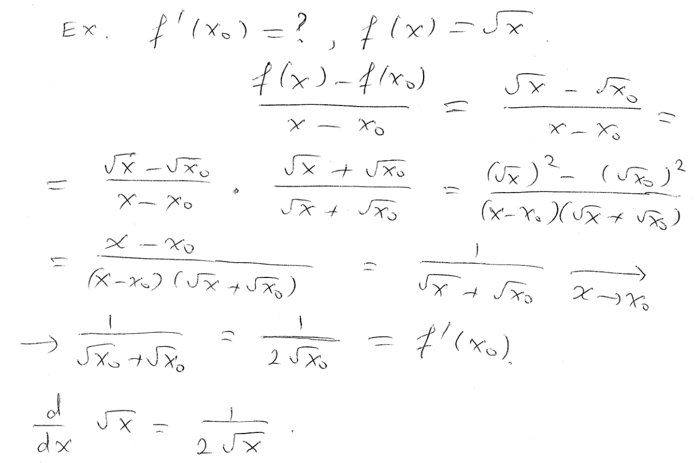
----
----

*Example: the derivative of stem:[1/x].*
++++
<figure>
    <figcaption></figcaption>
    <audio
	controls
	src="./2121-10-06.m4a">
	    Your browser does not support the
	    <code>audio</code> element.
    </audio>
</figure>
++++
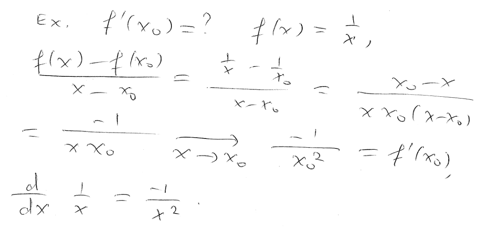
----
----

*Examples of the power rule.*
++++
<figure>
    <figcaption></figcaption>
    <audio
	controls
	src="./2121-10-07.m4a">
	    Your browser does not support the
	    <code>audio</code> element.
    </audio>
</figure>
++++
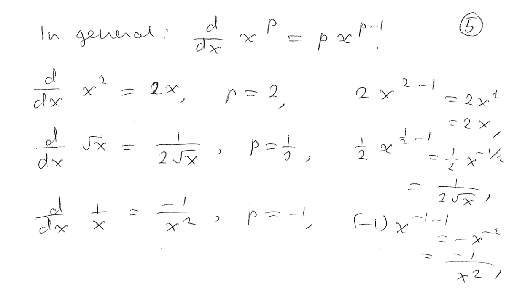
----
----

*Example: the derivative of the exponential function stem:[e^x].*
++++
<figure>
    <figcaption></figcaption>
    <audio
	controls
	src="./2121-10-08.m4a">
	    Your browser does not support the
	    <code>audio</code> element.
    </audio>
</figure>
++++
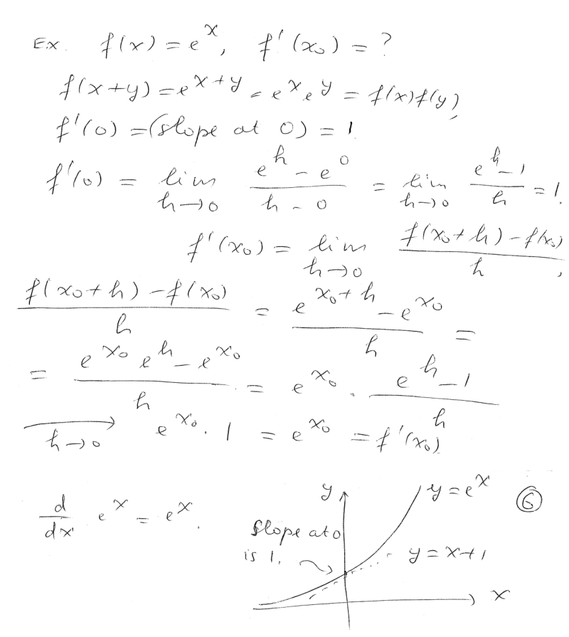
----
----

*Example: the derivative of the logarithm function stem:[ln x].*
++++
<figure>
    <figcaption></figcaption>
    <audio
	controls
	src="./2121-10-09.m4a">
	    Your browser does not support the
	    <code>audio</code> element.
    </audio>
</figure>
++++
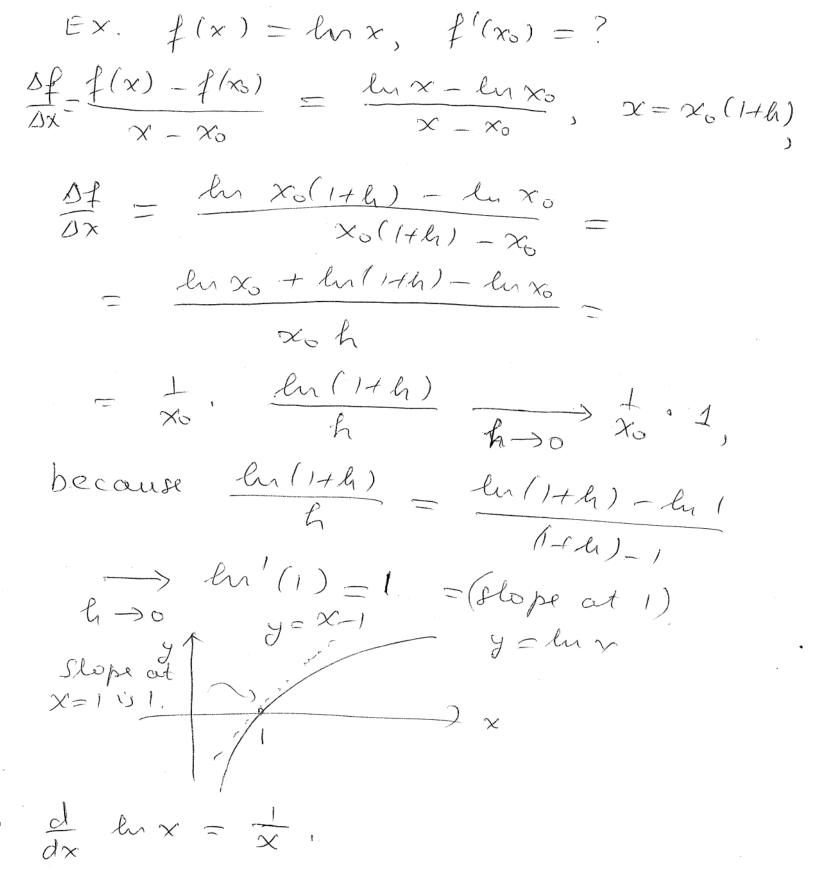
----
----

*Question.* (3.4:p181/19) Differentiate stem:[f(x)=2x^3+5].
++++
<figure>
    <figcaption>Solution</figcaption>
    <audio
	controls
	src="./2121-10-10.m4a">
	    Your browser does not support the
	    <code>audio</code> element.
    </audio>
</figure>
++++
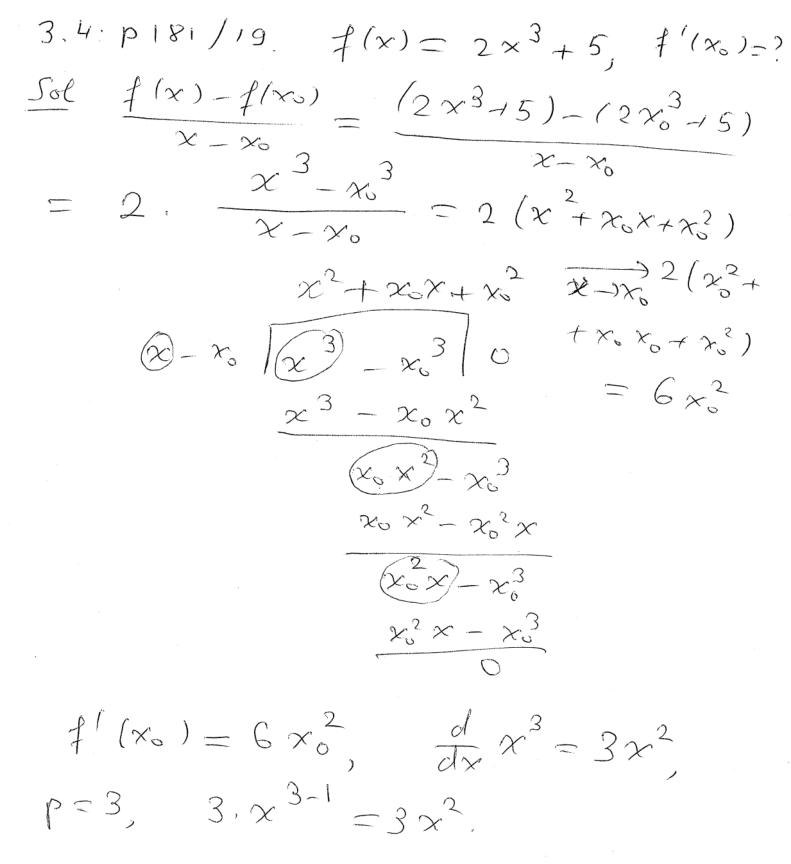
----
----

*Some rules of differentiation.*
++++
<figure>
    <figcaption></figcaption>
    <audio
	controls
	src="./2121-10-11.m4a">
	    Your browser does not support the
	    <code>audio</code> element.
    </audio>
</figure>
++++
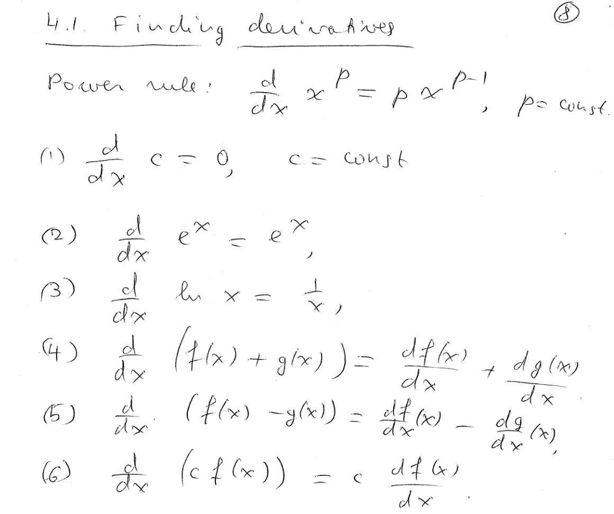
----
----

*Question.* (4.1:p209/1) Differentiate stem:[12x^3-8x^2+7x+5].
++++
<figure>
    <figcaption>Solution</figcaption>
    <audio
	controls
	src="./2121-10-12.m4a">
	    Your browser does not support the
	    <code>audio</code> element.
    </audio>
</figure>
++++
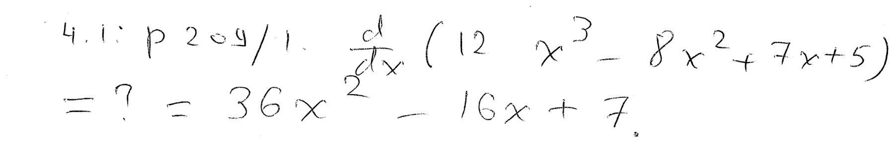
----
----

*Question.* (4.1:p209/3) Differentiate stem:[3x^4-6x^3+x^2/8+5].
++++
<figure>
    <figcaption>Solution</figcaption>
    <audio
	controls
	src="./2121-10-13.m4a">
	    Your browser does not support the
	    <code>audio</code> element.
    </audio>
</figure>
++++
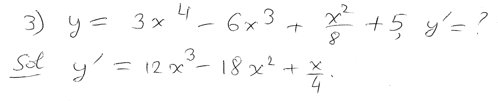
----
----

*Question.* (4.1:p209/5) Differentiate stem:[6x^{3.5}-10x^{0.5}].
++++
<figure>
    <figcaption>Solution</figcaption>
    <audio
	controls
	src="./2121-10-14.m4a">
	    Your browser does not support the
	    <code>audio</code> element.
    </audio>
</figure>
++++
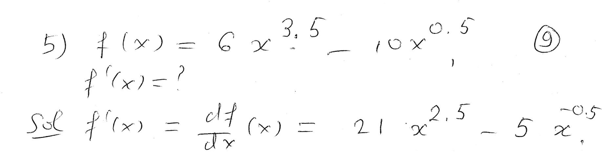
----
----

*Question.* (4.1:p209/7) Differentiate stem:[8sqrt{x}+6x^{3/4}].
++++
<figure>
    <figcaption>Solution</figcaption>
    <audio
	controls
	src="./2121-10-15.m4a">
	    Your browser does not support the
	    <code>audio</code> element.
    </audio>
</figure>
++++
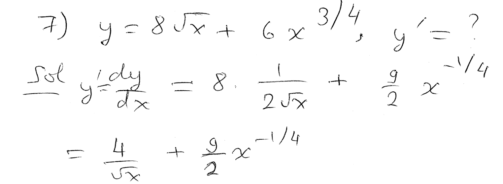
----
----

*Question.* (4.1:p209/11) Differentiate stem:[7/t-5/t^3].
++++
<figure>
    <figcaption>Solution</figcaption>
    <audio
	controls
	src="./2121-10-16.m4a">
	    Your browser does not support the
	    <code>audio</code> element.
    </audio>
</figure>
++++
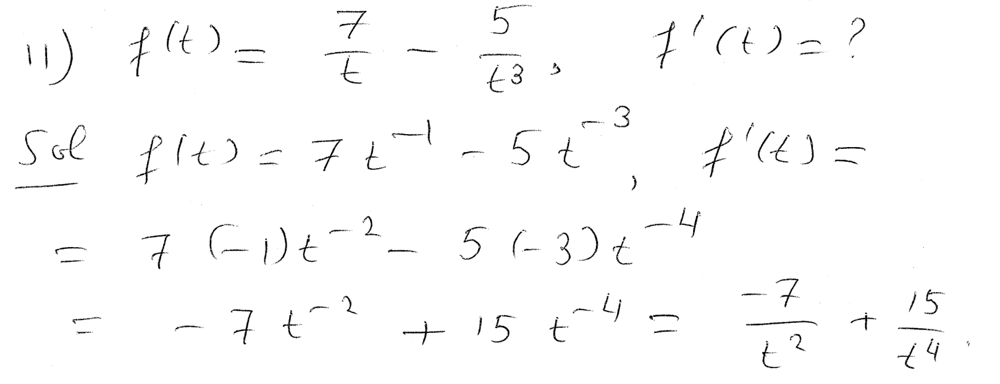
----
----

*Question.* (4.1:p209/14) Differentiate stem:[3/x^6+1/x^5-7/x^2].
++++
<figure>
    <figcaption>Solution</figcaption>
    <audio
	controls
	src="./2121-10-17.m4a">
	    Your browser does not support the
	    <code>audio</code> element.
    </audio>
</figure>
++++
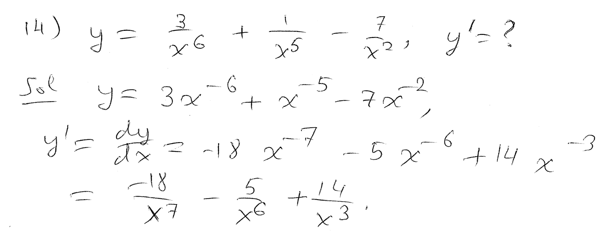
----
----

*Question.* (4.1:p209/17) Differentiate stem:[6/{root 4 x}].
++++
<figure>
    <figcaption>Solution</figcaption>
    <audio
	controls
	src="./2121-10-18.m4a">
	    Your browser does not support the
	    <code>audio</code> element.
    </audio>
</figure>
++++
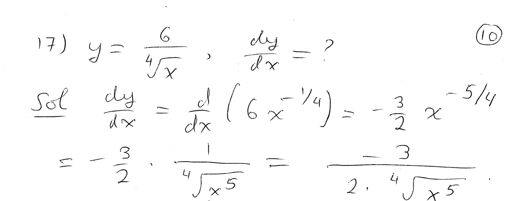
----
----

*Question.* (4.1:p209/19) Differentiate stem:[{x^3+5}/x].
++++
<figure>
    <figcaption>Solution</figcaption>
    <audio
	controls
	src="./2121-10-19.m4a">
	    Your browser does not support the
	    <code>audio</code> element.
    </audio>
</figure>
++++
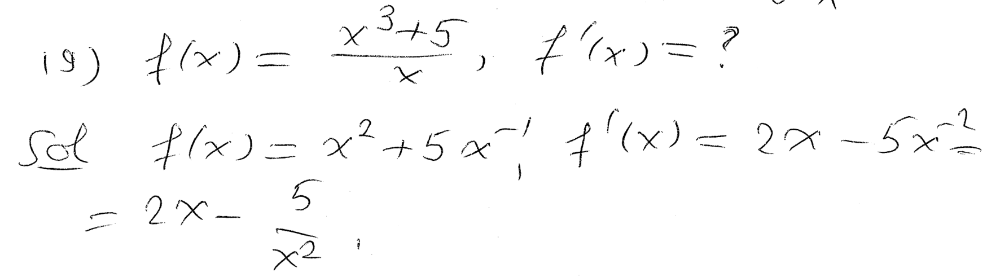
----
----

////
*Question.* () stem:[].
++++
<figure>
    <figcaption>Solution</figcaption>
    <audio
	controls
	src="./2121-10-20.m4a">
	    Your browser does not support the
	    <code>audio</code> element.
    </audio>
</figure>
++++
image::2121-10-20.PNG[Work]
----
----

*Question.* () stem:[].
++++
<figure>
    <figcaption>Solution</figcaption>
    <audio
	controls
	src="./2121-10-21.m4a">
	    Your browser does not support the
	    <code>audio</code> element.
    </audio>
</figure>
++++
image::2121-10-21.PNG[Work]
----
----

*Question.* () stem:[].
++++
<figure>
    <figcaption>Solution</figcaption>
    <audio
	controls
	src="./2121-10-22.m4a">
	    Your browser does not support the
	    <code>audio</code> element.
    </audio>
</figure>
++++
image::2121-10-22.PNG[Work]
----
----

*Question.* () stem:[].
++++
<figure>
    <figcaption>Solution</figcaption>
    <audio
	controls
	src="./2121-10-23.m4a">
	    Your browser does not support the
	    <code>audio</code> element.
    </audio>
</figure>
++++
image::2121-10-23.PNG[Work]
----
----

*Question.* () stem:[].
++++
<figure>
    <figcaption>Solution</figcaption>
    <audio
	controls
	src="./2121-10-24.m4a">
	    Your browser does not support the
	    <code>audio</code> element.
    </audio>
</figure>
++++
image::2121-10-24.PNG[Work]
----
----

*Question.* () stem:[].
++++
<figure>
    <figcaption>Solution</figcaption>
    <audio
	controls
	src="./2121-10-25.m4a">
	    Your browser does not support the
	    <code>audio</code> element.
    </audio>
</figure>
++++
image::2121-10-25.PNG[Work]
----
----

*Question.* () stem:[].
++++
<figure>
    <figcaption>Solution</figcaption>
    <audio
	controls
	src="./2121-10-26.m4a">
	    Your browser does not support the
	    <code>audio</code> element.
    </audio>
</figure>
++++
image::2121-10-26.PNG[Work]
----
----

*Question.* () stem:[].
++++
<figure>
    <figcaption>Solution</figcaption>
    <audio
	controls
	src="./2121-10-27.m4a">
	    Your browser does not support the
	    <code>audio</code> element.
    </audio>
</figure>
++++
image::2121-10-27.PNG[Work]
----
----

*Question.* () stem:[].
++++
<figure>
    <figcaption>Solution</figcaption>
    <audio
	controls
	src="./2121-10-28.m4a">
	    Your browser does not support the
	    <code>audio</code> element.
    </audio>
</figure>
++++
image::2121-10-28.PNG[Work]
----
----

*Question.* () stem:[].
++++
<figure>
    <figcaption>Solution</figcaption>
    <audio
	controls
	src="./2121-10-29.m4a">
	    Your browser does not support the
	    <code>audio</code> element.
    </audio>
</figure>
++++
image::2121-10-29.PNG[Work]
----
----

*Question.* () stem:[].
++++
<figure>
    <figcaption>Solution</figcaption>
    <audio
	controls
	src="./2121-10-30.m4a">
	    Your browser does not support the
	    <code>audio</code> element.
    </audio>
</figure>
++++
image::2121-10-30.PNG[Work]
----
----

////
