= Math 2121, Calculus for the life sciences, I
:source-highlighter: coderay
:stem:

In this set of notes we work through some notions and
examples from calculus.  You can read the questions
here, study the handwritten notes, and while doing
so, listen to some explanations by clicking on the
"play" button.

== Lesson 11, Rules of Differentiation; Derivatives of Products and Quotients.

*Question.* (4.1:p209/21) Differentiate stem:[(8x^2-4x)^2].
++++
<figure>
    <figcaption>Solution</figcaption>
    <audio
	controls
	src="./2121-11-01.m4a">
	    Your browser does not support the
	    <code>audio</code> element.
    </audio>
</figure>
++++
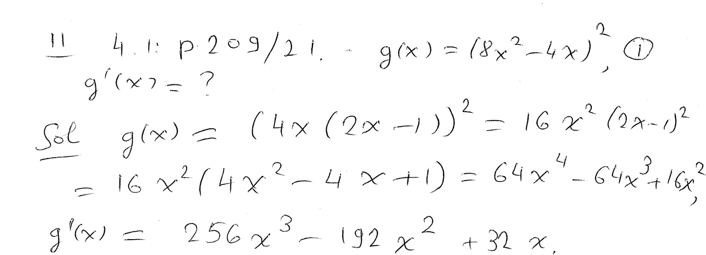
----
----

*Question.* (4.1:p209/27) Differentiate stem:[9x^{-1/2}+2/x^{3/2}].
++++
<figure>
    <figcaption>Solution</figcaption>
    <audio
	controls
	src="./2121-11-02.m4a">
	    Your browser does not support the
	    <code>audio</code> element.
    </audio>
</figure>
++++
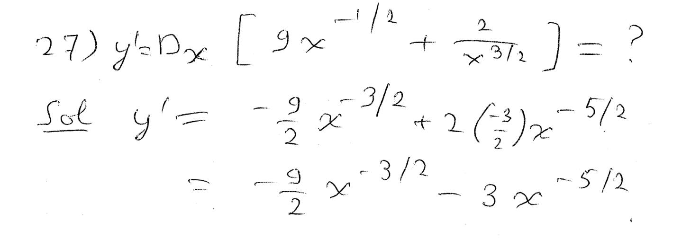
----
----

*Question.* (4.1:p209/29) Differentiate stem:[f(x)=x^4/6-3x]
and compute stem:[f'(-2)].
++++
<figure>
    <figcaption>Solution</figcaption>
    <audio
	controls
	src="./2121-11-03.m4a">
	    Your browser does not support the
	    <code>audio</code> element.
    </audio>
</figure>
++++
//image::2121-11-03.PNG[Work]
stem:[f'(x)=4x^3/6-3=2x^3/3-3], stem:[f'(-2)={2(-8)}/3-3=-25/3].
----
----

*Question.* (4.1:p209/37) At which points stem:[x] does the
function stem:[f(x)=2x^3+9x^2-60x+4] have a horizontal tangent line?
++++
<figure>
    <figcaption>Solution</figcaption>
    <audio
	controls
	src="./2121-11-04.m4a">
	    Your browser does not support the
	    <code>audio</code> element.
    </audio>
</figure>
++++
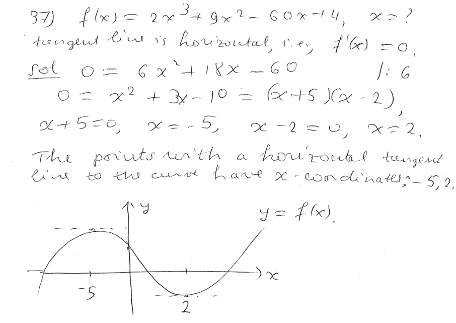
----
----

*Question.* (4.1:p209/71) A ball is thrown vertically upward from the
ground at a velocity of 64 ft per second.
Its distance from the ground at stem:[t] seconds is given by
stem:[s(t)=-16t^2+64t].

(a) How fast is the ball moving 2 seconds after being thrown?  Three seconds after?

(b) How long after the ball is thrown does it reach its maximum height?

(c) How high will it go?
++++
<figure>
    <figcaption>Solution</figcaption>
    <audio
	controls
	src="./2121-11-05.m4a">
	    Your browser does not support the
	    <code>audio</code> element.
    </audio>
</figure>
++++
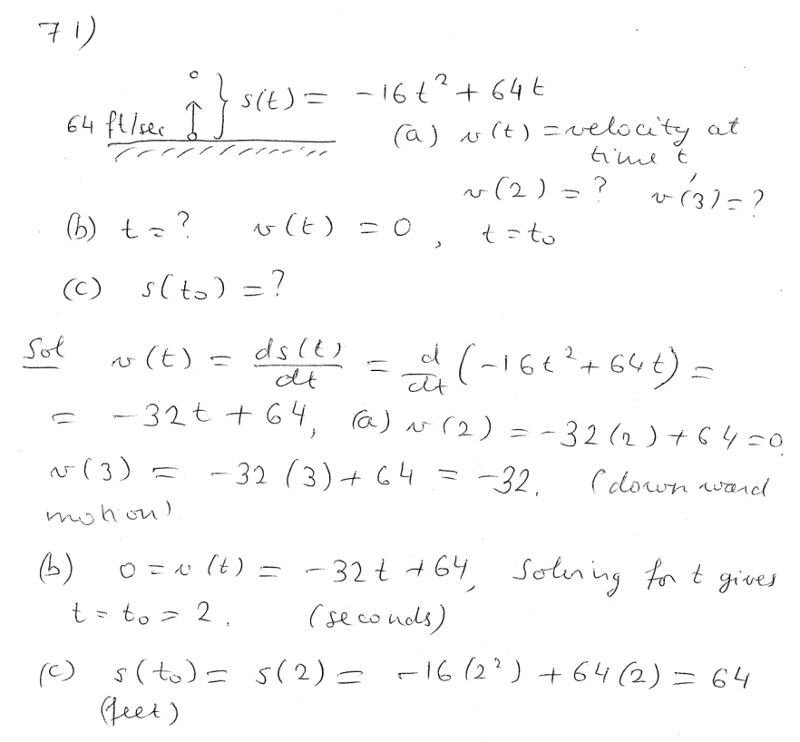
----
----

*The product rule; the quotient rule.*
++++
<figure>
    <figcaption></figcaption>
    <audio
	controls
	src="./2121-11-06.m4a">
	    Your browser does not support the
	    <code>audio</code> element.
    </audio>
</figure>
++++
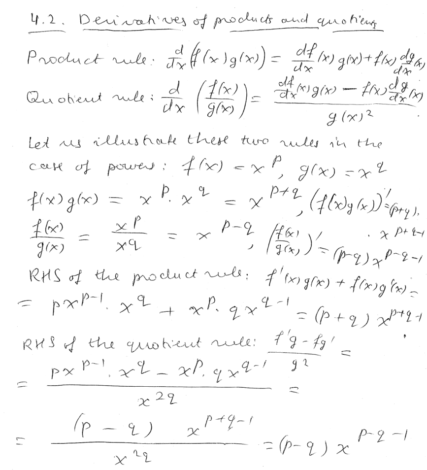
----
----

*Question.* (4.2:p218/1) Differentiate stem:[(3x^2+2)(2x-1)].
++++
<figure>
    <figcaption>Solution</figcaption>
    <audio
	controls
	src="./2121-11-07.m4a">
	    Your browser does not support the
	    <code>audio</code> element.
    </audio>
</figure>
++++
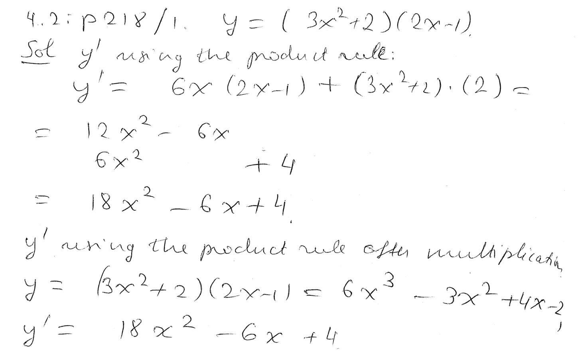
----
----

*Question.* (4.2:p218/3) Differentiate stem:[(2x-5)^2].
++++
<figure>
    <figcaption>Solution</figcaption>
    <audio
	controls
	src="./2121-11-08.m4a">
	    Your browser does not support the
	    <code>audio</code> element.
    </audio>
</figure>
++++
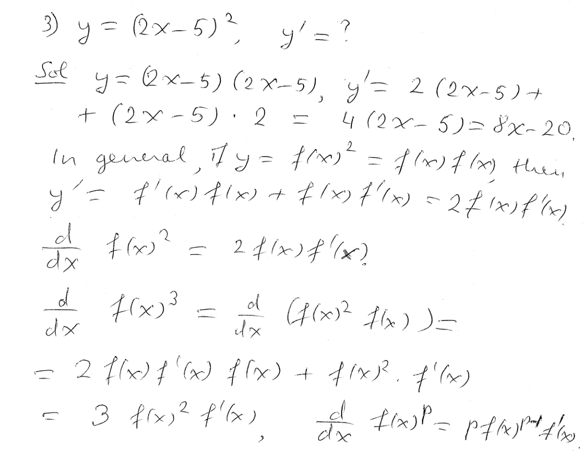
----
----

*Question.* (4.2:p218/7) Differentiate stem:[(x+1)(sqrt{x}+2)].
++++
<figure>
    <figcaption>Solution</figcaption>
    <audio
	controls
	src="./2121-11-09.m4a">
	    Your browser does not support the
	    <code>audio</code> element.
    </audio>
</figure>
++++
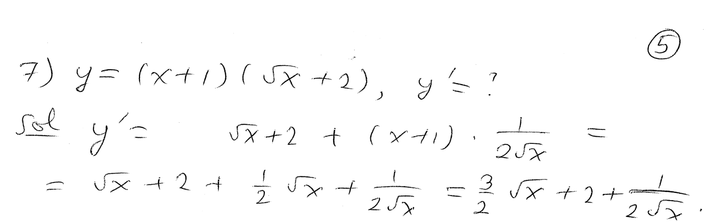
----
----

*Question.* (4.2:p218/9) Differentiate stem:[(y^{-1}+y^{-2})(2y^{-3}-5y^{-4})].
++++
<figure>
    <figcaption>Solution</figcaption>
    <audio
	controls
	src="./2121-11-10.m4a">
	    Your browser does not support the
	    <code>audio</code> element.
    </audio>
</figure>
++++
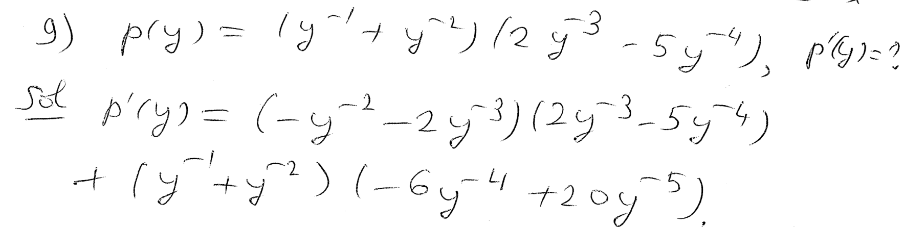
----
----

*Question.* (4.2:p218/11) Differentiate stem:[f(x)={6x+1}/{3x+10}].
++++
<figure>
    <figcaption>Solution</figcaption>
    <audio
	controls
	src="./2121-11-11.m4a">
	    Your browser does not support the
	    <code>audio</code> element.
    </audio>
</figure>
++++
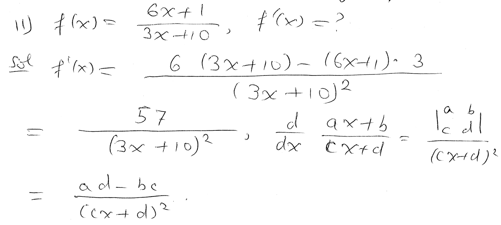
----
----

*Question.* (4.2:p218/15) Differentiate stem:[y={x^2+x}/{x-1}].
++++
<figure>
    <figcaption>Solution</figcaption>
    <audio
	controls
	src="./2121-11-12.m4a">
	    Your browser does not support the
	    <code>audio</code> element.
    </audio>
</figure>
++++
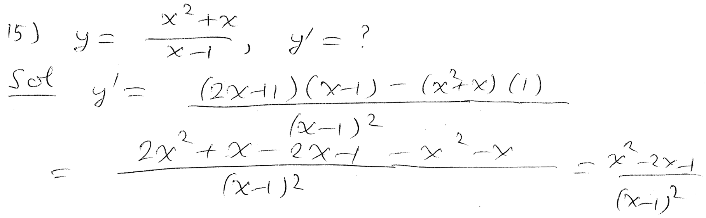
----
----

*Question.* (4.2:p218/19) Differentiate stem:[{x^2-4x+2}/{x^2+3}].
++++
<figure>
    <figcaption>Solution</figcaption>
    <audio
	controls
	src="./2121-11-13.m4a">
	    Your browser does not support the
	    <code>audio</code> element.
    </audio>
</figure>
++++
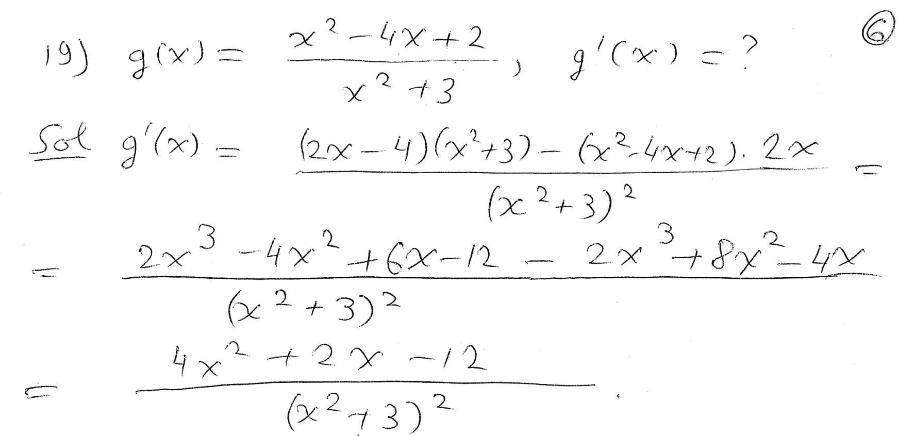
----
----

*Question.* (4.2:p218/26) Differentiate stem:[{y^{1.4}+1}/{y^{2.5}+2}].
++++
<figure>
    <figcaption>Solution</figcaption>
    <audio
	controls
	src="./2121-11-14.m4a">
	    Your browser does not support the
	    <code>audio</code> element.
    </audio>
</figure>
++++
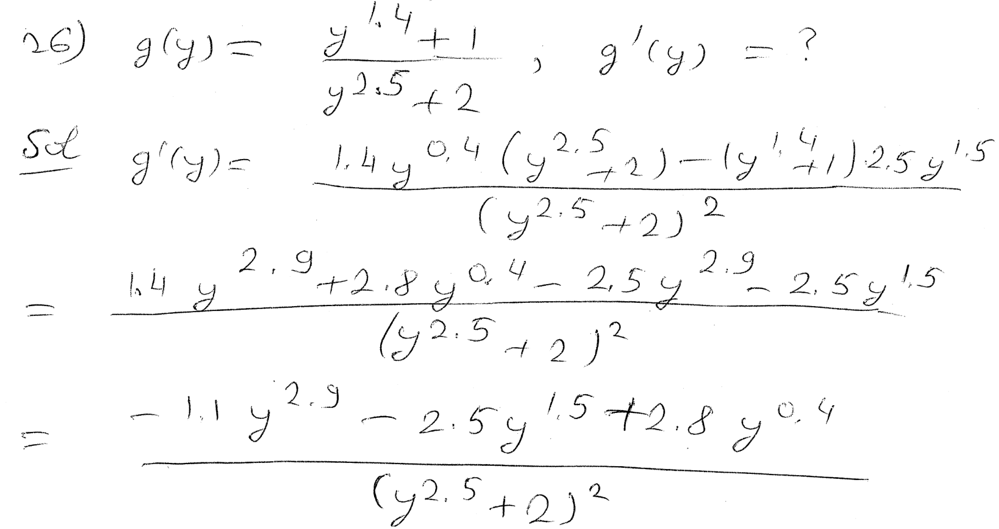
----
----

*Question.* (4.2:p218/27) Differentiate stem:[{(3x^2+1)(2x-1)}/{5x+4}].
++++
<figure>
    <figcaption>Solution</figcaption>
    <audio
	controls
	src="./2121-11-15.m4a">
	    Your browser does not support the
	    <code>audio</code> element.
    </audio>
</figure>
++++
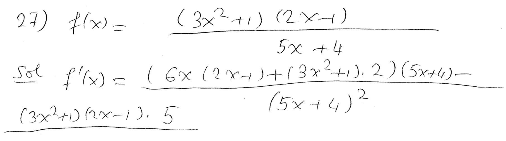
----
----

*Question.* (4.2:p218/33) Find an equation of the tangent line
to the curve  stem:[f(x)=x/{x-2}] at the point stem:[x_0=3].
++++
<figure>
    <figcaption>Solution</figcaption>
    <audio
	controls
	src="./2121-11-16.m4a">
	    Your browser does not support the
	    <code>audio</code> element.
    </audio>
</figure>
++++
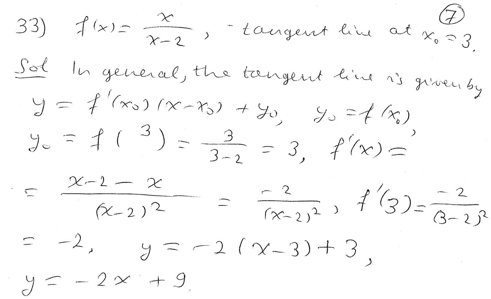
----
----

*Question.* (4.2:p218/29) If stem:[g(3)=4], stem:[g'(3)=5],
stem:[f(3)=9], stem:[f'(3)=8], then find stem:[h'(3)], where
stem:[h(x)=f(x)g(x)].
++++
<figure>
    <figcaption>Solution</figcaption>
    <audio
	controls
	src="./2121-11-17.m4a">
	    Your browser does not support the
	    <code>audio</code> element.
    </audio>
</figure>
++++
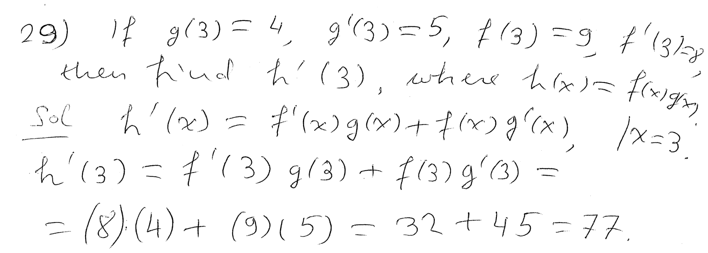
----
----

*Question.* (4.2:p218/30) If stem:[g(3)=4], stem:[g'(3)=5],
stem:[f(3)=9], stem:[f'(3)=8], then find stem:[h'(3)], where
stem:[h(x)=f(x)/g(x)].
++++
<figure>
    <figcaption>Solution</figcaption>
    <audio
	controls
	src="./2121-11-18.m4a">
	    Your browser does not support the
	    <code>audio</code> element.
    </audio>
</figure>
++++
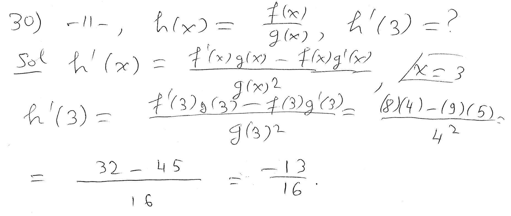
----
----

////
*Question.* () stem:[].
++++
<figure>
    <figcaption>Solution</figcaption>
    <audio
	controls
	src="./2121-11-19.m4a">
	    Your browser does not support the
	    <code>audio</code> element.
    </audio>
</figure>
++++
image::2121-11-19.PNG[Work]
----
----

*Question.* () stem:[].
++++
<figure>
    <figcaption>Solution</figcaption>
    <audio
	controls
	src="./2121-11-20.m4a">
	    Your browser does not support the
	    <code>audio</code> element.
    </audio>
</figure>
++++
image::2121-11-20.PNG[Work]
----
----

*Question.* () stem:[].
++++
<figure>
    <figcaption>Solution</figcaption>
    <audio
	controls
	src="./2121-11-21.m4a">
	    Your browser does not support the
	    <code>audio</code> element.
    </audio>
</figure>
++++
image::2121-11-21.PNG[Work]
----
----

*Question.* () stem:[].
++++
<figure>
    <figcaption>Solution</figcaption>
    <audio
	controls
	src="./2121-11-22.m4a">
	    Your browser does not support the
	    <code>audio</code> element.
    </audio>
</figure>
++++
image::2121-11-22.PNG[Work]
----
----

*Question.* () stem:[].
++++
<figure>
    <figcaption>Solution</figcaption>
    <audio
	controls
	src="./2121-11-23.m4a">
	    Your browser does not support the
	    <code>audio</code> element.
    </audio>
</figure>
++++
image::2121-11-23.PNG[Work]
----
----

*Question.* () stem:[].
++++
<figure>
    <figcaption>Solution</figcaption>
    <audio
	controls
	src="./2121-11-24.m4a">
	    Your browser does not support the
	    <code>audio</code> element.
    </audio>
</figure>
++++
image::2121-11-24.PNG[Work]
----
----

*Question.* () stem:[].
++++
<figure>
    <figcaption>Solution</figcaption>
    <audio
	controls
	src="./2121-11-25.m4a">
	    Your browser does not support the
	    <code>audio</code> element.
    </audio>
</figure>
++++
image::2121-11-25.PNG[Work]
----
----

*Question.* () stem:[].
++++
<figure>
    <figcaption>Solution</figcaption>
    <audio
	controls
	src="./2121-11-26.m4a">
	    Your browser does not support the
	    <code>audio</code> element.
    </audio>
</figure>
++++
image::2121-11-26.PNG[Work]
----
----

*Question.* () stem:[].
++++
<figure>
    <figcaption>Solution</figcaption>
    <audio
	controls
	src="./2121-11-27.m4a">
	    Your browser does not support the
	    <code>audio</code> element.
    </audio>
</figure>
++++
image::2121-11-27.PNG[Work]
----
----

*Question.* () stem:[].
++++
<figure>
    <figcaption>Solution</figcaption>
    <audio
	controls
	src="./2121-11-28.m4a">
	    Your browser does not support the
	    <code>audio</code> element.
    </audio>
</figure>
++++
image::2121-11-28.PNG[Work]
----
----

*Question.* () stem:[].
++++
<figure>
    <figcaption>Solution</figcaption>
    <audio
	controls
	src="./2121-11-29.m4a">
	    Your browser does not support the
	    <code>audio</code> element.
    </audio>
</figure>
++++
image::2121-11-29.PNG[Work]
----
----

*Question.* () stem:[].
++++
<figure>
    <figcaption>Solution</figcaption>
    <audio
	controls
	src="./2121-11-30.m4a">
	    Your browser does not support the
	    <code>audio</code> element.
    </audio>
</figure>
++++
image::2121-11-30.PNG[Work]
----
----

////
