= Math 2121, Calculus for the life sciences, I
:source-highlighter: coderay
:stem:

In this set of notes we work through some notions and
examples from calculus.  You can read the questions
here, study the handwritten notes, and while doing
so, listen to some explanations by clicking on the
"play" button.

== Lesson 12, The Chain Rule.

*The definition of a composition, or, chain of functions.*
++++
<figure>
    <figcaption></figcaption>
    <audio
	controls
	src="./2121-12-01.m4a">
	    Your browser does not support the
	    <code>audio</code> element.
    </audio>
</figure>
++++
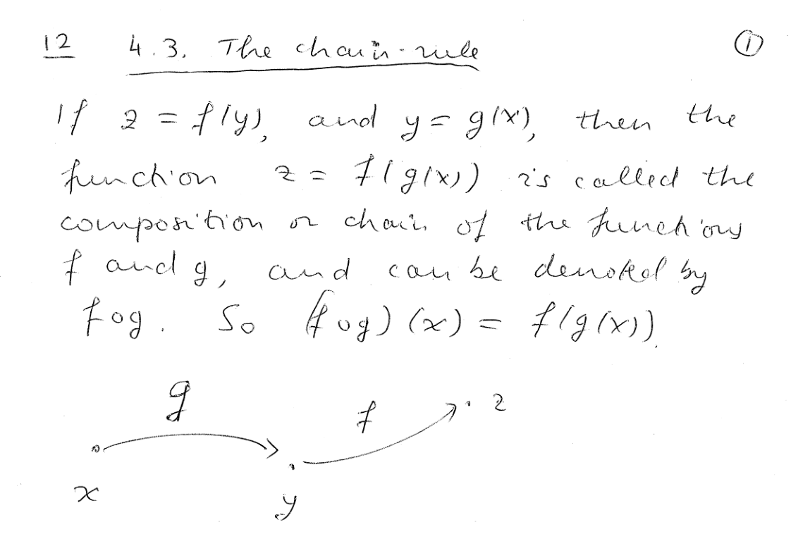
----
----

*The chain rule of differentiation.*
++++
<figure>
    <figcaption></figcaption>
    <audio
	controls
	src="./2121-12-02.m4a">
	    Your browser does not support the
	    <code>audio</code> element.
    </audio>
</figure>
++++
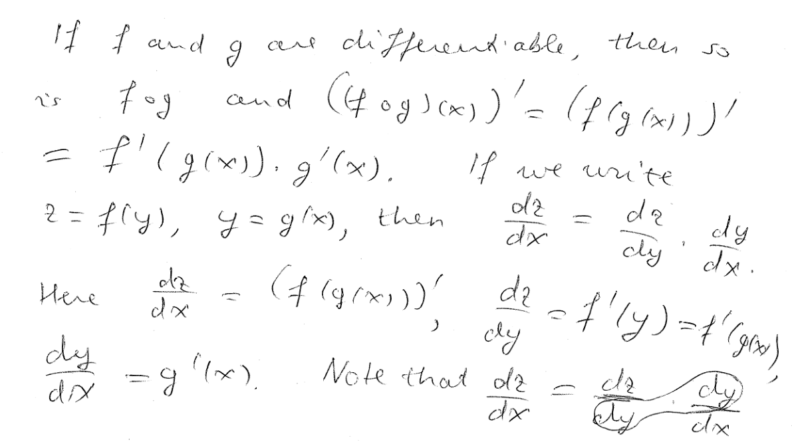
----
----

*Illustrating the chain rule using power functions.*
++++
<figure>
    <figcaption></figcaption>
    <audio
	controls
	src="./2121-12-03.m4a">
	    Your browser does not support the
	    <code>audio</code> element.
    </audio>
</figure>
++++
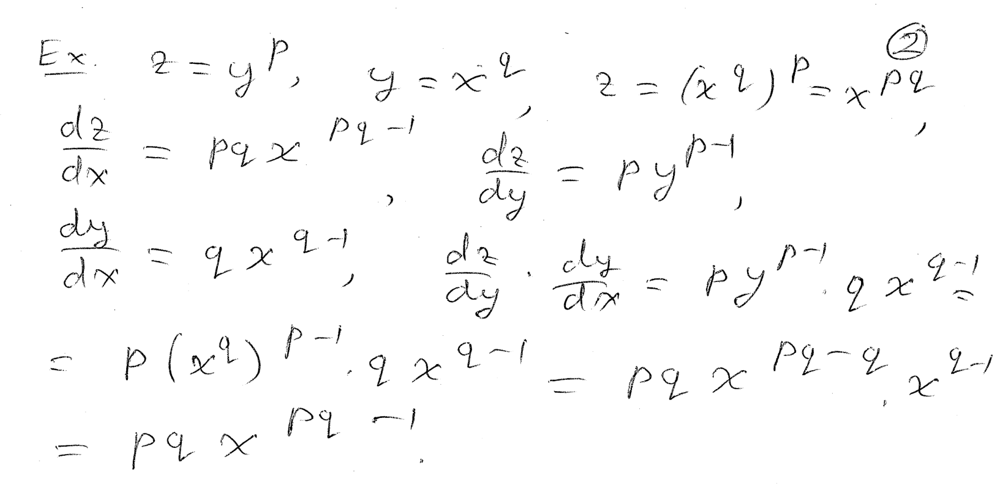
----
----

*Question.* (4.3:p227/7) Compute stem:[f(g(x))] and stem:[g(f(x))] for stem:[f(x)=x/8+7], stem:[g(x)=6x-1].
++++
<figure>
    <figcaption>Solution</figcaption>
    <audio
	controls
	src="./2121-12-04.m4a">
	    Your browser does not support the
	    <code>audio</code> element.
    </audio>
</figure>
++++
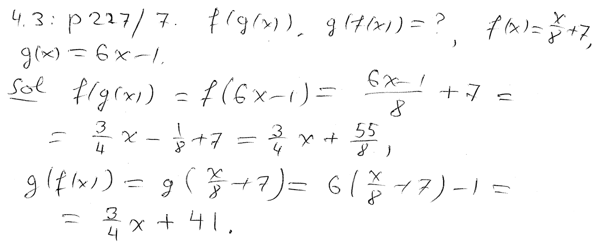
----
----

*Question.* (4.3:p227/13) Compute stem:[f(g(x))] and stem:[g(f(x))] for stem:[f(x)=sqrt{x+1}], stem:[g(x)=-1/x].
++++
<figure>
    <figcaption>Solution</figcaption>
    <audio
	controls
	src="./2121-12-05.m4a">
	    Your browser does not support the
	    <code>audio</code> element.
    </audio>
</figure>
++++
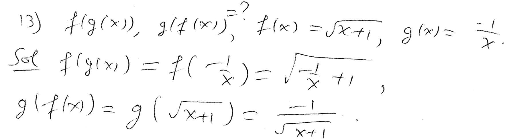
----
----

*Question.* (4.3:p227/21) Differentiate stem:[(8x^4-5x^2+1)^4].
++++
<figure>
    <figcaption>Solution</figcaption>
    <audio
	controls
	src="./2121-12-06.m4a">
	    Your browser does not support the
	    <code>audio</code> element.
    </audio>
</figure>
++++
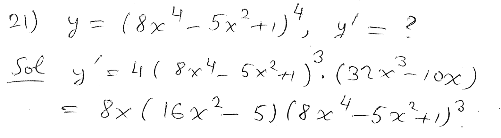
----
----

*Question.* (4.3:p227/23) Differentiate stem:[-2(12x^2+5)^{-6}].
++++
<figure>
    <figcaption>Solution</figcaption>
    <audio
	controls
	src="./2121-12-07.m4a">
	    Your browser does not support the
	    <code>audio</code> element.
    </audio>
</figure>
++++
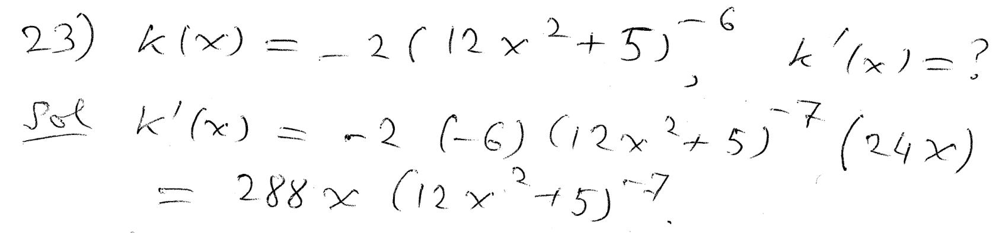
----
----

*Question.* (4.3:p227/25) Differentiate stem:[45(3t^3-8)^{3/2}].
++++
<figure>
    <figcaption>Solution</figcaption>
    <audio
	controls
	src="./2121-12-08.m4a">
	    Your browser does not support the
	    <code>audio</code> element.
    </audio>
</figure>
++++
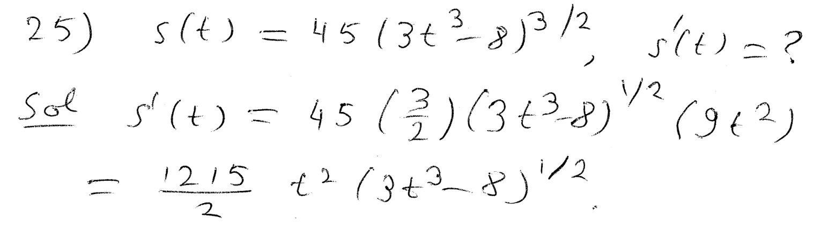
----
----

*Question.* (4.3:p227/27) Differentiate stem:[-3sqrt{7t^3-1}].
++++
<figure>
    <figcaption>Solution</figcaption>
    <audio
	controls
	src="./2121-12-09.m4a">
	    Your browser does not support the
	    <code>audio</code> element.
    </audio>
</figure>
++++
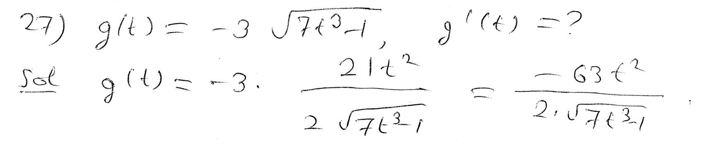
----
----

*Question.* (4.3:p227/31) Differentiate stem:[(3x^4+1)^4(x^3+4)].
++++
<figure>
    <figcaption>Solution</figcaption>
    <audio
	controls
	src="./2121-12-10.m4a">
	    Your browser does not support the
	    <code>audio</code> element.
    </audio>
</figure>
++++
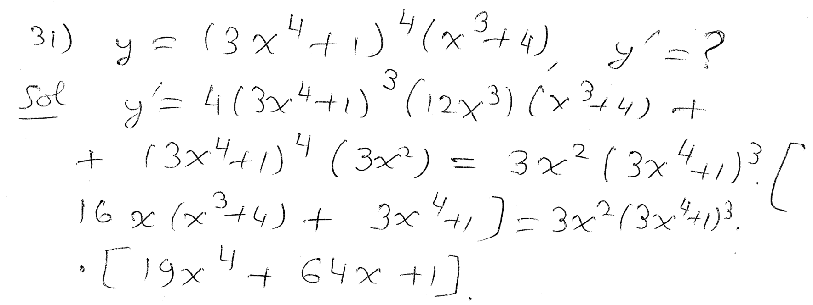
----
----

*Question.* (4.3:p227/33) Differentiate stem:[4y^2(y^2+1)^{5/4}].
++++
<figure>
    <figcaption>Solution</figcaption>
    <audio
	controls
	src="./2121-12-11.m4a">
	    Your browser does not support the
	    <code>audio</code> element.
    </audio>
</figure>
++++
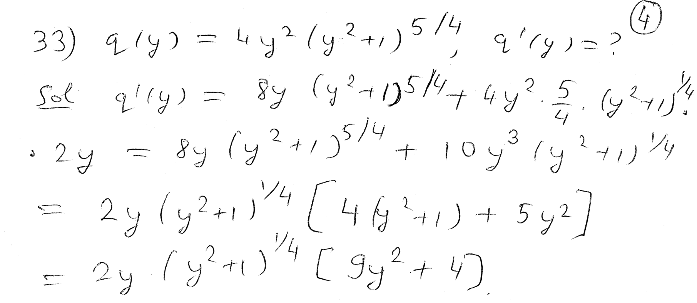
----
----

*Question.* (4.3:p227/37) Differentiate stem:[{(5t-6)^4}/{3t^2+4}].
++++
<figure>
    <figcaption>Solution</figcaption>
    <audio
	controls
	src="./2121-12-12.m4a">
	    Your browser does not support the
	    <code>audio</code> element.
    </audio>
</figure>
++++
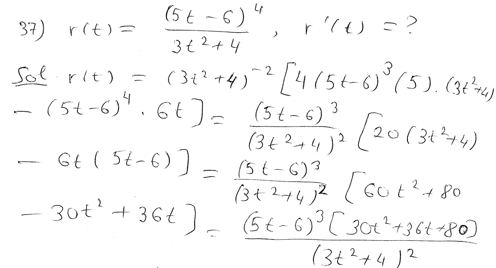
----
----

*Question.* (4.3:p227/39) Differentiate stem:[{3x^2-x}/{(2x-1)^5}].
++++
<figure>
    <figcaption>Solution</figcaption>
    <audio
	controls
	src="./2121-12-13.m4a">
	    Your browser does not support the
	    <code>audio</code> element.
    </audio>
</figure>
++++
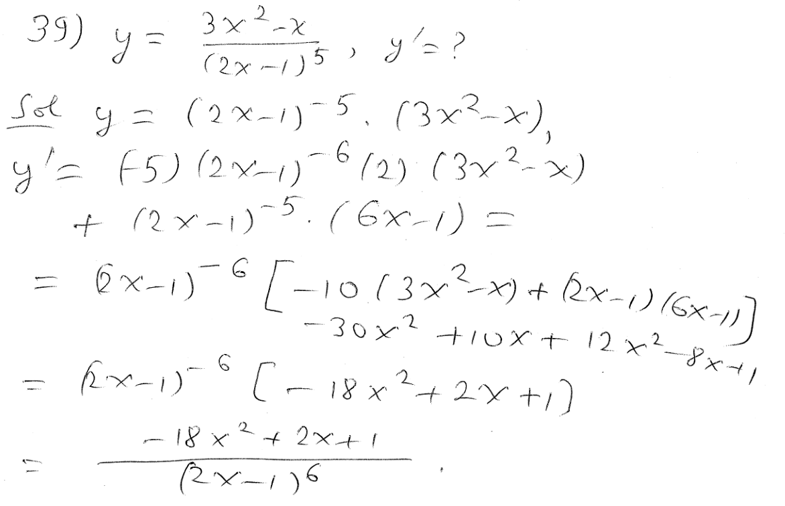
----
----

*Question.* (4.3:p227/43) Given the table below, compute stem:[D_x f(g(x))] at (a) stem:[x=1], (b) stem:[x=2].
++++
<figure>
    <figcaption>Solution</figcaption>
    <audio
	controls
	src="./2121-12-14.m4a">
	    Your browser does not support the
	    <code>audio</code> element.
    </audio>
</figure>
++++
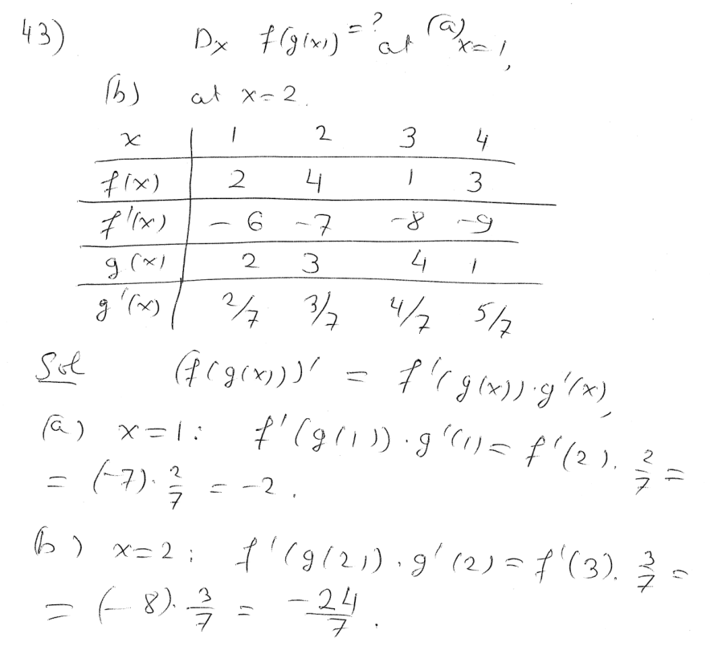
----
----

*Question.* (4.3:p227/45) Find an equation of the tangent line to the curve stem:[f(x)=sqrt{x^2+16}] at the point stem:[x_0=3].
++++
<figure>
    <figcaption>Solution</figcaption>
    <audio
	controls
	src="./2121-12-15.m4a">
	    Your browser does not support the
	    <code>audio</code> element.
    </audio>
</figure>
++++
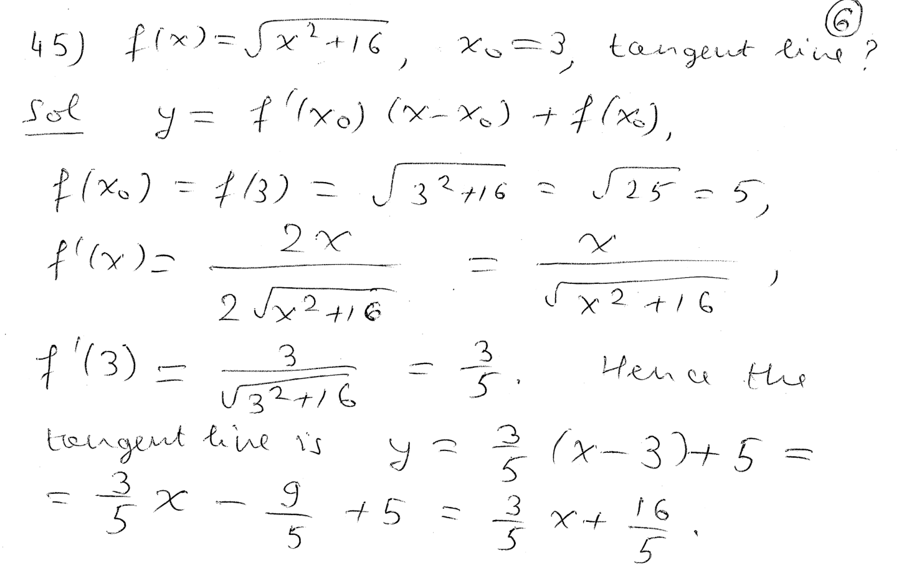
----
----

*Question.* (4.3:p227/47) Find an equation of the tangent line to the curve stem:[f(x)=x^2sqrt{x^4-12}] at the point stem:[x_0=2].
++++
<figure>
    <figcaption>Solution</figcaption>
    <audio
	controls
	src="./2121-12-16.m4a">
	    Your browser does not support the
	    <code>audio</code> element.
    </audio>
</figure>
++++
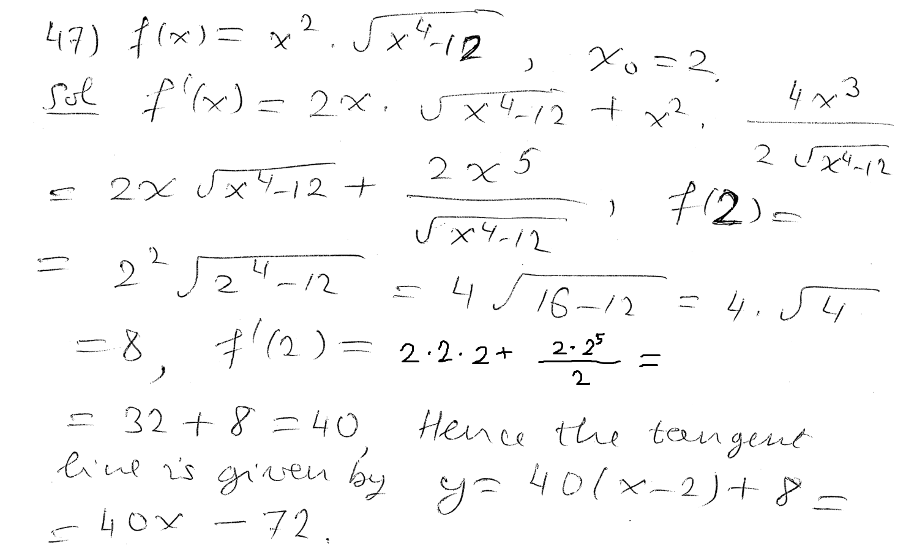
----
----

*Question.* (4.3:p227/49) Find the points stem:[x] where the function
stem:[sqrt{x^3-6x^2+9x+1}] has horizontal tangent lines.
++++
<figure>
    <figcaption>Solution</figcaption>
    <audio
	controls
	src="./2121-12-17.m4a">
	    Your browser does not support the
	    <code>audio</code> element.
    </audio>
</figure>
++++
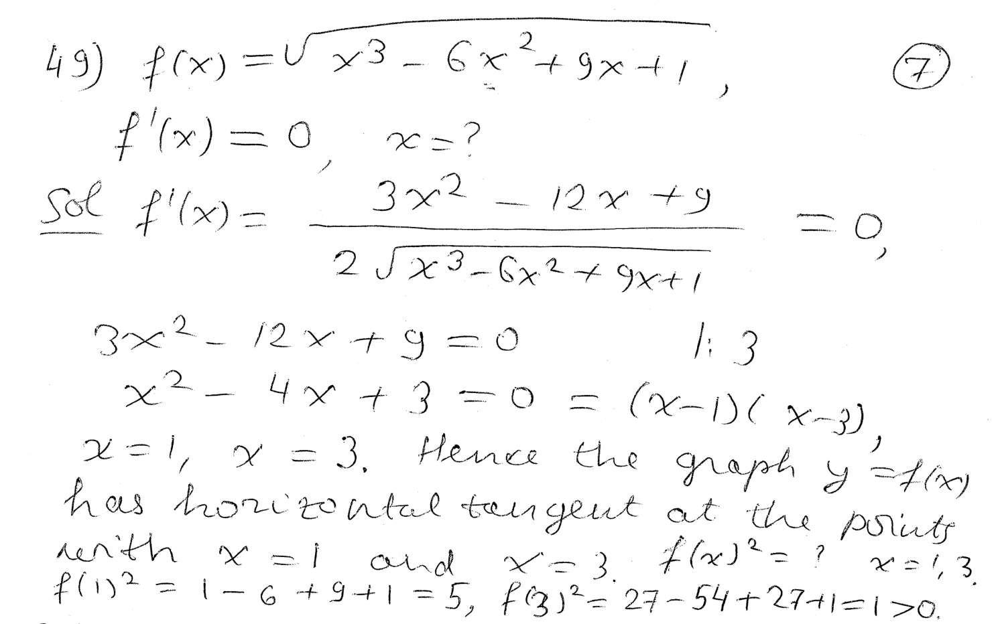
----
----

*Question.* (4.3:p227/62) The volume and surface area of a candy for any
radius is given by the formulas stem:[V(r)=4/3 pi r^3] and stem:[S(r)=4
pi r^2].  An expert estimates the radius of the candy while in a
person's mouth to be stem:[r(t)=6-3/17 t], where stem:[r(t)] is in
millimeters and stem:[t] is in minutes.

(a) What is the life expectancy of the candy?

(b) Find stem:[{dV}/dt] and stem:[{dS}/dt] when stem:[t=17] minutes.
++++
<figure>
    <figcaption>Solution</figcaption>
    <audio
	controls
	src="./2121-12-18.m4a">
	    Your browser does not support the
	    <code>audio</code> element.
    </audio>
</figure>
++++
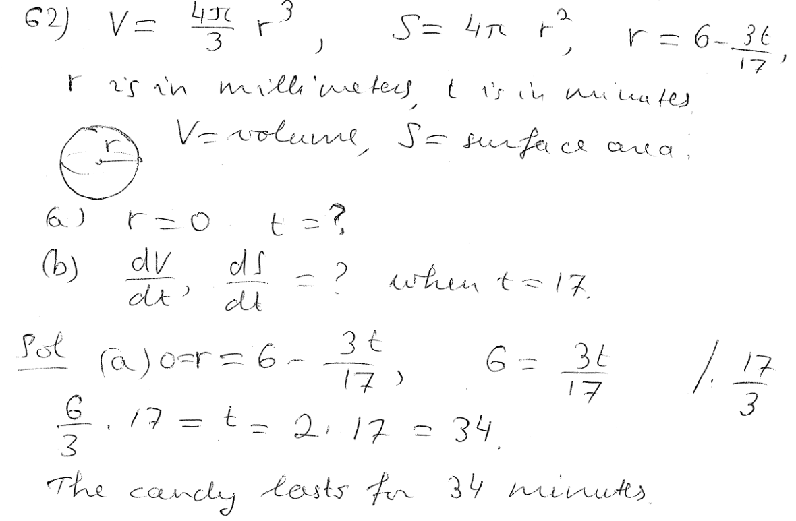
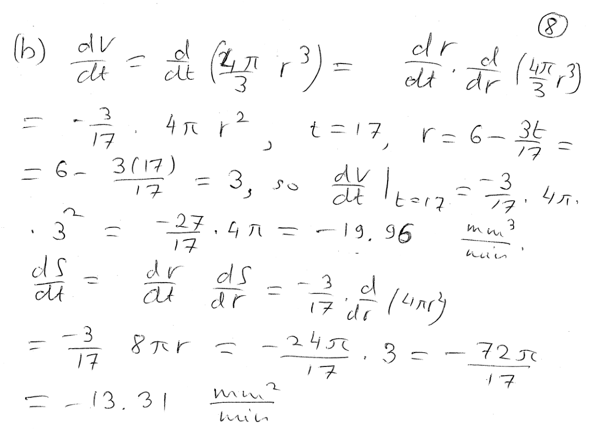
----
----

*Question.* (4.3:p227/63) A sum of $1500 is deposited in an account
with an interest rate stem:[r] percent per year, compounded daily.
At the end of 5 years, the balance in the account is given by
stem:[A=1500(1+r/36500)^{1825}].
Find the rate of change of stem:[A] with respect to stem:[r] for
(a) stem:[r=6%], (b) stem:[r=8%], (c) stem:[r=9%].
++++
<figure>
    <figcaption>Solution</figcaption>
    <audio
	controls
	src="./2121-12-19.m4a">
	    Your browser does not support the
	    <code>audio</code> element.
    </audio>
</figure>
++++
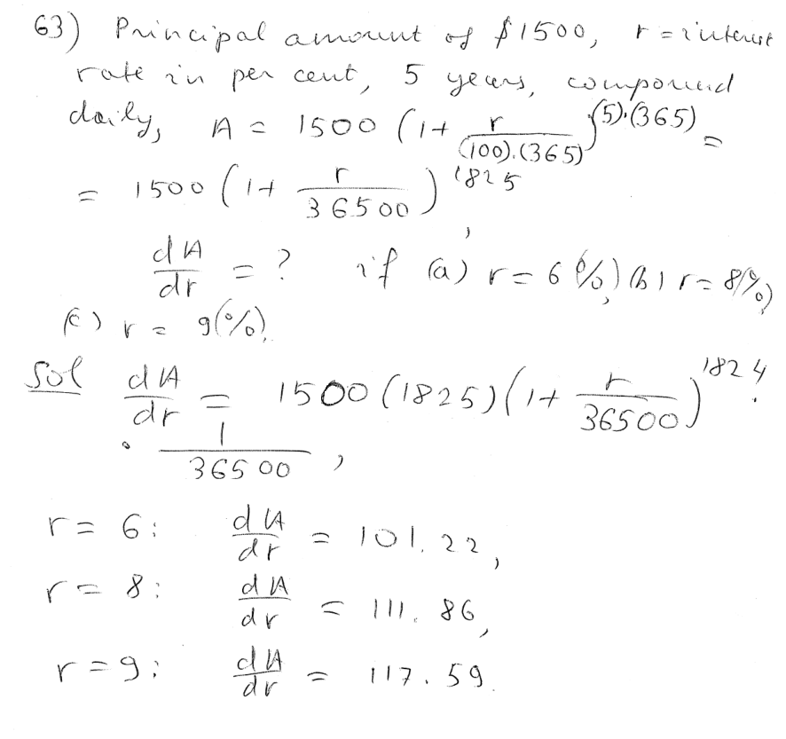
----
----

*Question.* (4.3:p227/64) A truck depreciates according to the formula
stem:[V={60000}/{1+(0.3)t+(0.1)t^2}],
where stem:[V] is the value of the truck in dollars,
stem:[t] is the time in years, and stem:[t=0] represents the time of
purchase.
Find the rate at which the value of the truck is changing at (a) stem:[t=2], (b) stem:[t=4].
++++
<figure>
    <figcaption>Solution</figcaption>
    <audio
	controls
	src="./2121-12-20.m4a">
	    Your browser does not support the
	    <code>audio</code> element.
    </audio>
</figure>
++++
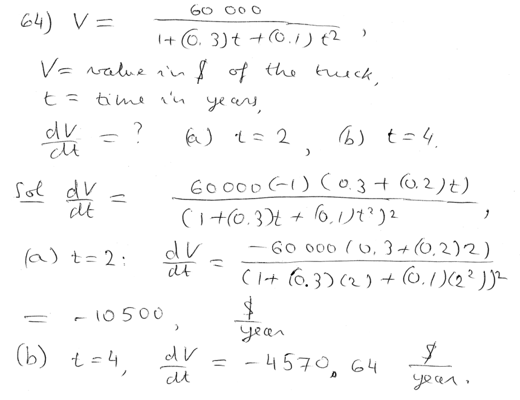
----
----

////
*Question.* () stem:[].
++++
<figure>
    <figcaption>Solution</figcaption>
    <audio
	controls
	src="./2121-12-21.m4a">
	    Your browser does not support the
	    <code>audio</code> element.
    </audio>
</figure>
++++
image::2121-12-21.PNG[Work]
----
----

*Question.* () stem:[].
++++
<figure>
    <figcaption>Solution</figcaption>
    <audio
	controls
	src="./2121-12-22.m4a">
	    Your browser does not support the
	    <code>audio</code> element.
    </audio>
</figure>
++++
image::2121-12-22.PNG[Work]
----
----

*Question.* () stem:[].
++++
<figure>
    <figcaption>Solution</figcaption>
    <audio
	controls
	src="./2121-12-23.m4a">
	    Your browser does not support the
	    <code>audio</code> element.
    </audio>
</figure>
++++
image::2121-12-23.PNG[Work]
----
----

*Question.* () stem:[].
++++
<figure>
    <figcaption>Solution</figcaption>
    <audio
	controls
	src="./2121-12-24.m4a">
	    Your browser does not support the
	    <code>audio</code> element.
    </audio>
</figure>
++++
image::2121-12-24.PNG[Work]
----
----

*Question.* () stem:[].
++++
<figure>
    <figcaption>Solution</figcaption>
    <audio
	controls
	src="./2121-12-25.m4a">
	    Your browser does not support the
	    <code>audio</code> element.
    </audio>
</figure>
++++
image::2121-12-25.PNG[Work]
----
----

*Question.* () stem:[].
++++
<figure>
    <figcaption>Solution</figcaption>
    <audio
	controls
	src="./2121-12-26.m4a">
	    Your browser does not support the
	    <code>audio</code> element.
    </audio>
</figure>
++++
image::2121-12-26.PNG[Work]
----
----

*Question.* () stem:[].
++++
<figure>
    <figcaption>Solution</figcaption>
    <audio
	controls
	src="./2121-12-27.m4a">
	    Your browser does not support the
	    <code>audio</code> element.
    </audio>
</figure>
++++
image::2121-12-27.PNG[Work]
----
----

*Question.* () stem:[].
++++
<figure>
    <figcaption>Solution</figcaption>
    <audio
	controls
	src="./2121-12-28.m4a">
	    Your browser does not support the
	    <code>audio</code> element.
    </audio>
</figure>
++++
image::2121-12-28.PNG[Work]
----
----

*Question.* () stem:[].
++++
<figure>
    <figcaption>Solution</figcaption>
    <audio
	controls
	src="./2121-12-29.m4a">
	    Your browser does not support the
	    <code>audio</code> element.
    </audio>
</figure>
++++
image::2121-12-29.PNG[Work]
----
----

*Question.* () stem:[].
++++
<figure>
    <figcaption>Solution</figcaption>
    <audio
	controls
	src="./2121-12-30.m4a">
	    Your browser does not support the
	    <code>audio</code> element.
    </audio>
</figure>
++++
image::2121-12-30.PNG[Work]
----
----

////
