= Math 2121, Calculus for the life sciences, I
:source-highlighter: coderay
:stem:

In this set of notes we work through some notions and
examples from calculus.  You can read the questions
here, study the handwritten notes, and while doing
so, listen to some explanations by clicking on the
"play" button.

== Lesson 13, The Derivative of the Exponential Function; The Derivative of the Logarithmic Function.

*Summary of the derivative of the exponential function and the derivative of the logarithmic function.*
++++
<figure>
    <figcaption></figcaption>
    <audio
	controls
	src="./2121-13-01.m4a">
	    Your browser does not support the
	    <code>audio</code> element.
    </audio>
</figure>
++++
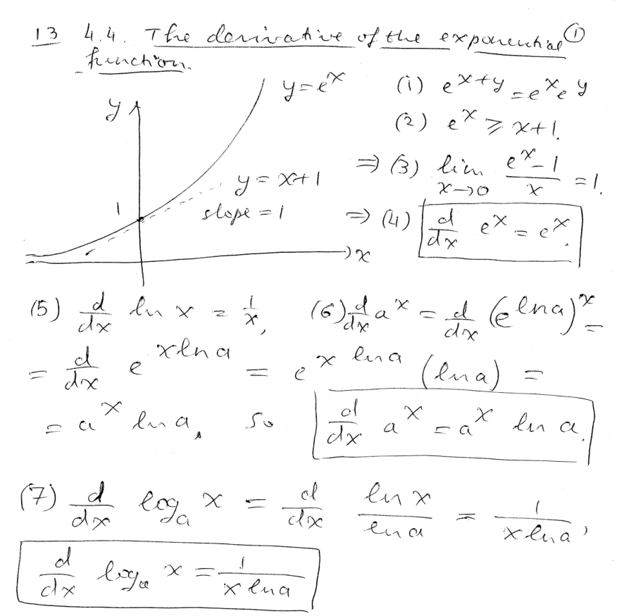
----
----

*Question.* (4.4:p235/1) Differentiate stem:[e^{4x}].
++++
<figure>
    <figcaption>Solution</figcaption>
    <audio
	controls
	src="./2121-13-02.m4a">
	    Your browser does not support the
	    <code>audio</code> element.
    </audio>
</figure>
++++
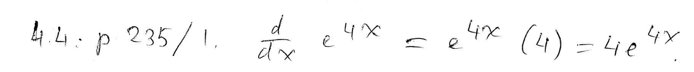
----
----

*Question.* (4.4:p235/5) Differentiate stem:[-16e^{2x+1}].
++++
<figure>
    <figcaption>Solution</figcaption>
    <audio
	controls
	src="./2121-13-03.m4a">
	    Your browser does not support the
	    <code>audio</code> element.
    </audio>
</figure>
++++
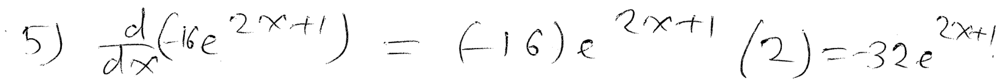
----
----

*Question.* (4.4:p235/9) Differentiate stem:[3e^{2x^2-4}].
++++
<figure>
    <figcaption>Solution</figcaption>
    <audio
	controls
	src="./2121-13-04.m4a">
	    Your browser does not support the
	    <code>audio</code> element.
    </audio>
</figure>
++++
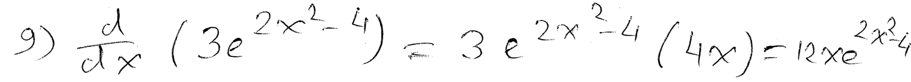
----
----

*Question.* (4.4:p235/9) Differentiate stem:[xe^x].
++++
<figure>
    <figcaption>Solution</figcaption>
    <audio
	controls
	src="./2121-13-05.m4a">
	    Your browser does not support the
	    <code>audio</code> element.
    </audio>
</figure>
++++
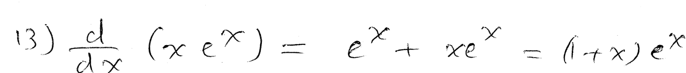
----
----

*Question.* (4.4:p235/15) Differentiate stem:[(x+3)^2e^{4x}].
++++
<figure>
    <figcaption>Solution</figcaption>
    <audio
	controls
	src="./2121-13-06.m4a">
	    Your browser does not support the
	    <code>audio</code> element.
    </audio>
</figure>
++++
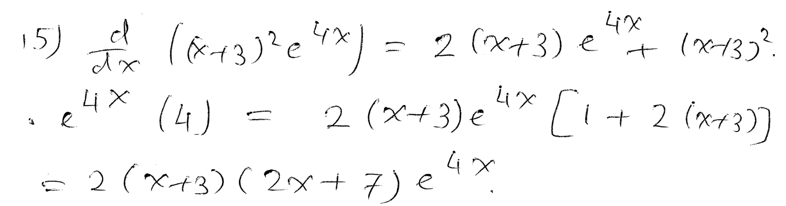
----
----

*Question.* (4.4:p235/17) Differentiate stem:[x^2/e^x].
++++
<figure>
    <figcaption>Solution</figcaption>
    <audio
	controls
	src="./2121-13-07.m4a">
	    Your browser does not support the
	    <code>audio</code> element.
    </audio>
</figure>
++++
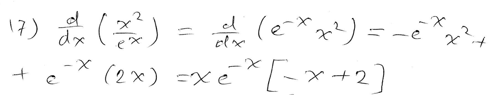
----
----

*Question.* (4.4:p235/19) Differentiate stem:[{e^x+e^{-x}}/x].
++++
<figure>
    <figcaption>Solution</figcaption>
    <audio
	controls
	src="./2121-13-08.m4a">
	    Your browser does not support the
	    <code>audio</code> element.
    </audio>
</figure>
++++
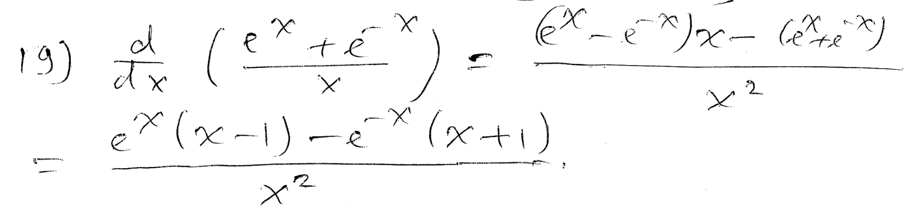
----
----

*Question.* (4.4:p235/21) Differentiate stem:[10000/{9+4e^{-0.2 t}}].
++++
<figure>
    <figcaption>Solution</figcaption>
    <audio
	controls
	src="./2121-13-09.m4a">
	    Your browser does not support the
	    <code>audio</code> element.
    </audio>
</figure>
++++
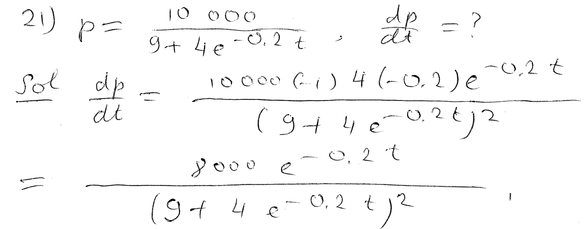
----
----

*Question.* (4.4:p235/23) Differentiate stem:[(2z+e^{-z^2})^2].
++++
<figure>
    <figcaption>Solution</figcaption>
    <audio
	controls
	src="./2121-13-10.m4a">
	    Your browser does not support the
	    <code>audio</code> element.
    </audio>
</figure>
++++
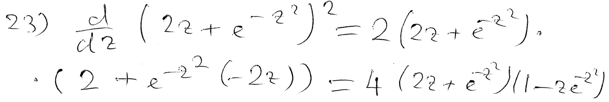
----
----

*Question.* (4.4:p235/25) Differentiate stem:[7^{3x+1}].
++++
<figure>
    <figcaption>Solution</figcaption>
    <audio
	controls
	src="./2121-13-11.m4a">
	    Your browser does not support the
	    <code>audio</code> element.
    </audio>
</figure>
++++
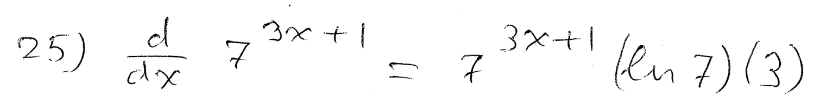
----
----

*Question.* (4.4:p235/27) Differentiate stem:[3cdot4^{x^2+2}].
++++
<figure>
    <figcaption>Solution</figcaption>
    <audio
	controls
	src="./2121-13-12.m4a">
	    Your browser does not support the
	    <code>audio</code> element.
    </audio>
</figure>
++++
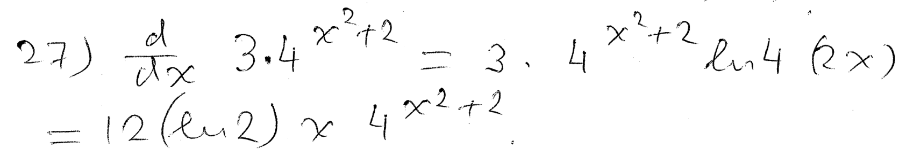
----
----

*Question.* (4.4:p235/29) Differentiate stem:[2cdot3^{sqrt{t}}].
++++
<figure>
    <figcaption>Solution</figcaption>
    <audio
	controls
	src="./2121-13-13.m4a">
	    Your browser does not support the
	    <code>audio</code> element.
    </audio>
</figure>
++++
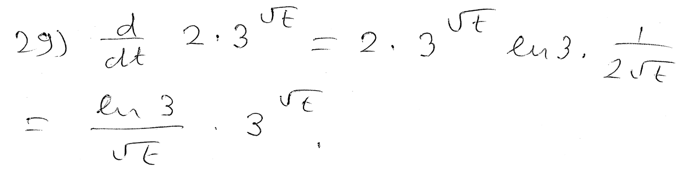
----
----

*Question.* (4.4:p235/31) Differentiate stem:[{te^t+2}/{e^{2t}+1}].
++++
<figure>
    <figcaption>Solution</figcaption>
    <audio
	controls
	src="./2121-13-14.m4a">
	    Your browser does not support the
	    <code>audio</code> element.
    </audio>
</figure>
++++
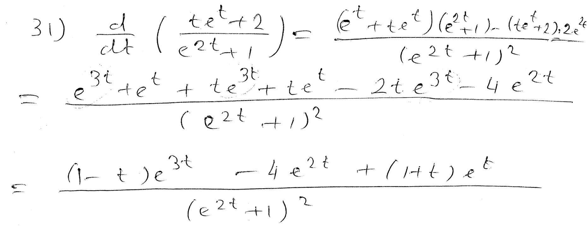
----
----

*The relative growth rate; the logarithmic derivative.*
++++
<figure>
    <figcaption></figcaption>
    <audio
	controls
	src="./2121-13-15.m4a">
	    Your browser does not support the
	    <code>audio</code> element.
    </audio>
</figure>
++++
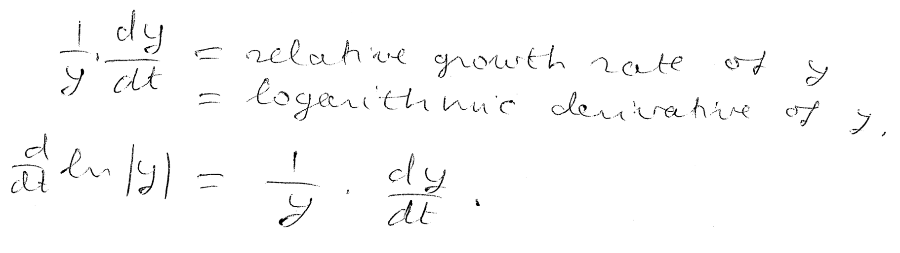
----
----

*The relative growth rate of an exponential growth model is constant.*
++++
<figure>
    <figcaption></figcaption>
    <audio
	controls
	src="./2121-13-16.m4a">
	    Your browser does not support the
	    <code>audio</code> element.
    </audio>
</figure>
++++
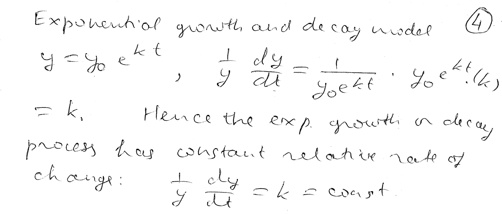
----
----

*The logistic growth model.*
++++
<figure>
    <figcaption>Solution</figcaption>
    <audio
	controls
	src="./2121-13-17.m4a">
	    Your browser does not support the
	    <code>audio</code> element.
    </audio>
</figure>
++++
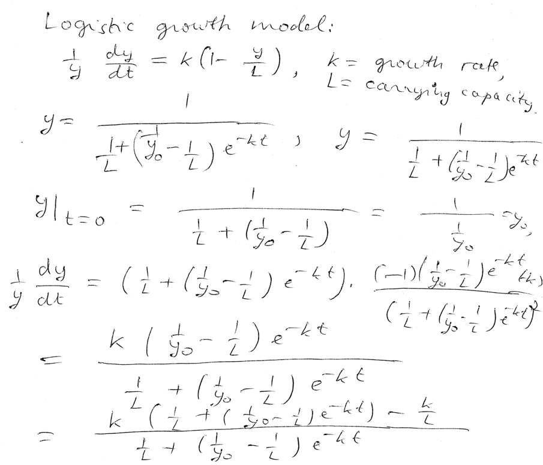
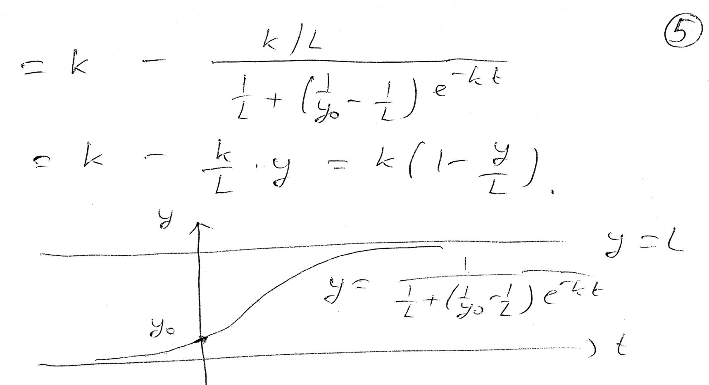
----
----

*Question.* (4.4:p235/31) Suppose that the world population
is approximated by
stem:[A(t)=3100 e^{(0.0166)t}],
where stem:[t] is the number of years since 1960.
Find the instantaneous rate of change in the world population
in year (a) 2010, (b) 2015.
++++
<figure>
    <figcaption>Solution</figcaption>
    <audio
	controls
	src="./2121-13-18.m4a">
	    Your browser does not support the
	    <code>audio</code> element.
    </audio>
</figure>
++++
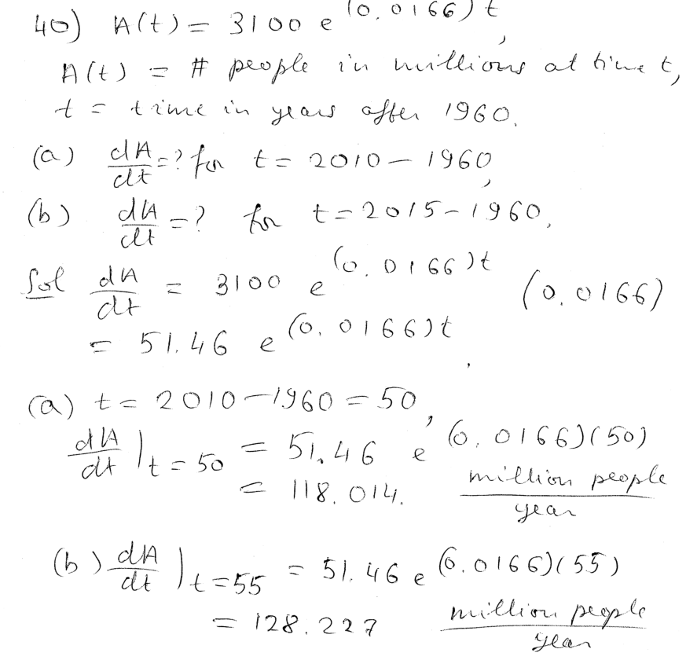
----
----

*The derivative of the logarithmic function.*
++++
<figure>
    <figcaption></figcaption>
    <audio
	controls
	src="./2121-13-19.m4a">
	    Your browser does not support the
	    <code>audio</code> element.
    </audio>
</figure>
++++
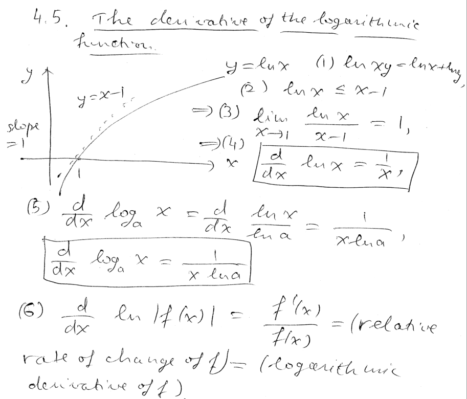
----
----

*The rule for differentiating a logarithm follows from the rule for differentiating an exponential function.*
++++
<figure>
    <figcaption></figcaption>
    <audio
	controls
	src="./2121-13-20.m4a">
	    Your browser does not support the
	    <code>audio</code> element.
    </audio>
</figure>
++++
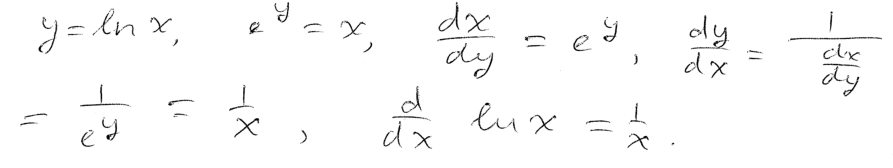
----
----

*Question.* (4.5:p244/1) Differentiate stem:[ln 8x].
++++
<figure>
    <figcaption>Solution</figcaption>
    <audio
	controls
	src="./2121-13-21.m4a">
	    Your browser does not support the
	    <code>audio</code> element.
    </audio>
</figure>
++++
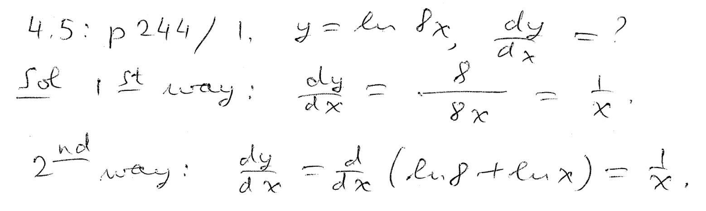
----
----

*Question.* (4.5:p244/5) Differentiate stem:[ln|4x^2-9x|].
++++
<figure>
    <figcaption>Solution</figcaption>
    <audio
	controls
	src="./2121-13-22.m4a">
	    Your browser does not support the
	    <code>audio</code> element.
    </audio>
</figure>
++++
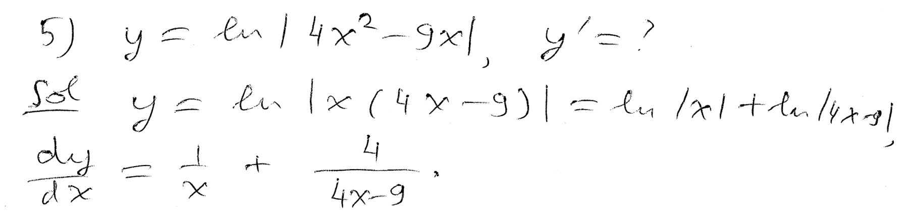
----
----

*Question.* (4.5:p244/9) Differentiate stem:[ln(x^4+5x^2)^{3/2}].
++++
<figure>
    <figcaption>Solution</figcaption>
    <audio
	controls
	src="./2121-13-23.m4a">
	    Your browser does not support the
	    <code>audio</code> element.
    </audio>
</figure>
++++
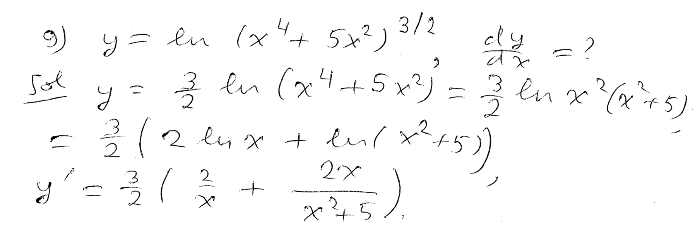
----
----

*Question.* (4.5:p244/13) Differentiate stem:[t^2 ln |t|].
++++
<figure>
    <figcaption>Solution</figcaption>
    <audio
	controls
	src="./2121-13-24.m4a">
	    Your browser does not support the
	    <code>audio</code> element.
    </audio>
</figure>
++++
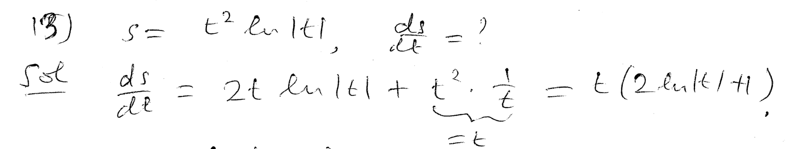
----
----

*Question.* (4.5:p244/15) Differentiate stem:[2cdot ln(x+3)/x^2].
++++
<figure>
    <figcaption>Solution</figcaption>
    <audio
	controls
	src="./2121-13-25.m4a">
	    Your browser does not support the
	    <code>audio</code> element.
    </audio>
</figure>
++++
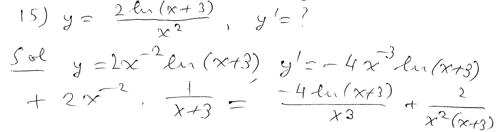
----
----

*Question.* (4.5:p244/19) Differentiate stem:[{3x^2}/{ln x}].
++++
<figure>
    <figcaption>Solution</figcaption>
    <audio
	controls
	src="./2121-13-26.m4a">
	    Your browser does not support the
	    <code>audio</code> element.
    </audio>
</figure>
++++
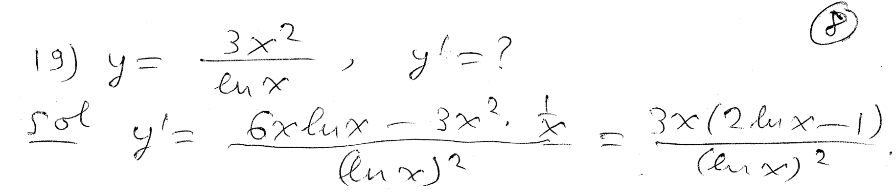
----
----

*Question.* (4.5:p244/21) Differentiate stem:[(ln|x+1|)^4].
++++
<figure>
    <figcaption>Solution</figcaption>
    <audio
	controls
	src="./2121-13-27.m4a">
	    Your browser does not support the
	    <code>audio</code> element.
    </audio>
</figure>
++++
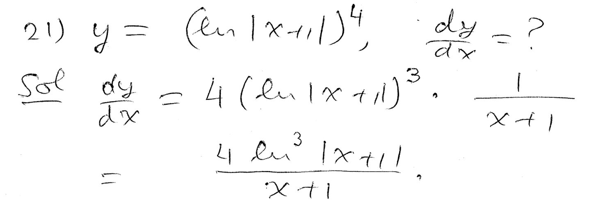
----
----

*Question.* (4.5:p244/23) Differentiate stem:[ln|ln x|].
++++
<figure>
    <figcaption>Solution</figcaption>
    <audio
	controls
	src="./2121-13-28.m4a">
	    Your browser does not support the
	    <code>audio</code> element.
    </audio>
</figure>
++++
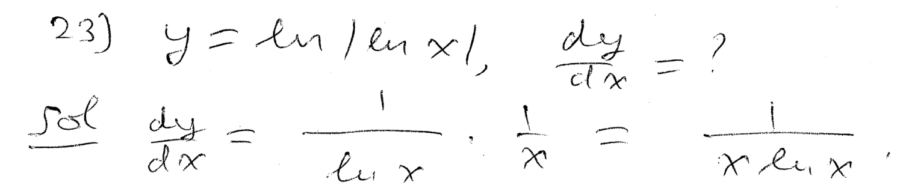
----
----

*Question.* (4.5:p244/25) Differentiate stem:[e^{x^2}ln x].
++++
<figure>
    <figcaption>Solution</figcaption>
    <audio
	controls
	src="./2121-13-29.m4a">
	    Your browser does not support the
	    <code>audio</code> element.
    </audio>
</figure>
++++
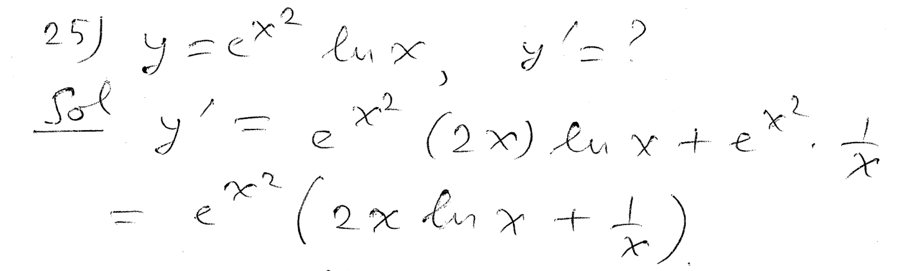
----
----

*Question.* (4.5:p244/30) Differentiate stem:[{e^x}/{ln x}].
++++
<figure>
    <figcaption>Solution</figcaption>
    <audio
	controls
	src="./2121-13-30.m4a">
	    Your browser does not support the
	    <code>audio</code> element.
    </audio>
</figure>
++++
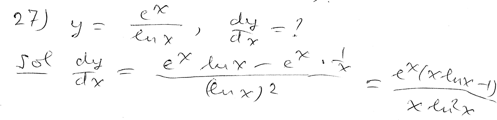
----
----

