= Math 2121, Calculus for the life sciences, I
:source-highlighter: coderay
:stem:

In this set of notes we work through some notions and
examples from calculus.  You can read the questions
here, study the handwritten notes, and while doing
so, listen to some explanations by clicking on the
"play" button.

== Lesson 14, The Derivative of the Logarithmic Function (continued); The Derivatives of Trigonometric Functions.

*Question.* (4.5:p244/29) Differentiate stem:[(e^{2z}+ln z)^3].
++++
<figure>
    <figcaption>Solution</figcaption>
    <audio
	controls
	src="./2121-14-01.m4a">
	    Your browser does not support the
	    <code>audio</code> element.
    </audio>
</figure>
++++
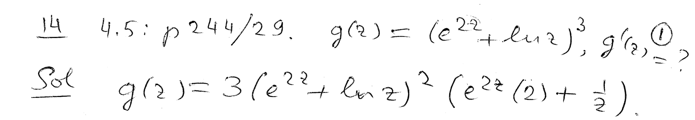
----
----

*Question.* (4.5:p244/31) Differentiate stem:[log(6x)].
++++
<figure>
    <figcaption>Solution</figcaption>
    <audio
	controls
	src="./2121-14-02.m4a">
	    Your browser does not support the
	    <code>audio</code> element.
    </audio>
</figure>
++++
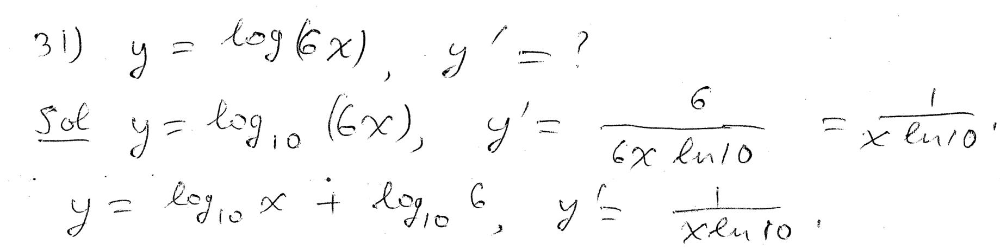
----
----

*Question.* (4.5:p244/35) Differentiate stem:[log_5 sqrt{5x+2}].
++++
<figure>
    <figcaption>Solution</figcaption>
    <audio
	controls
	src="./2121-14-03.m4a">
	    Your browser does not support the
	    <code>audio</code> element.
    </audio>
</figure>
++++
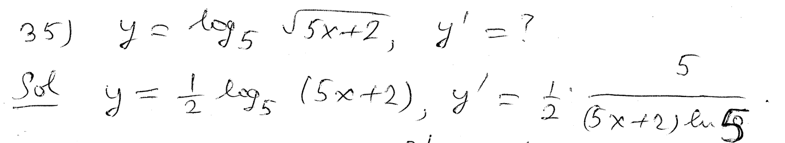
----
----

*Question.* (4.5:p244/37) Differentiate stem:[log_3(x^2+2x)^{3/2}].
++++
<figure>
    <figcaption>Solution</figcaption>
    <audio
	controls
	src="./2121-14-04.m4a">
	    Your browser does not support the
	    <code>audio</code> element.
    </audio>
</figure>
++++
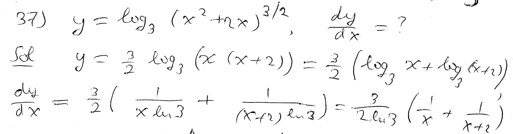
----
----

*Question.* (4.5:p244/39) Differentiate stem:[log_8 (2^p-1)].
++++
<figure>
    <figcaption>Solution</figcaption>
    <audio
	controls
	src="./2121-14-05.m4a">
	    Your browser does not support the
	    <code>audio</code> element.
    </audio>
</figure>
++++
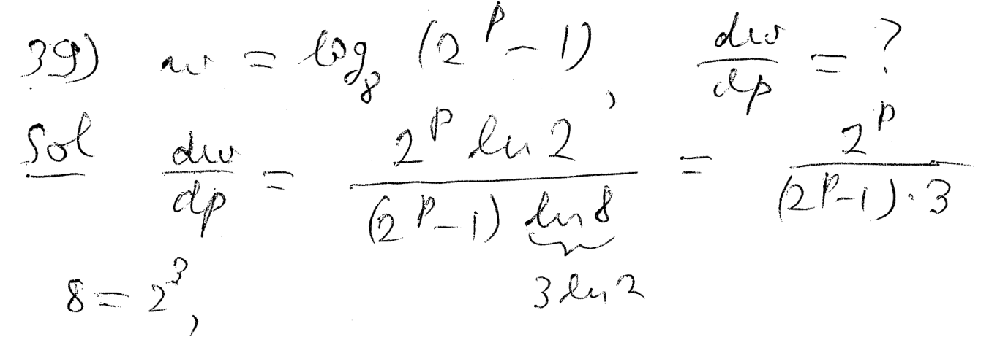
----
----

*Question.* (4.5:p244/39) Differentiate stem:[e^{sqrt{x}}ln(sqrt{x}+5)].
++++
<figure>
    <figcaption>Solution</figcaption>
    <audio
	controls
	src="./2121-14-06.m4a">
	    Your browser does not support the
	    <code>audio</code> element.
    </audio>
</figure>
++++
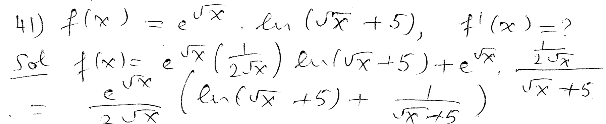
----
----

*Question.* (4.5:p244/43) Differentiate stem:[{ln(t^2+1)+t}/{ln(t^2+1)+1}].
++++
<figure>
    <figcaption>Solution</figcaption>
    <audio
	controls
	src="./2121-14-07.m4a">
	    Your browser does not support the
	    <code>audio</code> element.
    </audio>
</figure>
++++
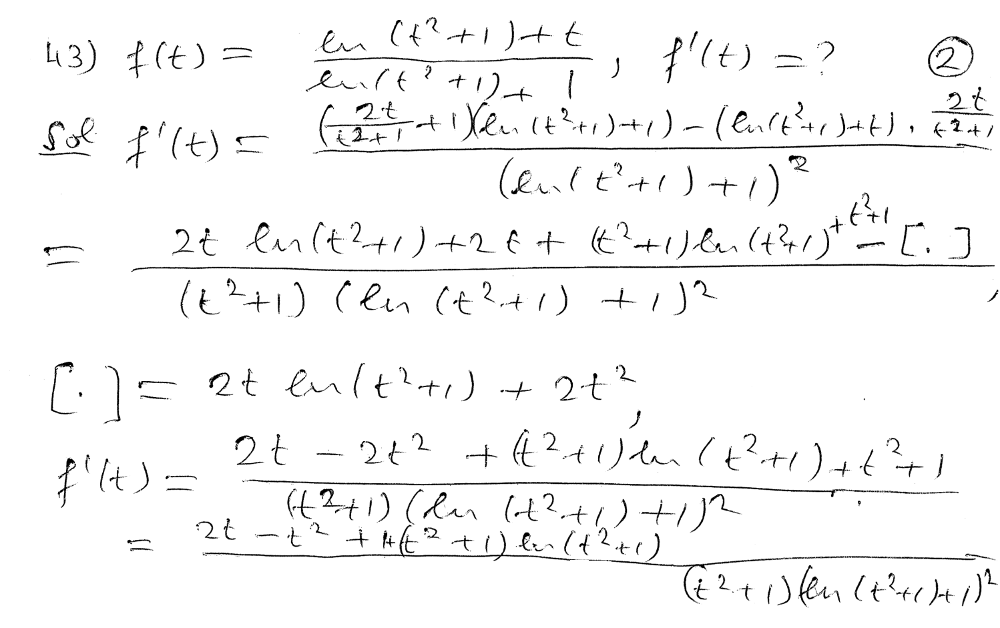
----
----

*Question.* (4.5:p244/54) Differentiate stem:[x^x].
++++
<figure>
    <figcaption>Solution</figcaption>
    <audio
	controls
	src="./2121-14-08.m4a">
	    Your browser does not support the
	    <code>audio</code> element.
    </audio>
</figure>
++++
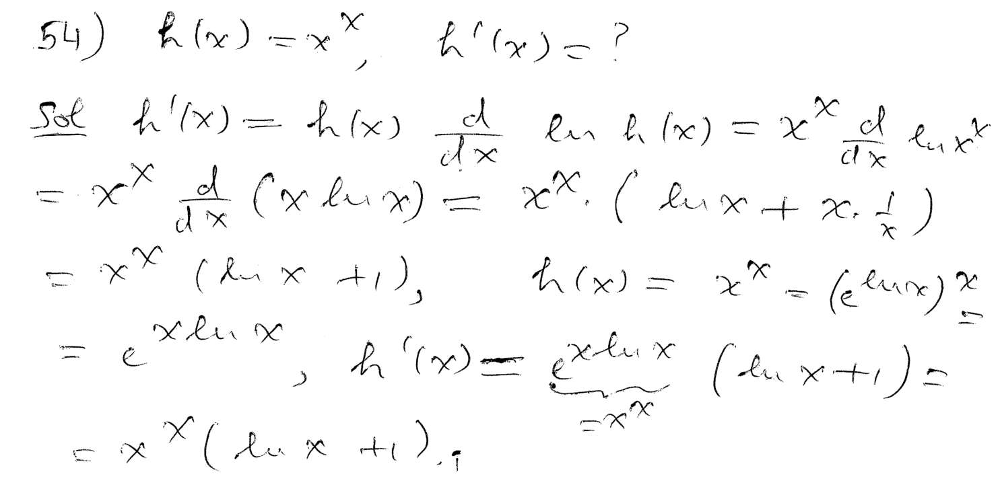
----
----

*Question.* (4.5:p244/55) Differentiate stem:[(x^2+1)^{5x}].
++++
<figure>
    <figcaption>Solution</figcaption>
    <audio
	controls
	src="./2121-14-09.m4a">
	    Your browser does not support the
	    <code>audio</code> element.
    </audio>
</figure>
++++
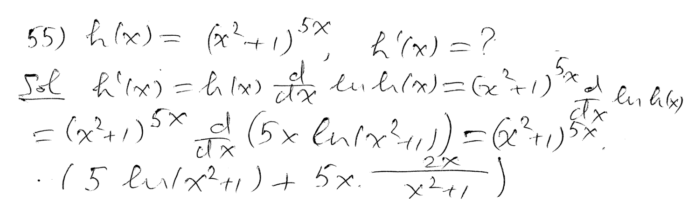
----
----

*Question.* (4.5:p244/58) Suppose that the population size of
some ants is given by
stem:[P(t)=(t+100)ln(t+2)],
where stem:[t] is the time in days.
Find the rate of change of the population on the second day and
on the eighth day.
++++
<figure>
    <figcaption>Solution</figcaption>
    <audio
	controls
	src="./2121-14-10.m4a">
	    Your browser does not support the
	    <code>audio</code> element.
    </audio>
</figure>
++++
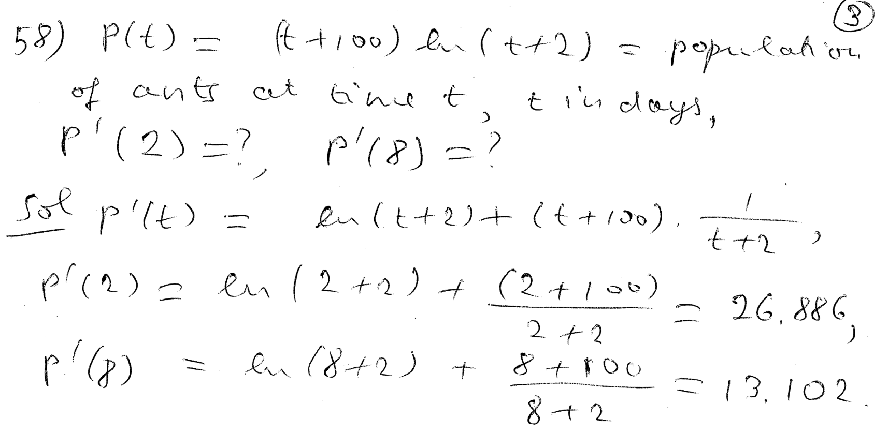
----
----

*The addition formulas for sine and cosine.*
++++
<figure>
    <figcaption></figcaption>
    <audio
	controls
	src="./2121-14-11.m4a">
	    Your browser does not support the
	    <code>audio</code> element.
    </audio>
</figure>
++++
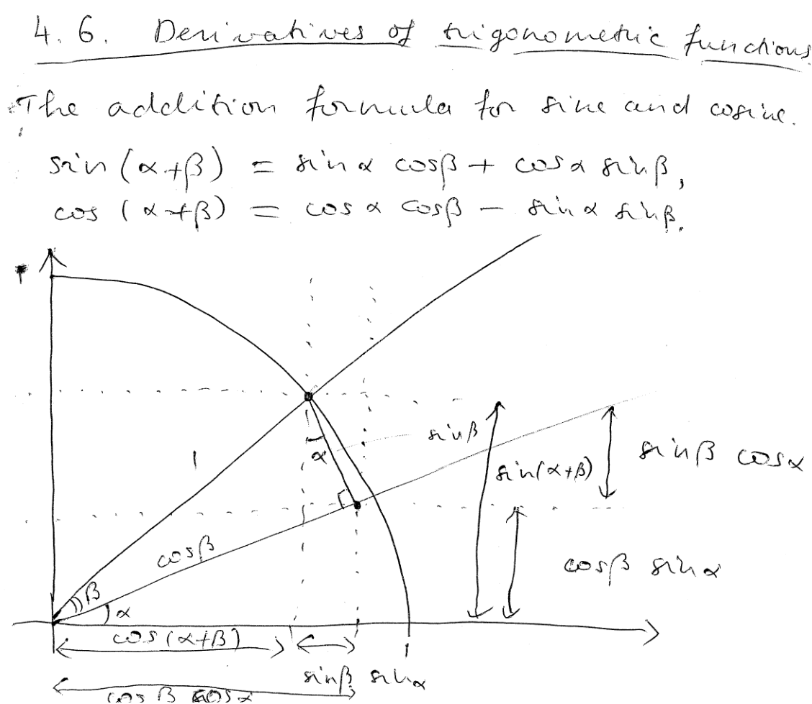
----
----

*An important trigonometric limit: stem:[lim_{theta to 0} {sin theta}/theta=1], i.e., the sine of a small arc of the unit circle is asymptotically equal to the length of the small arc.*
++++
<figure>
    <figcaption></figcaption>
    <audio
	controls
	src="./2121-14-12.m4a">
	    Your browser does not support the
	    <code>audio</code> element.
    </audio>
</figure>
++++
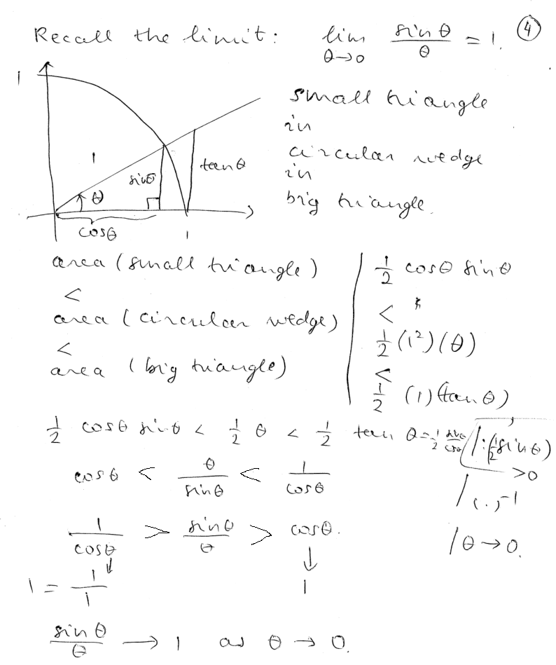
----
----

*Two other trigonometric limits as a consequence of the above limit.*
++++
<figure>
    <figcaption></figcaption>
    <audio
	controls
	src="./2121-14-13.m4a">
	    Your browser does not support the
	    <code>audio</code> element.
    </audio>
</figure>
++++
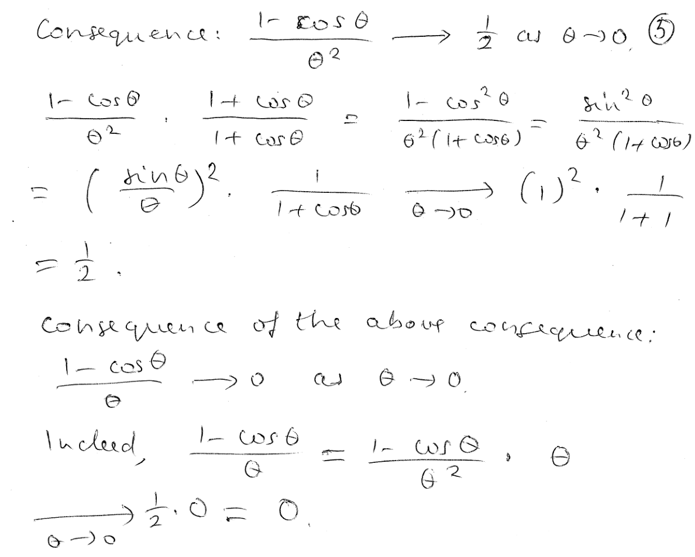
----
----

*The derivatives of sine and cosine.*
++++
<figure>
    <figcaption></figcaption>
    <audio
	controls
	src="./2121-14-14.m4a">
	    Your browser does not support the
	    <code>audio</code> element.
    </audio>
</figure>
++++
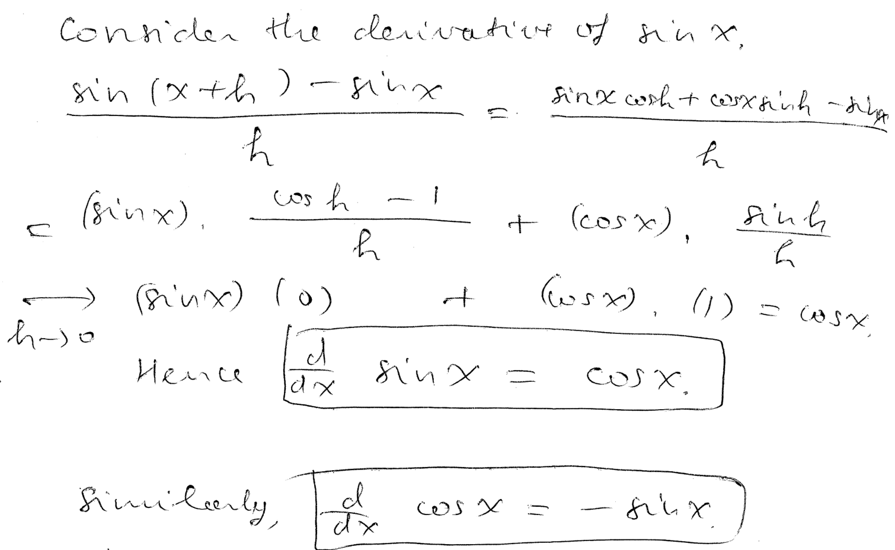
----
----

*The derivatives of tangent and cotangent.*
++++
<figure>
    <figcaption></figcaption>
    <audio
	controls
	src="./2121-14-15.m4a">
	    Your browser does not support the
	    <code>audio</code> element.
    </audio>
</figure>
++++
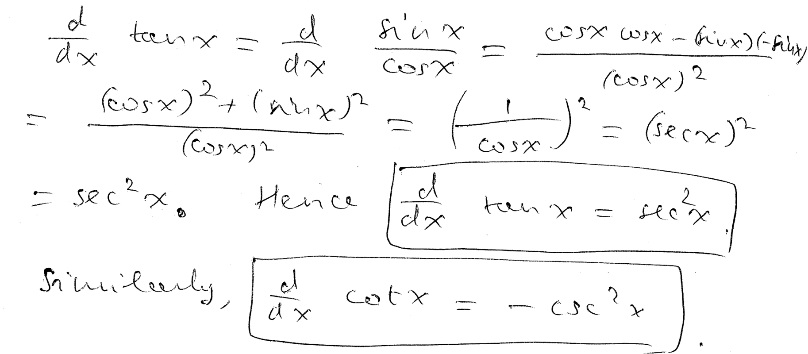
----
----

*The derivatives of secant and cosecant.*
++++
<figure>
    <figcaption></figcaption>
    <audio
	controls
	src="./2121-14-16.m4a">
	    Your browser does not support the
	    <code>audio</code> element.
    </audio>
</figure>
++++
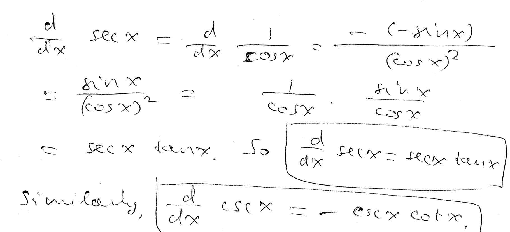
----
----

*The higher derivatives of sine and cosine repeat after 4 steps.*
++++
<figure>
    <figcaption></figcaption>
    <audio
	controls
	src="./2121-14-17.m4a">
	    Your browser does not support the
	    <code>audio</code> element.
    </audio>
</figure>
++++
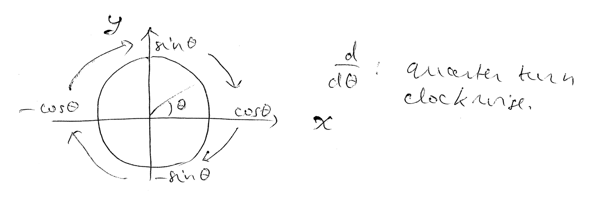
----
----

*Question.* (4.6:p253/1) Differentiate stem:[1/2 sin 8x].
++++
<figure>
    <figcaption>Solution</figcaption>
    <audio
	controls
	src="./2121-14-18.m4a">
	    Your browser does not support the
	    <code>audio</code> element.
    </audio>
</figure>
++++
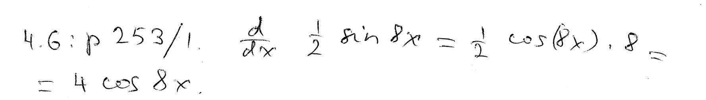
----
----

*Question.* (4.6:p253/3) Differentiate stem:[12 tan(9x+1)].
++++
<figure>
    <figcaption>Solution</figcaption>
    <audio
	controls
	src="./2121-14-19.m4a">
	    Your browser does not support the
	    <code>audio</code> element.
    </audio>
</figure>
++++
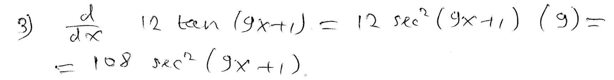
----
----

*Question.* (4.6:p253/5) Differentiate stem:[cos^4 x].
++++
<figure>
    <figcaption>Solution</figcaption>
    <audio
	controls
	src="./2121-14-20.m4a">
	    Your browser does not support the
	    <code>audio</code> element.
    </audio>
</figure>
++++
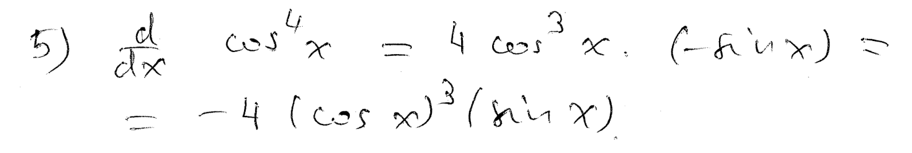
----
----

*Question.* (4.6:p253/7) Differentiate stem:[tan^8 x].
++++
<figure>
    <figcaption>Solution</figcaption>
    <audio
	controls
	src="./2121-14-21.m4a">
	    Your browser does not support the
	    <code>audio</code> element.
    </audio>
</figure>
++++
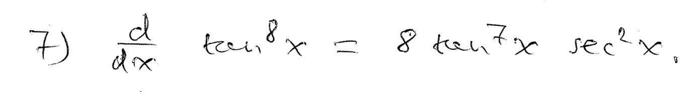
----
----

*Question.* (4.6:p253/9) Differentiate stem:[-6x sin 2x].
++++
<figure>
    <figcaption>Solution</figcaption>
    <audio
	controls
	src="./2121-14-22.m4a">
	    Your browser does not support the
	    <code>audio</code> element.
    </audio>
</figure>
++++
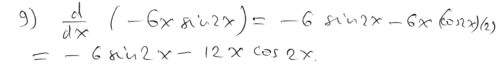
----
----

*General rule for differentiating a power with variable base and
variable exponent.*
++++
<figure>
    <figcaption></figcaption>
    <audio
	controls
	src="./2121-14-23.m4a">
	    Your browser does not support the
	    <code>audio</code> element.
    </audio>
</figure>
++++
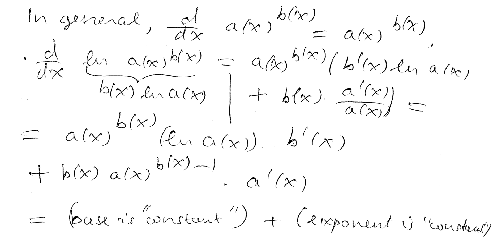
----
----

////
*Question.* () stem:[].
++++
<figure>
    <figcaption>Solution</figcaption>
    <audio
	controls
	src="./2121-14-24.m4a">
	    Your browser does not support the
	    <code>audio</code> element.
    </audio>
</figure>
++++
image::2121-14-24.PNG[Work]
----
----

*Question.* () stem:[].
++++
<figure>
    <figcaption>Solution</figcaption>
    <audio
	controls
	src="./2121-14-25.m4a">
	    Your browser does not support the
	    <code>audio</code> element.
    </audio>
</figure>
++++
image::2121-14-25.PNG[Work]
----
----

*Question.* () stem:[].
++++
<figure>
    <figcaption>Solution</figcaption>
    <audio
	controls
	src="./2121-14-26.m4a">
	    Your browser does not support the
	    <code>audio</code> element.
    </audio>
</figure>
++++
image::2121-14-26.PNG[Work]
----
----

*Question.* () stem:[].
++++
<figure>
    <figcaption>Solution</figcaption>
    <audio
	controls
	src="./2121-14-27.m4a">
	    Your browser does not support the
	    <code>audio</code> element.
    </audio>
</figure>
++++
image::2121-14-27.PNG[Work]
----
----

*Question.* () stem:[].
++++
<figure>
    <figcaption>Solution</figcaption>
    <audio
	controls
	src="./2121-14-28.m4a">
	    Your browser does not support the
	    <code>audio</code> element.
    </audio>
</figure>
++++
image::2121-14-28.PNG[Work]
----
----

*Question.* () stem:[].
++++
<figure>
    <figcaption>Solution</figcaption>
    <audio
	controls
	src="./2121-14-29.m4a">
	    Your browser does not support the
	    <code>audio</code> element.
    </audio>
</figure>
++++
image::2121-14-29.PNG[Work]
----
----

*Question.* () stem:[].
++++
<figure>
    <figcaption>Solution</figcaption>
    <audio
	controls
	src="./2121-14-30.m4a">
	    Your browser does not support the
	    <code>audio</code> element.
    </audio>
</figure>
++++
image::2121-14-30.PNG[Work]
----
----

////
