= Math 2121, Calculus for the life sciences, I
:source-highlighter: coderay
:stem:

In this set of notes we work through some notions and
examples from calculus.  You can read the questions
here, study the handwritten notes, and while doing
so, listen to some explanations by clicking on the
"play" button.

== Lesson 15, The Derivatives of Trigonometric Functions (continued); Increasing and Decreasing Functions.

*Question.* (4.6:p253/11) Differentiate stem:[{csc x}/x].
++++
<figure>
    <figcaption>Solution</figcaption>
    <audio
	controls
	src="./2121-15-01.m4a">
	    Your browser does not support the
	    <code>audio</code> element.
    </audio>
</figure>
++++
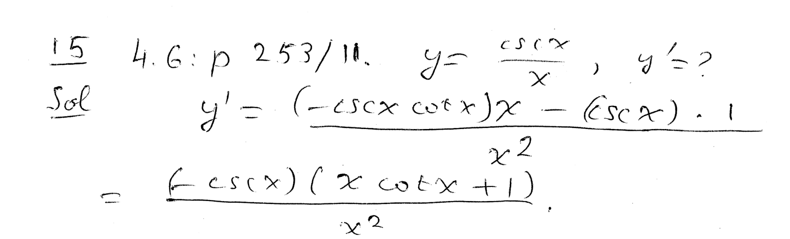
----
----

*Question.* (4.6:p253/13) Differentiate stem:[sin e^{4x}].
++++
<figure>
    <figcaption>Solution</figcaption>
    <audio
	controls
	src="./2121-15-02.m4a">
	    Your browser does not support the
	    <code>audio</code> element.
    </audio>
</figure>
++++
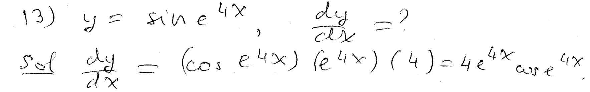
----
----

*Question.* (4.6:p253/15) Differentiate stem:[e^{cos x}].
++++
<figure>
    <figcaption>Solution</figcaption>
    <audio
	controls
	src="./2121-15-03.m4a">
	    Your browser does not support the
	    <code>audio</code> element.
    </audio>
</figure>
++++
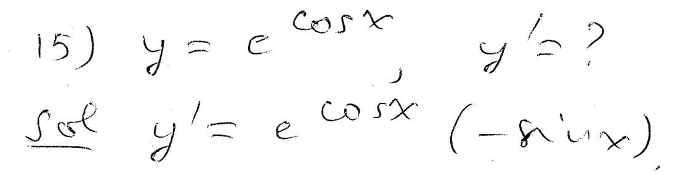
----
----

*Question.* (4.6:p253/17) Differentiate stem:[sin ln 3x^4].
++++
<figure>
    <figcaption>Solution</figcaption>
    <audio
	controls
	src="./2121-15-04.m4a">
	    Your browser does not support the
	    <code>audio</code> element.
    </audio>
</figure>
++++
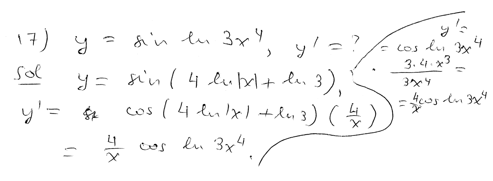
----
----

*Question.* (4.6:p253/19) Differentiate stem:[ln |sin x^2|].
++++
<figure>
    <figcaption>Solution</figcaption>
    <audio
	controls
	src="./2121-15-05.m4a">
	    Your browser does not support the
	    <code>audio</code> element.
    </audio>
</figure>
++++
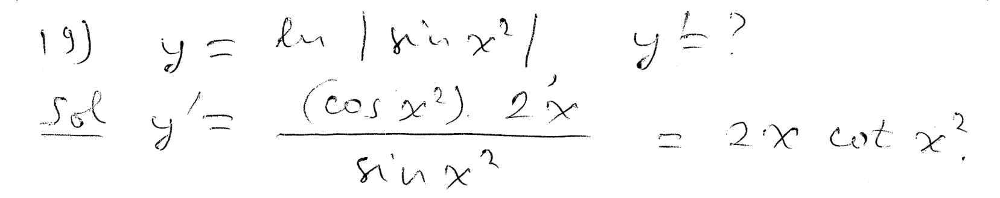
----
----

*Question.* (4.6:p253/21) Differentiate stem:[{2sin x}/{3-2sin x}].
++++
<figure>
    <figcaption>Solution</figcaption>
    <audio
	controls
	src="./2121-15-06.m4a">
	    Your browser does not support the
	    <code>audio</code> element.
    </audio>
</figure>
++++
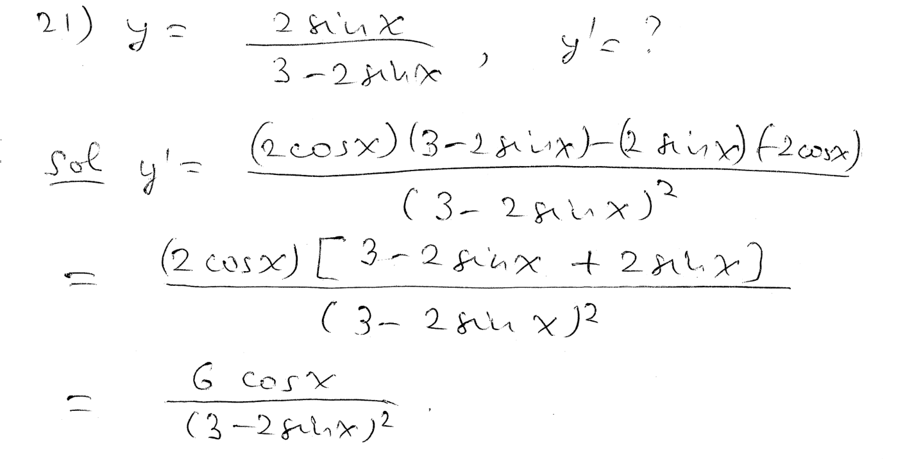
----
----

*Question.* (4.6:p253/23) Differentiate stem:[sqrt{{sin x}/{sin 3x}}].
++++
<figure>
    <figcaption>Solution</figcaption>
    <audio
	controls
	src="./2121-15-07.m4a">
	    Your browser does not support the
	    <code>audio</code> element.
    </audio>
</figure>
++++
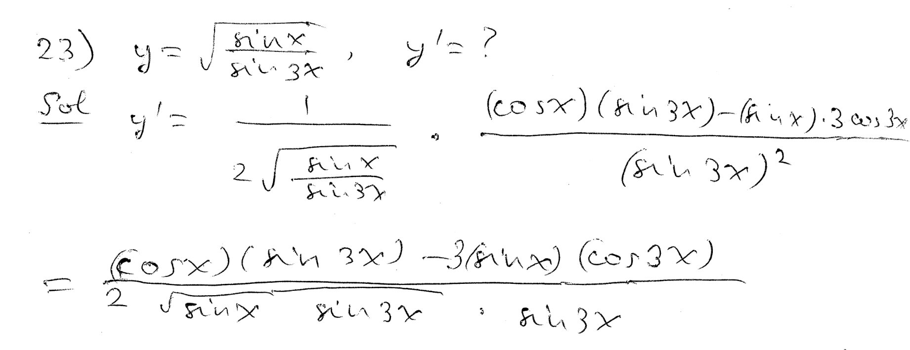
----
----

*Question.* (4.6:p253/25) Differentiate stem:[3 tan(x/4) + 4 cot 2x - 5 csc x + e^{-2x}].
++++
<figure>
    <figcaption>Solution</figcaption>
    <audio
	controls
	src="./2121-15-08.m4a">
	    Your browser does not support the
	    <code>audio</code> element.
    </audio>
</figure>
++++
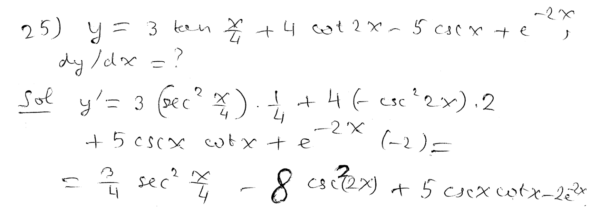
----
----

*Question.* (4.6:p253/29) Differentiate stem:[cos x] at the point stem:[x=-{5pi}/6].
++++
<figure>
    <figcaption>Solution</figcaption>
    <audio
	controls
	src="./2121-15-09.m4a">
	    Your browser does not support the
	    <code>audio</code> element.
    </audio>
</figure>
++++
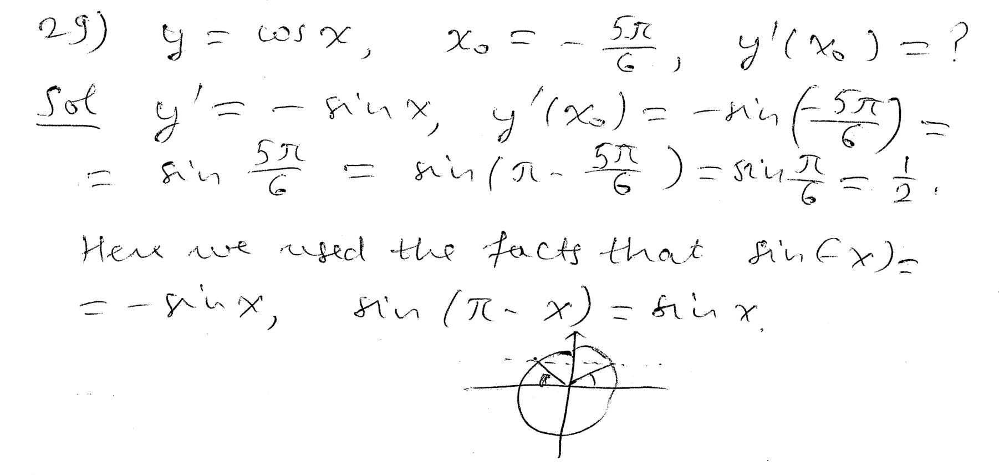
----
----

*Increasing function.*
++++
<figure>
    <figcaption></figcaption>
    <audio
	controls
	src="./2121-15-10.m4a">
	    Your browser does not support the
	    <code>audio</code> element.
    </audio>
</figure>
++++
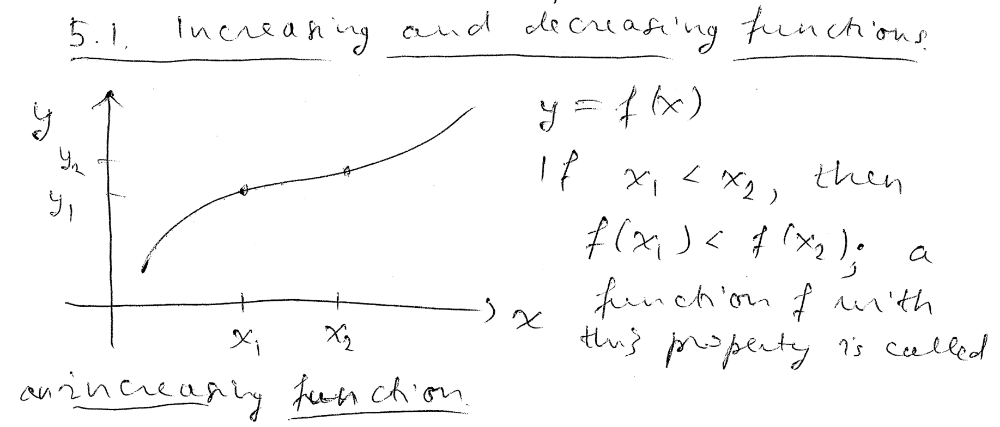
----
----

*Decreasing function.*
++++
<figure>
    <figcaption></figcaption>
    <audio
	controls
	src="./2121-15-11.m4a">
	    Your browser does not support the
	    <code>audio</code> element.
    </audio>
</figure>
++++
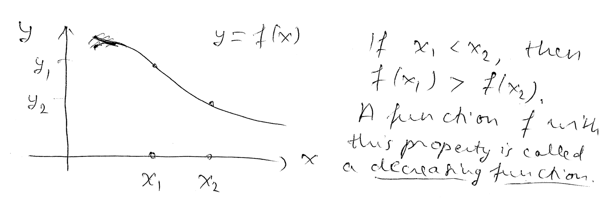
----
----

*Some functions can be decomposed into increasing and decreasing arcs.*
++++
<figure>
    <figcaption></figcaption>
    <audio
	controls
	src="./2121-15-12.m4a">
	    Your browser does not support the
	    <code>audio</code> element.
    </audio>
</figure>
++++
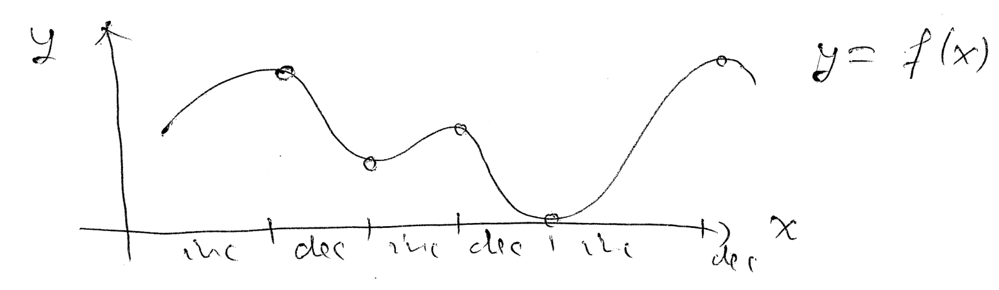
----
----

*A function is increasing if it has positive slopes.  A function is
decreasing if it has negative slopes.*
++++
<figure>
    <figcaption></figcaption>
    <audio
	controls
	src="./2121-15-13.m4a">
	    Your browser does not support the
	    <code>audio</code> element.
    </audio>
</figure>
++++
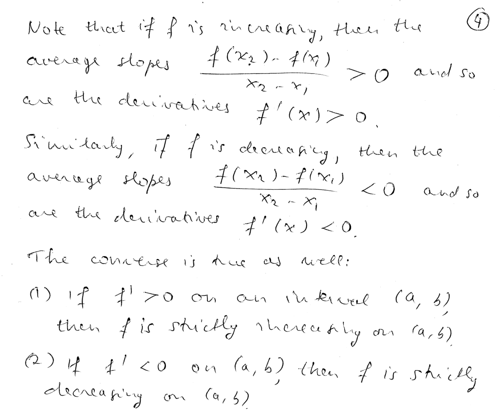
----
----

*Definition of a critical point.*
++++
<figure>
    <figcaption></figcaption>
    <audio
	controls
	src="./2121-15-14.m4a">
	    Your browser does not support the
	    <code>audio</code> element.
    </audio>
</figure>
++++
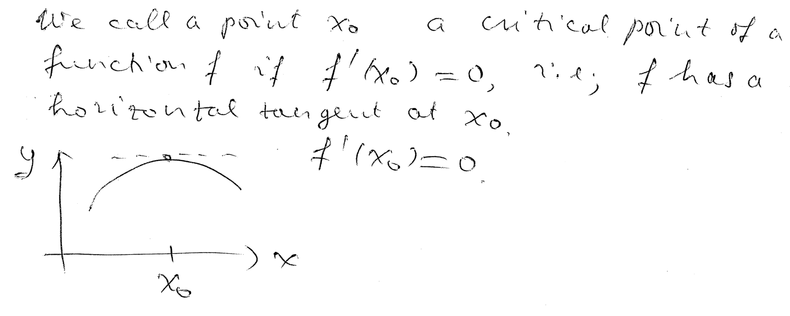
----
----

*The first derivative changes sign from minus to plus at a strict local minimum.*
++++
<figure>
    <figcaption></figcaption>
    <audio
	controls
	src="./2121-15-15.m4a">
	    Your browser does not support the
	    <code>audio</code> element.
    </audio>
</figure>
++++
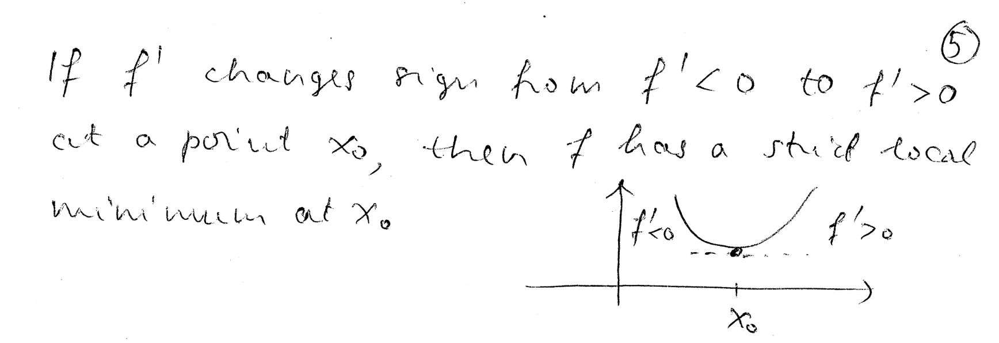
----
----

*The first derivative changes sign from plus to minus at a strict local maximum.*
++++
<figure>
    <figcaption></figcaption>
    <audio
	controls
	src="./2121-15-16.m4a">
	    Your browser does not support the
	    <code>audio</code> element.
    </audio>
</figure>
++++
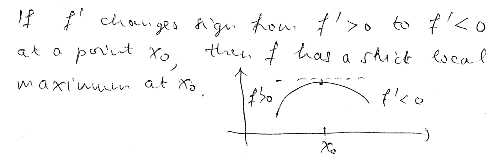
----
----

*Question.* (5.1:p270/1) Find the open intervals of increase and decrease of the function sketched.
++++
<figure>
    <figcaption>Solution</figcaption>
    <audio
	controls
	src="./2121-15-17.m4a">
	    Your browser does not support the
	    <code>audio</code> element.
    </audio>
</figure>
++++
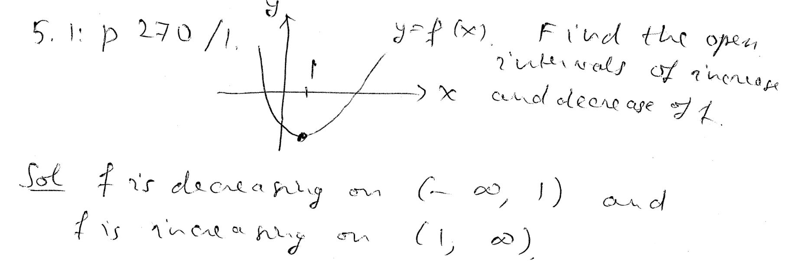
----
----

*Question.* (5.1:p270/5) Find the open intervals of increase and decrease of the function sketched.
++++
<figure>
    <figcaption>Solution</figcaption>
    <audio
	controls
	src="./2121-15-18.m4a">
	    Your browser does not support the
	    <code>audio</code> element.
    </audio>
</figure>
++++
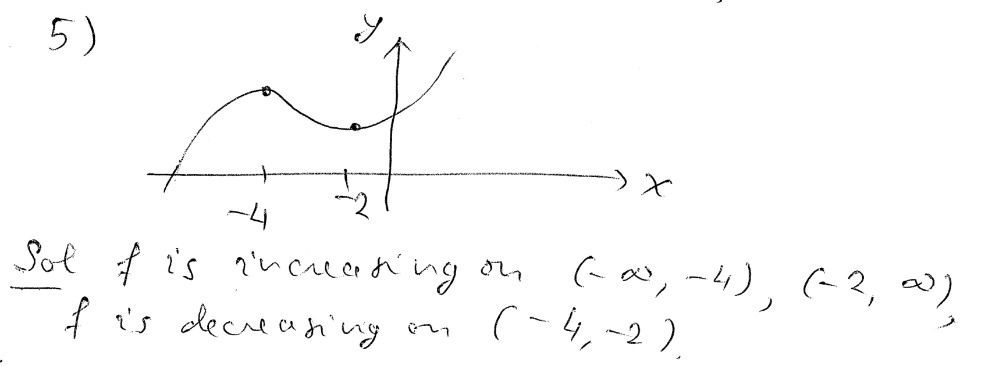
----
----

*Question.* (5.1:p270/13) Find the open intervals of increase and decrease of the function stem:[2.3+3.4x-1.2x^2].
++++
<figure>
    <figcaption>Solution</figcaption>
    <audio
	controls
	src="./2121-15-19.m4a">
	    Your browser does not support the
	    <code>audio</code> element.
    </audio>
</figure>
++++
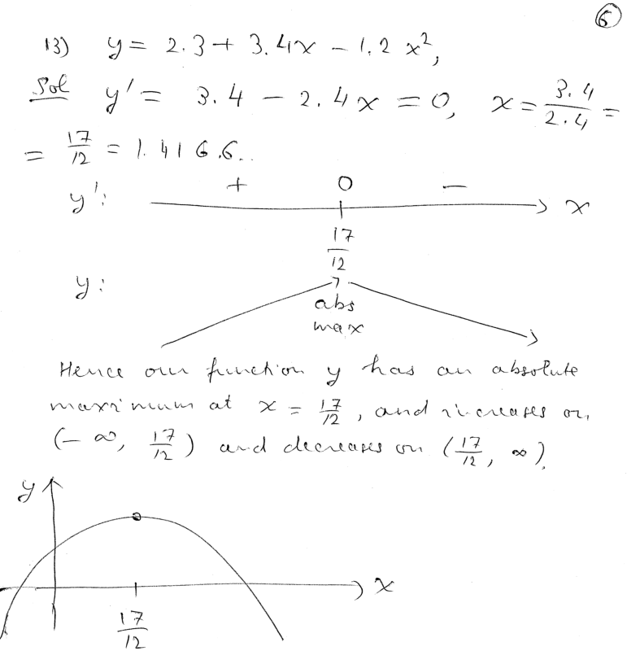
----
----

*Question.* (5.1:p270/15) Find the open intervals of increase and decrease of the function stem:[2/3 x^3-x^2-24x-4].
++++
<figure>
    <figcaption>Solution</figcaption>
    <audio
	controls
	src="./2121-15-20.m4a">
	    Your browser does not support the
	    <code>audio</code> element.
    </audio>
</figure>
++++
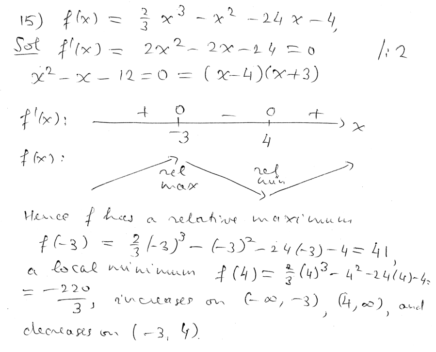
----
----

*Question.* (5.1:p270/17) Find the open intervals of increase and decrease of the function stem:[4x^3-15x^2-72x+5].
++++
<figure>
    <figcaption>Solution</figcaption>
    <audio
	controls
	src="./2121-15-21.m4a">
	    Your browser does not support the
	    <code>audio</code> element.
    </audio>
</figure>
++++
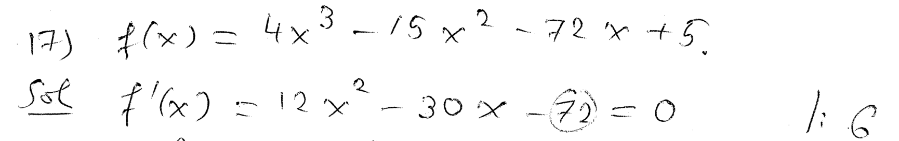
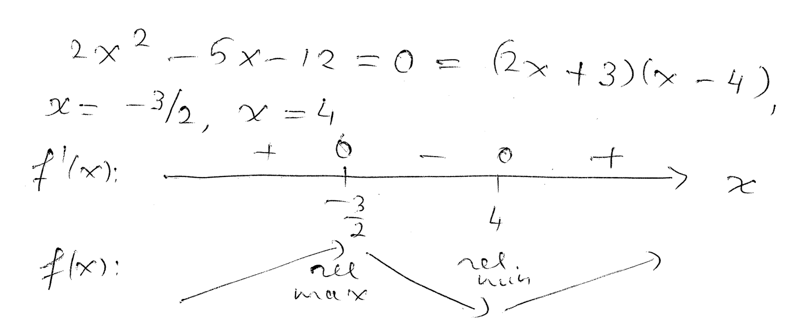
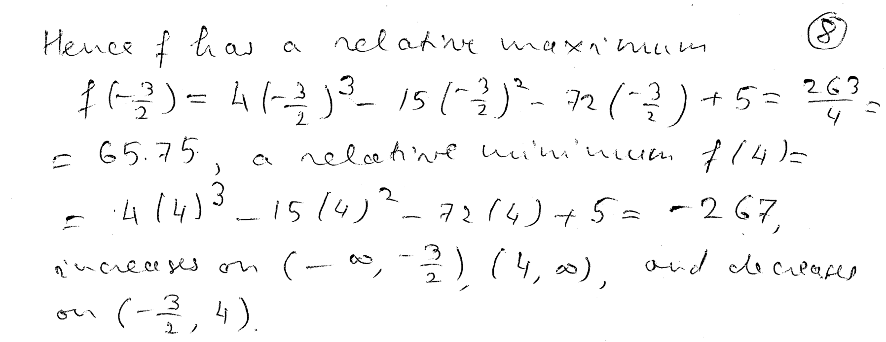
----
----

*Question.* (5.1:p270/19) Find the open intervals of increase and decrease of the function stem:[x^4+4x^3+4x^2+1].
++++
<figure>
    <figcaption>Solution</figcaption>
    <audio
	controls
	src="./2121-15-22.m4a">
	    Your browser does not support the
	    <code>audio</code> element.
    </audio>
</figure>
++++
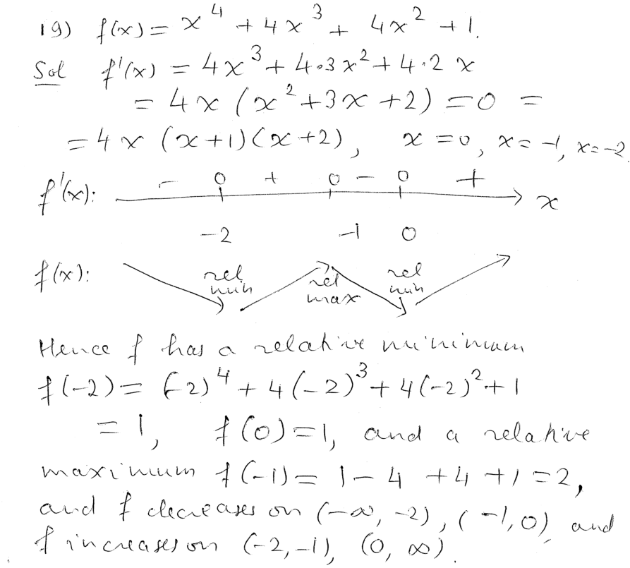
----
----

////
*Question.* () stem:[].
++++
<figure>
    <figcaption>Solution</figcaption>
    <audio
	controls
	src="./2121-15-23.m4a">
	    Your browser does not support the
	    <code>audio</code> element.
    </audio>
</figure>
++++
image::2121-15-23.PNG[Work]
----
----

*Question.* () stem:[].
++++
<figure>
    <figcaption>Solution</figcaption>
    <audio
	controls
	src="./2121-15-24.m4a">
	    Your browser does not support the
	    <code>audio</code> element.
    </audio>
</figure>
++++
image::2121-15-24.PNG[Work]
----
----

*Question.* () stem:[].
++++
<figure>
    <figcaption>Solution</figcaption>
    <audio
	controls
	src="./2121-15-25.m4a">
	    Your browser does not support the
	    <code>audio</code> element.
    </audio>
</figure>
++++
image::2121-15-25.PNG[Work]
----
----

*Question.* () stem:[].
++++
<figure>
    <figcaption>Solution</figcaption>
    <audio
	controls
	src="./2121-15-26.m4a">
	    Your browser does not support the
	    <code>audio</code> element.
    </audio>
</figure>
++++
image::2121-15-26.PNG[Work]
----
----

*Question.* () stem:[].
++++
<figure>
    <figcaption>Solution</figcaption>
    <audio
	controls
	src="./2121-15-27.m4a">
	    Your browser does not support the
	    <code>audio</code> element.
    </audio>
</figure>
++++
image::2121-15-27.PNG[Work]
----
----

*Question.* () stem:[].
++++
<figure>
    <figcaption>Solution</figcaption>
    <audio
	controls
	src="./2121-15-28.m4a">
	    Your browser does not support the
	    <code>audio</code> element.
    </audio>
</figure>
++++
image::2121-15-28.PNG[Work]
----
----

*Question.* () stem:[].
++++
<figure>
    <figcaption>Solution</figcaption>
    <audio
	controls
	src="./2121-15-29.m4a">
	    Your browser does not support the
	    <code>audio</code> element.
    </audio>
</figure>
++++
image::2121-15-29.PNG[Work]
----
----

*Question.* () stem:[].
++++
<figure>
    <figcaption>Solution</figcaption>
    <audio
	controls
	src="./2121-15-30.m4a">
	    Your browser does not support the
	    <code>audio</code> element.
    </audio>
</figure>
++++
image::2121-15-30.PNG[Work]
----
----

////
