= Math 2121, Calculus for the life sciences, I
:source-highlighter: coderay
:stem:

In this set of notes we work through some notions and
examples from calculus.  You can read the questions
here, study the handwritten notes, and while doing
so, listen to some explanations by clicking on the
"play" button.

== Lesson 19, Higher Derivatives, Concavity and the Second Derivative Test.

*Definition of second, third, etc, derivatives.*
++++
<figure>
    <figcaption></figcaption>
    <audio
	controls
	src="./2121-19-01.m4a">
	    Your browser does not support the
	    <code>audio</code> element.
    </audio>
</figure>
++++
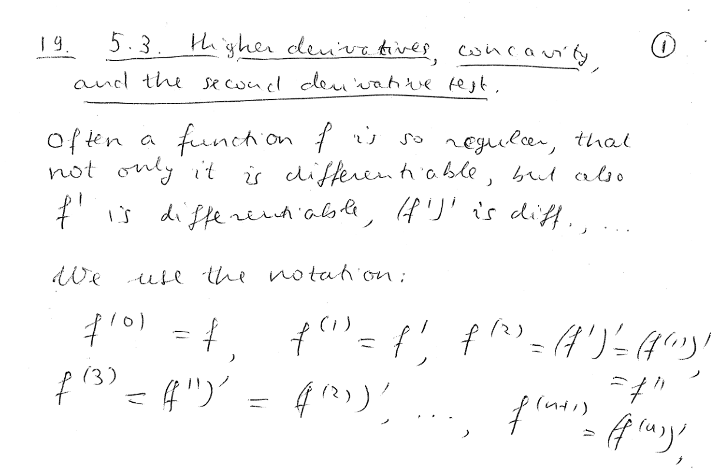
----
----

*The first derivative of the position function is the velocity function.  The second derivative of the position function is the acceleration function.*
++++
<figure>
    <figcaption></figcaption>
    <audio
	controls
	src="./2121-19-02.m4a">
	    Your browser does not support the
	    <code>audio</code> element.
    </audio>
</figure>
++++
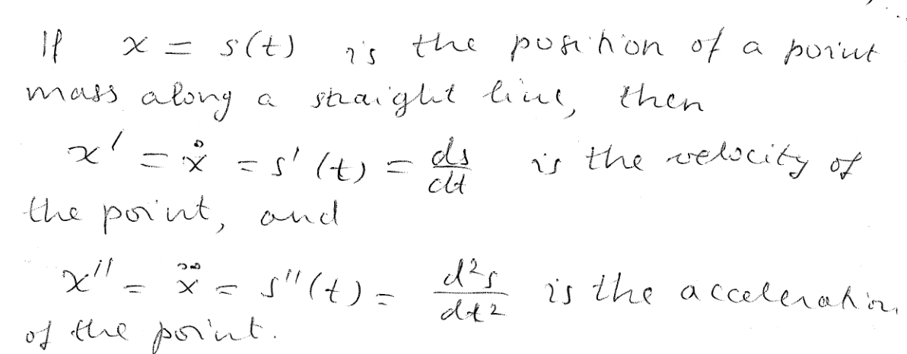
----
----

*Definition of a function concave up.*
++++
<figure>
    <figcaption></figcaption>
    <audio
	controls
	src="./2121-19-03.m4a">
	    Your browser does not support the
	    <code>audio</code> element.
    </audio>
</figure>
++++
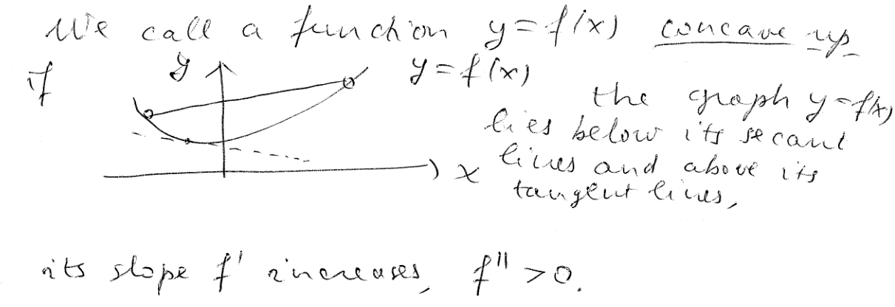
----
----

*Definition of a function concave down.*
++++
<figure>
    <figcaption></figcaption>
    <audio
	controls
	src="./2121-19-04.m4a">
	    Your browser does not support the
	    <code>audio</code> element.
    </audio>
</figure>
++++
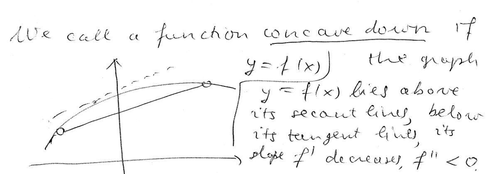
----
----

*We have an inflection at a point where the function changes its sense of concavity.*
++++
<figure>
    <figcaption></figcaption>
    <audio
	controls
	src="./2121-19-05.m4a">
	    Your browser does not support the
	    <code>audio</code> element.
    </audio>
</figure>
++++
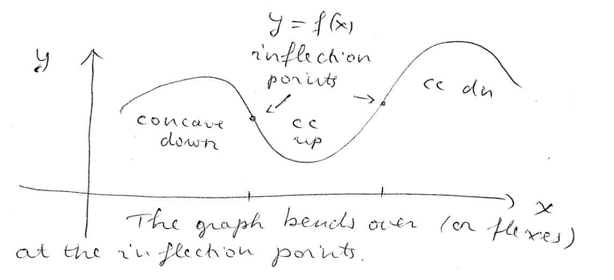
----
----

*We can use the sign of the second derivative to check for concavity
and inflection points.*
++++
<figure>
    <figcaption></figcaption>
    <audio
	controls
	src="./2121-19-06.m4a">
	    Your browser does not support the
	    <code>audio</code> element.
    </audio>
</figure>
++++
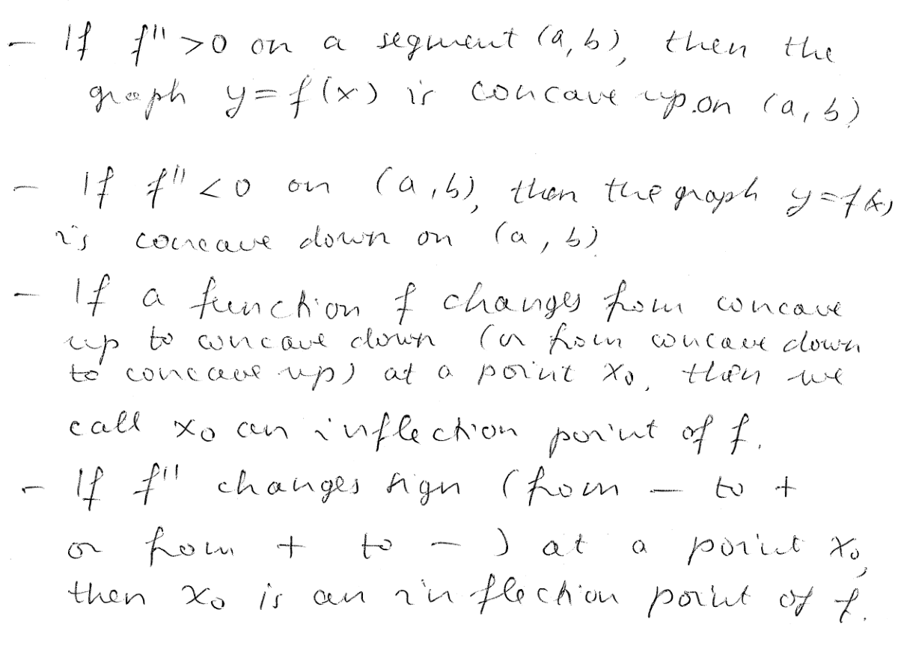
----
----

*The second derivative test.*
++++
<figure>
    <figcaption></figcaption>
    <audio
	controls
	src="./2121-19-07.m4a">
	    Your browser does not support the
	    <code>audio</code> element.
    </audio>
</figure>
++++
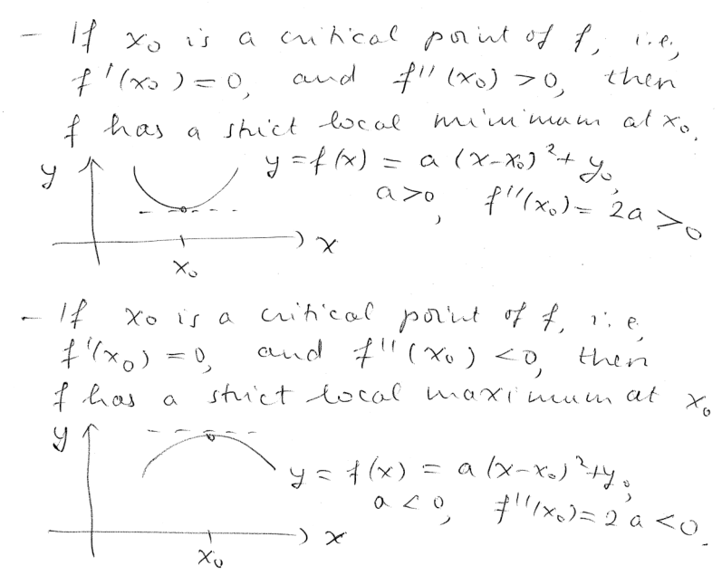
----
----

*Question.* (5.3:p294/1) Compute stem:[f''(0),f''(2)] for stem:[f(x)=5x^3-7x^2+4x+3].
++++
<figure>
    <figcaption>Solution</figcaption>
    <audio
	controls
	src="./2121-19-08.m4a">
	    Your browser does not support the
	    <code>audio</code> element.
    </audio>
</figure>
++++
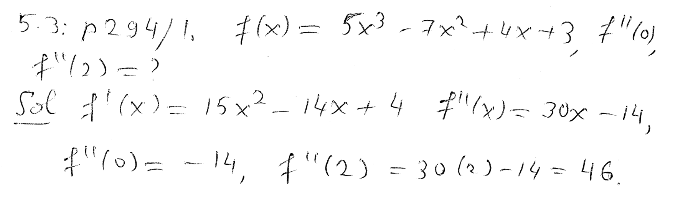
----
----

*Question.* (5.3:p294/7) Compute stem:[f''(0),f''(2)] for stem:[f(x)=x^2/{1+x}].
++++
<figure>
    <figcaption>Solution</figcaption>
    <audio
	controls
	src="./2121-19-09.m4a">
	    Your browser does not support the
	    <code>audio</code> element.
    </audio>
</figure>
++++
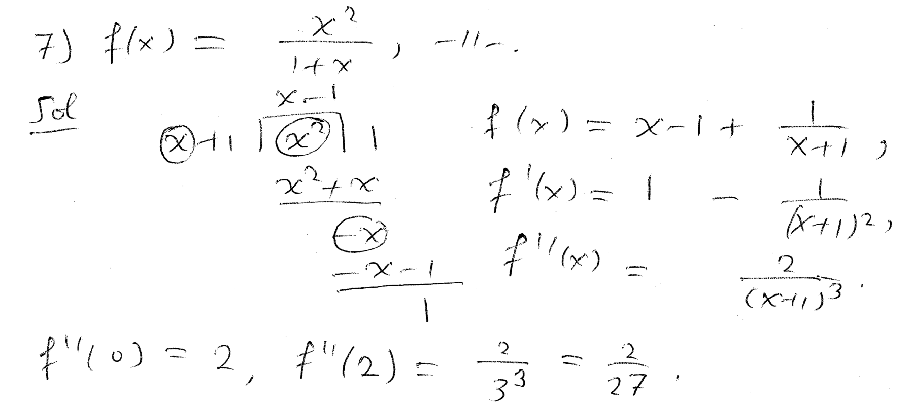
----
----

*Question.* (5.3:p294/10) Compute stem:[f''(0),f''(2)] for stem:[f(x)=sqrt{2x^2+9}].
++++
<figure>
    <figcaption>Solution</figcaption>
    <audio
	controls
	src="./2121-19-10.m4a">
	    Your browser does not support the
	    <code>audio</code> element.
    </audio>
</figure>
++++
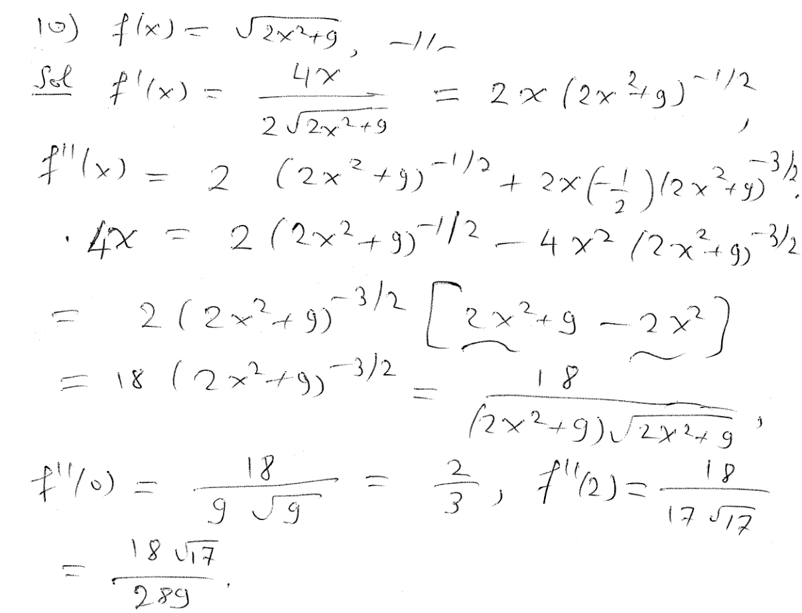
----
----

*Question.* (5.3:p294/13) Compute stem:[f'(x),f''(x)] for stem:[f(x)=5e^{-x^2}].
++++
<figure>
    <figcaption>Solution</figcaption>
    <audio
	controls
	src="./2121-19-11.m4a">
	    Your browser does not support the
	    <code>audio</code> element.
    </audio>
</figure>
++++
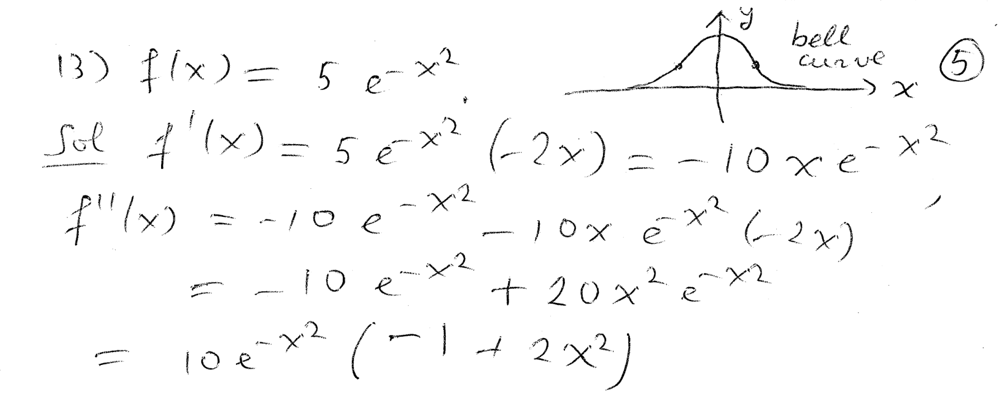
----
----

*Question.* (5.3:p294/15) Compute stem:[f'(x),f''(x)] for stem:[f(x)={ln x}/{4x}].
++++
<figure>
    <figcaption>Solution</figcaption>
    <audio
	controls
	src="./2121-19-12.m4a">
	    Your browser does not support the
	    <code>audio</code> element.
    </audio>
</figure>
++++
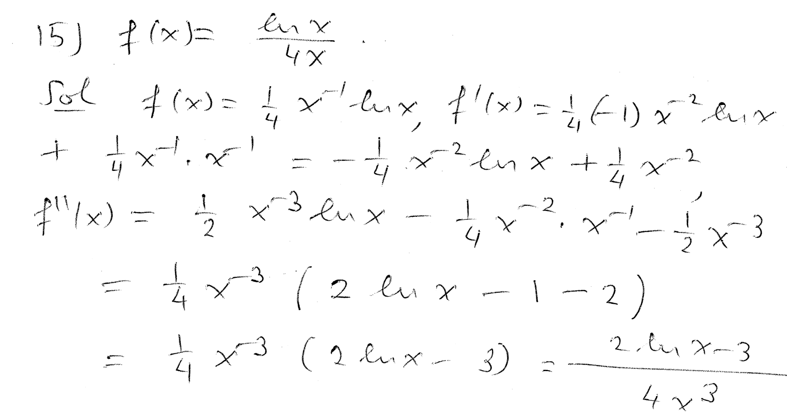
----
----

*Question.* (5.3:p294/17) Compute stem:[f'(x),f''(x)] for stem:[f(x)=cos x^3].
++++
<figure>
    <figcaption>Solution</figcaption>
    <audio
	controls
	src="./2121-19-13.m4a">
	    Your browser does not support the
	    <code>audio</code> element.
    </audio>
</figure>
++++
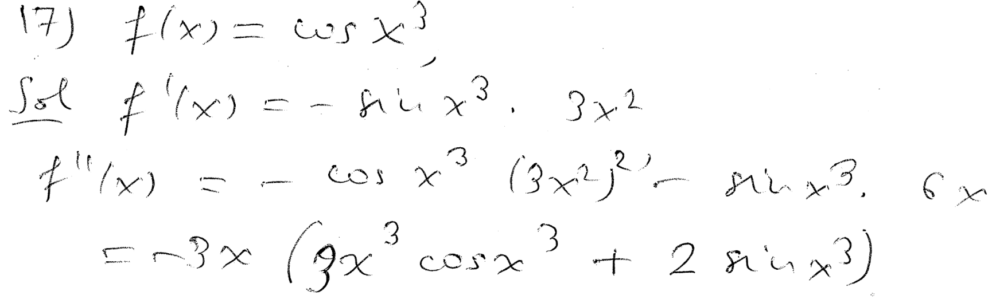
----
----

*Question.* (5.3:p294/17) Compute stem:[f'(x),f''(x),f'''(x),f^{IV}(x)] for stem:[f(x)=7x^4+6x^3+5x^2+4x+3].
++++
<figure>
    <figcaption>Solution</figcaption>
    <audio
	controls
	src="./2121-19-14.m4a">
	    Your browser does not support the
	    <code>audio</code> element.
    </audio>
</figure>
++++
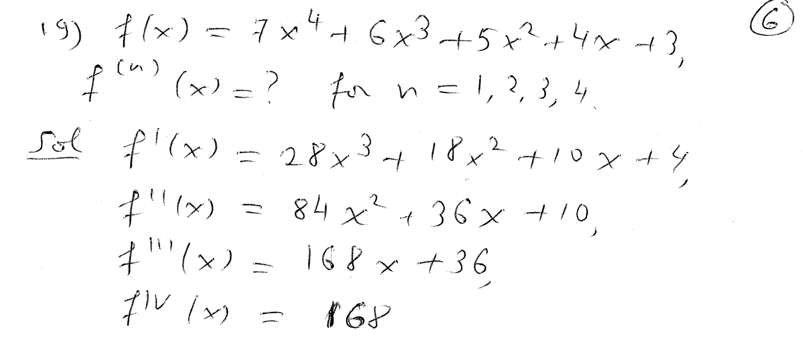
----
----

*Question.* (5.3:p294/17) Compute stem:[f'(x),f''(x),f'''(x),f^{IV}(x)] for stem:[f(x)={x-1}/{x+2}].
++++
<figure>
    <figcaption>Solution</figcaption>
    <audio
	controls
	src="./2121-19-15.m4a">
	    Your browser does not support the
	    <code>audio</code> element.
    </audio>
</figure>
++++
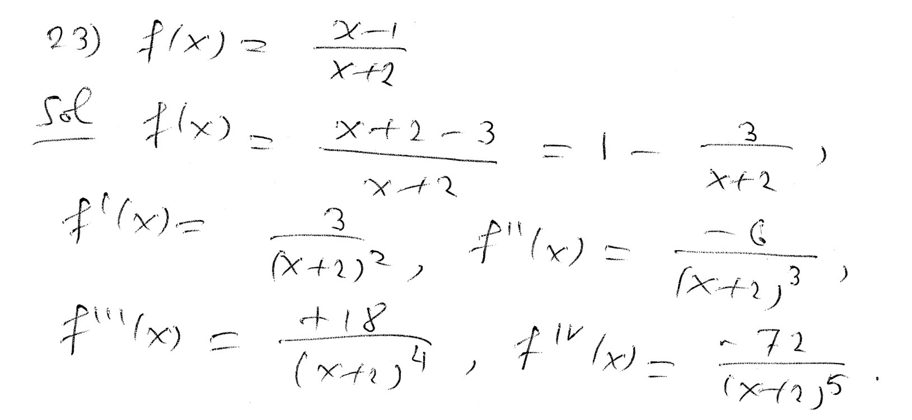
----
----

*Question.* (5.3:p294/33) Find the intervals on which stem:[f] is concave up or concave down for the function sketched.
++++
<figure>
    <figcaption>Solution</figcaption>
    <audio
	controls
	src="./2121-19-16.m4a">
	    Your browser does not support the
	    <code>audio</code> element.
    </audio>
</figure>
++++
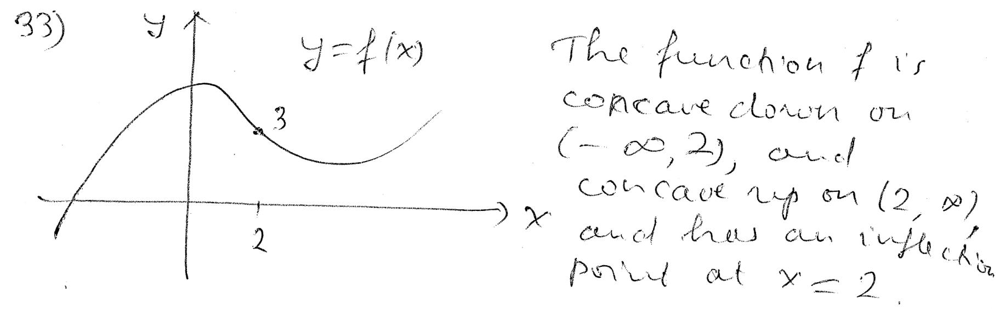
----
----

*Question.* (5.3:p294/33) Find the intervals on which stem:[f] is concave up or concave down for the function sketched.
++++
<figure>
    <figcaption>Solution</figcaption>
    <audio
	controls
	src="./2121-19-17.m4a">
	    Your browser does not support the
	    <code>audio</code> element.
    </audio>
</figure>
++++
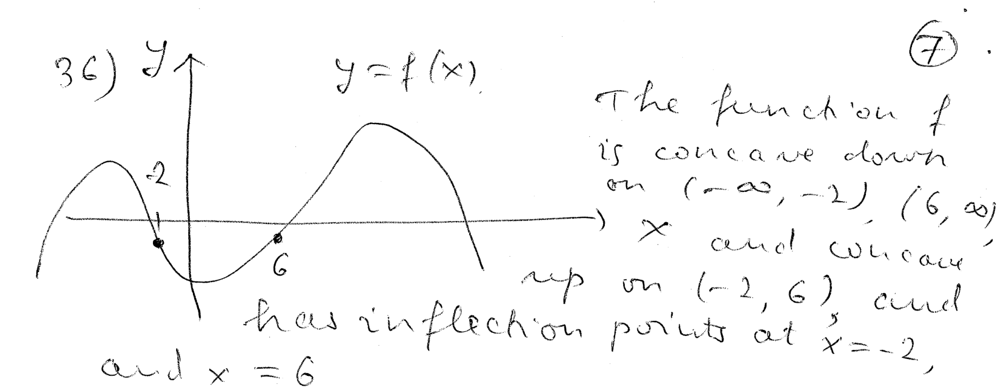
----
----

*Question.* (5.3:p294/33) Find the intervals on which stem:[f] is concave up or concave down for stem:[f(x)=x^2+10x-9].
++++
<figure>
    <figcaption>Solution</figcaption>
    <audio
	controls
	src="./2121-19-18.m4a">
	    Your browser does not support the
	    <code>audio</code> element.
    </audio>
</figure>
++++
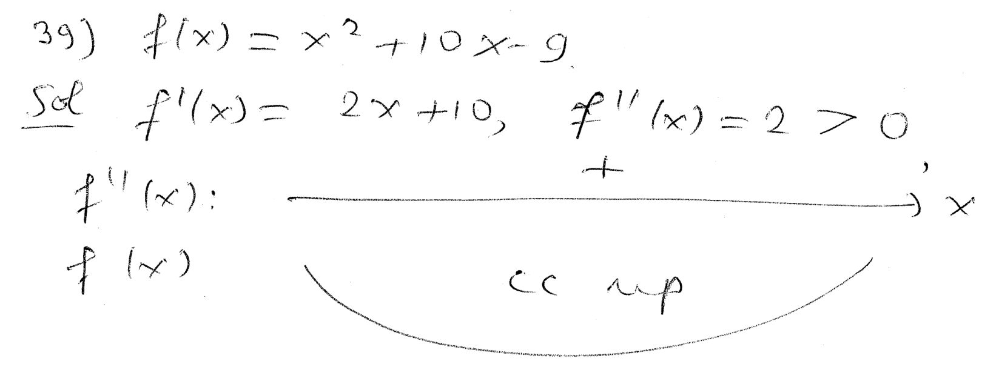
----
----

*Question.* (5.3:p294/41) Find the intervals on which stem:[f] is concave up or concave down for stem:[f(x)=-2x^3+9x^2+168x-3].
++++
<figure>
    <figcaption>Solution</figcaption>
    <audio
	controls
	src="./2121-19-19.m4a">
	    Your browser does not support the
	    <code>audio</code> element.
    </audio>
</figure>
++++
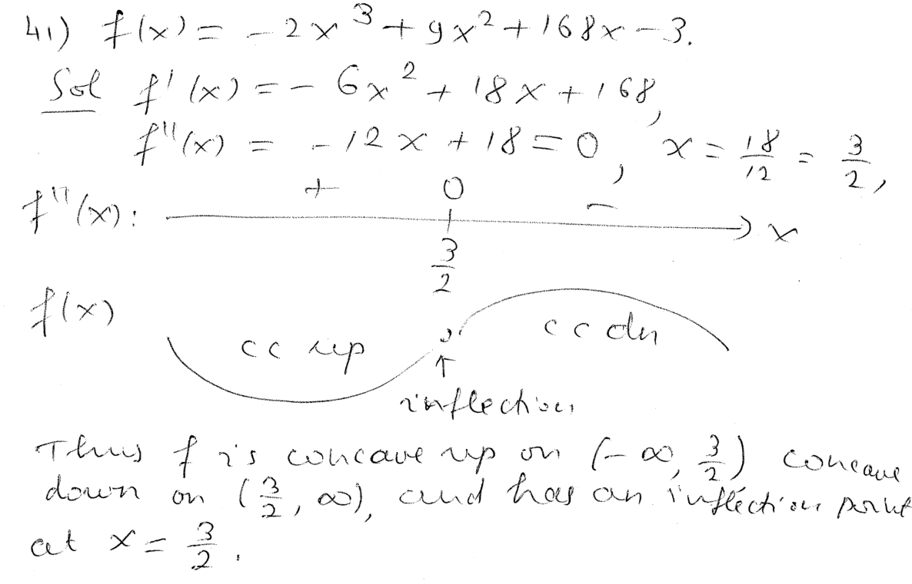
----
----

*Question.* (5.3:p294/43) Find the intervals on which stem:[f] is concave up or concave down for stem:[f(x)=3/{x-5}].
++++
<figure>
    <figcaption>Solution</figcaption>
    <audio
	controls
	src="./2121-19-20.m4a">
	    Your browser does not support the
	    <code>audio</code> element.
    </audio>
</figure>
++++
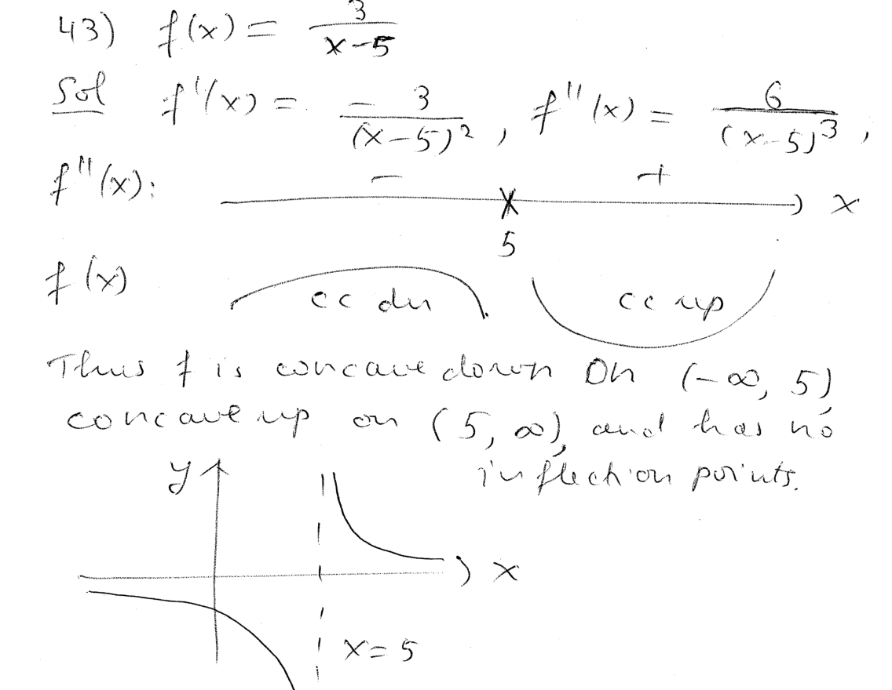
----
----

*Question.* (5.3:p294/45) Find the intervals on which stem:[f] is concave up or concave down for stem:[f(x)=x(x+5)^2].
++++
<figure>
    <figcaption>Solution</figcaption>
    <audio
	controls
	src="./2121-19-21.m4a">
	    Your browser does not support the
	    <code>audio</code> element.
    </audio>
</figure>
++++
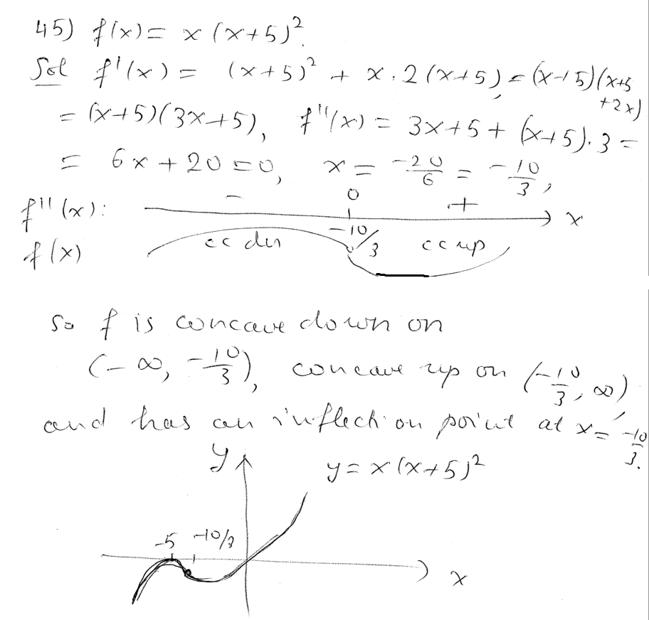
----
----

////
*Question.* () stem:[].
++++
<figure>
    <figcaption>Solution</figcaption>
    <audio
	controls
	src="./2121-19-22.m4a">
	    Your browser does not support the
	    <code>audio</code> element.
    </audio>
</figure>
++++
image::2121-19-22.PNG[Work]
----
----

*Question.* () stem:[].
++++
<figure>
    <figcaption>Solution</figcaption>
    <audio
	controls
	src="./2121-19-23.m4a">
	    Your browser does not support the
	    <code>audio</code> element.
    </audio>
</figure>
++++
image::2121-19-23.PNG[Work]
----
----

*Question.* () stem:[].
++++
<figure>
    <figcaption>Solution</figcaption>
    <audio
	controls
	src="./2121-19-24.m4a">
	    Your browser does not support the
	    <code>audio</code> element.
    </audio>
</figure>
++++
image::2121-19-24.PNG[Work]
----
----

*Question.* () stem:[].
++++
<figure>
    <figcaption>Solution</figcaption>
    <audio
	controls
	src="./2121-19-25.m4a">
	    Your browser does not support the
	    <code>audio</code> element.
    </audio>
</figure>
++++
image::2121-19-25.PNG[Work]
----
----

*Question.* () stem:[].
++++
<figure>
    <figcaption>Solution</figcaption>
    <audio
	controls
	src="./2121-19-26.m4a">
	    Your browser does not support the
	    <code>audio</code> element.
    </audio>
</figure>
++++
image::2121-19-26.PNG[Work]
----
----

*Question.* () stem:[].
++++
<figure>
    <figcaption>Solution</figcaption>
    <audio
	controls
	src="./2121-19-27.m4a">
	    Your browser does not support the
	    <code>audio</code> element.
    </audio>
</figure>
++++
image::2121-19-27.PNG[Work]
----
----

*Question.* () stem:[].
++++
<figure>
    <figcaption>Solution</figcaption>
    <audio
	controls
	src="./2121-19-28.m4a">
	    Your browser does not support the
	    <code>audio</code> element.
    </audio>
</figure>
++++
image::2121-19-28.PNG[Work]
----
----

*Question.* () stem:[].
++++
<figure>
    <figcaption>Solution</figcaption>
    <audio
	controls
	src="./2121-19-29.m4a">
	    Your browser does not support the
	    <code>audio</code> element.
    </audio>
</figure>
++++
image::2121-19-29.PNG[Work]
----
----

*Question.* () stem:[].
++++
<figure>
    <figcaption>Solution</figcaption>
    <audio
	controls
	src="./2121-19-30.m4a">
	    Your browser does not support the
	    <code>audio</code> element.
    </audio>
</figure>
++++
image::2121-19-30.PNG[Work]
----
----

////
