= Math 2121, Calculus for the life sciences, I
:source-highlighter: coderay
:stem:

In this set of notes we work through some notions and
examples from calculus.  You can read the questions
here, study the handwritten notes, and while doing
so, listen to some explanations by clicking on the
"play" button.

== Lesson 21, Curve Sketching (continued); Absolute Extrema.

*Question.* (5.4:p306/25) Sketch the function stem:[f(x)=xe^{-x}].
++++
<figure>
    <figcaption>Solution</figcaption>
    <audio
	controls
	src="./2121-21-01.m4a">
	    Your browser does not support the
	    <code>audio</code> element.
    </audio>
</figure>
++++
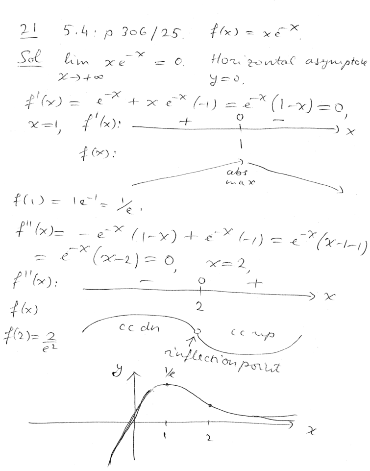
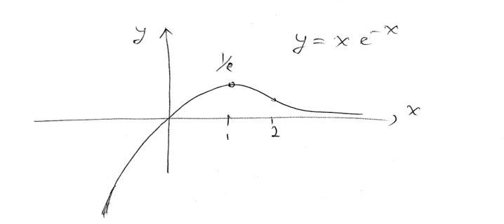
----
----

*The extreme value theorem.*
++++
<figure>
    <figcaption></figcaption>
    <audio
	controls
	src="./2121-21-02.m4a">
	    Your browser does not support the
	    <code>audio</code> element.
    </audio>
</figure>
++++
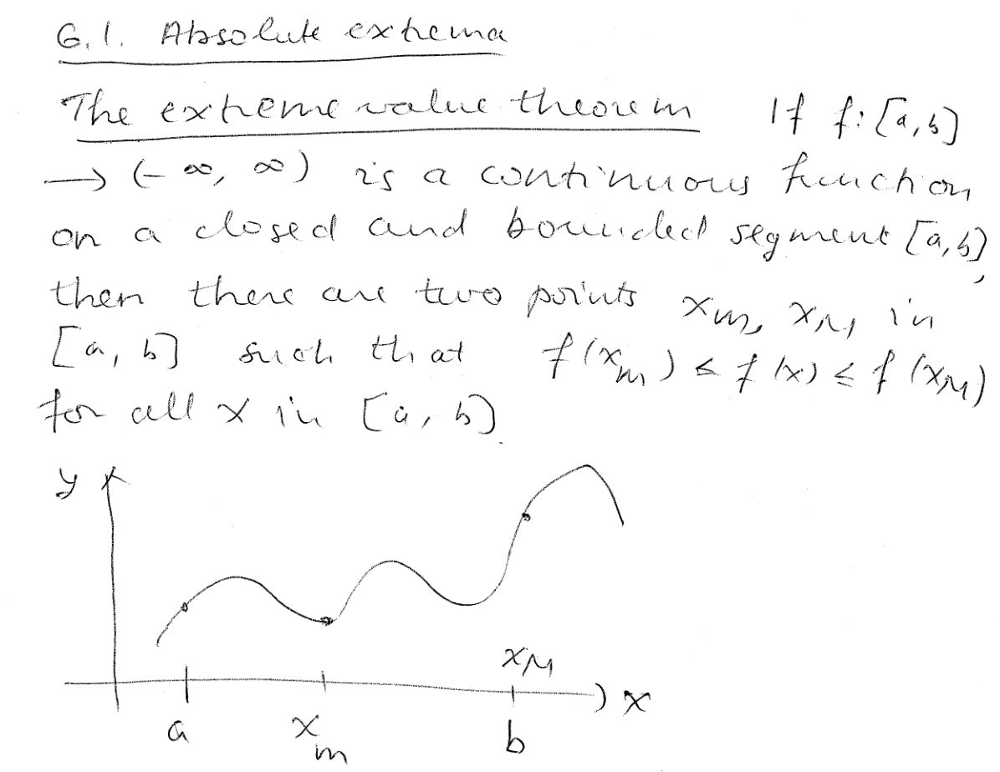
----
----

*To find the absolute extrema, tabulate stem:[(x,f(x))], for stem:[x] running through the interior critical points and the end points of the interval.*
++++
<figure>
    <figcaption></figcaption>
    <audio
	controls
	src="./2121-21-03.m4a">
	    Your browser does not support the
	    <code>audio</code> element.
    </audio>
</figure>
++++
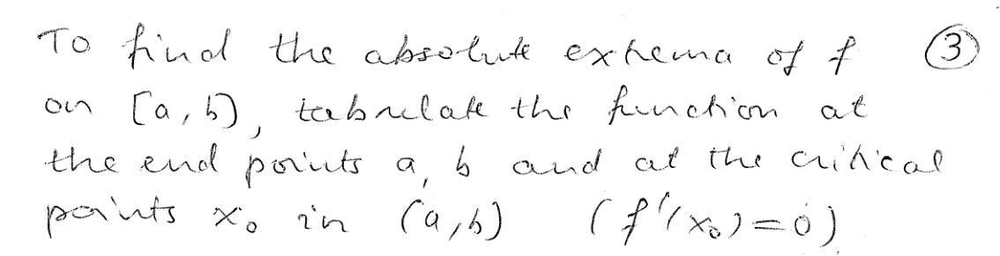
----
----

*Question.* (6.1:p323/11) Find the absolute extrema of stem:[f(x)=x^3-6x^2+9x-8] on stem:[[0,5]].
++++
<figure>
    <figcaption>Solution</figcaption>
    <audio
	controls
	src="./2121-21-04.m4a">
	    Your browser does not support the
	    <code>audio</code> element.
    </audio>
</figure>
++++
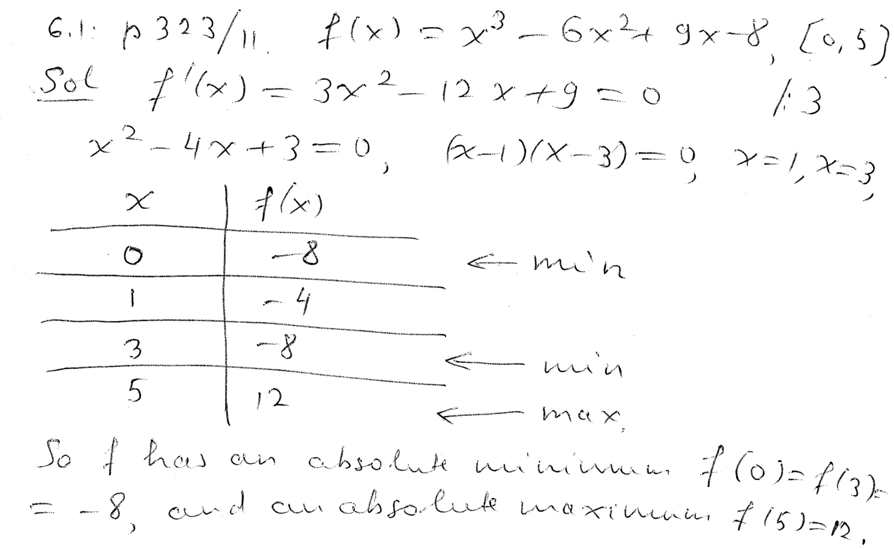
----
----

*Question.* (6.1:p323/13) Find the absolute extrema of stem:[f(x)=1/3 x^3+3/2 x^2 -4x+1] on stem:[[-5,2]].
++++
<figure>
    <figcaption>Solution</figcaption>
    <audio
	controls
	src="./2121-21-05.m4a">
	    Your browser does not support the
	    <code>audio</code> element.
    </audio>
</figure>
++++

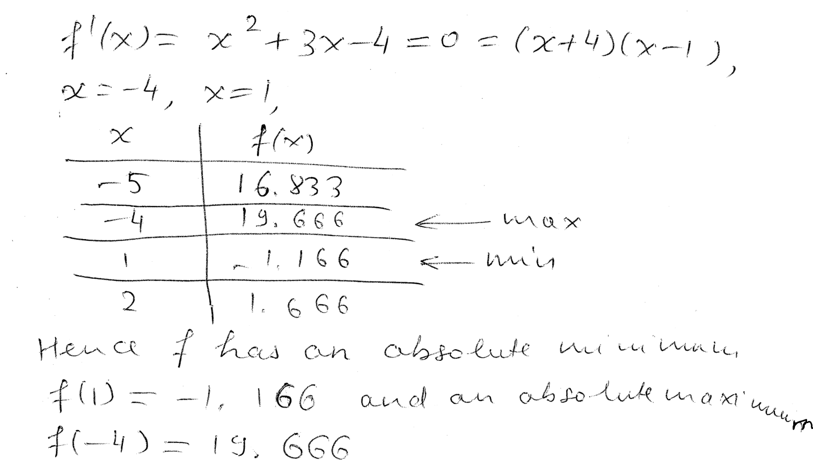
----
----

*Question.* (6.1:p323/15) Find the absolute extrema of stem:[f(x)=x^4-18x^2+1] on stem:[[-4,4]].
++++
<figure>
    <figcaption>Solution</figcaption>
    <audio
	controls
	src="./2121-21-06.m4a">
	    Your browser does not support the
	    <code>audio</code> element.
    </audio>
</figure>
++++
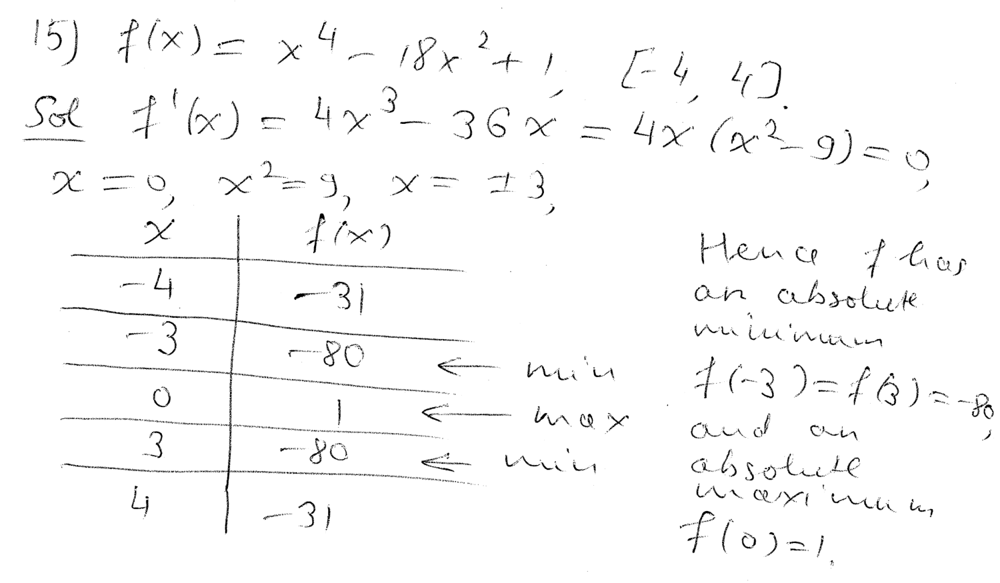
----
----

*Question.* (6.1:p323/17) Find the absolute extrema of stem:[f(x)={1-x}/{3+x}] on stem:[[0,3]].
++++
<figure>
    <figcaption>Solution</figcaption>
    <audio
	controls
	src="./2121-21-07.m4a">
	    Your browser does not support the
	    <code>audio</code> element.
    </audio>
</figure>
++++
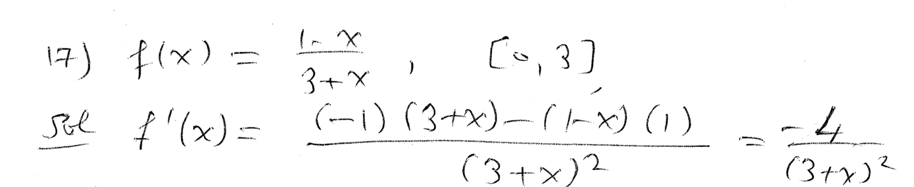
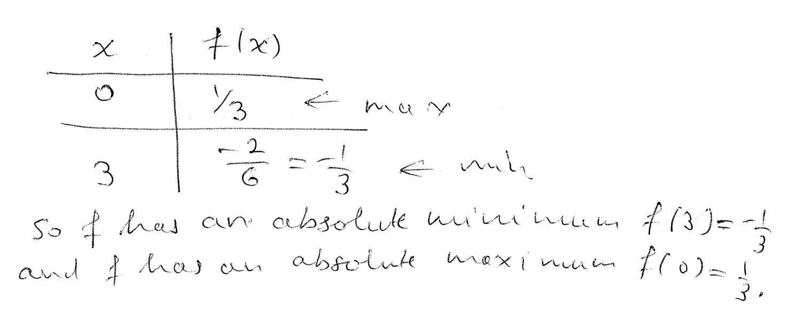
----
----

*Question.* (6.1:p323/21) Find the absolute extrema of stem:[f(x)=(x^2-4)^{1/3}] on stem:[[-2,3]].
++++
<figure>
    <figcaption>Solution</figcaption>
    <audio
	controls
	src="./2121-21-08.m4a">
	    Your browser does not support the
	    <code>audio</code> element.
    </audio>
</figure>
++++
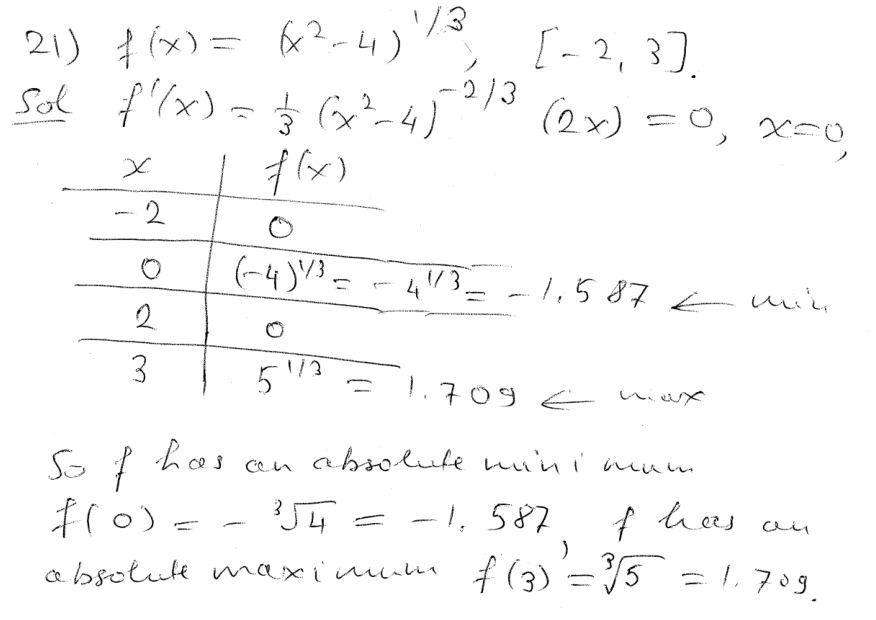
----
----

*Question.* (6.1:p323/23) Find the absolute extrema of stem:[f(x)=5x^{2/3}+2x^{5/3}] on stem:[[-2,1]].
++++
<figure>
    <figcaption>Solution</figcaption>
    <audio
	controls
	src="./2121-21-09.m4a">
	    Your browser does not support the
	    <code>audio</code> element.
    </audio>
</figure>
++++

----
----

*Question.* (6.1:p323/26) Find the absolute extrema of stem:[f(x)={ln x}/x^2] on stem:[[1,4]].
++++
<figure>
    <figcaption>Solution</figcaption>
    <audio
	controls
	src="./2121-21-10.m4a">
	    Your browser does not support the
	    <code>audio</code> element.
    </audio>
</figure>
++++
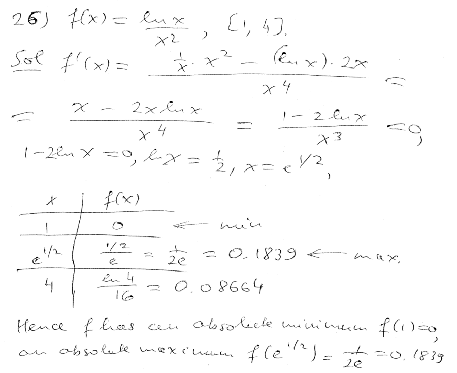
----
----

*Question.* (6.1:p323/27) Find the absolute extrema of stem:[f(x)=x+e^{-3x}] on stem:[[-1,3]].
++++
<figure>
    <figcaption>Solution</figcaption>
    <audio
	controls
	src="./2121-21-11.m4a">
	    Your browser does not support the
	    <code>audio</code> element.
    </audio>
</figure>
++++
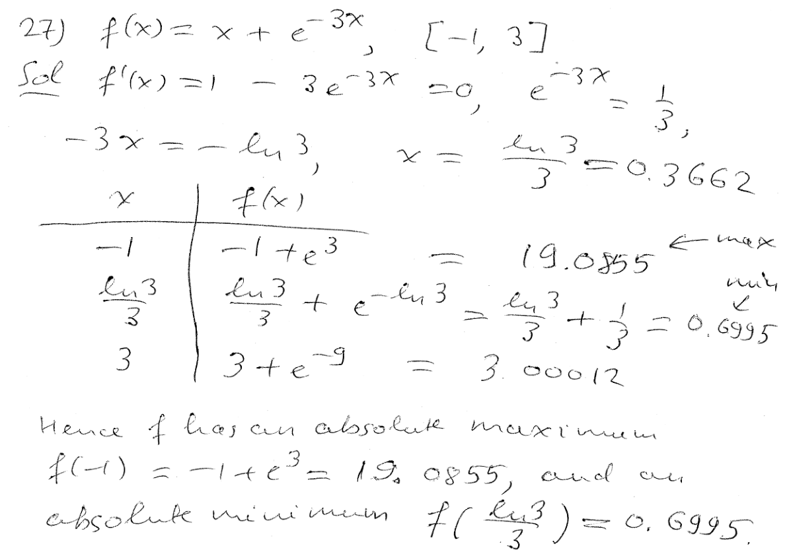
----
----

*Question.* (6.1:p323/29) Find the absolute extrema of stem:[f(x)=x/2-sin x] on stem:[[0,pi]].
++++
<figure>
    <figcaption>Solution</figcaption>
    <audio
	controls
	src="./2121-21-12.m4a">
	    Your browser does not support the
	    <code>audio</code> element.
    </audio>
</figure>
++++
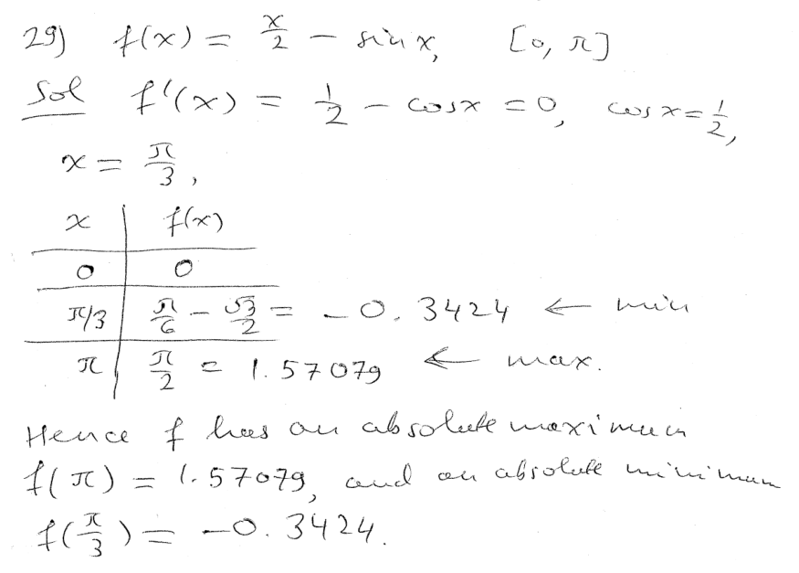
----
----

*Question.* (6.1:p323/33) Find the absolute extrema of stem:[f(x)=2x+8/x^2+1] for stem:[x>0].
++++
<figure>
    <figcaption>Solution</figcaption>
    <audio
	controls
	src="./2121-21-13.m4a">
	    Your browser does not support the
	    <code>audio</code> element.
    </audio>
</figure>
++++
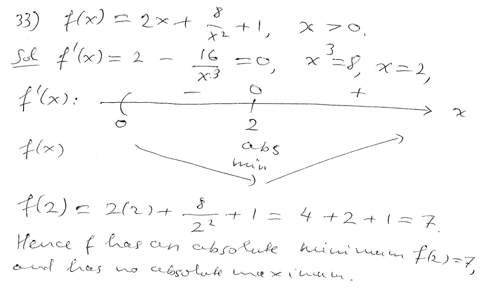
----
----

*Question.* (6.1:p323/37) Find the absolute extrema of stem:[f(x)={x-1}/{x^2+2x+6}].
++++
<figure>
    <figcaption>Solution</figcaption>
    <audio
	controls
	src="./2121-21-14.m4a">
	    Your browser does not support the
	    <code>audio</code> element.
    </audio>
</figure>
++++
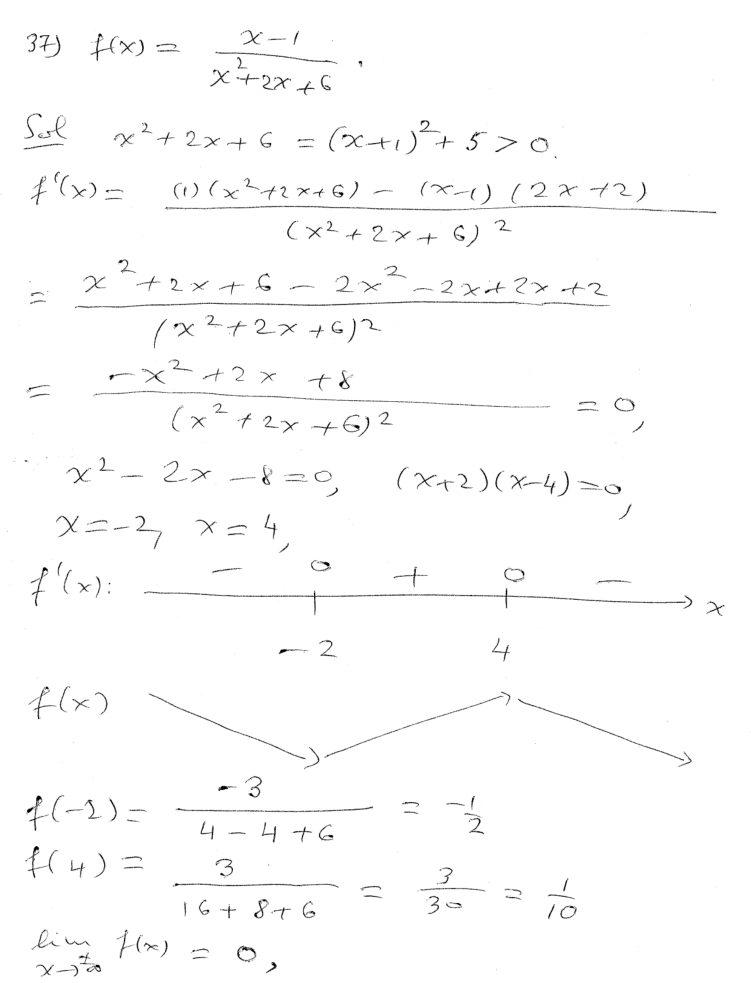

----
----

*Question.* (6.1:p323/40) Find the absolute extrema of stem:[f(x)=x ln x].
++++
<figure>
    <figcaption>Solution</figcaption>
    <audio
	controls
	src="./2121-21-15.m4a">
	    Your browser does not support the
	    <code>audio</code> element.
    </audio>
</figure>
++++
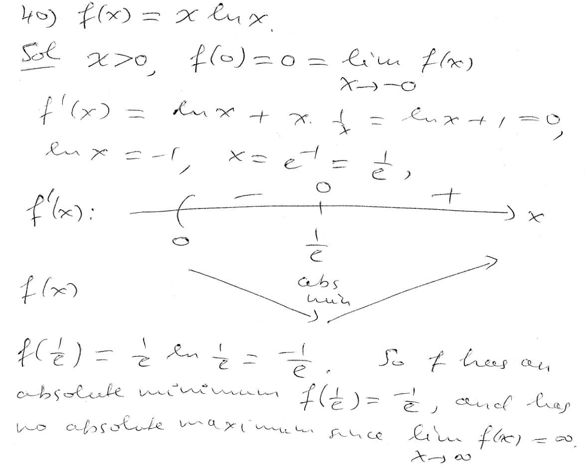
----
----

////
*Question.* () stem:[].
++++
<figure>
    <figcaption>Solution</figcaption>
    <audio
	controls
	src="./2121-21-16.m4a">
	    Your browser does not support the
	    <code>audio</code> element.
    </audio>
</figure>
++++
image::2121-21-16.PNG[Work]
----
----

*Question.* () stem:[].
++++
<figure>
    <figcaption>Solution</figcaption>
    <audio
	controls
	src="./2121-21-17.m4a">
	    Your browser does not support the
	    <code>audio</code> element.
    </audio>
</figure>
++++
image::2121-21-17.PNG[Work]
----
----

*Question.* () stem:[].
++++
<figure>
    <figcaption>Solution</figcaption>
    <audio
	controls
	src="./2121-21-18.m4a">
	    Your browser does not support the
	    <code>audio</code> element.
    </audio>
</figure>
++++
image::2121-21-18.PNG[Work]
----
----

*Question.* () stem:[].
++++
<figure>
    <figcaption>Solution</figcaption>
    <audio
	controls
	src="./2121-21-19.m4a">
	    Your browser does not support the
	    <code>audio</code> element.
    </audio>
</figure>
++++
image::2121-21-19.PNG[Work]
----
----

*Question.* () stem:[].
++++
<figure>
    <figcaption>Solution</figcaption>
    <audio
	controls
	src="./2121-21-20.m4a">
	    Your browser does not support the
	    <code>audio</code> element.
    </audio>
</figure>
++++
image::2121-21-20.PNG[Work]
----
----

*Question.* () stem:[].
++++
<figure>
    <figcaption>Solution</figcaption>
    <audio
	controls
	src="./2121-21-21.m4a">
	    Your browser does not support the
	    <code>audio</code> element.
    </audio>
</figure>
++++
image::2121-21-21.PNG[Work]
----
----

*Question.* () stem:[].
++++
<figure>
    <figcaption>Solution</figcaption>
    <audio
	controls
	src="./2121-21-22.m4a">
	    Your browser does not support the
	    <code>audio</code> element.
    </audio>
</figure>
++++
image::2121-21-22.PNG[Work]
----
----

*Question.* () stem:[].
++++
<figure>
    <figcaption>Solution</figcaption>
    <audio
	controls
	src="./2121-21-23.m4a">
	    Your browser does not support the
	    <code>audio</code> element.
    </audio>
</figure>
++++
image::2121-21-23.PNG[Work]
----
----

*Question.* () stem:[].
++++
<figure>
    <figcaption>Solution</figcaption>
    <audio
	controls
	src="./2121-21-24.m4a">
	    Your browser does not support the
	    <code>audio</code> element.
    </audio>
</figure>
++++
image::2121-21-24.PNG[Work]
----
----

*Question.* () stem:[].
++++
<figure>
    <figcaption>Solution</figcaption>
    <audio
	controls
	src="./2121-21-25.m4a">
	    Your browser does not support the
	    <code>audio</code> element.
    </audio>
</figure>
++++
image::2121-21-25.PNG[Work]
----
----

*Question.* () stem:[].
++++
<figure>
    <figcaption>Solution</figcaption>
    <audio
	controls
	src="./2121-21-26.m4a">
	    Your browser does not support the
	    <code>audio</code> element.
    </audio>
</figure>
++++
image::2121-21-26.PNG[Work]
----
----

*Question.* () stem:[].
++++
<figure>
    <figcaption>Solution</figcaption>
    <audio
	controls
	src="./2121-21-27.m4a">
	    Your browser does not support the
	    <code>audio</code> element.
    </audio>
</figure>
++++
image::2121-21-27.PNG[Work]
----
----

*Question.* () stem:[].
++++
<figure>
    <figcaption>Solution</figcaption>
    <audio
	controls
	src="./2121-21-28.m4a">
	    Your browser does not support the
	    <code>audio</code> element.
    </audio>
</figure>
++++
image::2121-21-28.PNG[Work]
----
----

*Question.* () stem:[].
++++
<figure>
    <figcaption>Solution</figcaption>
    <audio
	controls
	src="./2121-21-29.m4a">
	    Your browser does not support the
	    <code>audio</code> element.
    </audio>
</figure>
++++
image::2121-21-29.PNG[Work]
----
----

*Question.* () stem:[].
++++
<figure>
    <figcaption>Solution</figcaption>
    <audio
	controls
	src="./2121-21-30.m4a">
	    Your browser does not support the
	    <code>audio</code> element.
    </audio>
</figure>
++++
image::2121-21-30.PNG[Work]
----
----

////
