= Math 2121, Calculus for the life sciences, I
:source-highlighter: coderay
:stem:

In this set of notes we work through some notions and
examples from calculus.  You can read the questions
here, study the handwritten notes, and while doing
so, listen to some explanations by clicking on the
"play" button.

== Lesson 22, Application of Extrema.

*Question.* (6.2:p333/1) Given that stem:[x+y=180], maximize stem:[xy].
++++
<figure>
    <figcaption>Solution</figcaption>
    <audio
	controls
	src="./2121-22-01.m4a">
	    Your browser does not support the
	    <code>audio</code> element.
    </audio>
</figure>
++++
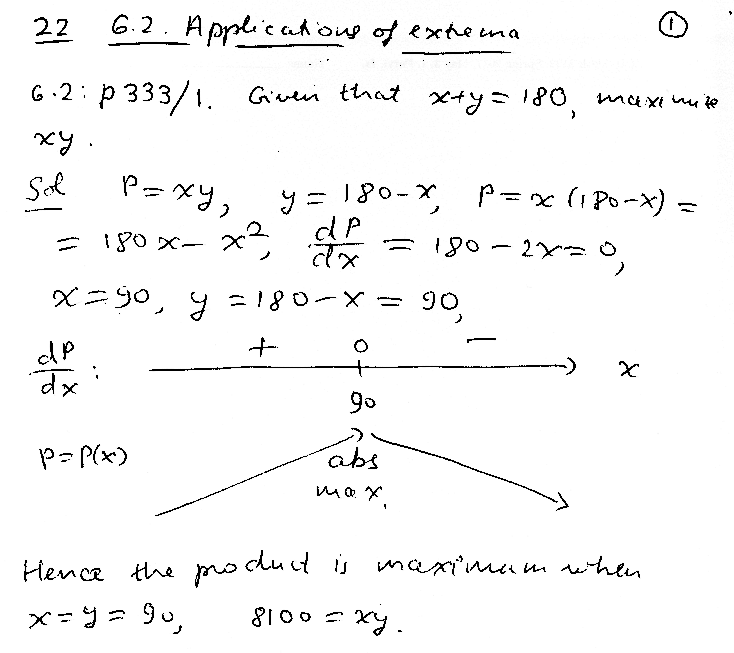
----
----

*Question.* (6.2:p333/3) Maximize stem:[x^2y] subject to stem:[x+y=90], stem:[x,y ge0].
++++
<figure>
    <figcaption>Solution</figcaption>
    <audio
	controls
	src="./2121-22-02.m4a">
	    Your browser does not support the
	    <code>audio</code> element.
    </audio>
</figure>
++++
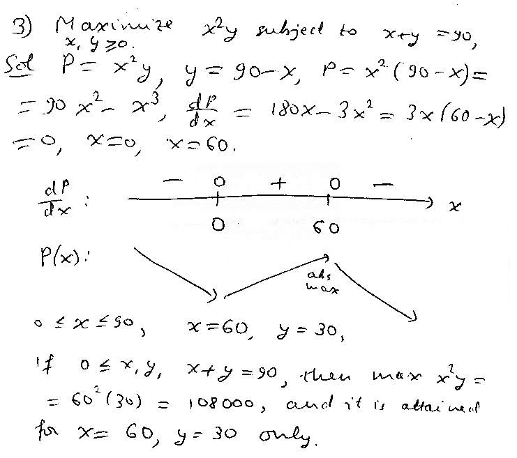
----
----

*Question.* (6.2:p333/13) A pidgeon flies straight from the boat to the
point stem:[P] on the shore and then straight to point stem:[L], or, its
home, on the shore.  The boat is 1 mile from the closest point stem:[A] on
the shore and stem:[A] is 2 miles from stem:[L].  The pidgeon needs
stem:[4/3] times the energy to fly over water than over land, find the
location of the point stem:[P] that minimizes the energy used.
++++
<figure>
    <figcaption>Solution</figcaption>
    <audio
	controls
	src="./2121-22-03.m4a">
	    Your browser does not support the
	    <code>audio</code> element.
    </audio>
</figure>
++++
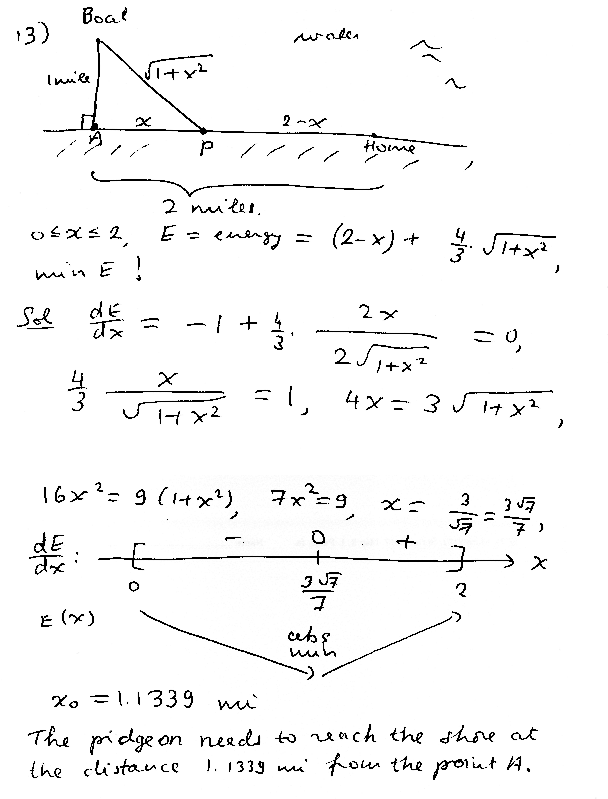
----
----

*Question.* (6.2:p333/20) A campground owner wants to use 1400 m of
fencing to enclose a rectangular region of maximum area next to a river
with the condition that we do not need fencing on the side next to the
water.  Find the maximum area and the sizes that yield it.
++++
<figure>
    <figcaption>Solution</figcaption>
    <audio
	controls
	src="./2121-22-04.m4a">
	    Your browser does not support the
	    <code>audio</code> element.
    </audio>
</figure>
++++
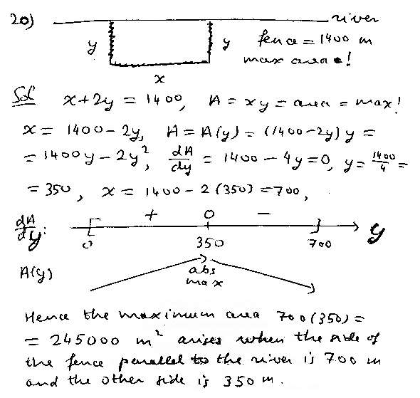
----
----

*Question.* (6.2:p333/25) A fence must be built to enclose a rectangular
region of stem:[20,000 ft^2].  Fencing material costs $2.50 per foot on the North and South sides, and $3.20 per foot on the West and East sides.  Find the cost and sizes of the least expensive fence. 
++++
<figure>
    <figcaption>Solution</figcaption>
    <audio
	controls
	src="./2121-22-05.m4a">
	    Your browser does not support the
	    <code>audio</code> element.
    </audio>
</figure>
++++
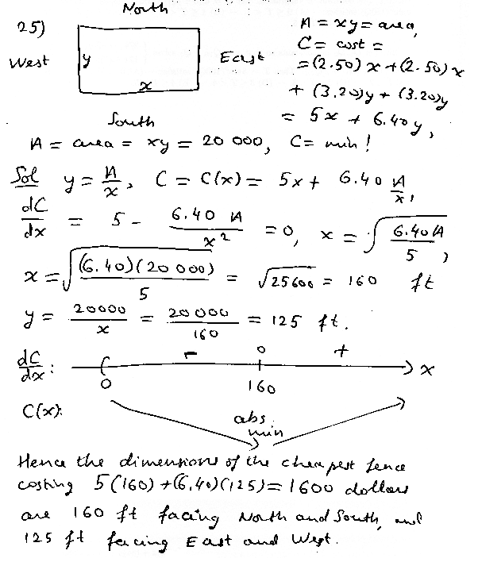
----
----

*Question.* (6.2:p333/27) A company wants to make a box with a volume of stem:[36] cubic feet that has an open top and is twice as long as it is wide.  Find the dimensions of the box made with the least amount of materials.
++++
<figure>
    <figcaption>Solution</figcaption>
    <audio
	controls
	src="./2121-22-06.m4a">
	    Your browser does not support the
	    <code>audio</code> element.
    </audio>
</figure>
++++
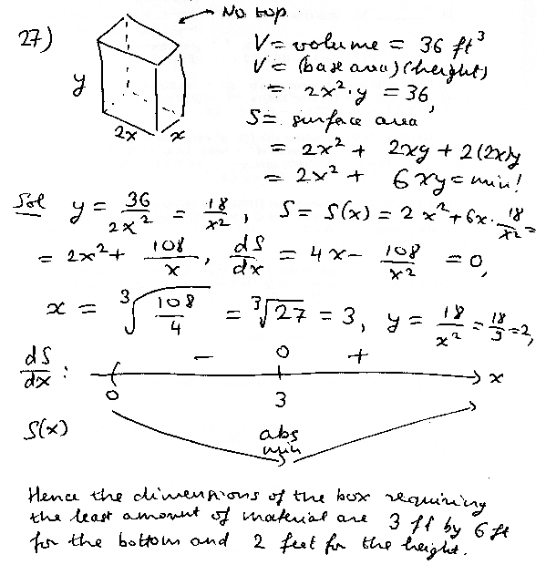
----
----

*Question.* (6.2:p333/31) A book is to contain 36 square inches of printed matter per page with margins 1 inch along the sides and 1.5 inches along the top and bottom.  Find the dimensions of the page that needs the least amount of paper.
++++
<figure>
    <figcaption>Solution</figcaption>
    <audio
	controls
	src="./2121-22-07.m4a">
	    Your browser does not support the
	    <code>audio</code> element.
    </audio>
</figure>
++++
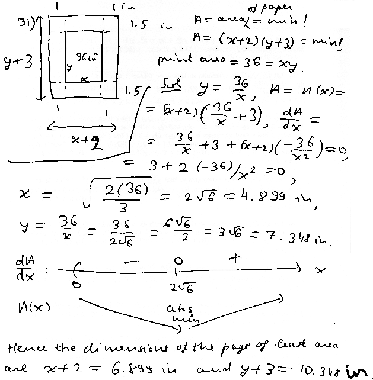
----
----

*Question.* (6.2:p333/43) A thief wants to climb over a 9 foot high fence that is 2 feet from a house.  He needs to lean his ladder against the house.  What is the length of the shortest ladder that he can use?
++++
<figure>
    <figcaption>Solution</figcaption>
    <audio
	controls
	src="./2121-22-08.m4a">
	    Your browser does not support the
	    <code>audio</code> element.
    </audio>
</figure>
++++
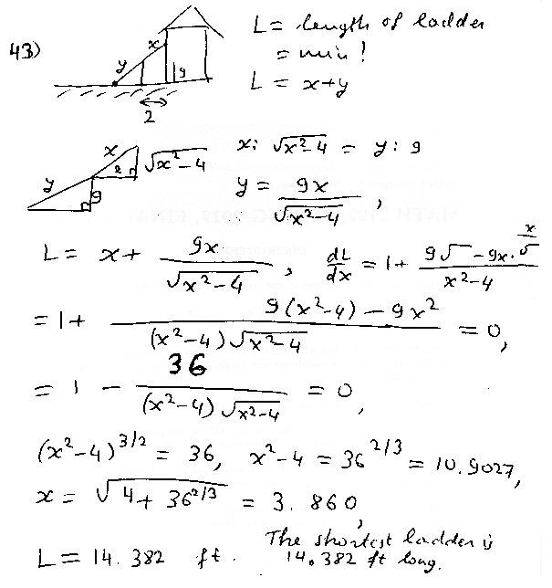
----
----

*Question.* (6.2:p333/42) A box has to have length plus girth at most
108 inches.  Find the sizes of the sides of the box of maximum volume,
if the width and height are equal.
++++
<figure>
    <figcaption>Solution</figcaption>
    <audio
	controls
	src="./2121-22-09.m4a">
	    Your browser does not support the
	    <code>audio</code> element.
    </audio>
</figure>
++++
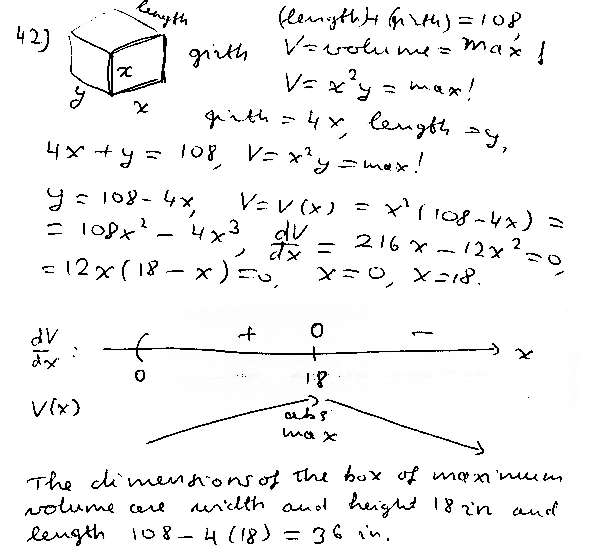
----
----

*Question.* (6.2:p333/22) We want to use 3600 meters of fencing to fence in a rectangle of maximum area subdivided into 3 pens.  What are the sizes of the sides of the rectangle?
++++
<figure>
    <figcaption>Solution</figcaption>
    <audio
	controls
	src="./2121-22-10.m4a">
	    Your browser does not support the
	    <code>audio</code> element.
    </audio>
</figure>
++++
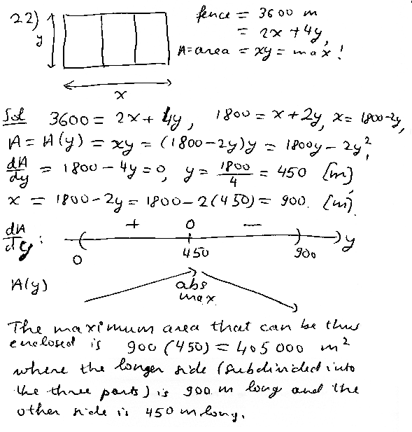
----
----

*Question.* (6.2:p333/40) A hunter is at a point on the river bank.  He wants to go to his cabin, located 3 miles to the North and 8 miles to the West.  He can travel at 5 mph along the river, and at 2 mph over land.  How far upriver should he go in order to reach the cabin the soonest.
++++
<figure>
    <figcaption>Solution</figcaption>
    <audio
	controls
	src="./2121-22-11.m4a">
	    Your browser does not support the
	    <code>audio</code> element.
    </audio>
</figure>
++++
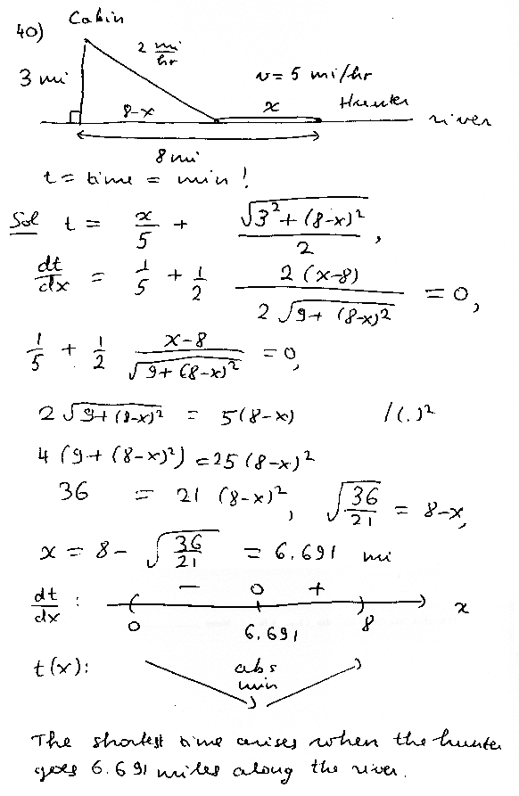
----
----

////
*Question.* () stem:[].
++++
<figure>
    <figcaption>Solution</figcaption>
    <audio
	controls
	src="./2121-22-12.m4a">
	    Your browser does not support the
	    <code>audio</code> element.
    </audio>
</figure>
++++
image::2121-22-12.PNG[Work]
----
----

*Question.* () stem:[].
++++
<figure>
    <figcaption>Solution</figcaption>
    <audio
	controls
	src="./2121-22-13.m4a">
	    Your browser does not support the
	    <code>audio</code> element.
    </audio>
</figure>
++++
image::2121-22-13.PNG[Work]
----
----

*Question.* () stem:[].
++++
<figure>
    <figcaption>Solution</figcaption>
    <audio
	controls
	src="./2121-22-14.m4a">
	    Your browser does not support the
	    <code>audio</code> element.
    </audio>
</figure>
++++
image::2121-22-14.PNG[Work]
----
----

*Question.* () stem:[].
++++
<figure>
    <figcaption>Solution</figcaption>
    <audio
	controls
	src="./2121-22-15.m4a">
	    Your browser does not support the
	    <code>audio</code> element.
    </audio>
</figure>
++++
image::2121-22-15.PNG[Work]
----
----

*Question.* () stem:[].
++++
<figure>
    <figcaption>Solution</figcaption>
    <audio
	controls
	src="./2121-22-16.m4a">
	    Your browser does not support the
	    <code>audio</code> element.
    </audio>
</figure>
++++
image::2121-22-16.PNG[Work]
----
----

*Question.* () stem:[].
++++
<figure>
    <figcaption>Solution</figcaption>
    <audio
	controls
	src="./2121-22-17.m4a">
	    Your browser does not support the
	    <code>audio</code> element.
    </audio>
</figure>
++++
image::2121-22-17.PNG[Work]
----
----

*Question.* () stem:[].
++++
<figure>
    <figcaption>Solution</figcaption>
    <audio
	controls
	src="./2121-22-18.m4a">
	    Your browser does not support the
	    <code>audio</code> element.
    </audio>
</figure>
++++
image::2121-22-18.PNG[Work]
----
----

*Question.* () stem:[].
++++
<figure>
    <figcaption>Solution</figcaption>
    <audio
	controls
	src="./2121-22-19.m4a">
	    Your browser does not support the
	    <code>audio</code> element.
    </audio>
</figure>
++++
image::2121-22-19.PNG[Work]
----
----

*Question.* () stem:[].
++++
<figure>
    <figcaption>Solution</figcaption>
    <audio
	controls
	src="./2121-22-20.m4a">
	    Your browser does not support the
	    <code>audio</code> element.
    </audio>
</figure>
++++
image::2121-22-20.PNG[Work]
----
----

*Question.* () stem:[].
++++
<figure>
    <figcaption>Solution</figcaption>
    <audio
	controls
	src="./2121-22-21.m4a">
	    Your browser does not support the
	    <code>audio</code> element.
    </audio>
</figure>
++++
image::2121-22-21.PNG[Work]
----
----

*Question.* () stem:[].
++++
<figure>
    <figcaption>Solution</figcaption>
    <audio
	controls
	src="./2121-22-22.m4a">
	    Your browser does not support the
	    <code>audio</code> element.
    </audio>
</figure>
++++
image::2121-22-22.PNG[Work]
----
----

*Question.* () stem:[].
++++
<figure>
    <figcaption>Solution</figcaption>
    <audio
	controls
	src="./2121-22-23.m4a">
	    Your browser does not support the
	    <code>audio</code> element.
    </audio>
</figure>
++++
image::2121-22-23.PNG[Work]
----
----

*Question.* () stem:[].
++++
<figure>
    <figcaption>Solution</figcaption>
    <audio
	controls
	src="./2121-22-24.m4a">
	    Your browser does not support the
	    <code>audio</code> element.
    </audio>
</figure>
++++
image::2121-22-24.PNG[Work]
----
----

*Question.* () stem:[].
++++
<figure>
    <figcaption>Solution</figcaption>
    <audio
	controls
	src="./2121-22-25.m4a">
	    Your browser does not support the
	    <code>audio</code> element.
    </audio>
</figure>
++++
image::2121-22-25.PNG[Work]
----
----

*Question.* () stem:[].
++++
<figure>
    <figcaption>Solution</figcaption>
    <audio
	controls
	src="./2121-22-26.m4a">
	    Your browser does not support the
	    <code>audio</code> element.
    </audio>
</figure>
++++
image::2121-22-26.PNG[Work]
----
----

*Question.* () stem:[].
++++
<figure>
    <figcaption>Solution</figcaption>
    <audio
	controls
	src="./2121-22-27.m4a">
	    Your browser does not support the
	    <code>audio</code> element.
    </audio>
</figure>
++++
image::2121-22-27.PNG[Work]
----
----

*Question.* () stem:[].
++++
<figure>
    <figcaption>Solution</figcaption>
    <audio
	controls
	src="./2121-22-28.m4a">
	    Your browser does not support the
	    <code>audio</code> element.
    </audio>
</figure>
++++
image::2121-22-28.PNG[Work]
----
----

*Question.* () stem:[].
++++
<figure>
    <figcaption>Solution</figcaption>
    <audio
	controls
	src="./2121-22-29.m4a">
	    Your browser does not support the
	    <code>audio</code> element.
    </audio>
</figure>
++++
image::2121-22-29.PNG[Work]
----
----

*Question.* () stem:[].
++++
<figure>
    <figcaption>Solution</figcaption>
    <audio
	controls
	src="./2121-22-30.m4a">
	    Your browser does not support the
	    <code>audio</code> element.
    </audio>
</figure>
++++
image::2121-22-30.PNG[Work]
----
----

////
